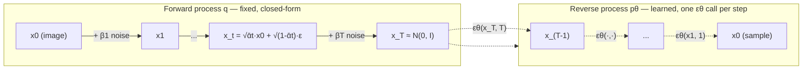

> **One-paragraph hook:** Diffusion models generate data by learning to undo a fixed, gradual corruption process — you destroy an image with Gaussian noise over hundreds of steps, train a network to predict what was added at each step, and then run that prediction backward from pure noise. It sounds wasteful compared to a single forward pass through a GAN generator, and it is — but the training objective is stable (no adversarial min-max, no mode collapse) and the resulting samples are the current ceiling for image and video fidelity. Every modern text-to-image and text-to-video system (Stable Diffusion, Imagen, Sora, FLUX) is a descendant of this framework, even where the newer ones have swapped diffusion's specific math for [[Concept - Flow Matching]].

## The mechanism

**Forward process.** Fix a variance schedule $\beta_1, \dots, \beta_T$ (typically $T=1000$). Define $\alpha_t = 1-\beta_t$ and $\bar\alpha_t = \prod_{s=1}^t \alpha_s$. The forward (noising) process is Markovian and Gaussian:

$$q(x_t \mid x_0) = \mathcal{N}\!\left(x_t;\ \sqrt{\bar\alpha_t}\,x_0,\ (1-\bar\alpha_t)\,I\right)$$

This has a closed form, so you don't have to simulate $T$ steps to get a training example — you jump straight to any $t$:

$$x_t = \sqrt{\bar\alpha_t}\,x_0 + \sqrt{1-\bar\alpha_t}\,\epsilon, \qquad \epsilon \sim \mathcal N(0, I)$$

As $t \to T$, $\bar\alpha_t \to 0$ and $x_t$ becomes indistinguishable from pure Gaussian noise.

**Reverse process.** You want $p_\theta(x_{t-1}\mid x_t)$, the denoising step. Ho et al. 2020 (DDPM) show that if you parameterize the network to predict the noise $\epsilon$ that was added rather than $x_0$ directly, the variational lower bound on the data log-likelihood simplifies — after dropping a $t$-dependent weighting term — to a plain denoising regression:

$$L_{simple} = \mathbb E_{t,\,x_0,\,\epsilon}\Big[\big\| \epsilon - \epsilon_\theta(x_t, t) \big\|^2\Big]$$

This is the entire training loop: sample a real image, sample a timestep and noise, corrupt, and regress. No adversarial discriminator, no likelihood-free tricks — pure supervised regression with a moving target ($\epsilon_\theta$ must work at every noise level).

**Score connection.** Song & Ermon (2019, 2021) show $\epsilon$-prediction is equivalent, up to a known scale factor, to estimating the score $\nabla_x \log p(x_t)$ — the gradient of the log-density of the noised data. Diffusion training is therefore a discretization of a continuous-time stochastic differential equation (SDE) that transforms data into noise; running it backward denoises. Because every SDE has a corresponding deterministic probability-flow ODE with the *same* marginals, you can sample by solving an ODE instead of simulating the stochastic reverse chain — this is what enables deterministic samplers like DDIM and later [[Concept - Flow Matching]] itself.

**Parameterizations.** $\epsilon$-prediction is the DDPM default, but you can equally train the network to predict $x_0$ directly, or the "velocity" $v = \sqrt{\bar\alpha_t}\,\epsilon - \sqrt{1-\bar\alpha_t}\,x_0$ (Salimans & Ho 2022). v-prediction behaves better at very high noise levels (where $\epsilon$-prediction's target is nearly degenerate) and at the zero-SNR edge, and is the standard target for distillation. Loss-weighting choices layer on top of any parameterization — min-SNR-$\gamma$ (Hang et al. 2023) reweights per-timestep loss to stop easy, low-noise timesteps from dominating the gradient, which measurably speeds convergence.

**Noise schedules.** The original linear schedule ($\beta_1{=}10^{-4}$ to $\beta_T{=}0.02$) spends too much of the step budget at very high noise for small images; Nichol & Dhariwal (2021) introduce a cosine schedule that keeps SNR more evenly distributed and improves low-resolution sample quality and log-likelihood. A separate, more insidious schedule bug — standard schedules never actually reaching zero SNR — is covered in [[Gotchas - Diffusion Training and Sampling]].

## Architecture / walkthrough



The network $\epsilon_\theta$ is called once per sampling step. Its standard internal shape (pixel-space DDPM; latent-space and DiT variants swap the backbone but keep this conditioning pattern):

```
t (scalar) --> sinusoidal position embedding --> small MLP --> per-block scale/shift (FiLM-style)
x_t (C,H,W)
    -> Down: [ResBlock(+ time-embed) , Self-Attention]  x k, with downsampling, caching skip activations
    -> Mid:  ResBlock -> Self-Attention -> Cross-Attention(text/class embedding) -> ResBlock
    -> Up:   [ResBlock(+ skip-concat) , Self-Attention] x k, with upsampling
    -> output conv -> εθ(x_t, t)  (same shape as x_t)
```

Self-attention runs at the low-resolution middle stages only (quadratic cost otherwise); cross-attention is where conditioning — text, class label, or in [[Concept - Classifier-Free Guidance]]'s case, the null token — enters the network, the same wiring [[Concept - Latent Diffusion]] uses for text-to-image.

## Evolution

Score matching (Song & Ermon 2019) framed generative modeling as learning $\nabla_x \log p(x)$ via denoising score matching at multiple noise levels → DDPM (Ho et al. 2020) reframed the same idea as a discrete-time Markov chain with a simple regression loss and made it practical → DDIM (Song et al. 2021) showed the same trained model admits a non-Markovian, deterministic sampler that needs 20-50 steps instead of 1000 → [[Concept - Latent Diffusion]] (Rombach et al. 2022) moved the whole process into a compressed autoencoder latent, making training and inference tractable on consumer hardware → [[Concept - Classifier-Free Guidance]] (Ho & Salimans 2022) gave practitioners a knob to trade diversity for prompt adherence without a separate classifier → v-prediction and Karras et al.'s EDM (2022) reformulated the schedule as noise levels $\sigma$ and unified the design space, improving few-step quality → [[Concept - Flow Matching]] (Lipman et al. 2022; rectified flow, Liu et al. 2022) generalized the whole framework to arbitrary probability paths with a simpler regression target and straighter (hence cheaper-to-integrate) trajectories, and is what SD3 and FLUX train against → [[Concept - Diffusion Transformers (DiT)]] (Peebles & Xie 2023) replaced the convolutional U-Net backbone with a plain transformer over latent patches, showing diffusion quality scales with FLOPs the way LLMs do. Each step kept the same forward-corruption/reverse-generation shell; what changed is the path geometry, the backbone, and the conditioning mechanism.

## In practice

Pixel-space DDPM on ImageNet-64 used $T=1000$ and a linear schedule; almost nobody trains pixel-space diffusion at scale anymore because [[Concept - Latent Diffusion]] gets a ~48x reduction in spatial elements essentially for free. Inference step counts dropped from 1000 (ancestral DDPM) to 20-50 (DDIM/[[Concept - Diffusion Samplers and Schedulers]]) to 1-4 with distillation (LCM, ADD) — the number of network forward passes is the single biggest lever on serving latency, and with classifier-free guidance every step is *two* forward passes (conditional and unconditional), which is why guidance-distilled models (FLUX-dev/schnell) matter operationally. Text conditioning is injected through cross-attention using frozen CLIP or T5 text embeddings; class-conditional models (e.g., ADM, the diffusion model behind classifier guidance's original comparison) instead add a class embedding into the timestep MLP.

## Failure modes

- **Too few sampling steps → blur or structured artifacts.** The reverse process approximates a continuous trajectory with discrete steps; too coarse a discretization accumulates integration error, visible as smeared detail or ringing. Detection: compare FID/visual quality across step counts — quality should plateau, not keep improving past ~30-50 DDIM steps for a well-trained model; if it doesn't plateau, the sampler or schedule is mismatched.
- **Parameterization/schedule mismatch.** Sampling with a DDIM/Euler solver tuned for $\epsilon$-prediction against a model trained with v-prediction (or vice versa) silently produces degraded or shifted outputs — the solver's update rule assumes a specific target. Detection: outputs look washed out or oversharpened even at high step counts; check the sampler's `prediction_type` matches training.
- **Exposure bias.** Training conditions the network on *exact* forward-process samples $x_t$ derived from real $x_0$; at inference, $x_{t-1}$ is the model's own imperfect estimate, so small early errors compound over hundreds of steps — a train/inference distribution mismatch structurally similar to exposure bias in autoregressive sequence models. Detection: samples degrade disproportionately with very long chains or drift toward blurriness late in generation; partial mitigations include self-conditioning and consistency-style objectives.

## The non-obvious

The score-matching equivalence is not just theoretical elegance — it's why deterministic ODE samplers (DDIM and everything downstream) are *correct*, not merely a convenient approximation: the probability-flow ODE shares exact marginals with the stochastic reverse SDE, so integrating it deterministically samples from the same distribution, just without the injected per-step noise. Practitioners who don't internalize this often assume DDIM is "cheating" a stochastic process into being deterministic; it's actually solving a different, exactly equivalent equation. A second hard-won lesson: because $L_{simple}$ drops the ELBO's per-timestep weighting, the model is *not* directly optimizing log-likelihood — it's implicitly reweighted toward mid-noise timesteps, which is why min-SNR-$\gamma$ reweighting (Hang et al. 2023) and cosine schedules (Nichol & Dhariwal 2021) can measurably change perceptual quality despite all being "correct" under the theory; schedule and weighting choices are not free parameters you can vary without retraining consequences.

## Connections
- [[Concept - Latent Diffusion]] — the practical move (compress to a VAE latent before doing any of this math) that made diffusion affordable to train and serve; a direct prerequisite-adjacent concept.
- [[Concept - Classifier-Free Guidance]] — the inference-time technique layered on top of the trained $\epsilon_\theta$ to sharpen prompt adherence, built directly on the conditional/unconditional split described here.
- [[Concept - Flow Matching]] — the generalization that replaces the DDPM forward process with an arbitrary probability path, subsuming diffusion as a curved-path special case.
- [[Concept - Diffusion Samplers and Schedulers]] — the numerical-solver detail (DDIM, DPM-Solver++, Karras sigmas) for turning the trained $\epsilon_\theta$ into images in few steps.
- [[Concept - Diffusion Transformers (DiT)]] — the backbone swap (U-Net to transformer) that made diffusion quality scale predictably with compute.
- [[Gotchas - Diffusion Training and Sampling]] — the arcane, hard-won failure modes (zero-terminal-SNR, latent scaling bugs) that this note's clean math doesn't warn you about.
- [[Concept - KL Divergence]] — the ELBO that $L_{simple}$ is a simplification of is built from a sum of KL terms between Gaussians.
- [[Concept - Entropy and Cross-Entropy]] — the information-theoretic frame underlying the variational bound diffusion models are (loosely) optimizing.
- [[Concept - Softmax]] — cross-attention conditioning inside the U-Net uses the same softmax-attention machinery as language transformers.
- [[Snippet - DDPM Training and Sampling Loop]] — the runnable ~30-line version of the training and ancestral-sampling loop derived above.
- [[Concept - Backpropagation]] — the diffusion loss is trained with plain backprop through the denoiser network like any other supervised objective.
- [[Breakdown - Stable Diffusion]] — the system-level case study of this framework deployed at scale, including exact schedules and text-encoder choices across versions.

## Sources
- Ho, Jain, Abbeel (2020) — Denoising Diffusion Probabilistic Models. Introduces the $\epsilon$-prediction reparameterization and $L_{simple}$.
- Song & Ermon (2019) — Generative Modeling by Estimating Gradients of the Data Distribution. The score-matching framing diffusion is equivalent to.
- Song, Meng, Ermon (2021) — Denoising Diffusion Implicit Models (DDIM). The deterministic, non-Markovian few-step sampler.
- Song et al. (2021) — Score-Based Generative Modeling through Stochastic Differential Equations. Unifies diffusion as an SDE/ODE.
- Nichol & Dhariwal (2021) — Improved Denoising Diffusion Probabilistic Models. Cosine noise schedule.
- Salimans & Ho (2022) — Progressive Distillation for Fast Sampling of Diffusion Models. v-prediction.
- Karras, Aittala, Aila, Laine (2022) — Elucidating the Design Space of Diffusion-Based Generative Models (EDM). Sigma-based schedule reframing, Heun sampler.
- Hang et al. (2023) — Efficient Diffusion Training via Min-SNR Weighting Strategy.
