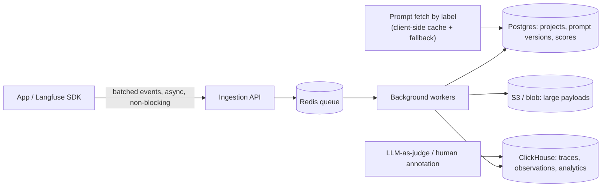

> Langfuse is an open-source LLM engineering platform — tracing, evals, and versioned prompt management — deployable self-hosted or as managed cloud. It's one of the most widely adopted concrete implementations of the [[Concept - LLM Observability and Tracing]] data model, and a useful reference point for what "observability for non-deterministic, expensive, multi-step calls" looks like once it has to survive real production volume rather than a demo.

## The headline numbers

| Dimension | Figure |
|---|---|
| Storage | Split by workload: Postgres (config/transactional), ClickHouse (OLAP trace/observation analytics), Redis (queue + cache), S3-compatible blob storage (large payloads) |
| Ingestion | Fully async — SDK batches client-side, ships to an ingestion API, queued rather than written synchronously |
| Data model | Trace → nested Observations (`SPAN` / `GENERATION` / `EVENT`) → Sessions (multi-turn) → Scores (attached evaluation results) |
| Deployment | Self-hosted (Docker Compose / Helm) or managed cloud |
| Cost computation | Per-`GENERATION`, from a maintained per-model pricing table — feeding directly into the attribution and budgeting practices in [[Concept - Cost Engineering for LLM Applications]] |

## How it actually works

The data model has four levels. A **Trace** is one user request end to end. Nested inside it, **Observations** are typed `SPAN` (a generic step), `GENERATION` (a model call — carrying model id, input/output, token usage, and computed cost), or `EVENT` (a point-in-time marker); the nesting mirrors an agent's control flow the way it does generally in [[Concept - LLM Observability and Tracing]]. **Sessions** group the traces belonging to one multi-turn conversation. **Scores** attach an evaluation result — from an [[Concept - LLM-as-Judge]] run, a human annotator, or a code-based check — to a trace or a specific observation, independently queryable for dashboards and regression tracking.

Prompt management treats prompts as versioned objects carrying labels (`production`, `staging`, ...); the app fetches "the prompt labeled production" at runtime rather than embedding a hardcoded string, so shipping a new prompt is a label move, not a redeploy. The SDK caches the fetched prompt client-side with a fallback to the last-known-good version if the API is unreachable, so an observability-layer outage degrades to "stale prompt" rather than a hard failure. Every trace produced under a prompt version links back to it — one concrete implementation of the prompt-version leg of the [[Concept - Model Lifecycle and Versioning]] version triple — which is what turns "did judge score drop after prompt v14 shipped" into a direct query instead of a manual correlation exercise.

The evals layer runs LLM-as-judge scoring asynchronously over sampled traces, offers human annotation queues for manual scoring, and supports dataset/experiment runs that replay a fixed input set against a new prompt or model offline — the same evaluation-loop shape [[Deep Dive - Designing an Eval Harness]] covers generally, and one Langfuse feature area where similarity-based lookups over historical traces or prompt variants lean on approximate nearest-neighbor search such as [[Concept - HNSW]]. The resulting score trend is the raw signal [[Concept - Production Monitoring and Drift Detection]] watches over time to catch quality drift rather than reacting to one noisy sample.

Interop is deliberate: Langfuse ingests raw [[Reference - OpenTelemetry GenAI Semantic Conventions]] spans, which means instrumenting an app with OpenInference (Arize) or OpenLLMetry (Traceloop) and pointing the exporter at Langfuse works without a Langfuse-specific SDK call in the hot path — the wire format is the integration point, not a vendor library. Full prompt/completion payloads land in the S3 blob store by default, which is exactly the surface [[Concept - PII Redaction and Data Retention]] requires a redaction and retention policy over before it ships to production.

## The clever parts

**ClickHouse for analytics, Postgres for everything else.** A columnar OLAP store is what makes "p95 cost per tenant over the last 30 days, grouped by prompt version" a fast query at real trace volume; running that aggregation against Postgres row storage at the same cardinality would fall over. Splitting storage by access pattern, rather than forcing one database to serve both jobs, is the transferable idea.

**Fully async, queue-decoupled ingestion.** Client-side batching into a Redis-backed queue means the observability layer's own latency or downtime is structurally incapable of adding latency to, or failing, the LLM call it's observing — a property a synchronous "log to Postgres inline" design cannot offer.

**Prompt-linked-to-trace lineage as a first-class relationship.** Because every trace records which prompt version produced it, prompt iteration becomes a queryable, data-driven loop — compare score distributions across prompt versions directly — instead of a changelog nobody consults.

**Label-based prompt fetch with client-side cache and fallback.** This turns a prompt "deploy" into an instant, reversible pointer move, and the cache-fallback behavior means an unreachable prompt API degrades to "the last shipped prompt keeps running," not "the app can't construct a request."

**A maintained model pricing map as the source of cost truth.** Every `GENERATION` gets a $ figure without the calling application knowing current per-token pricing for whichever of dozens of models it happened to call — the same pattern [[Breakdown - LiteLLM]] independently arrived at for its own cost map, because it's the correct place to put that knowledge.

**OTel-native ingestion.** Accepting the GenAI semantic-conventions wire format directly decouples "which instrumentation library did you use" from "which backend do you send it to," so a team can switch backends without re-instrumenting their app.

## What it got wrong / what's dated

The self-host footprint is real operational weight: four stateful services (Postgres, ClickHouse, Redis, S3-compatible storage) is a lot of infrastructure to run and back up correctly just to get trace logging, and it's the single biggest reason teams that start self-hosted often move to the managed cloud offering once volume grows. The pricing map, like every gateway's pricing map, lags real provider price changes — a new model or a price cut shows up on Langfuse's update schedule, not the provider's announcement schedule. And because the GenAI OTel semantic conventions were still Experimental and actively revising attribute names through 2024–2026, ingestion compatibility with any given instrumentor's output has had to track a moving spec rather than a stable one — pin the semconv version your instrumentation targets, per the caveat in [[Reference - OpenTelemetry GenAI Semantic Conventions]].

## What to steal

Even outside Langfuse specifically: use a columnar OLAP store for trace/span analytics and a row store for config — not one database for both. Make prompt versions a queryable, trace-linked entity from day one rather than bolting on prompt history later. And design the observability SDK so it is structurally unable to slow down or fail the request it's observing — async, batched, queue-decoupled, with a client-side fallback for anything (like a prompt) it needs to fetch synchronously.

## Connections

- [[Concept - LLM Observability and Tracing]] — Langfuse is a concrete, production-scale implementation of the trace/span/session data model this note defines abstractly.
- [[Reference - OpenTelemetry GenAI Semantic Conventions]] — the vendor-neutral wire format Langfuse ingests, decoupling instrumentation choice from backend choice.
- [[Concept - Model Lifecycle and Versioning]] — Langfuse's prompt-label-and-fetch mechanism is one concrete implementation of the prompt-version leg of the version triple.
- [[Concept - LLM-as-Judge]] — the scoring mechanism most commonly wired into Langfuse's async evals layer.
- [[Breakdown - LiteLLM]] — the sibling open-source project in the LLMOps stack; both independently converge on a maintained per-model pricing map as the cost source of truth.
- [[Concept - Production Monitoring and Drift Detection]] — consumes the score trend Langfuse's evals layer produces to detect quality drift over time.
- [[Concept - Cost Engineering for LLM Applications]] — Langfuse's per-generation cost computation is the raw data this note's attribution and budgeting practices are built on.
- [[Deep Dive - Designing an Eval Harness]] — Langfuse's dataset/experiment-run feature is one concrete harness for the offline-eval loop this deep dive covers generally.
- [[Concept - HNSW]] — the approximate nearest-neighbor index family underlying similarity search over historical traces and prompt variants in Langfuse-style eval tooling.
- [[Concept - PII Redaction and Data Retention]] — full prompt/completion payloads flowing into Langfuse's blob storage are exactly the surface this note's redaction and retention discipline has to cover.

## Sources

- Langfuse — official documentation and open-source repository (`langfuse/langfuse`); the architecture and data model above are drawn from its published self-hosting and architecture docs.
- OpenTelemetry GenAI Special Interest Group (2024–2026, Experimental status as of 2026) — GenAI semantic conventions, the ingestion format Langfuse accepts natively.
- Traceloop (OpenLLMetry) and Arize (OpenInference) — the two major independent instrumentation libraries that emit into the same OTel GenAI wire format Langfuse ingests.
