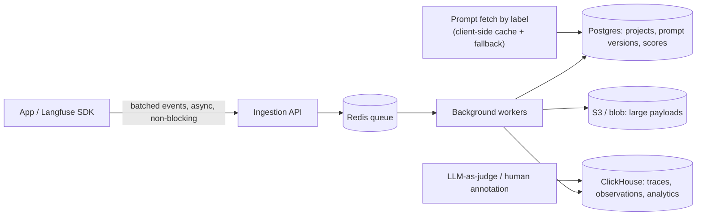

> Langfuse is an open-source LLM engineering platform (tracing, evals and versioned prompt management) that runs self-hosted or as a managed cloud. It's one of the most widely adopted implementations of the [[Concept - LLM Observability and Tracing]] data model, and a useful reference for what observability of non-deterministic, expensive, multi-step calls looks like once it has to survive real production volume instead of a demo.

## The headline numbers

| Dimension | Figure |
|---|---|
| Storage | Split by workload: Postgres (config/transactional), ClickHouse (OLAP trace/observation analytics), Redis (queue + cache), S3-compatible blob storage (large payloads) |
| Ingestion | Fully async — SDK batches client-side, ships to an ingestion API, queued rather than written synchronously |
| Data model | Trace → nested Observations (`SPAN` / `GENERATION` / `EVENT`) → Sessions (multi-turn) → Scores (attached evaluation results) |
| Deployment | Self-hosted (Docker Compose / Helm) or managed cloud |
| Cost computation | Per-`GENERATION`, from a maintained per-model pricing table — feeding directly into the attribution and budgeting practices in [[Concept - Cost Engineering for LLM Applications]] |

## How it works

The data model has four levels. A **Trace** is one user request, end to end. Inside it, **Observations** are typed: `SPAN` (a generic step), `GENERATION` (a model call, with model id, input/output, token usage and computed cost) or `EVENT` (a point-in-time marker). The nesting follows the agent's control flow, as in [[Concept - LLM Observability and Tracing]] generally. **Sessions** group the traces of one multi-turn conversation. **Scores** attach an evaluation result, from an [[Concept - LLM-as-Judge]] run, a human annotator or a code-based check, to a trace or a specific observation, and you can query them on their own for dashboards and regression tracking.

Prompts are versioned objects with labels (`production`, `staging`, ...). At runtime the app fetches "the prompt labeled production" instead of embedding a hardcoded string, so shipping a new prompt means moving a label, with no redeploy. The SDK caches the fetched prompt client-side and falls back to the last-known-good version if the API is unreachable, so an outage in the observability layer degrades to "stale prompt" and never becomes a hard failure. Every trace produced under a prompt version links back to it. That's one implementation of the prompt-version leg of the [[Concept - Model Lifecycle and Versioning]] version triple, and it turns "did the judge score drop after prompt v14 shipped" into a direct query instead of a manual correlation job.

The evals layer runs LLM-as-judge scoring asynchronously over sampled traces, provides human annotation queues for manual scoring, and supports dataset/experiment runs that replay a fixed input set against a new prompt or model offline. It's the evaluation loop [[Deep Dive - Designing an Eval Harness]] describes in general. Similarity lookups over historical traces or prompt variants in this area rely on approximate nearest-neighbor search such as [[Concept - HNSW]]. The resulting score trend is the raw signal [[Concept - Production Monitoring and Drift Detection]] watches over time, so quality drift gets caught as a trend instead of as a reaction to one noisy sample.

Interop is deliberate. Langfuse ingests raw [[Reference - OpenTelemetry GenAI Semantic Conventions]] spans, so you can instrument an app with OpenInference (Arize) or OpenLLMetry (Traceloop), point the exporter at Langfuse, and never call a Langfuse-specific SDK in the hot path. The wire format is the integration point. Full prompt/completion payloads land in the S3 blob store by default, and that's the surface [[Concept - PII Redaction and Data Retention]] needs a redaction and retention policy over before anything ships to production.

## The clever parts

**ClickHouse for analytics, Postgres for everything else.** A columnar OLAP store is what makes "p95 cost per tenant over the last 30 days, grouped by prompt version" a fast query at real trace volume. The same aggregation on Postgres row storage at that cardinality would fall over. The idea worth taking is splitting storage by access pattern instead of forcing one database to do both jobs.

**Fully async, queue-decoupled ingestion.** Client-side batching into a Redis-backed queue means the observability layer's own latency or downtime can't, by design, add latency to or fail the LLM call it's watching. A synchronous "log to Postgres inline" design can't promise that.

**Prompt-to-trace lineage built in.** Every trace records which prompt version produced it, so prompt iteration becomes a data-driven loop you can query (compare score distributions across prompt versions directly), not a changelog nobody reads.

**Label-based prompt fetch with a client-side cache and fallback.** A prompt "deploy" becomes an instant, reversible pointer move. With the cache fallback, an unreachable prompt API means "the last shipped prompt keeps running", not "the app can't build a request".

**A maintained model pricing map as the source of cost truth.** Every `GENERATION` gets a $ figure without the calling app knowing current per-token prices for whichever of dozens of models it called. [[Breakdown - LiteLLM]] arrived at the same pattern independently for its own cost map, because that's the right place for the knowledge to live.

**OTel-native ingestion.** Accepting the GenAI semantic-conventions wire format directly separates "which instrumentation library did you use" from "which backend do you send to", so a team can switch backends without re-instrumenting.

## What it got wrong / what's dated

Self-hosting carries real operational weight. Four stateful services (Postgres, ClickHouse, Redis, S3-compatible storage) is a lot of infrastructure to run and back up properly just to get trace logging, and it's the biggest reason teams that start self-hosted often move to the managed cloud as volume grows. The pricing map, like every gateway's, lags real provider price changes: a new model or a price cut appears on Langfuse's update schedule, not the provider's announcement schedule. And the GenAI OTel semantic conventions were still Experimental and renaming attributes through 2024–2026, so ingestion compatibility with any given instrumentor has had to follow a moving spec. Pin the semconv version your instrumentation targets, per the caveat in [[Reference - OpenTelemetry GenAI Semantic Conventions]].

## What to steal

These hold outside Langfuse too. Use a columnar OLAP store for trace/span analytics and a row store for config, not one database for both. Make prompt versions a queryable, trace-linked entity from day one instead of bolting on prompt history later. And build the observability SDK so it can't slow down or fail the request it observes: async, batched, queue-decoupled, with a client-side fallback for anything (like a prompt) it has to fetch synchronously.

## Connections

- [[Concept - LLM Observability and Tracing]] — Langfuse is a concrete, production-scale implementation of the trace/span/session data model this note defines abstractly.
- [[Reference - OpenTelemetry GenAI Semantic Conventions]] — the vendor-neutral wire format Langfuse ingests, decoupling instrumentation choice from backend choice.
- [[Concept - Model Lifecycle and Versioning]] — Langfuse's prompt-label-and-fetch mechanism is one concrete implementation of the prompt-version leg of the version triple.
- [[Concept - LLM-as-Judge]] — the scoring mechanism most commonly wired into Langfuse's async evals layer.
- [[Breakdown - LiteLLM]] — the sibling open-source project in the LLMOps stack; both independently converge on a maintained per-model pricing map as the cost source of truth.
- [[Concept - Production Monitoring and Drift Detection]] — consumes the score trend Langfuse's evals layer produces to detect quality drift over time.
- [[Concept - Cost Engineering for LLM Applications]] — Langfuse's per-generation cost computation is the raw data this note's attribution and budgeting practices are built on.
- [[Deep Dive - Designing an Eval Harness]] — Langfuse's dataset/experiment-run feature is one concrete harness for the offline-eval loop this deep dive covers generally.
- [[Concept - HNSW]] — the approximate nearest-neighbor index family underlying similarity search over historical traces and prompt variants in Langfuse-style eval tooling.
- [[Concept - PII Redaction and Data Retention]] — full prompt/completion payloads flowing into Langfuse's blob storage are exactly the surface this note's redaction and retention discipline has to cover.

## Sources

- Langfuse — official documentation and open-source repository (`langfuse/langfuse`); the architecture and data model above are drawn from its published self-hosting and architecture docs.
- OpenTelemetry GenAI Special Interest Group (2024–2026, Experimental status as of 2026) — GenAI semantic conventions, the ingestion format Langfuse accepts natively.
- Traceloop (OpenLLMetry) and Arize (OpenInference) — the two major independent instrumentation libraries that emit into the same OTel GenAI wire format Langfuse ingests.
