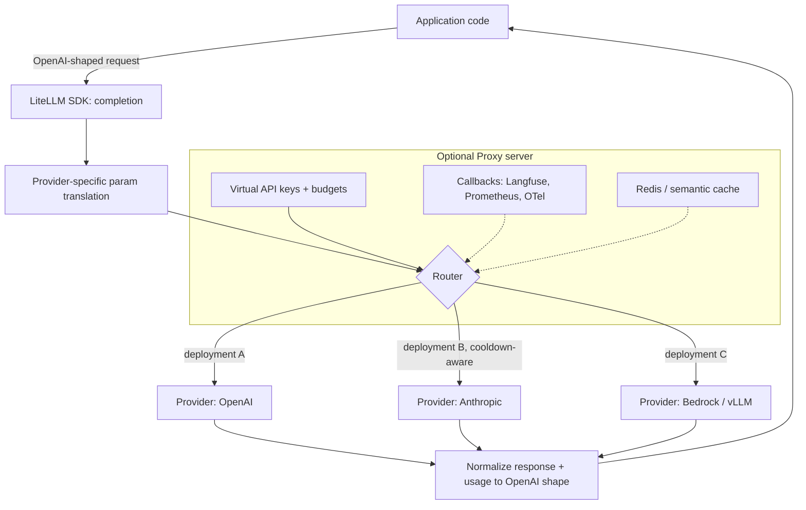

> LiteLLM is an open-source Python SDK plus an optional standalone proxy server, maintained by Berri AI, that normalizes calls to 100+ LLM providers — OpenAI, Anthropic, AWS Bedrock, Google Vertex AI, Azure OpenAI, Cohere, and local engines like [[Breakdown - vLLM]] — into a single OpenAI-compatible Chat Completions interface. As of 2026 it is one of the most widely deployed layers in the LLMOps stack: the default choice for teams that want multi-provider portability without hand-building translation and routing logic, sitting at the same architectural position as the [[Concept - LLM Gateways and Routing|gateway pattern]] it embodies.

## The headline numbers

| Dimension | Figure |
|---|---|
| Providers supported | 100+ (OpenAI, Anthropic, Bedrock, Vertex, Azure, Cohere, local/self-hosted engines, and more) |
| Deployment forms | Python SDK (in-process) and standalone Proxy server (sidecar/service) |
| Interface | OpenAI Chat Completions API shape, for both request and response |
| Core config surface | A single `config.yaml` model list on the Proxy; a `completion()` call on the SDK |
| Persistence (Proxy) | Postgres for virtual keys, spend, and budgets; Redis for caching and distributed rate limiting |

## How it actually works

At the core, `completion()` takes an OpenAI-shaped request, applies a provider-specific transformation — Anthropic's `messages` shape, Bedrock's request envelope, and so on all differ from OpenAI's — calls the target provider, and normalizes both the response body and the usage object back to OpenAI's shape, including normalizing streaming into OpenAI-style SSE chunks regardless of the upstream provider's native streaming format. This is the mechanism that lets application code written once against the OpenAI shape run against any of the 100+ backends without a rewrite, the same normalization problem [[Concept - Model Routing and Cascades|routing and cascade systems]] build on top of.

The **Router** sits above `completion()` and treats a logical model name as an abstraction over multiple concrete "deployments" — for example, the same logical `gpt-4o` model available via two Azure regions and an OpenAI direct endpoint. It load-balances across deployments using configurable strategies (simple-shuffle, least-busy, latency-based, or usage/TPM-based) and tracks per-deployment failures to apply cooldowns, implementing the [[Pattern - Resilient LLM Request Handling|resilient-request-handling pattern]] directly: on a failure it can fall back to the next deployment in a configured chain, including a context-window-overflow fallback that reroutes to a larger-context model when a prompt exceeds the current deployment's limit.

The **Proxy server** wraps the SDK and Router in a standalone service exposing the same OpenAI-compatible API, configured via a `config.yaml` model list. It adds virtual API keys scoped with per-key budgets and TPM/RPM limits, persists spend tracking to Postgres, emits callbacks to observability backends such as [[Breakdown - Langfuse]], Prometheus, and OpenTelemetry, supports guardrail hooks, and layers on Redis-backed response or [[Concept - Semantic Caching|semantic caching]].

## The clever parts

**A maintained per-model token-pricing map as the single cost source of truth.** LiteLLM ships and continuously updates a JSON pricing table keyed by exact model-snapshot id, powering both cost attribution in traces and mid-flight budget enforcement. The alternative — every team hand-maintaining its own pricing table — is exactly the kind of drift that produces silently wrong cost dashboards, which is why [[Snippet - Token Cost Attribution and Budget Enforcement|cost-attribution code]] typically defers to this map rather than hardcoding prices.

**The deployment abstraction decouples "logical model" from "physical endpoint."** Treating `gpt-4o` as a pool of interchangeable deployments rather than a single endpoint is what makes load balancing, regional failover, and cooldown-based routing possible without application code ever knowing which concrete endpoint served a given call. The losing alternative — hardcoding a provider/region per call site — was the norm before gateway abstractions like this existed, and it loses all of this flexibility.

**Context-window-overflow fallback.** Rather than failing a request that exceeds the current deployment's context limit, the Router can reroute automatically to a larger-context deployment of a similar model — a narrow but high-value special case of the general fallback chain that most hand-rolled retry logic doesn't bother to implement.

**Mid-flight budget enforcement, not just after-the-fact reporting.** Because virtual keys carry live budgets checked against the Postgres-backed spend ledger before a call proceeds, LiteLLM can reject or downgrade a request *before* it's made rather than only reporting overspend after the invoice arrives — the harder, more valuable version of the cost governance described in [[Concept - Rate Limiting and Quota Design]].

**Pass-through endpoints.** For provider-specific features that don't fit the OpenAI-normalized shape — a proprietary Anthropic or Bedrock parameter, for instance — the Proxy can pass a request through with minimal transformation, trading the uniform-interface benefit for access to a feature the abstraction would otherwise hide.

## What it got wrong / what's dated

Param translation is inherently lossy: providers diverge on capabilities — reasoning-token controls, provider-specific sampler knobs, structured-output schema formats — that don't have a clean OpenAI-shaped equivalent, so some features are unreachable through the normalized interface without dropping to a pass-through. The Proxy server itself becomes a scaling and availability concern; teams that don't run it highly available behind a load balancer have simply relocated the single-point-of-failure problem it was meant to solve (see [[Concept - LLM Gateways and Routing]] for this tradeoff generally). The pricing map, while actively maintained, necessarily lags real-world price changes and new-model releases by some window, which can misprice cost dashboards during that gap. Streaming error handling — what happens when a provider fails mid-stream after tokens have already been emitted — remains one of the fiddlier edge cases across providers, matching the general streaming-retry hazard described in [[Gotchas - LLM Production Operations]].

## What to steal

Two ideas worth lifting into any in-house gateway, even without adopting LiteLLM itself: (1) the **logical-model-over-many-deployments router with cooldowns**, which decouples what an application calls from where the call actually lands and is the mechanism that makes fallback and load balancing possible at all; and (2) a **single, centrally maintained pricing map** as the one source of truth for cost computation, rather than letting each service or dashboard maintain its own copy of provider pricing and drift out of sync.

## Connections

- [[Concept - LLM Gateways and Routing]] — LiteLLM is the concrete, most widely deployed instance of the gateway pattern this note describes generally.
- [[Pattern - Resilient LLM Request Handling]] — the Router's cooldown-plus-fallback-chain design is a direct implementation of this pattern.
- [[Concept - Model Routing and Cascades]] — LiteLLM's static load-balancing strategies are the substrate that learned/cascade routing systems build on top of.
- [[Concept - Cost Engineering for LLM Applications]] — the pricing map and budget enforcement described here are the concrete mechanism behind that note's cost-attribution theory.
- [[Breakdown - Langfuse]] — the most common observability backend LiteLLM's Proxy callbacks feed into.
- [[Breakdown - vLLM]] — a common self-hosted deployment target that LiteLLM routes to alongside hosted providers.
- [[Concept - Rate Limiting and Quota Design]] — the TPM/RPM limits enforced per virtual key are this note's algorithms applied inside LiteLLM's Proxy.
- [[Concept - Semantic Caching]] — one of the optional caching layers the Proxy can wire in via Redis.
- [[Concept - LLM Observability and Tracing]] — the callback mechanism is how LiteLLM populates the trace/span data this note describes.
- [[Snippet - Token Cost Attribution and Budget Enforcement]] — implements the same reserve-then-reconcile budget logic LiteLLM's Proxy applies internally.
- [[Concept - Tool Use and Function Calling]] — normalizing tool/function-call parameters across providers is part of the same translation layer that normalizes chat completions.

## Sources
- LiteLLM documentation and GitHub repository (Berri AI, ongoing, as of 2026) — Router strategies, Proxy configuration, and the maintained pricing map referenced throughout.
- LiteLLM Proxy production deployment guides and community postmortems (as of 2026) — the HA/SPOF and streaming-error-handling caveats under "What it got wrong."
