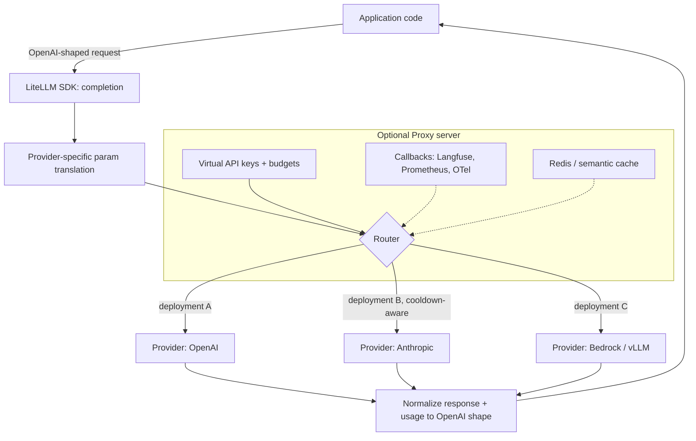

> LiteLLM is an open-source Python SDK plus an optional standalone proxy server, maintained by Berri AI. It normalizes calls to 100+ LLM providers (OpenAI, Anthropic, AWS Bedrock, Google Vertex AI, Azure OpenAI, Cohere, and local engines like [[Breakdown - vLLM]]) into one OpenAI-compatible Chat Completions interface. As of 2026 it's one of the most widely deployed layers in the LLMOps stack and the default for teams that want multi-provider portability without hand-building translation and routing logic. It occupies the same architectural slot as the [[Concept - LLM Gateways and Routing|gateway pattern]] it implements.

## The headline numbers

| Dimension | Figure |
|---|---|
| Providers supported | 100+ (OpenAI, Anthropic, Bedrock, Vertex, Azure, Cohere, local/self-hosted engines, and more) |
| Deployment forms | Python SDK (in-process) and standalone Proxy server (sidecar/service) |
| Interface | OpenAI Chat Completions API shape, for both request and response |
| Core config surface | A single `config.yaml` model list on the Proxy; a `completion()` call on the SDK |
| Persistence (Proxy) | Postgres for virtual keys, spend, and budgets; Redis for caching and distributed rate limiting |

## How it works

At the core, `completion()` takes an OpenAI-shaped request and applies a provider-specific transformation (Anthropic's `messages` shape, Bedrock's request envelope and the rest all differ from OpenAI's). It calls the target provider, then normalizes the response body and the usage object back to OpenAI's shape, including turning streaming into OpenAI-style SSE chunks whatever the upstream's native streaming format. That's how application code written once against the OpenAI shape runs on any of the 100+ backends without a rewrite. [[Concept - Model Routing and Cascades|Routing and cascade systems]] build on top of the same normalization.

The **Router** sits above `completion()` and treats a logical model name as an abstraction over several concrete "deployments", for example the same logical `gpt-4o` model reachable through two Azure regions and an OpenAI direct endpoint. It load-balances across deployments with configurable strategies (simple-shuffle, least-busy, latency-based, or usage/TPM-based) and tracks per-deployment failures to apply cooldowns. That implements the [[Pattern - Resilient LLM Request Handling|resilient-request-handling pattern]] directly. On a failure it can fall back to the next deployment in a configured chain, including a context-window-overflow fallback that reroutes to a larger-context model when a prompt exceeds the current deployment's limit.

The **Proxy server** wraps the SDK and Router in a standalone service with the same OpenAI-compatible API, configured through a `config.yaml` model list. It adds virtual API keys with per-key budgets and TPM/RPM limits, persists spend tracking to Postgres, sends callbacks to observability backends such as [[Breakdown - Langfuse]], Prometheus and OpenTelemetry, supports guardrail hooks, and adds Redis-backed response or [[Concept - Semantic Caching|semantic caching]].

## The clever parts

**One maintained per-model pricing map as the cost source of truth.** LiteLLM ships and keeps updating a JSON pricing table keyed by exact model-snapshot id. It drives both cost attribution in traces and mid-flight budget enforcement. If every team maintained its own pricing table instead, you'd get the drift that produces silently wrong cost dashboards, so [[Snippet - Token Cost Attribution and Budget Enforcement|cost-attribution code]] typically defers to this map and doesn't hardcode prices.

**The deployment abstraction separates "logical model" from "physical endpoint".** Treating `gpt-4o` as a pool of interchangeable deployments, not one endpoint, is what makes load balancing, regional failover and cooldown-based routing possible without application code knowing which endpoint served a call. Before gateway abstractions like this, hardcoding a provider/region per call site was the norm, and it gave up all of that flexibility.

**Context-window-overflow fallback.** When a request exceeds the current deployment's context limit, the Router can reroute it automatically to a larger-context deployment of a similar model instead of failing. It's a narrow but high-value case of the general fallback chain, and most hand-rolled retry logic doesn't bother with it.

**Budget enforcement before the call.** Virtual keys carry live budgets checked against the Postgres-backed spend ledger before a call proceeds, so LiteLLM can reject or downgrade a request *before* it's made. Reporting overspend after the invoice arrives is the easy version; this is the harder and more valuable form of the cost governance in [[Concept - Rate Limiting and Quota Design]].

**Pass-through endpoints.** For provider features that don't fit the OpenAI-normalized shape, such as a proprietary Anthropic or Bedrock parameter, the Proxy can pass a request through with minimal transformation. You give up the uniform interface to reach a feature the abstraction would otherwise hide.

## What it got wrong / what's dated

Param translation is lossy by nature. Providers differ on capabilities with no clean OpenAI-shaped equivalent (reasoning-token controls, provider-specific sampler knobs, structured-output schema formats), so some features are out of reach through the normalized interface unless you drop to pass-through. The Proxy server itself becomes a scaling and availability concern. Teams that don't run it highly available behind a load balancer have just moved the single point of failure it was supposed to remove ([[Concept - LLM Gateways and Routing]] covers that tradeoff in general). The pricing map, though actively maintained, lags real price changes and new-model releases by some window, and cost dashboards can be mispriced during that gap. Streaming error handling, meaning what happens when a provider fails mid-stream after tokens have gone out, is still one of the fiddlier edge cases across providers, in line with the general streaming-retry hazard in [[Gotchas - LLM Production Operations]].

## What to steal

Two ideas are worth lifting into any in-house gateway, even if you don't adopt LiteLLM: (1) the **logical-model-over-many-deployments router with cooldowns**, which separates what an application calls from where the call lands and is what makes fallback and load balancing possible at all; and (2) **one centrally maintained pricing map** as the single source of truth for cost, so services and dashboards don't each keep a copy of provider pricing and drift out of sync.

## Connections

- [[Concept - LLM Gateways and Routing]] — LiteLLM is the concrete, most widely deployed instance of the gateway pattern this note describes generally.
- [[Pattern - Resilient LLM Request Handling]] — the Router's cooldown-plus-fallback-chain design is a direct implementation of this pattern.
- [[Concept - Model Routing and Cascades]] — LiteLLM's static load-balancing strategies are the substrate that learned/cascade routing systems build on top of.
- [[Concept - Cost Engineering for LLM Applications]] — the pricing map and budget enforcement described here are the concrete mechanism behind that note's cost-attribution theory.
- [[Breakdown - Langfuse]] — the most common observability backend LiteLLM's Proxy callbacks feed into.
- [[Breakdown - vLLM]] — a common self-hosted deployment target that LiteLLM routes to alongside hosted providers.
- [[Concept - Rate Limiting and Quota Design]] — the TPM/RPM limits enforced per virtual key are this note's algorithms applied inside LiteLLM's Proxy.
- [[Concept - Semantic Caching]] — one of the optional caching layers the Proxy can wire in via Redis.
- [[Concept - LLM Observability and Tracing]] — the callback mechanism is how LiteLLM populates the trace/span data this note describes.
- [[Snippet - Token Cost Attribution and Budget Enforcement]] — implements the same reserve-then-reconcile budget logic LiteLLM's Proxy applies internally.
- [[Concept - Tool Use and Function Calling]] — normalizing tool/function-call parameters across providers is part of the same translation layer that normalizes chat completions.

## Sources
- LiteLLM documentation and GitHub repository (Berri AI, ongoing, as of 2026) — Router strategies, Proxy configuration, and the maintained pricing map referenced throughout.
- LiteLLM Proxy production deployment guides and community postmortems (as of 2026) — the HA/SPOF and streaming-error-handling caveats under "What it got wrong."
