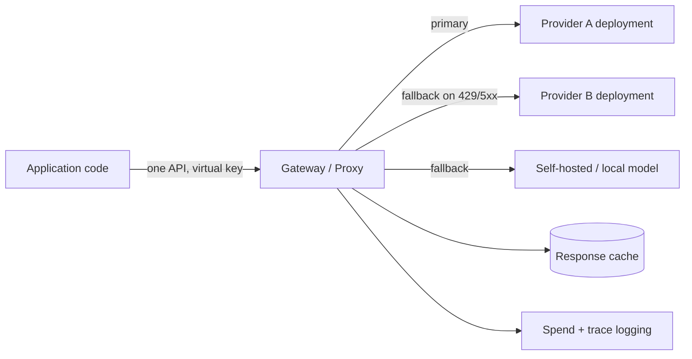

> **One-paragraph hook:** Once an application calls more than one model (a primary provider, a fallback, a cheap model for easy cases), each of those calls brings its own SDK quirks, retry logic, API key and cost accounting, duplicated at every call site. An LLM gateway puts all of that in one place: a proxy that speaks one API to your application and translates, load-balances and fails over across however many providers you point it at.

## The mechanism

A gateway sits between application code and every provider it talks to, and its value is centralization. It offers one OpenAI-compatible API whichever provider serves the request; a key vault that holds the real provider credentials behind virtual keys the application uses instead; per-key spend and rate limits; load balancing across several deployments of a logical model; automatic fallback on failure; response caching; structured request/response logging; and unified cost tracking. Without a gateway, each of these cross-cutting concerns gets reimplemented at every call site, usually inconsistently.

Static routing across the deployments behind a logical model uses a few well-established strategies: pin to one deployment; weighted or round-robin distribution; latency-based routing to whichever deployment is fastest right now; cost-based routing to the cheapest option that meets a floor; load-based routing to the deployment with the fewest in-flight requests; and provider-priority fallback chains with cooldowns that pause traffic to a deployment that just failed. None of it is learned or quality-aware. It's traffic engineering over interchangeable backends, a different thing from the difficulty-aware routing in [[Concept - Model Routing and Cascades]].

Fallback is what turns one provider's blip into a non-event for the user. On a 429, 5xx or timeout, the gateway retries against the next provider or deployment in the chain instead of surfacing the failure. That's easy for a single non-streaming completion and much harder with streaming and tool calls. By the time a failure is detected, the client may already have partial tokens from a stream, and you can't restart it on another backend without duplicating output or making the client discard and re-render. The resilience machinery a gateway needs to do this safely (timeouts, backoff, idempotency) has its own note, [[Pattern - Resilient LLM Request Handling]].

## In practice

Gateways ship either as an in-process library or as a standalone proxy/sidecar. [[Breakdown - LiteLLM]] is the most widely deployed open-source instance and offers both an SDK and a proxy server. Portkey, Cloudflare AI Gateway, OpenRouter, Kong AI Gateway and Envoy AI Gateway fill the same niche with different deployment models and emphasis. The "deployment" behind any of them is as often a self-hosted engine like [[Breakdown - vLLM]] as a hosted provider endpoint. Teams building the wider operational stack in [[Concept - LLMOps]] typically put the gateway at its center, because caching ([[Concept - Semantic Caching]]), cost tracking ([[Concept - Cost Engineering for LLM Applications]]) and inbound rate limiting all fit naturally as gateway hooks instead of code duplicated across the app.

The tradeoffs are real. A gateway adds a network hop, typically single-digit to low double-digit milliseconds: small next to model latency, but not zero. Every model call now goes through it, so the gateway can become a single point of failure and has to run highly available, never as one unreplicated process. The OpenAI-compatible schema is a lowest common denominator, so provider-specific features ([[Concept - Prompt Caching]]'s provider-specific cache-control directives, a grounding mode, a stricter structured-output guarantee) don't always map through cleanly. Streaming and tool-call passthrough are especially fiddly to get bit-for-bit right across providers with different chunking and event formats. Badly tuned load balancing is its own trap: routing purely on cost, or naive round-robin, can pile traffic onto one deployment until it hits its rate limits, the failure [[Concept - Rate Limiting and Quota Design]] covers from the enforcement side.

## Failure modes

**The gateway as an unreplicated single point of failure.** A gateway running as one process with no redundancy takes down every model call in the app when it dies. That's a bigger blast radius than any single provider outage it was meant to protect against.

**The abstraction hides a feature you needed.** A team adopts a gateway for provider portability, then finds mid-project that a provider-specific capability isn't exposed in the unified schema. They either fork around the gateway for that call path or wait on an upstream feature request.

**Hot-spotting from badly tuned load balancing.** A routing strategy that ignores per-deployment rate-limit ceilings can push one deployment past its provider limit while others sit idle, turning a load-balancing decision into a self-inflicted 429 storm.

## The non-obvious

A gateway adopted for API portability also creates a new, more concentrated secrets-management problem. Every provider credential the app would otherwise hold separately now lives in one system, so compromising the gateway compromises every downstream vendor account at once. If you want a gateway purely to avoid vendor lock-in, weigh that against the blast radius you're centralizing: the portability win and the SPOF/credential-concentration risk come from the same architectural decision.

There's a second, less visible cost. The gateway normalizes responses to one schema, so subtle provider-specific behavior (exact finish-reason semantics, how a provider counts hidden reasoning tokens) can be flattened into a generic field. A team debugging a cost or quality anomaly can find that the normalization layer erased the signal they needed.

## Connections

- [[Concept - LLMOps]] — the operational stack the gateway sits inside as the central call-path layer.
- [[Breakdown - LiteLLM]] — the concrete open-source implementation of most of this note's mechanisms: router, virtual keys, cooldowns, fallback chains.
- [[Concept - Model Routing and Cascades]] — the learned, quality-aware routing that goes beyond this note's static load-balancing strategies.
- [[Concept - Rate Limiting and Quota Design]] — the enforcement mechanics a gateway typically hosts for both inbound user limits and outbound provider-limit shaping.
- [[Pattern - Resilient LLM Request Handling]] — the client-side resilience primitives (timeouts, backoff, circuit breakers) a gateway's fallback logic is built from.
- [[Concept - Semantic Caching]] — one of the cross-cutting concerns gateways commonly implement as a pre-call hook.
- [[Concept - Cost Engineering for LLM Applications]] — the cost-tracking and attribution value a centralized call path makes practical.
- [[Breakdown - vLLM]] — a self-hosted serving engine a gateway can route to as one deployment alongside hosted-provider deployments.
- [[Concept - Prompt Caching]] — a provider-side cost lever a gateway must pass through correctly (a byte-stable cacheable prefix) rather than break via its normalization layer.

## Sources
- Zaharia, M. et al. (2024) — "The Shift from Models to Compound AI Systems" (Berkeley Artificial Intelligence Research blog) — frames the architectural move toward systems that route and orchestrate across multiple models rather than calling one model directly, the pattern a gateway operationalizes.
- LiteLLM project documentation (2023–2026, ongoing) — the Router and Proxy design (deployment pools, cooldowns, virtual keys) this note's mechanism section generalizes from.
