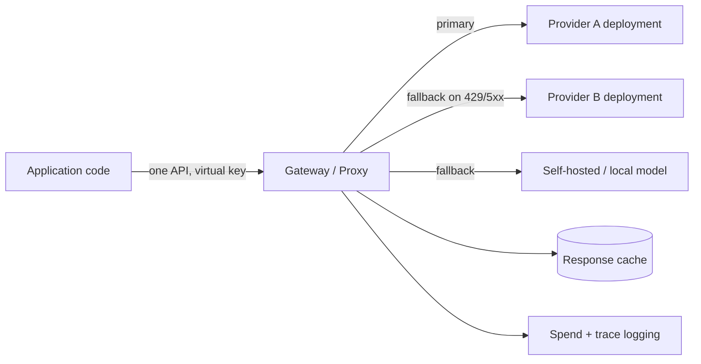

> **One-paragraph hook:** Once an application calls more than one model — a primary provider, a fallback, a cheap model for easy cases — every one of those calls needs its own SDK quirks, its own retry logic, its own API key, and its own cost accounting duplicated at every call site. An LLM gateway collapses that into one place: a proxy that speaks one API to your application and translates, load-balances, and fails over across as many providers as you point it at.

## The mechanism

A gateway sits between application code and every model provider it talks to, and its core value is centralization: one OpenAI-compatible API surface regardless of which provider actually serves the request, a key vault holding real provider credentials behind virtual keys that the application uses instead, per-key spend limits and rate limits, load balancing across multiple deployments of a logical model, automatic fallback on failure, response caching, structured request/response logging, and unified cost tracking. Every one of these is a cross-cutting concern that, without a gateway, gets reimplemented — usually inconsistently — at every call site in the application.

Static routing across the deployments behind that logical model uses a handful of well-established strategies: pin to a single deployment, weighted or round-robin distribution, latency-based routing to the currently-fastest deployment, cost-based routing toward the cheapest option that meets a floor, load-based routing to whichever deployment has the fewest in-flight requests, and provider-priority fallback chains with cooldowns that temporarily stop sending traffic to a deployment that just failed. None of this is learned or quality-aware — it's traffic engineering over interchangeable backends, distinct from the difficulty-aware routing covered in [[Concept - Model Routing and Cascades]].

Fallback is the mechanism that turns a single provider's blip into a non-event for the end user: on a 429, 5xx, or timeout, the gateway retries against the next provider or deployment in the chain rather than surfacing the failure. This is straightforward for a single non-streaming completion and considerably harder once streaming and tool calls are involved, because by the time a failure is detected the client may already have received partial tokens of a stream that can't simply be restarted from a different backend without either duplicating output or requiring the client to discard and re-render. The resilience patterns a gateway needs internally to do this safely — timeouts, backoff, idempotency — are the subject of their own note, [[Pattern - Resilient LLM Request Handling]].

## In practice

Real gateway products are deployed either as an in-process library or as a standalone proxy/sidecar. [[Breakdown - LiteLLM]] is the most widely deployed open-source instance of this pattern, offering both an SDK and a proxy server; Portkey, Cloudflare AI Gateway, OpenRouter, Kong AI Gateway, and Envoy AI Gateway occupy the same space with different deployment models and feature emphasis, and a "deployment" behind any of them is just as often a self-hosted engine such as [[Breakdown - vLLM]] as it is a hosted provider endpoint. Teams building the broader operational stack described in [[Concept - LLMOps]] typically put the gateway at the center of it, because caching (see [[Concept - Semantic Caching]]), cost tracking (see [[Concept - Cost Engineering for LLM Applications]]), and inbound rate limiting are all naturally implemented as gateway hooks rather than duplicated in application code.

The tradeoffs are real, not theoretical. A gateway adds a network hop, typically single-digit to low double-digit milliseconds — small relative to model latency but not zero. Because every model call now transits it, the gateway itself becomes a potential single point of failure and must be run highly available, not as a single unreplicated process. The OpenAI-compatible abstraction is a lowest-common-denominator schema, so provider-specific features — [[Concept - Prompt Caching]]'s provider-specific cache-control directives, a grounding mode, a stricter structured-output guarantee — don't always map cleanly through it, and streaming/tool-call passthrough in particular is fiddly to get bit-for-bit correct across providers with different chunking and event formats. Mis-tuned load balancing is its own operational trap: routing purely on cost or naive round-robin can concentrate traffic onto one deployment and drive it into its own rate limits — the failure mode [[Concept - Rate Limiting and Quota Design]] covers from the enforcement side.

## Failure modes

**The gateway as an un-replicated single point of failure.** A gateway deployed as one process with no redundancy takes down every model call in the application when it falls over, which is a worse blast radius than any single provider outage it was meant to protect against. **The abstraction hiding a feature you needed.** A team adopts a gateway for provider portability, then discovers mid-project that a provider-specific capability isn't exposed through the unified schema, and either forks around the gateway for that one call path or waits on an upstream feature request. **Hot-spotting from mis-tuned load balancing.** A routing strategy that doesn't account for per-deployment rate-limit ceilings can push one deployment past its provider-side limit while others sit idle, turning a load-balancing decision into a self-inflicted 429 storm.

## The non-obvious

Adopting a gateway for API portability quietly creates a new, more concentrated secrets-management problem: every provider credential the application would otherwise have held separately is now held by one system, so a gateway compromise is a compromise of every downstream vendor account at once, not just one. Teams that reach for a gateway purely to avoid vendor lock-in should weigh that against the blast radius they're centralizing — the portability win and the SPOF/credential-concentration risk are the same architectural decision, not two separate ones. A second, quieter cost: because the gateway normalizes responses to one schema, subtle provider-specific behaviors (exact finish-reason semantics, how a provider counts hidden reasoning tokens) can get flattened into a generic field, and a team debugging a cost or quality anomaly discovers the gateway's normalization layer erased the very signal they needed to diagnose it.

## Connections

- [[Concept - LLMOps]] — the operational stack the gateway sits inside as the central call-path layer.
- [[Breakdown - LiteLLM]] — the concrete open-source implementation of most of this note's mechanisms: router, virtual keys, cooldowns, fallback chains.
- [[Concept - Model Routing and Cascades]] — the learned, quality-aware routing that goes beyond this note's static load-balancing strategies.
- [[Concept - Rate Limiting and Quota Design]] — the enforcement mechanics a gateway typically hosts for both inbound user limits and outbound provider-limit shaping.
- [[Pattern - Resilient LLM Request Handling]] — the client-side resilience primitives (timeouts, backoff, circuit breakers) a gateway's fallback logic is built from.
- [[Concept - Semantic Caching]] — one of the cross-cutting concerns gateways commonly implement as a pre-call hook.
- [[Concept - Cost Engineering for LLM Applications]] — the cost-tracking and attribution value a centralized call path makes practical.
- [[Breakdown - vLLM]] — a self-hosted serving engine a gateway can route to as one deployment alongside hosted-provider deployments.
- [[Concept - Prompt Caching]] — a provider-side cost lever a gateway must pass through correctly (a byte-stable cacheable prefix) rather than break via its normalization layer.

## Sources
- Zaharia, M. et al. (2024) — "The Shift from Models to Compound AI Systems" (Berkeley Artificial Intelligence Research blog) — frames the architectural move toward systems that route and orchestrate across multiple models rather than calling one model directly, the pattern a gateway operationalizes.
- LiteLLM project documentation (2023–2026, ongoing) — the Router and Proxy design (deployment pools, cooldowns, virtual keys) this note's mechanism section generalizes from.
