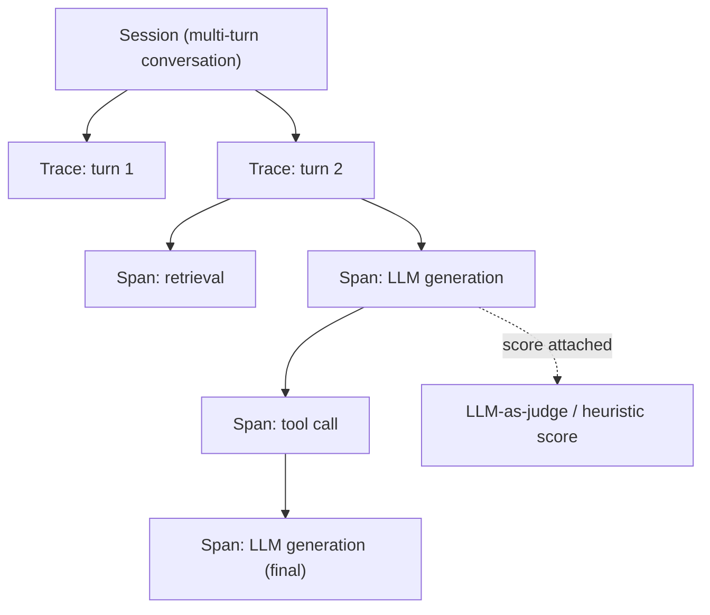

> **One-paragraph hook:** A single user-facing action in a modern LLM app can fan out into a retrieval call, three tool invocations, a guardrail check, and two model generations — and when the output is wrong, "check the logs" only works if those five sub-calls were captured as a connected structure, with the exact prompt, model, tokens, and latency attached to each one. LLM observability is that structure: it is distributed tracing's data model, borrowed wholesale, with token accounting and quality scoring bolted on as first-class fields that generic APM was never built to hold.

## The mechanism

The data model has three levels. A **trace** is one user request end to end. A **span** is one step inside it — an LLM call, a retrieval, a tool call, a guardrail check — and spans nest, so an agent's loop of think → call tool → observe → think again produces a tree of spans under one trace, mirroring the control flow described in [[Deep Dive - The Agent Loop]]. A **session** groups the traces belonging to one multi-turn conversation, letting you see drift or degradation across turns rather than one request in isolation.

Each LLM-call span carries a specific payload beyond what a generic APM span holds: the model id, the templated *and* rendered prompt, the full message list, decode params, prompt and completion token counts, computed cost, time-to-first-token (TTFT) and total latency, `finish_reason`, any tool calls emitted, a cache-hit flag, and error state if the call failed. This is why raw Jaeger- or Datadog-style APM traces are insufficient on their own: those systems have no native concept of a token, a $ cost, or a quality score, and the text payloads involved are both large and high-cardinality in a way typical span tags are not designed for.

The tooling landscape standardizing on this model includes [[Breakdown - Langfuse]], LangSmith, Arize Phoenix, Helicone, Braintrust, W&B Weave, and Traceloop. The emerging vendor-neutral wire format is [[Reference - OpenTelemetry GenAI Semantic Conventions]], which defines `gen_ai.*` span attributes (model, token usage, temperature) so instrumentation isn't locked to one vendor's SDK.

Full-payload logging at scale is expensive and a privacy liability — see [[Concept - PII Redaction and Data Retention]] — so the standard practice is to sample or redact bodies while keeping 100% of the numeric telemetry. Tail-based sampling (keep everything for traces that errored or were slow, downsample the boring majority) preserves signal where it matters most; naive head-based sampling (a fixed % of all traces) risks silently dropping exactly the traces you'd want during an incident.

## In practice

Because there is no ground-truth label available at request time, quality is attached after the fact via an online-eval hook: an [[Concept - LLM-as-Judge]] score, or a cheaper heuristic (schema validity, refusal detection), runs asynchronously against sampled live traffic and writes a score back onto the span. This turns quality into a first-class, sliceable dimension — you can graph judge score by prompt version, by model snapshot, or by tenant, the same way you'd graph latency. That score stream is also the raw input to [[Concept - Production Monitoring and Drift Detection]], which watches it (and other proxy signals) for a shift rather than a single bad sample.

Cost, computed per-span from token counts and a pricing table, is the other metric every trace should carry — see [[Concept - Cost Engineering for LLM Applications]] for the pricing model itself. Attaching cost at the span level rather than only in a monthly aggregate is what makes per-feature and per-tenant cost dashboards possible instead of a mystery invoice.

For agentic systems specifically, the nested-span structure is what makes an infinite tool-call loop or a runaway retry chain visible as a pathologically deep or wide trace rather than an opaque timeout — see [[Gotchas - Agents in Production]] for the failure signatures this surfaces.

## Failure modes

**Cardinality explosion.** Tagging spans with unbounded values (raw user IDs, full free-text as a tag rather than an event) blows up the backend's indexing cost and slows every query; keep high-cardinality data in event payloads, not indexed tags. **Dropped spans under load.** An async batching exporter that isn't backpressure-aware silently drops spans exactly when the system is under the load you most need visibility into — verify the exporter's queue behavior, don't assume it. **Logging secrets or PII into trace payloads.** A prompt or tool result containing an API key or a customer's SSN gets copied verbatim into the observability backend by default, becoming a second, less-audited copy of sensitive data. **No linkage back to version.** A trace that records tokens and latency but not the exact prompt hash and model snapshot that produced them is unusable for root-causing a regression — see [[Concept - Model Lifecycle and Versioning]] for why that triple has to travel with every span.

## The non-obvious

The trace/span data model isn't LLM-native — it's Dapper's model, the internal Google system Sigelman et al. described for tracing RPCs across a large distributed backend, applied almost unchanged to a domain with a completely different cost structure. A traditional RPC span is cheap to keep in full (a few KB of structured data); an LLM span's payload is the actual prompt and completion text, which is both far larger and, unlike a database query string, often the literal content a user typed or a system leaked. Teams that stand up LLM observability by pointing their existing APM at the LLM calls discover the mismatch immediately: the backend chokes on payload size, or the team has to bolt on redaction and sampling that generic APM never needed. Budgeting for text-payload volume and privacy handling from day one — rather than treating it as an afterthought to "just add tracing" — is the lesson every team learns the hard way once.

## Connections

- [[Concept - LLMOps]] — observability is one of the core stack layers LLMOps defines; this note is the mechanism behind that layer.
- [[Reference - OpenTelemetry GenAI Semantic Conventions]] — the wire-level attribute names this note's span model maps onto in a vendor-neutral instrumentation.
- [[Breakdown - Langfuse]] — a concrete implementation of the trace/observation/session/score data model at production scale.
- [[Concept - PII Redaction and Data Retention]] — the sampling-and-redaction discipline required because full LLM payloads are both large and sensitive.
- [[Concept - Production Monitoring and Drift Detection]] — consumes the online-eval scores this note's tracing layer attaches to spans.
- [[Concept - LLM-as-Judge]] — the scoring mechanism most commonly wired into the online-eval hook.
- [[Gotchas - Agents in Production]] — the agent-specific failure signatures (loops, runaway tool calls) that nested spans make visible.
- [[Concept - Cost Engineering for LLM Applications]] — the cost computation that turns raw token counts on a span into a $ figure.
- [[Deep Dive - The Agent Loop]] — the control flow whose think/act/observe structure directly produces the nested-span tree described above.
- [[Concept - Model Lifecycle and Versioning]] — the version triple that a span must carry for a trace to be useful during a regression investigation.

## Sources
- Sigelman, B. et al. (2010) — "Dapper, a Large-Scale Distributed Systems Tracing Infrastructure" (Google) — the trace/span data model this space adopted essentially unchanged, before adding token/cost/quality as first-class fields.
- OpenTelemetry GenAI Special Interest Group (2024–2026, ongoing, Experimental status as of 2026) — GenAI semantic conventions — the vendor-neutral attribute schema for `gen_ai.*` spans.
- Langfuse and Arize Phoenix product documentation — the trace/observation/session/score and OpenInference instrumentation patterns referenced above.
