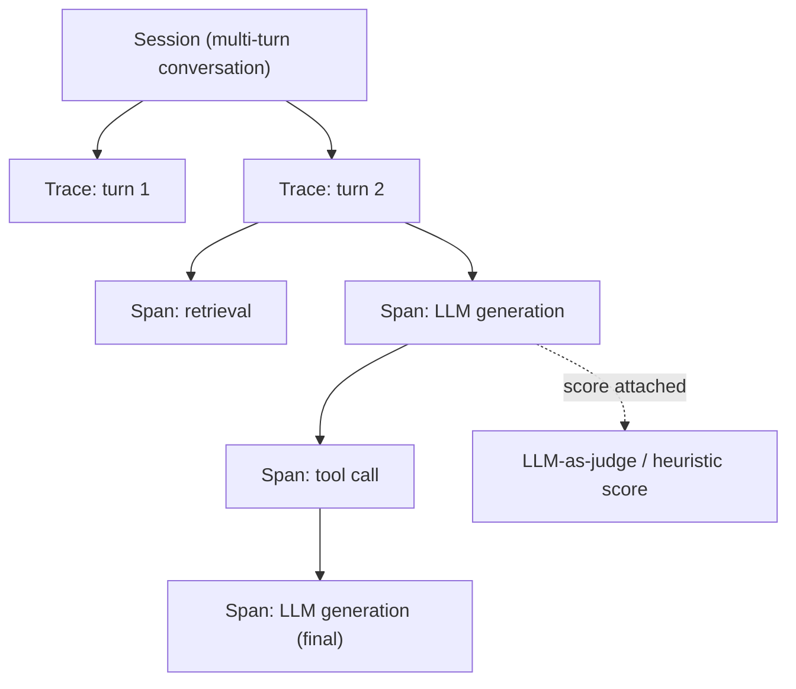

> **One-paragraph hook:** One user-facing action in a modern LLM app can fan out into a retrieval call, three tool invocations, a guardrail check and two model generations. When the output is wrong, "check the logs" only helps if those sub-calls were captured as a connected structure, each with its exact prompt, model, tokens and latency. LLM observability is that structure. It takes distributed tracing's data model wholesale and adds token accounting and quality scoring as fields generic APM was never built to hold.

## The mechanism

There are three levels. A **trace** is one user request end to end. A **span** is one step inside it: an LLM call, a retrieval, a tool call, a guardrail check. Spans nest, so an agent's think → call tool → observe → think loop produces a tree of spans under one trace, mirroring the control flow in [[Deep Dive - The Agent Loop]]. A **session** groups the traces of one multi-turn conversation, so you can see drift or degradation across turns instead of one request in isolation.

An LLM-call span carries more than a generic APM span: model id, the templated *and* rendered prompt, the full message list, decode params, prompt and completion token counts, computed cost, time-to-first-token (TTFT) and total latency, `finish_reason`, any tool calls emitted, a cache-hit flag, and error state if the call failed. Raw Jaeger- or Datadog-style APM traces can't hold this on their own. They have no native notion of a token, a $ cost or a quality score, and the text payloads are larger and higher-cardinality than span tags are designed for.

Tools converging on this model include [[Breakdown - Langfuse]], LangSmith, Arize Phoenix, Helicone, Braintrust, W&B Weave and Traceloop. The emerging vendor-neutral wire format is [[Reference - OpenTelemetry GenAI Semantic Conventions]], which defines `gen_ai.*` span attributes (model, token usage, temperature) so your instrumentation isn't tied to one vendor's SDK.

Logging full payloads at scale is expensive and a privacy liability (see [[Concept - PII Redaction and Data Retention]]), so the standard practice is to sample or redact bodies and keep 100% of the numeric telemetry. Tail-based sampling keeps everything for traces that errored or ran slow and downsamples the boring majority. Naive head-based sampling, a fixed % of all traces, can silently drop the very traces you'd want during an incident.

## In practice

There's no ground-truth label at request time, so quality gets attached afterwards through an online-eval hook. An [[Concept - LLM-as-Judge]] score, or a cheaper heuristic like schema validity or refusal detection, runs asynchronously on sampled live traffic and writes a score back onto the span. Now you can graph judge score by prompt version, model snapshot or tenant, the same way you graph latency. That score stream also feeds [[Concept - Production Monitoring and Drift Detection]], which watches it and other proxy signals for a shift, not a single bad sample.

Cost is the other metric every trace should carry, computed per span from token counts and a pricing table ([[Concept - Cost Engineering for LLM Applications]] covers the pricing model). Attaching it at the span level, not only in a monthly aggregate, is what gets you per-feature and per-tenant cost dashboards in place of a mystery invoice.

For agents, nested spans turn an infinite tool-call loop or a runaway retry chain into a visibly deep or wide trace instead of an opaque timeout. [[Gotchas - Agents in Production]] has the failure signatures this surfaces.

## Failure modes

**Cardinality explosion.** Tagging spans with unbounded values (raw user IDs, free text as a tag instead of an event) inflates the backend's indexing cost and slows every query. Put high-cardinality data in event payloads, not indexed tags.

**Dropped spans under load.** An async batching exporter without backpressure handling drops spans silently, and it does so under the load you most need to see. Check the exporter's queue behavior; don't assume it.

**Secrets or PII in trace payloads.** A prompt or tool result containing an API key or a customer's SSN is copied verbatim into the observability backend by default. You now have a second, less-audited copy of sensitive data.

**No link back to version.** A trace with tokens and latency but no prompt hash and model snapshot can't be used to root-cause a regression. [[Concept - Model Lifecycle and Versioning]] explains why that triple has to travel with every span.

## The non-obvious

The trace/span model isn't LLM-native. It's Dapper, the internal Google system Sigelman et al. described for tracing RPCs across a large distributed backend, applied almost unchanged to a domain with a very different cost structure. A traditional RPC span is cheap to keep in full, a few KB of structured data. An LLM span's payload is the prompt and completion text: far larger, and, unlike a database query string, often the literal content a user typed or a system leaked. Teams that point their existing APM at the LLM calls hit the mismatch right away. The backend chokes on payload size, or they end up bolting on redaction and sampling that generic APM never needed. Budget for text-payload volume and privacy handling from day one instead of treating tracing as a quick add-on; every team learns this the hard way once.

## Connections

- [[Concept - LLMOps]] — observability is one of the core stack layers LLMOps defines; this note is the mechanism behind that layer.
- [[Reference - OpenTelemetry GenAI Semantic Conventions]] — the wire-level attribute names this note's span model maps onto in a vendor-neutral instrumentation.
- [[Breakdown - Langfuse]] — a concrete implementation of the trace/observation/session/score data model at production scale.
- [[Concept - PII Redaction and Data Retention]] — the sampling-and-redaction discipline required because full LLM payloads are both large and sensitive.
- [[Concept - Production Monitoring and Drift Detection]] — consumes the online-eval scores this note's tracing layer attaches to spans.
- [[Concept - LLM-as-Judge]] — the scoring mechanism most commonly wired into the online-eval hook.
- [[Gotchas - Agents in Production]] — the agent-specific failure signatures (loops, runaway tool calls) that nested spans make visible.
- [[Concept - Cost Engineering for LLM Applications]] — the cost computation that turns raw token counts on a span into a $ figure.
- [[Deep Dive - The Agent Loop]] — the control flow whose think/act/observe structure directly produces the nested-span tree described above.
- [[Concept - Model Lifecycle and Versioning]] — the version triple that a span must carry for a trace to be useful during a regression investigation.

## Sources
- Sigelman, B. et al. (2010) — "Dapper, a Large-Scale Distributed Systems Tracing Infrastructure" (Google) — the trace/span data model this space adopted essentially unchanged, before adding token/cost/quality as first-class fields.
- OpenTelemetry GenAI Special Interest Group (2024–2026, ongoing, Experimental status as of 2026) — GenAI semantic conventions — the vendor-neutral attribute schema for `gen_ai.*` spans.
- Langfuse and Arize Phoenix product documentation — the trace/observation/session/score and OpenInference instrumentation patterns referenced above.
