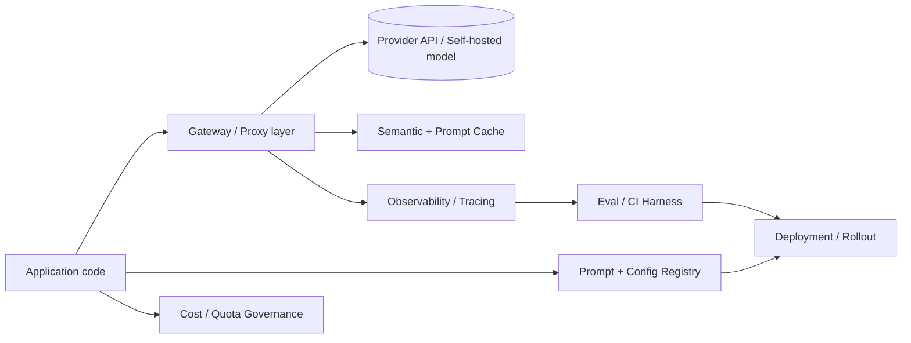

> **One-paragraph hook:** LLMOps is the operational discipline for shipping and running LLM-backed applications, and it inherits MLOps' name while breaking most of its assumptions. For the overwhelming majority of production LLM apps the model is a frozen third-party dependency called over HTTP, not an artifact you train — the thing that actually changes week to week is the prompt sitting in front of it, and that changes the entire shape of the operational problem.

## The mechanism

Classical MLOps is organized around a training loop: you own the weights, you have a labeled validation set, and "did this change help" is a number you compute offline before you ship. LLMOps drops nearly every one of those assumptions. Most teams call a provider API, so there is no gradient step to instrument and no checkpoint to version. The unit of change becomes the prompt — effectively the "source code" of the system — plus whatever tools, retrieved context, and decode parameters surround it. Outputs are non-deterministic even at temperature 0 (see [[Concept - Nondeterminism in Production LLM Serving]] for why), and there is rarely a clean ground-truth label to compute accuracy against, so an offline metric that looked great in a notebook can silently fail to predict production quality.

What replaces the training loop is a stack of operational layers that a production LLM app needs regardless of whether the model is hosted or self-served:

Gateway/proxy (LiteLLM, Portkey, Cloudflare AI Gateway — see [[Concept - LLM Gateways and Routing]]) centralizes the call path; observability/tracing (Langfuse, LangSmith, Arize Phoenix, Helicone — see [[Concept - LLM Observability and Tracing]]) captures what actually happened; prompt and config management tracks the "code"; an eval/CI harness scores changes before and after they ship; semantic and prompt caching cut redundant calls; cost/quota governance bounds the blast radius of a single bad request (see [[Concept - Cost Engineering for LLM Applications]]); and deployment/rollout governs how a change reaches users (see [[Concept - Model Lifecycle and Versioning]]).

The unit that ships is not "the model" — it's three artifacts bound together: the exact model snapshot (`gpt-4o-2024-08-06`, not the floating alias `gpt-4o`), the prompt template hash, and the inference config (temperature, tool schema, `max_tokens`). Changing any one of the three is a deploy, and if only one of them is tracked, an incident review can reconstruct the model that was live but not the prompt, or vice versa.

## In practice

The MLOps loop of train → deploy → monitor runs on a cadence of weeks; the LLMOps loop of prompt → eval → ship → observe → iterate runs in hours, because there's no retraining gate between an idea and a production change. That velocity is the entire value proposition of building on top of a frontier model — and it is also the risk, because the safety rails that a slow training cycle forced on MLOps (a held-out eval, a review of the diff) have to be rebuilt deliberately rather than falling out of the process for free.

Production magnitudes worth internalizing: agentic and RAG applications commonly issue 2-5 model calls per single user-facing action (retrieval, tool calls, a final generation), not one; cost is usually input-token dominated because RAG context and conversation history get resent on every turn, not because generations are long; and a typical interactive-chat latency budget sits around 1-3 seconds end to end. A self-hosted serving stack such as [[Breakdown - vLLM]] sits at the bottom of the deployment layer when volume justifies it, while most teams start against a managed API and add self-hosting only when the economics tip (a decision covered in domain 16's own Decision note on self-hosting). Agentic systems layer their own loop on top of this stack — see [[Deep Dive - The Agent Loop]] — and whether you reach for prompting, RAG, or a fine-tune in the first place is itself a real engineering decision (see [[Decision - Fine-Tuning vs RAG vs Prompting]]) that determines how much of the LLMOps stack you even need. The eval/CI layer that gates a prompt change before it ships is its own discipline — see [[Deep Dive - Designing an Eval Harness]].

## Failure modes

**Prompts treated as untracked config.** A prompt edited directly in a config file or a dashboard, with no diff and no version history, produces silent regressions that nobody can bisect — the team knows behavior changed but not which of the last five edits caused it. **No request/response logging.** Without captured payloads, a user-reported bad output cannot be reproduced or root-caused; the incident is gone the moment the response streamed back. **No cost attribution.** Without per-call tagging, teams discover their unit economics only when the monthly invoice arrives, by which point a single misbehaving feature may have been burning budget for weeks.

## The non-obvious

The instinct coming from MLOps is to look for the "model versioning" problem and solve it in isolation — but the artifact that actually breaks production most often is the prompt, not the model, because prompts are edited far more frequently and with far less ceremony than anyone edits a pinned model string. Teams that build rigorous model-pinning discipline while leaving prompts as untracked strings in application code have solved the easier half of the versioning problem and left the more dangerous half open. The prompt is the code; treat it with the same rigor (review, versioning, CI) as the code around it, not as a string literal.

## Connections

- [[Concept - LLM Observability and Tracing]] — the layer that turns an opaque API call into something debuggable; without it, LLMOps has no feedback signal.
- [[Concept - Cost Engineering for LLM Applications]] — the stack layer that keeps the hours-long ship cadence from turning into an uncontrolled bill.
- [[Concept - Model Lifecycle and Versioning]] — the mechanics of the "three artifacts" bundle and how it is promoted and rolled back.
- [[Concept - LLM Gateways and Routing]] — the proxy layer most of the stack's other pieces (caching, cost tracking, fallback) are typically implemented behind.
- [[Breakdown - vLLM]] — a concrete self-hosted serving engine that sits at the deployment layer once volume justifies owning the GPUs.
- [[Deep Dive - Designing an Eval Harness]] — what replaces the offline validation set that classical MLOps relied on to gate a ship.
- [[Deep Dive - The Agent Loop]] — the multi-call control flow that drives the "2-5 calls per action" magnitude cited above.
- [[Decision - Fine-Tuning vs RAG vs Prompting]] — the upstream decision that determines how much of the LLMOps stack a given feature actually needs.
- [[Concept - Nondeterminism in Production LLM Serving]] — the reason "did this change help" can't be answered from a single sample the way an offline MLOps metric could.

## Sources
- Huyen, C. (2022) — *Designing Machine Learning Systems* (O'Reilly) — the ML-system lifecycle framing that LLMOps departs from once the model becomes an external frozen dependency.
- Google Cloud (2020) — "MLOps: Continuous Delivery and Automation Pipelines in Machine Learning" — the canonical train → deploy → monitor loop LLMOps compresses into hours.
- OpenTelemetry GenAI Special Interest Group (2024–2026, ongoing) — GenAI semantic conventions — the emerging vendor-neutral standard for the observability layer of the stack.
