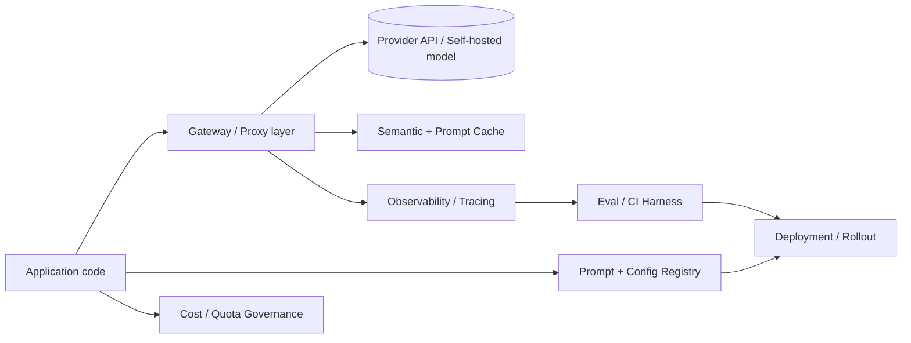

> **One-paragraph hook:** LLMOps is the operational discipline for shipping and running LLM-backed applications. It inherits MLOps' name and breaks most of its assumptions. In the overwhelming majority of production LLM apps the model is a frozen third-party dependency called over HTTP, not an artifact you train. What changes week to week is the prompt in front of it, and that reshapes the whole operational problem.

## The mechanism

Classical MLOps is built around a training loop. You own the weights, you have a labeled validation set, and "did this change help" is a number you compute offline before shipping. LLMOps loses almost all of that. Most teams call a provider API, so there's no gradient step to instrument and no checkpoint to version. The unit of change is the prompt, which is effectively the system's source code, plus the tools, retrieved context and decode parameters around it. Outputs are non-deterministic even at temperature 0 ([[Concept - Nondeterminism in Production LLM Serving]] explains why), and there's rarely a clean ground-truth label to score against. An offline metric that looked great in a notebook can fail to predict production quality without anyone noticing.

In place of the training loop, a production LLM app needs a stack of operational layers, whether the model is hosted or self-served:

- **Gateway/proxy** (LiteLLM, Portkey, Cloudflare AI Gateway; see [[Concept - LLM Gateways and Routing]]) centralizes the call path.
- **Observability/tracing** (Langfuse, LangSmith, Arize Phoenix, Helicone; see [[Concept - LLM Observability and Tracing]]) records what happened.
- **Prompt and config management** tracks the "code".
- **Eval/CI harness** scores changes before and after they ship.
- **Semantic and prompt caching** cuts redundant calls.
- **Cost/quota governance** bounds the blast radius of a single bad request ([[Concept - Cost Engineering for LLM Applications]]).
- **Deployment/rollout** governs how a change reaches users ([[Concept - Model Lifecycle and Versioning]]).

What ships is three artifacts bound together: the exact model snapshot (`gpt-4o-2024-08-06`, not the floating alias `gpt-4o`), the prompt template hash, and the inference config (temperature, tool schema, `max_tokens`). Changing any one of them is a deploy. Track only one and an incident review can reconstruct the model that was live but not the prompt, or the reverse.

## In practice

MLOps runs train → deploy → monitor on a cadence of weeks. LLMOps runs prompt → eval → ship → observe → iterate in hours, because no retraining gate sits between an idea and a production change. That speed is the whole point of building on a frontier model, and also the risk. A slow training cycle forced safety rails on MLOps for free: a held-out eval, a review of the diff. In LLMOps you have to rebuild them on purpose.

Some production magnitudes to remember. Agentic and RAG apps commonly issue 2-5 model calls per user-facing action (retrieval, tool calls, a final generation). Cost is usually dominated by input tokens, because RAG context and conversation history get resent every turn; long generations aren't the driver. A typical interactive-chat latency budget is around 1-3 seconds end to end.

A self-hosted serving stack like [[Breakdown - vLLM]] sits at the bottom of the deployment layer once volume justifies it. Most teams start on a managed API and self-host only when the economics tip (domain 16's own Decision note on self-hosting covers that call). Agentic systems add their own loop on top of this stack ([[Deep Dive - The Agent Loop]]). Whether you prompt, use RAG or fine-tune in the first place is a real engineering decision ([[Decision - Fine-Tuning vs RAG vs Prompting]]) and it sets how much of the LLMOps stack you need. Gating a prompt change with evals before it ships is its own discipline: [[Deep Dive - Designing an Eval Harness]].

## Failure modes

**Prompts as untracked config.** A prompt edited directly in a config file or dashboard, with no diff and no history, causes regressions nobody can bisect. The team knows behavior changed but not which of the last five edits did it.

**No request/response logging.** Without captured payloads you can't reproduce or root-cause a user-reported bad output. The incident is gone once the response has streamed back.

**No cost attribution.** Without per-call tagging, teams learn their unit economics from the monthly invoice, by which point one misbehaving feature may have been burning budget for weeks.

## The non-obvious

People coming from MLOps go looking for the "model versioning" problem and solve it in isolation. But the prompt breaks production more often than the model does, because prompts get edited far more often and with far less ceremony than anyone edits a pinned model string. A team with strict model pinning and prompts as untracked strings in application code has solved the easier half of versioning and left the more dangerous half open. The prompt is code. Give it the same review, versioning and CI as the code around it.

## Connections

- [[Concept - LLM Observability and Tracing]] — the layer that turns an opaque API call into something debuggable; without it, LLMOps has no feedback signal.
- [[Concept - Cost Engineering for LLM Applications]] — the stack layer that keeps the hours-long ship cadence from turning into an uncontrolled bill.
- [[Concept - Model Lifecycle and Versioning]] — the mechanics of the "three artifacts" bundle and how it is promoted and rolled back.
- [[Concept - LLM Gateways and Routing]] — the proxy layer most of the stack's other pieces (caching, cost tracking, fallback) are typically implemented behind.
- [[Breakdown - vLLM]] — a concrete self-hosted serving engine that sits at the deployment layer once volume justifies owning the GPUs.
- [[Deep Dive - Designing an Eval Harness]] — what replaces the offline validation set that classical MLOps relied on to gate a ship.
- [[Deep Dive - The Agent Loop]] — the multi-call control flow that drives the "2-5 calls per action" magnitude cited above.
- [[Decision - Fine-Tuning vs RAG vs Prompting]] — the upstream decision that determines how much of the LLMOps stack a given feature actually needs.
- [[Concept - Nondeterminism in Production LLM Serving]] — the reason "did this change help" can't be answered from a single sample the way an offline MLOps metric could.

## Sources
- Huyen, C. (2022) — *Designing Machine Learning Systems* (O'Reilly) — the ML-system lifecycle framing that LLMOps departs from once the model becomes an external frozen dependency.
- Google Cloud (2020) — "MLOps: Continuous Delivery and Automation Pipelines in Machine Learning" — the canonical train → deploy → monitor loop LLMOps compresses into hours.
- OpenTelemetry GenAI Special Interest Group (2024–2026, ongoing) — GenAI semantic conventions — the emerging vendor-neutral standard for the observability layer of the stack.
