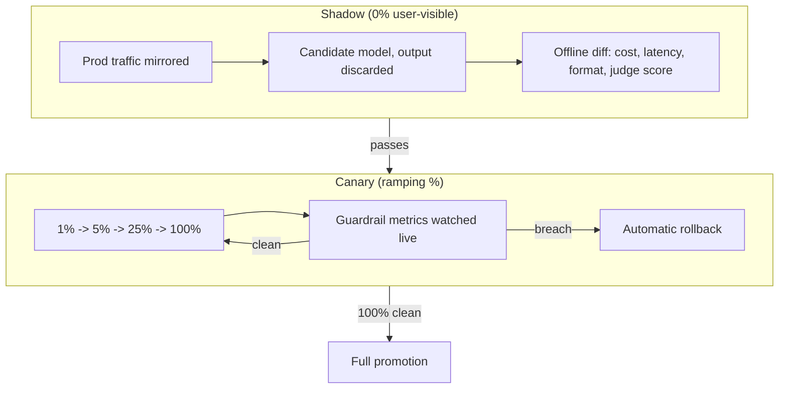

> **One-paragraph hook:** Progressive delivery (shadow a change, canary it to a small slice of traffic, promote or roll back) is standard practice for shipping any software change safely. LLM changes need the same discipline. The difference is the gate: "did this help or hurt" can't be a test-suite pass/fail, because a generated response has no ground-truth label. The rollout mechanics come from classical deployment. The metrics that gate them have to be invented for a system whose output is a distribution, not an assertion.

## The mechanism

**Shadow (mirror) deployment** sends a copy of live traffic to the candidate model or prompt in parallel and never returns its output to the user. You compare shadow and incumbent offline on cost, latency, output-format validity and judge scores. Nothing the shadow produces reaches a user, so this is the zero-risk step that catches latency, cost and format regressions before real traffic depends on the new version.

**Canary deployment** routes a small, ramping share of real traffic to the new version, typically 1% → 5% → 25% → 100%, while guardrail metrics are watched continuously and an automatic rollback fires if any threshold is breached. Canary output is real and user-visible. The watched metrics (error rate, latency, refusal rate, thumbs-down rate, cost per request) have to be tight enough to catch a regression before it reaches a meaningful fraction of users.

**Blue-green deployment** keeps two complete environments live and moves all traffic between them with a single alias flip, the same mechanism the version triple in [[Concept - Model Lifecycle and Versioning]] uses for instant rollback. You give up a canary's gradual exposure and get atomicity: the whole system moves to the new version, or back, in one step. That fits changes that can't be meaningfully partial, like a model snapshot swap that also changes the tokenizer.

## In practice

What's different for LLMs is the missing label. A REST endpoint canary can check schema and status code as a hard pass/fail. An LLM canary has no such assertion, so the gate is built from proxies: [[Concept - LLM-as-Judge]] scoring against a rubric, pairwise diffing of incumbent and candidate outputs on matched inputs, and distributional metrics (output-length distribution, refusal rate, schema-valid rate) that stand in for quality you can't assert directly.

Generation is non-deterministic even at temperature 0 ([[Concept - Nondeterminism in Production LLM Serving]]), so one paired comparison is noise. Telling a real regression from sampling variance takes enough paired samples per prompt, and enough distinct users alone won't get you there. [[Concept - Statistical Rigor in Model Evaluation]] covers this in depth. Teams routinely under-provision here by treating "one canary user, one sample" as sufficient.

A clean 100% promotion doesn't end the job. [[Concept - Production Monitoring and Drift Detection]] takes over once a canary finishes, because a version that passed every gate can still drift weeks later from a silent provider-side change with no deploy on your side.

Champion-challenger, run as an online A/B test on product metrics (task success rate, retention, human-escalation rate), is the closest thing to ground truth you have at promotion time, since it measures downstream outcomes instead of proxying for quality. It's also the slowest and most expensive gate. That's what shadow and canary are for, as cheaper filters upstream:

- Shadow catches the loud regressions (a broken output format, a 3x cost increase, a latency doubling) for free, before any user is exposed.
- Canary catches the moderate ones with limited exposure.
- Champion-challenger is kept for questions that need a product-level A/B to answer.

All three feed the apparatus in [[Playbook - Incident Response for LLM Systems]] and the pre-flight gates in [[Checklist - Production LLM Launch Readiness]]; that checklist's "rollout group" and "quality/eval group" are checking that these mechanics are wired up. The eval harness producing the judge scores and proxy metrics for every stage is its own infrastructure, covered in [[Deep Dive - Designing an Eval Harness]]. The schema-valid-rate gate depends on the structured-output discipline in [[Playbook - Reliable Structured Output]]. Without a format-validity gate, a canary can promote a prompt change that silently breaks a downstream parser while every other metric looks clean.

## Failure modes

**Canarying on the wrong axis.** A rollout watched only for latency and cost can sail through a real quality regression (a subtly worse tone, more hallucination on a rare input type) because neither latency nor cost moved.

**A canary too small to see rare, severe failures.** A 1% ramp exposes so few users that a failure hitting 1-in-2000 requests may never show up before the ramp moves to 25%. By then far more users have hit it.

**No format-validity gate.** A prompt change that alters output structure in a way a downstream parser can't handle passes every quality and cost metric and still breaks production, because schema-valid rate was never watched.

## The non-obvious

An aggregate quality score, even a well-calibrated judge score, can stay flat while the output distribution changes shape. An average hides a shift in shape. A candidate that gets more verbose for one group of queries and more terse for another can average out to "no change" on mean judge score while user experience visibly changed for both. Teams burned by this add a separate diff-rate metric to the canary gate: the fraction of paired outputs a judge scores as *materially different* from the incumbent, regardless of which scored higher. It catches drift in kind as well as drift in average quality, and no single scalar metric is built to detect the former.

## Connections

- [[Concept - Model Lifecycle and Versioning]] — the version-triple and alias-flip machinery that blue-green and rollback in this note actually operate on.
- [[Concept - Production Monitoring and Drift Detection]] — the ongoing, post-promotion counterpart to the pre-promotion gating this note describes; a clean canary doesn't guarantee no drift six weeks later.
- [[Concept - LLM-as-Judge]] — the primary proxy-quality signal used to gate a rollout in the absence of a ground-truth label.
- [[Concept - Statistical Rigor in Model Evaluation]] — why paired-sample counts, not user counts, determine whether a canary result is signal or noise.
- [[Playbook - Incident Response for LLM Systems]] — the runbook that a rollback trigger from this note's canary gate hands off into.
- [[Checklist - Production LLM Launch Readiness]] — the pre-flight checklist whose rollout and quality/eval groups verify these patterns are actually implemented before a launch.
- [[Deep Dive - Designing an Eval Harness]] — the infrastructure that produces the judge scores and proxy metrics every stage of this note's rollout depends on.
- [[Playbook - Reliable Structured Output]] — the discipline behind the schema-valid-rate gate that catches a format-breaking prompt change other metrics miss.

## Sources
- Kohavi, R., Longbotham, R., Sommerfield, D., & Henne, R. M. (2009) — "Controlled Experiments on the Web: Survey and Practical Guide" — the methodological foundation for champion-challenger and canary-style controlled rollout that this note adapts to a labelless generation setting.
- Chen, L., Zaharia, M., & Zou, J. (2023) — "How Is ChatGPT's Behavior Changing over Time?" — empirical evidence that model behavior shifts even between nominally similar snapshots, motivating the shadow/canary diffing step rather than trusting a version bump alone.
