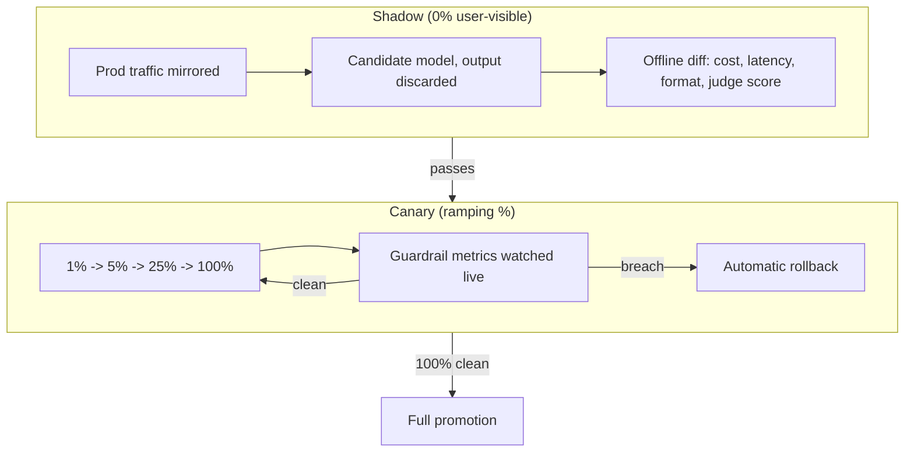

> **One-paragraph hook:** Progressive delivery — shadow a change, canary it to a small slice of traffic, promote or roll back — is standard practice for shipping any software change safely. LLM changes need the same discipline, but the gate that decides "did this help or hurt" cannot be a test-suite pass/fail, because there is no ground-truth label for a generated response. The rollout mechanics are borrowed from classical deployment; the metrics that gate them have to be invented for a system whose output is a distribution, not an assertion.

## The mechanism

**Shadow (mirror) deployment** sends a copy of live production traffic to the candidate model or prompt in parallel, without ever returning its output to the user, and compares the shadow's outputs against the incumbent's offline — on cost, latency, output-format validity, and judge scores. Because nothing the shadow produces reaches a user, this is the zero-user-risk step that catches latency, cost, and format regressions before any real traffic depends on the new version.

**Canary deployment** routes a small, ramping percentage of real traffic to the new version — a typical ramp is 1% → 5% → 25% → 100% — while watching guardrail metrics continuously, with an automatic rollback trigger if any threshold is breached. Unlike shadow, canary traffic's output is real and user-visible, so the metrics being watched (error rate, latency, refusal rate, thumbs-down rate, cost per request) have to be tight enough to catch a regression before it reaches a meaningful fraction of users.

**Blue-green deployment** keeps two complete environments live simultaneously and switches all traffic between them via a single alias flip — the same mechanism the version triple in [[Concept - Model Lifecycle and Versioning]] uses for instant rollback. It trades the gradual-exposure safety of a canary for atomicity: the whole system moves to the new version (or back) in one step, which is the right shape for changes that can't be meaningfully partial, such as a model snapshot swap that also changes the tokenizer.

## In practice

What actually differs for LLMs, compared to canarying a classical service, is the absence of a label to assert against. A REST endpoint canary can check "did the response match the expected schema and status code" as a hard pass/fail; an LLM canary has no such assertion, so the gating signal has to be built from proxy measures instead: [[Concept - LLM-as-Judge]] scoring against a rubric, pairwise output diffing between the incumbent and the candidate on matched inputs, and distributional proxy metrics — output-length distribution, refusal rate, schema-valid rate — that stand in for quality when quality itself can't be asserted directly. Because generation is non-deterministic even at temperature 0 (see [[Concept - Nondeterminism in Production LLM Serving]]), a single paired comparison is noise, not signal; separating a real regression from sampling variance requires enough paired samples per prompt — not just enough distinct users — to reach statistical significance, a requirement [[Concept - Statistical Rigor in Model Evaluation]] covers in more depth and that teams routinely under-provision by treating "one canary user, one sample" as sufficient.

A clean 100% promotion is not the end of the story: [[Concept - Production Monitoring and Drift Detection]] takes over the moment a canary finishes, because a version that passed every rollout gate can still drift weeks later from a silent provider-side change with no corresponding deploy on your side. Champion-challenger, run as an online A/B test against real product metrics — task success rate, retention, human-escalation rate — is the closest thing to ground truth available at promotion time, because it measures downstream outcomes rather than proxying for quality directly. It's also the slowest and most expensive gate, which is why shadow and canary exist as cheaper upstream filters: shadow catches the loud regressions (a broken output format, a 3x cost increase, a latency doubling) for free before any user is exposed, canary catches the moderate ones with limited exposure, and champion-challenger is reserved for questions that genuinely require a product-level A/B to answer. All three stages feed the same operational apparatus described in [[Playbook - Incident Response for LLM Systems]] and the pre-flight gates enumerated in [[Checklist - Production LLM Launch Readiness]] — the rollout mechanics here are what that checklist's "rollout group" and "quality/eval group" are actually verifying are wired up. The eval harness that produces the judge scores and proxy metrics feeding all three stages is its own piece of infrastructure, covered in [[Deep Dive - Designing an Eval Harness]], and the schema-valid-rate gate specifically depends on the structured-output discipline in [[Playbook - Reliable Structured Output]] — a canary with no format-validity gate can promote a prompt change that silently breaks a downstream parser while every other metric looks clean.

## Failure modes

**Canarying on the wrong axis.** A rollout watched only for latency and cost regressions can sail through while a real quality regression — a subtly worse tone, a higher hallucination rate on a rare input type — goes undetected, because neither latency nor cost moved. **A canary too small to see rare-but-severe failures.** A 1% ramp exposes so few users that a failure mode occurring in 1-in-2000 requests may not appear at all before the ramp advances to 25%, by which point far more users have hit it. **Missing the format-validity gate.** A prompt change that alters output structure in a way a downstream parser can't handle passes every quality and cost metric cleanly and still breaks production, because schema-valid rate was never one of the gates being watched.

## The non-obvious

A single aggregate quality score — even a well-calibrated judge score — can stay flat while the actual distribution of outputs shifts qualitatively, because an average is exactly the statistic that hides a shift in shape rather than level: a candidate that becomes more verbose for one subpopulation of queries and more terse for another can average out to "no change" on a mean judge score while user experience visibly changed for both groups. Teams that have been burned by this add a distinct diff-rate metric to their canary gate — the fraction of paired outputs a judge scores as *materially different* from the incumbent, independent of whether either output scored higher or lower — specifically because it catches drift in kind, not just drift in average quality, which no single scalar metric is built to detect.

## Connections

- [[Concept - Model Lifecycle and Versioning]] — the version-triple and alias-flip machinery that blue-green and rollback in this note actually operate on.
- [[Concept - Production Monitoring and Drift Detection]] — the ongoing, post-promotion counterpart to the pre-promotion gating this note describes; a clean canary doesn't guarantee no drift six weeks later.
- [[Concept - LLM-as-Judge]] — the primary proxy-quality signal used to gate a rollout in the absence of a ground-truth label.
- [[Concept - Statistical Rigor in Model Evaluation]] — why paired-sample counts, not user counts, determine whether a canary result is signal or noise.
- [[Playbook - Incident Response for LLM Systems]] — the runbook that a rollback trigger from this note's canary gate hands off into.
- [[Checklist - Production LLM Launch Readiness]] — the pre-flight checklist whose rollout and quality/eval groups verify these patterns are actually implemented before a launch.
- [[Deep Dive - Designing an Eval Harness]] — the infrastructure that produces the judge scores and proxy metrics every stage of this note's rollout depends on.
- [[Playbook - Reliable Structured Output]] — the discipline behind the schema-valid-rate gate that catches a format-breaking prompt change other metrics miss.

## Sources
- Kohavi, R., Longbotham, R., Sommerfield, D., & Henne, R. M. (2009) — "Controlled Experiments on the Web: Survey and Practical Guide" — the methodological foundation for champion-challenger and canary-style controlled rollout that this note adapts to a labelless generation setting.
- Chen, L., Zaharia, M., & Zou, J. (2023) — "How Is ChatGPT's Behavior Changing over Time?" — empirical evidence that model behavior shifts even between nominally similar snapshots, motivating the shadow/canary diffing step rather than trusting a version bump alone.
