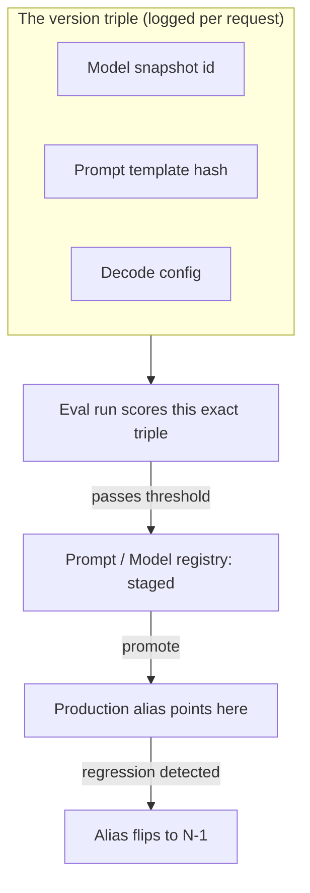

> **One-paragraph hook:** Every production LLM feature is three artifacts wearing one trench coat: a model snapshot, a prompt template and a decode config. Unlike a normal software deploy, one of the three (the model) belongs to someone else, who can change, deprecate or retire it on their own schedule. Model lifecycle and versioning means pinning, tracking, promoting and rolling back that triple so "what was live during the incident" always has an answer.

## The mechanism

The version triple is the unit of truth:

- the exact model string, a dated snapshot like `gpt-4o-2024-08-06` or `claude-sonnet-4-20250514`, never the floating alias `gpt-4o`;
- a content hash or semver id for the prompt template;
- the decode config (temperature, `top_p`, tool schema, `max_tokens`).

Log all three on every request. A reproducible-in-principle output needs the whole triple, and the model id alone won't do. [[Concept - LLM Observability and Tracing]] captures this at the span level, and [[Concept - LLMOps]] treats it as the unit that ships.

Provider aliases move. `gpt-4o` and other unversioned names get repointed to a new checkpoint whenever the provider decides, so an app pinned to the alias picks up behavior changes it never asked for or deployed. Dated snapshots are stable by comparison but not permanent. Providers publish deprecation and sunset schedules: OpenAI typically gives months-to-a-year notice before retiring a snapshot, and Azure OpenAI publishes explicit GA and retirement dates per model. Every pinned model eventually forces a migration, wanted or not.

Prompts get versioned like code. Store each one as a content-hashed or semver'd artifact in git or a prompt registry (Langfuse, PromptLayer, Humanloop), and tie every version to the eval run that scored it. A prompt then never ships without a known quality number for that exact version, as opposed to "the prompt" as a mutable concept.

For self-hosted weights the equivalent is a model registry (MLflow, Weights & Biases) with stage tags (`staging`/`prod`), immutable artifact storage and provenance metadata: which checkpoint, which training data, which base model, and, where relevant, which [[Deep Dive - LoRA]] adapter was merged or attached. It's the provenance chain a [[Reference - Model Genealogy]] entry records at the ecosystem level, applied to your own deployed artifact.

Design rollback up front; don't improvise it mid-incident. Keep the previous version (N-1) pinned and warm instead of tearing it down, and send production traffic through an alias or router layer so rollback is one alias flip, not a redeploy. This only works if N-1's infrastructure (weights loaded, connections warm) is still live when you need it.

## In practice

To ship a new prompt version, a team runs it through the eval harness against the currently pinned model snapshot, compares scores with the incumbent prompt, and only then promotes it to the production label in the prompt registry.

A change to the model itself, say moving from one dated snapshot to a newer one ahead of a deprecation date, is a full redeploy. Re-run the eval suite on the new snapshot with the existing prompt held constant, because the output-quality signals in [[Concept - Production Monitoring and Drift Detection]] can shift on a model change alone, with zero prompt changes.

Fine-tuned or distilled models built on a base checkpoint (see [[Concept - Supervised Fine-Tuning (SFT)]]) inherit the base model's deprecation timeline as an extra forcing function. When the base is sunset, the fine-tune's provenance chain breaks unless the base was archived.

Gateway/router products like the one in [[Breakdown - LiteLLM]] implement alias-flip rollback directly. A logical model name maps to a pool of physical deployments, and changing which deployment the alias resolves to is how rollback works in practice.

## Failure modes

**Not pinning the model.** The team ships against the floating alias, the provider repoints it, and behavior changes overnight with no deploy on the team's side. There's no commit to `git blame`.

**No rollback path.** Without a warm N-1, a regression in a newly promoted model or prompt leaves the team stuck mid-incident: eat the regression, or scramble to redeploy the old version cold.

**Split versioning.** The model is tracked in one system and the prompt in another, or not at all. During an incident nobody can say with confidence which model-prompt-config combination was live. The triple existed in principle but was never captured as one unit.

## The non-obvious

The provider's model card and API changelog aren't version control. Teams that go by "we're on gpt-4o, per the docs" and don't log the dated snapshot id on every request find out, usually during an incident, that they can't say which checkpoint served a given user's request last Tuesday. Capture the dated snapshot string at request time as data. Don't read it off a settings page, because the alias-to-snapshot mapping is the thing that silently moves.

## Connections

- [[Concept - LLMOps]] — the discipline this note's version triple is the versioning half of; LLMOps names the artifact, this note is how it's managed over time.
- [[Concept - LLM Observability and Tracing]] — the mechanism that captures the version triple on every request, which is what makes an incident's "live version" answerable.
- [[Concept - Model Deployment Patterns for LLMs]] — the progressive-delivery mechanics (canary, shadow, blue-green) that consume this version triple during a promotion.
- [[Lore - When the Model Changed Under You]] — the war stories that motivate pinning dated snapshots in the first place.
- [[Concept - Production Monitoring and Drift Detection]] — how you detect that a pinned version has drifted anyway, or that a promoted version regressed.
- [[Deep Dive - LoRA]] — the adapter-provenance case for self-hosted model registries, where the "model" is a base checkpoint plus a versioned delta.
- [[Reference - Model Genealogy]] — the ecosystem-wide version of the same provenance question, applied to public model lineages rather than your own deployment.
- [[Concept - Supervised Fine-Tuning (SFT)]] — the training step that produces a self-hosted artifact needing its own registry entry, as distinct from calling a provider snapshot.
- [[Breakdown - LiteLLM]] — a concrete implementation of alias-indirection rollback via its Router's deployment pool abstraction.

## Sources
- Chen, L., Zaharia, M., & Zou, J. (2023) — "How Is ChatGPT's Behavior Changing over Time?" — empirical evidence that even snapshots believed stable can drift, the core motivation for treating the model as a versioned, monitored dependency rather than a constant.
- OpenAI and Microsoft Azure OpenAI Service model deprecation documentation (2024–2026, ongoing) — the sunset-schedule mechanics that force periodic migration of pinned snapshots.
- MLflow Model Registry documentation — the stage-tag (`staging`/`prod`) and immutable-artifact pattern this note's self-hosted registry section is built on.
