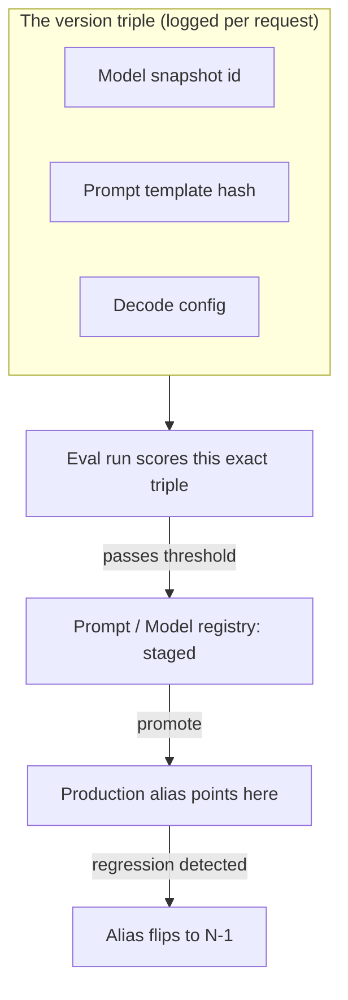

> **One-paragraph hook:** Every production LLM feature is really three artifacts wearing one trench coat — a model snapshot, a prompt template, and a decode config — and unlike a normal software deploy, one of those three artifacts (the model) is owned by someone else who can change it, deprecate it, or retire it on their own schedule. Model lifecycle and versioning is the discipline of pinning, tracking, promoting, and rolling back that triple so "what was live during the incident" is always a knowable answer.

## The mechanism

The version triple is the unit of truth: the exact model string (`gpt-4o-2024-08-06`, `claude-sonnet-4-20250514` — a dated snapshot, never the floating alias `gpt-4o`), a content-hash or semver identifier for the prompt template, and the decode config (temperature, `top_p`, tool schema, `max_tokens`). All three should be logged on every request, because a reproducible-in-principle output requires all three, not just the model id — this is the same discipline [[Concept - LLM Observability and Tracing]] captures at the span level and [[Concept - LLMOps]] frames as the unit that ships.

Provider aliases are moving targets, not stable identifiers: `gpt-4o` and similar unversioned names repoint to a new underlying checkpoint at the provider's discretion, so an application pinned to the alias inherits behavior changes it never asked for and never deployed. Dated snapshots are stable in comparison but are not permanent — providers publish deprecation and sunset schedules (OpenAI typically gives months-to-a-year notice before retiring a snapshot; Azure OpenAI publishes explicit GA and retirement dates per model), which means every pinned model eventually forces a migration whether or not the team wants one.

Prompt versioning follows the same logic as code versioning: store the prompt as a content-hash or semver'd artifact in git or a dedicated prompt registry (Langfuse, PromptLayer, Humanloop), and tie every prompt version to the eval run that scored it, so a prompt never ships without a known quality number attached to that exact version — not to "the prompt" as a mutable concept.

For self-hosted weights, the equivalent registry is a model registry (MLflow, Weights & Biases) with stage tags (`staging`/`prod`), immutable artifact storage, and provenance metadata: which checkpoint, which training data, which base model, and — where relevant — which [[Deep Dive - LoRA]] adapter was merged or attached. This is the same provenance chain a [[Reference - Model Genealogy]] entry documents at the ecosystem level, applied to your own deployed artifact.

Rollback is designed in up front, not improvised during an incident: keep the previous version (N-1) pinned and warm rather than torn down, and route production traffic through an alias or router indirection layer so rollback is a single alias flip, not a redeploy. This only works if N-1's infrastructure (weights loaded, connections warm) is actually still live when you need it.

## In practice

A team ships a new prompt version by first running it through the eval harness against the currently-pinned model snapshot, comparing scores against the incumbent prompt version, and only then promoting it to the production label in the prompt registry. If the underlying model itself changes — say migrating from one dated snapshot to a newer one ahead of a provider's deprecation date — that is treated as a full redeploy: re-run the eval suite against the new snapshot with the existing prompt held constant, because [[Concept - Production Monitoring and Drift Detection]] output-quality signals can shift on a model change alone even with zero prompt changes. Fine-tuned or distilled models built on top of a base checkpoint (see [[Concept - Supervised Fine-Tuning (SFT)]]) inherit the base model's deprecation timeline as an additional forcing function — when the base is sunset, the fine-tune's provenance chain breaks unless the base was archived. Gateway/router products such as the one described in [[Breakdown - LiteLLM]] implement the alias-flip rollback pattern directly: a logical model name maps to a pool of physical deployments, and swapping which deployment the alias resolves to is the rollback mechanism in practice, not a conceptual ideal.

## Failure modes

**Not pinning the model.** A team ships against the floating alias, the provider repoints it, and behavior changes overnight with zero deploy on the team's side — the incident has no corresponding commit to `git blame`. **No rollback path.** Without a warm N-1, a regression in a newly promoted model or prompt leaves the team stuck mid-incident, forced to either eat the regression or scramble to redeploy the old version cold. **Split versioning.** The model is tracked in one system and the prompt in another (or not at all), so during an incident nobody can state with confidence which model-prompt-config combination was actually live — the version triple exists in principle but was never captured as one unit.

## The non-obvious

The provider's own model card and API changelog are not sufficient version control — teams that rely on "we're on gpt-4o, per the docs" rather than logging the dated snapshot id on every request discover, usually during an incident, that they cannot actually state which underlying checkpoint served a given user's request last Tuesday. The dated snapshot string has to be captured at request time as data, not assumed from a settings page, because the alias-to-snapshot mapping is exactly the thing that silently moves.

## Connections

- [[Concept - LLMOps]] — the discipline this note's version triple is the versioning half of; LLMOps names the artifact, this note is how it's managed over time.
- [[Concept - LLM Observability and Tracing]] — the mechanism that captures the version triple on every request, which is what makes an incident's "live version" answerable.
- [[Concept - Model Deployment Patterns for LLMs]] — the progressive-delivery mechanics (canary, shadow, blue-green) that consume this version triple during a promotion.
- [[Lore - When the Model Changed Under You]] — the war stories that motivate pinning dated snapshots in the first place.
- [[Concept - Production Monitoring and Drift Detection]] — how you detect that a pinned version has drifted anyway, or that a promoted version regressed.
- [[Deep Dive - LoRA]] — the adapter-provenance case for self-hosted model registries, where the "model" is a base checkpoint plus a versioned delta.
- [[Reference - Model Genealogy]] — the ecosystem-wide version of the same provenance question, applied to public model lineages rather than your own deployment.
- [[Concept - Supervised Fine-Tuning (SFT)]] — the training step that produces a self-hosted artifact needing its own registry entry, as distinct from calling a provider snapshot.
- [[Breakdown - LiteLLM]] — a concrete implementation of alias-indirection rollback via its Router's deployment pool abstraction.

## Sources
- Chen, L., Zaharia, M., & Zou, J. (2023) — "How Is ChatGPT's Behavior Changing over Time?" — empirical evidence that even snapshots believed stable can drift, the core motivation for treating the model as a versioned, monitored dependency rather than a constant.
- OpenAI and Microsoft Azure OpenAI Service model deprecation documentation (2024–2026, ongoing) — the sunset-schedule mechanics that force periodic migration of pinned snapshots.
- MLflow Model Registry documentation — the stage-tag (`staging`/`prod`) and immutable-artifact pattern this note's self-hosted registry section is built on.
