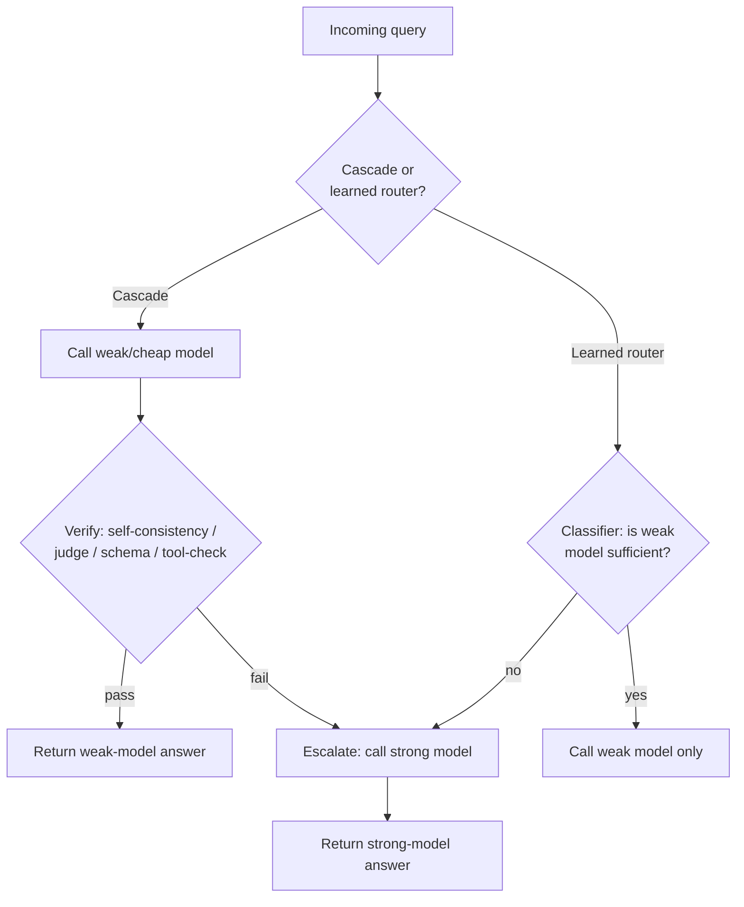

> **One-paragraph hook:** Most requests to a production LLM app don't need your strongest model to answer them well — a large fraction are easy by any reasonable definition, and sending them to a frontier model anyway is paying frontier prices for a query a much cheaper model would have nailed. Model routing and cascades exploit that gap deliberately: instead of a fixed model per feature, every request gets dynamically assigned to the cheapest model expected to handle it, with escalation to something stronger only when there's evidence the cheap model isn't enough. The payoff compounds across every request in a way a single prompt or model change never does.

## The mechanism

There are two structurally different ways to do this, and it matters which one you've actually built.

**Cascades** run the cheap model first, always, and decide afterward whether to trust its answer. A verifier checks the weak model's output; if it passes, return it; if not, escalate to a stronger model and return that instead. The expected cost per query is

$$
\mathbb{E}[\text{cost}] = c_{\text{weak}} + (1 - p_{\text{accept}}) \cdot c_{\text{strong}}
$$

where $p_{\text{accept}}$ is the fraction of queries the verifier accepts from the weak model without escalating. The whole scheme lives or dies on the verifier: self-consistency (sample the weak model $k$ times and check agreement), an [[Concept - LLM-as-Judge]] score against a threshold, schema/format validity against a target structure (see [[Playbook - Reliable Structured Output]]), or a tool-result check (code compiles and passes tests, a calculation checks out).

**Learned routers** skip running the weak model at all and predict up front, from the query alone, whether it's the kind of query the weak model would have handled fine. A lightweight classifier is trained on labeled (query, "was the weak model sufficient?") pairs and makes the routing call before any model is invoked. Difficulty signals typically include query length and complexity, embedding-cluster membership, the presence of code or math, requested output length, and historical success on similar queries.

Conceptually this is the same cheap-draft-then-verify shape as [[Concept - Speculative Decoding]], just moved up a level of granularity: speculative decoding verifies a cheap model's guesses token-by-token against the target model inside a single generation, while routing and cascades verify (or predict) at the level of a whole request, deciding which model handles it end to end.

## In practice

Cascades and learned routers both target the same cost/quality Pareto frontier that [[Concept - Cost Engineering for LLM Applications]] frames as the thing to optimize, but they arrive from opposite directions: a cascade always pays for the weak call and saves on escalations, while a router pays a small classification cost and saves the weak call entirely on queries it's confident will need the strong model anyway. FrugalGPT (Chen, Zaharia & Zou, 2023) demonstrated the cascade approach with a learned scoring function gating escalation, reporting up to roughly 98% cost reduction on some tasks while matching or improving accuracy relative to always calling the strongest available model. RouteLLM (LMSYS, 2024) trains a classifier router on human preference data — pairwise comparisons from Chatbot Arena-style judgments — and reports large cost reductions at matched quality against an always-strong baseline.

At the infrastructure layer, routing decisions get executed wherever the request already passes through — typically the [[Concept - LLM Gateways and Routing|gateway]], since it already sees every call and can swap the target model without any application-code change; [[Breakdown - LiteLLM]]'s Router primitive is the common substrate this gets built on top of. Routing and cascades are also the mechanism that makes the hybrid architectures in [[Decision - Self-Hosting vs Managed LLM API]] work in practice — a cheap self-hosted model handling the bulk of traffic with escalation to a frontier API model captures most of the self-hosting cost win without betting the whole workload on it. Commercial routers (Martian, NotDiamond, Unify) package this as a hosted product, and providers themselves have started shipping it internally — a GPT-5-style auto-router (as of 2026) that transparently picks between a fast, cheap mode and a slower, deeper-reasoning mode per query without the caller choosing explicitly.

## Failure modes

**Misroute is the highest-pain case and it's silent by construction.** When a cascade's verifier or a router's classifier accepts a weak-model answer that's actually wrong, there is no second check — the answer ships, and unless something downstream catches it (a user complaint, a judge score on sampled traffic), the quality drop is invisible in aggregate cost and latency metrics. **Escalation is a latency tax, not just a cost one.** A cascade that escalates pays for the weak call *and* the strong call sequentially — a full extra network round trip on top of a full generation — so for the escalated fraction of traffic, tail latency gets strictly worse than always calling the strong model directly, unless the two are raced in parallel (which then also strictly increases cost). Teams that only track average latency and average cost routinely miss this and get paged when p99 breaches SLO under a traffic mix with more hard queries than usual. **Verifier or router failure defeats the whole scheme in one of two directions:** a verifier that always accepts collapses back to "always cheap, sometimes wrong," and one that always rejects collapses back to "always expensive," silently erasing the savings the system was built for.

## The non-obvious

The instinct is to tune a router once at launch and move on, but the routing boundary is workload-specific and drifts with your traffic — a new feature that shifts the query distribution, or a competitor's price cut that changes which model is actually "cheap" this quarter, can flip which model *should* handle a given query class without any code change on your side. A router validated once and never re-benchmarked degrades exactly like a model does in production, and needs the same continuous re-evaluation discipline, not a one-time calibration. The subtler trap: because frontier model prices and capabilities move faster than most teams retrain routers, a router can end up routing traffic to a model that was cheap and sufficient when it was trained but is now *more* expensive, *less* capable, or both, relative to a newer alternative it was never trained to consider.

## Connections

- [[Concept - LLM Gateways and Routing]] — the layer where a routing decision is actually executed against live traffic.
- [[Concept - Cost Engineering for LLM Applications]] — the cost/quality frontier that routing and cascades exist to move along.
- [[Decision - Self-Hosting vs Managed LLM API]] — the hybrid architecture (self-hosted cheap tier, API frontier escalation) that routing makes practical.
- [[Concept - LLM-as-Judge]] — one of the verification methods a cascade uses to decide whether to trust the weak model's answer.
- [[Playbook - Reliable Structured Output]] — schema/format validity as a cheap, deterministic verification signal for a cascade to gate on.
- [[Concept - Speculative Decoding]] — the same cheap-draft-then-verify mechanism at token granularity instead of whole-request granularity.
- [[Breakdown - LiteLLM]] — the router primitive most self-built routing/cascade systems execute on top of.
- [[Gotchas - LLM Production Operations]] — the operational incident catalog, including failure patterns a misconfigured router or cascade can trigger in production.

## Sources
- Chen, L., Zaharia, M., & Zou, J. (2023) — *FrugalGPT: How to Use Large Language Models While Reducing Cost and Improving Accuracy.* Introduces LLM cascades gated by a learned scoring function, reporting up to ~98% cost reduction on some tasks at matched or improved accuracy.
- Ong, I. et al. (2024) — *RouteLLM: Learning to Route LLMs with Preference Data* (LMSYS). Trains a classifier router on human preference data to approach strong-model quality at a fraction of the cost of always calling the strong model.
