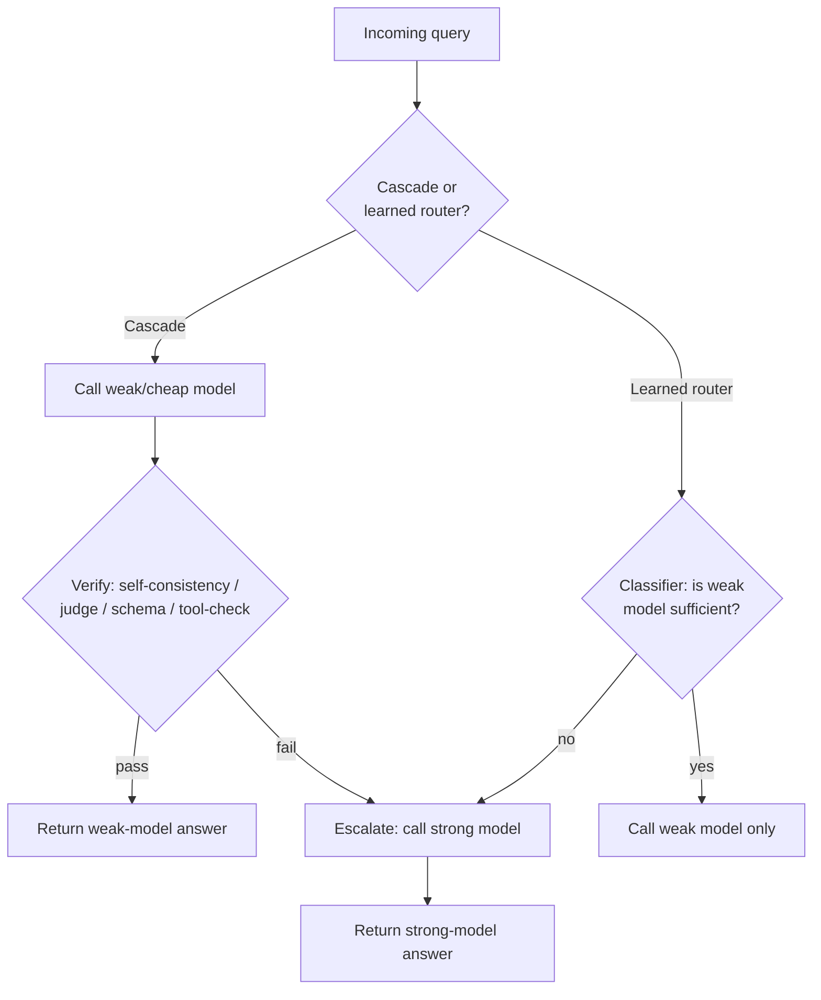

> **One-paragraph hook:** Most requests to a production LLM app don't need your strongest model. A large fraction are easy by any reasonable definition, and sending them to a frontier model anyway means paying frontier prices for a query a much cheaper model would have nailed. Model routing and cascades exploit that gap. There's no fixed model per feature: each request goes to the cheapest model expected to handle it, and escalates to a stronger one only when there's evidence the cheap one isn't enough. The savings compound across every request, which a single prompt or model change never does.

## The mechanism

There are two different ways to build this, and you should know which one you have.

**Cascades** always run the cheap model first and decide afterwards whether to trust it. A verifier checks the weak model's output. If it passes, return it. If not, escalate to a stronger model and return that. Expected cost per query is

$$
\mathbb{E}[\text{cost}] = c_{\text{weak}} + (1 - p_{\text{accept}}) \cdot c_{\text{strong}}
$$

where $p_{\text{accept}}$ is the fraction of queries the verifier accepts from the weak model without escalating. Everything depends on the verifier. Options: self-consistency (sample the weak model $k$ times and check agreement), an [[Concept - LLM-as-Judge]] score against a threshold, schema/format validity against a target structure (see [[Playbook - Reliable Structured Output]]), or a tool-result check (the code compiles and passes tests, a calculation checks out).

**Learned routers** don't run the weak model at all. They predict from the query alone whether the weak model would have handled it. A lightweight classifier trained on labeled (query, "was the weak model sufficient?") pairs makes the call before any model is invoked. Difficulty signals typically include query length and complexity, embedding-cluster membership, the presence of code or math, requested output length, and historical success on similar queries.

It's the same cheap-draft-then-verify shape as [[Concept - Speculative Decoding]], one level up. Speculative decoding checks a cheap model's guesses token by token against the target model inside one generation. Routing and cascades verify (or predict) per request and pick which model handles it end to end.

## In practice

Both approaches target the cost/quality Pareto frontier that [[Concept - Cost Engineering for LLM Applications]] treats as the thing to optimize, from opposite directions. A cascade always pays for the weak call and saves on escalations. A router pays a small classification cost and skips the weak call entirely on queries it's confident need the strong model.

FrugalGPT (Chen, Zaharia & Zou, 2023) showed the cascade approach with a learned scoring function gating escalation, reporting up to roughly 98% cost reduction on some tasks while matching or improving accuracy against always calling the strongest available model. RouteLLM (LMSYS, 2024) trains a classifier router on human preference data (pairwise comparisons from Chatbot Arena-style judgments) and reports large cost reductions at matched quality against an always-strong baseline.

In infrastructure terms, routing runs wherever the request already passes through. That's typically the [[Concept - LLM Gateways and Routing|gateway]], which sees every call and can swap the target model with no application-code change; [[Breakdown - LiteLLM]]'s Router primitive is the usual base for this. Routing and cascades also make the hybrid setups in [[Decision - Self-Hosting vs Managed LLM API]] work: a cheap self-hosted model takes the bulk of traffic and escalates to a frontier API model, capturing most of the self-hosting cost win without betting the whole workload on it. Commercial routers (Martian, NotDiamond, Unify) sell this as a hosted product. Providers have started shipping it internally too: a GPT-5-style auto-router (as of 2026) picks between a fast, cheap mode and a slower, deeper-reasoning mode per query without the caller choosing.

## Failure modes

**Misroutes hurt most, and they're silent by construction.** When a cascade's verifier or a router's classifier accepts a wrong weak-model answer, nothing checks it again. The answer ships. Unless something downstream catches it (a user complaint, a judge score on sampled traffic), the quality drop doesn't show up in aggregate cost or latency metrics.

**Escalation costs latency as well as money.** An escalating cascade pays for the weak call *and* the strong call in sequence: an extra network round trip plus a full generation. For the escalated fraction, tail latency is strictly worse than calling the strong model directly, unless you race the two in parallel, which then strictly increases cost. Teams tracking only average latency and cost routinely miss this and get paged when p99 breaches SLO under a traffic mix with more hard queries than usual.

**A broken verifier or router defeats the scheme in one of two directions.** One that always accepts collapses to "always cheap, sometimes wrong." One that always rejects collapses to "always expensive," and the savings disappear without anyone noticing.

## The non-obvious

The instinct is to tune a router at launch and move on. But the routing boundary is workload-specific and drifts with your traffic. A new feature that shifts the query distribution, or a competitor's price cut that changes which model counts as "cheap" this quarter, can flip which model *should* handle a query class with no code change on your side. A router validated once and never re-benchmarked degrades like a model does in production, and it needs the same continuous re-evaluation.

The subtler trap: frontier prices and capabilities move faster than most teams retrain routers. A router can keep sending traffic to a model that was cheap and sufficient when it was trained but is now *more* expensive, *less* capable, or both, compared with a newer alternative it was never trained to consider.

## Connections

- [[Concept - LLM Gateways and Routing]] — the layer where a routing decision is actually executed against live traffic.
- [[Concept - Cost Engineering for LLM Applications]] — the cost/quality frontier that routing and cascades exist to move along.
- [[Decision - Self-Hosting vs Managed LLM API]] — the hybrid architecture (self-hosted cheap tier, API frontier escalation) that routing makes practical.
- [[Concept - LLM-as-Judge]] — one of the verification methods a cascade uses to decide whether to trust the weak model's answer.
- [[Playbook - Reliable Structured Output]] — schema/format validity as a cheap, deterministic verification signal for a cascade to gate on.
- [[Concept - Speculative Decoding]] — the same cheap-draft-then-verify mechanism at token granularity instead of whole-request granularity.
- [[Breakdown - LiteLLM]] — the router primitive most self-built routing/cascade systems execute on top of.
- [[Gotchas - LLM Production Operations]] — the operational incident catalog, including failure patterns a misconfigured router or cascade can trigger in production.

## Sources
- Chen, L., Zaharia, M., & Zou, J. (2023) — *FrugalGPT: How to Use Large Language Models While Reducing Cost and Improving Accuracy.* Introduces LLM cascades gated by a learned scoring function, reporting up to ~98% cost reduction on some tasks at matched or improved accuracy.
- Ong, I. et al. (2024) — *RouteLLM: Learning to Route LLMs with Preference Data* (LMSYS). Trains a classifier router on human preference data to approach strong-model quality at a fraction of the cost of always calling the strong model.
