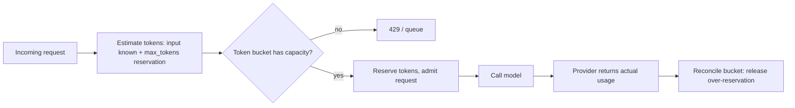

> **One-paragraph hook:** A classical API rate limiter counts requests per minute and treats every request as roughly the same size and duration. LLM traffic breaks both assumptions. A request's cost scales with tokens, and one generation can hold a connection open for seconds to minutes instead of milliseconds. Port a REST limiter's assumptions onto an LLM endpoint and everything it touches ends up undersized or oversized. That's why rate limiting belongs in the operational stack from [[Concept - LLMOps]] from the start and can't be bolted onto a working system later.

## The mechanism

LLM limits have to be token-based (TPM, tokens per minute) as well as request-based (RPM, requests per minute, or raw concurrency), because compute cost and latency both scale with token count. You know the input token count before the call. You don't know the output count, so you estimate it as a `max_tokens` reservation at admission and reconcile against the actual usage the provider returns when the call completes. There's no way around reserve-then-reconcile: you have to gate the request before you know what it will consume.

In practice concurrency limits usually matter more than a raw RPM ceiling. The reason is Little's Law on a workload with a long, variable holding time: $L = \lambda W$, where $L$ is requests in flight, $\lambda$ is arrival rate and $W$ is the average time a request holds a slot. A typical REST call has $W$ in the tens of milliseconds. An LLM generation has $W$ of seconds to low minutes, one to three orders of magnitude larger and far more variable. The same throughput needs proportionally more concurrent-request headroom than a classical API budget suggests, and one long generation holding a slot for a full minute protects (or starves) the system more than any per-minute request count.

Three enforcement algorithms cover most designs:

- **Token bucket.** Capacity refills at a fixed rate and allows short bursts up to the bucket size.
- **Sliding-window log or counter.** Tracks exact or approximate request/token counts over a rolling window.
- **GCRA** (generic cell rate algorithm). A bucket variant that computes the next allowed time directly instead of ticking a refill loop.

None of them work if each replica of a horizontally scaled service keeps its own local counter; the limit becomes per-pod instead of global. You need an atomic shared counter, typically a Redis `INCR`/`INCRBYFLOAT` wrapped in a Lua script or a `MULTI`/`EXEC` transaction, so check-and-increment stays atomic when concurrent callers hit different replicas at once.

## In practice

**Outbound to the provider**, you must respect the provider's limits. Handle a 429 by honoring its `Retry-After` header exactly, and watch the `x-ratelimit-remaining-tokens` / `x-ratelimit-remaining-requests` response headers so the client throttles itself before it hits the wall. Retry against a provider limit with exponential backoff and full jitter. Synchronized fixed-interval retries across many clients recreate the same burst that caused the original 429. Because rate limiting and retry behavior have to coordinate, they sit in the same layer as [[Pattern - Resilient LLM Request Handling]] and are frequently implemented in the same [[Concept - LLM Gateways and Routing]] proxy.

**Inbound from your users**, fairness takes more than one global limit. Per-tenant quotas stop one customer from eating the whole budget. Weighted fair queueing allocates capacity proportionally instead of first-come-first-served. Priority lanes let interactive traffic preempt batch. Admission control under saturation sheds the lowest-priority requests first so everyone doesn't degrade together.

Rate limiting is the demand side of a two-sided problem. [[Concept - Autoscaling LLM Inference]] is the supply side, adding replicas to meet load, and you have to tune the two together. A limit set to protect a fixed fleet throttles traffic a scaled-up fleet could have served. A limit set too loose relies on autoscaling reacting faster than its cold-start time allows. The same token-budget enforcement that protects capacity also protects unit economics; [[Concept - Cost Engineering for LLM Applications]] covers the cost side of that reservation. Below the gateway, admission interacts with [[Concept - Continuous Batching]]: an admitted request still competes for a batch slot, so edge rate limiting and engine batching are two layers of the same backpressure problem.

## Failure modes

These are common enough to be catalogued in [[Gotchas - LLM Production Operations]].

**Over-reservation throttling healthy traffic.** Reserve the full `max_tokens` for every request when actual p95 output length is a fraction of that, and the system looks saturated at a fraction of its real capacity. Reserve near the observed p95 output length and reconcile down afterwards.

**Thundering herd from synchronized retries.** A provider blip sets off a wave of clients retrying on the same fixed schedule, and the retry wave ends up larger than the blip. Full jitter on backoff breaks the synchronization.

**Noisy-neighbor outages.** With no per-tenant cap, one customer's traffic spike (organic or abusive) eats the shared token budget and degrades every other tenant. One account's behavior becomes a platform-wide incident.

## The non-obvious

The instinct is to size limits from the provider's published RPM/TPM tier and stop. But the tier and the right concurrency limit for your system are different questions with different math. The tier bounds what the provider will accept. Little's Law bounds what your own queueing and latency budget can absorb. Whichever is smaller is your limit. A team that sizes only to the tier and never computes $L = \lambda W$ for its own workload routinely finds its real bottleneck is self-inflicted: too few concurrent slots for a workload whose holding time it never measured, with the provider's ceiling nowhere near.

A related trap is treating abuse and legitimate load as one problem. A prompt-injection attack that pushes an agent into an unbounded tool-calling loop looks to the rate limiter like a legitimate burst (see [[Concept - Prompt Injection]] for the attack side). So per-request and per-tenant token caps have to be hard ceilings as well as smoothing mechanisms.

## Connections

- [[Pattern - Resilient LLM Request Handling]] — the client-side backoff and circuit-breaker behavior that must coordinate with rate-limit enforcement to avoid amplifying a provider blip.
- [[Concept - LLM Gateways and Routing]] — the layer where token-bucket and per-key limit enforcement is typically implemented centrally.
- [[Concept - Autoscaling LLM Inference]] — the supply-side lever that changes capacity; rate limiting is the demand-side lever that protects capacity already provisioned.
- [[Concept - Cost Engineering for LLM Applications]] — the economic twin of this note's token-budget enforcement: the same reservation that protects latency also protects the bill.
- [[Concept - Continuous Batching]] — the serving-engine mechanism that admission-controlled requests ultimately compete for once past the rate limiter.
- [[Gotchas - LLM Production Operations]] — documents the over-reservation and thundering-herd incident patterns this note's failure modes describe.
- [[Concept - Prompt Injection]] — the attack vector that makes per-tenant token caps a security control, not just a fairness mechanism.
- [[Concept - LLMOps]] — the operational stack this note's enforcement layer sits inside.

## Sources
- Little, J. D. C. (1961) — "A Proof for the Queuing Formula: L = λW" — the queueing-theory result underlying why LLM concurrency limits must be sized from holding time, not copied from a request-count budget designed for millisecond-scale APIs.
- ATM Forum Traffic Management Specification (1996) — the original definition of the Generic Cell Rate Algorithm (GCRA), the rate-limiting algorithm variant widely reused in modern token-bucket implementations.
