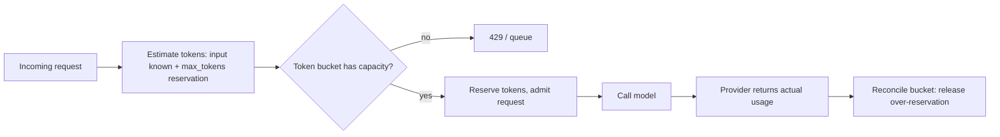

> **One-paragraph hook:** A classical API rate limiter counts requests per minute and treats every request as roughly the same size and duration. Neither holds for LLM traffic: a request's cost scales with tokens, not with request count, and a single generation can hold a connection open for seconds to minutes rather than milliseconds. Porting a REST-API rate limiter's assumptions onto an LLM endpoint undersizes or oversizes everything it touches — which is why rate limiting is one of the load-bearing layers of the operational stack described in [[Concept - LLMOps]], not an afterthought bolted onto a working system.

## The mechanism

LLM limits have to be token-based (TPM, tokens per minute) as much as request-based (RPM, requests per minute or raw concurrency), because compute cost and latency both scale with token count, not with request count alone. The input token count is known before the call; the output token count is not, so it has to be estimated as a `max_tokens` reservation at admission time and reconciled against the actual usage the provider returns once the call completes. This reserve-then-reconcile pattern is unavoidable — you must gate the request before you know how many tokens it will actually consume.

Concurrency limits usually matter more in practice than a raw RPM ceiling, and the reason is Little's Law applied to a workload with an unusually long and variable holding time: $L = \lambda W$, where $L$ is the number of requests in flight, $\lambda$ is the arrival rate, and $W$ is the average time a request holds a slot. A typical REST call has a $W$ of tens of milliseconds; an LLM generation has a $W$ of seconds to low minutes — one to three orders of magnitude larger and far more variable across requests. The same throughput therefore requires proportionally more concurrent-request headroom than a classical API budget would suggest, and a single long generation holding a slot for a full minute protects (or starves) the system more than any per-minute request count does.

Three enforcement algorithms cover most designs: the token bucket (a capacity that refills at a fixed rate and allows short bursts up to the bucket size), the sliding-window log or counter (tracking exact or approximate request/token counts over a rolling window), and GCRA (the generic cell rate algorithm, a bucket variant that computes the next allowed time directly rather than ticking a refill loop). None of these work correctly if each replica of a horizontally-scaled service enforces its own local counter — the limit becomes per-pod instead of global. Correct enforcement needs an atomic shared counter, typically a Redis `INCR`/`INCRBYFLOAT` wrapped in a Lua script or a `MULTI`/`EXEC` transaction so the check-and-increment is atomic across concurrent callers hitting different replicas at once.

## In practice

Outbound, toward the upstream provider, respecting the provider's own limits is not optional: a 429 response should be handled with its `Retry-After` header honored exactly, and `x-ratelimit-remaining-tokens` / `x-ratelimit-remaining-requests` response headers watched proactively so the client throttles itself before hitting the wall rather than after. Retries against a provider limit use exponential backoff with full jitter, not fixed intervals — synchronized fixed-interval retries across many clients recreate the exact burst that caused the original 429. This coordination between rate limiting and retry behavior is why the two live in the same layer as [[Pattern - Resilient LLM Request Handling]] and are frequently implemented inside the same [[Concept - LLM Gateways and Routing]] proxy.

Inbound, toward your own users, fairness requires more than one global limit: per-tenant quotas prevent one customer from consuming the whole budget, weighted fair queueing allocates capacity proportionally rather than first-come-first-served, priority lanes let interactive traffic preempt batch traffic, and admission control under saturation sheds the lowest-priority requests first rather than degrading everyone uniformly. Rate limiting is the demand-side half of a two-sided problem — [[Concept - Autoscaling LLM Inference]] is the supply-side half, adding replicas to meet load — and the two have to be tuned together, because a rate limit set to protect a fixed fleet will throttle traffic that a scaled-up fleet could have served, while a limit set too loose relies on autoscaling reacting faster than its cold-start time actually allows. The same token-budget enforcement that protects capacity is also the mechanism that protects unit economics — see [[Concept - Cost Engineering for LLM Applications]] for the cost side of the same reservation. At the serving layer underneath the gateway, admission decisions interact with [[Concept - Continuous Batching]]: a request admitted into the queue still competes for a batch slot, so rate limiting at the edge and batching at the engine are two layers of the same backpressure problem, not independent controls.

## Failure modes

These are common enough to be catalogued in [[Gotchas - LLM Production Operations]]. **Over-reservation throttling healthy traffic.** Reserving the full `max_tokens` value for every request when the actual p95 output length is a fraction of that ceiling makes the system look saturated at a fraction of its real capacity — the fix is reserving near the observed p95 output length and reconciling down after the fact, not reserving the worst case every time. **Thundering herd from synchronized retries.** A provider blip triggers a wave of clients retrying on the same fixed schedule, and the retry wave itself becomes larger than the original blip — full jitter on backoff is what breaks the synchronization. **Noisy-neighbor outages.** With no per-tenant cap, one customer's traffic spike (organic or abusive) consumes the shared token budget and degrades every other tenant, turning a single account's behavior into a platform-wide incident.

## The non-obvious

The instinct is to size rate limits from a provider's published RPM/TPM tier and stop there, but the tier number and the correct concurrency limit for your system are different questions answered by different math — the tier bounds what the provider will accept, Little's Law bounds what your own queueing and latency budget can absorb, and the binding constraint is whichever is smaller. A team that sizes purely to the provider's tier and never computes $L = \lambda W$ for its own workload routinely discovers its real bottleneck is self-inflicted: too few concurrent-request slots reserved for a workload whose holding time it never measured, not the provider's ceiling at all. A related trap is treating abuse and legitimate load as the same problem: a prompt-injection attack that manipulates an agent into an unbounded tool-calling loop looks, from the rate limiter's point of view, exactly like a legitimate burst of traffic — see [[Concept - Prompt Injection]] for the attack side — which is why per-request and per-tenant token caps have to be hard ceilings, not just smoothing mechanisms.

## Connections

- [[Pattern - Resilient LLM Request Handling]] — the client-side backoff and circuit-breaker behavior that must coordinate with rate-limit enforcement to avoid amplifying a provider blip.
- [[Concept - LLM Gateways and Routing]] — the layer where token-bucket and per-key limit enforcement is typically implemented centrally.
- [[Concept - Autoscaling LLM Inference]] — the supply-side lever that changes capacity; rate limiting is the demand-side lever that protects capacity already provisioned.
- [[Concept - Cost Engineering for LLM Applications]] — the economic twin of this note's token-budget enforcement: the same reservation that protects latency also protects the bill.
- [[Concept - Continuous Batching]] — the serving-engine mechanism that admission-controlled requests ultimately compete for once past the rate limiter.
- [[Gotchas - LLM Production Operations]] — documents the over-reservation and thundering-herd incident patterns this note's failure modes describe.
- [[Concept - Prompt Injection]] — the attack vector that makes per-tenant token caps a security control, not just a fairness mechanism.
- [[Concept - LLMOps]] — the operational stack this note's enforcement layer sits inside.

## Sources
- Little, J. D. C. (1961) — "A Proof for the Queuing Formula: L = λW" — the queueing-theory result underlying why LLM concurrency limits must be sized from holding time, not copied from a request-count budget designed for millisecond-scale APIs.
- ATM Forum Traffic Management Specification (1996) — the original definition of the Generic Cell Rate Algorithm (GCRA), the rate-limiting algorithm variant widely reused in modern token-bucket implementations.
