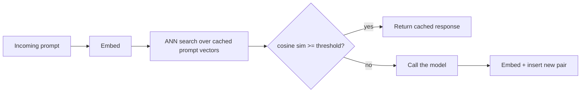

> **One-paragraph hook:** Most requests to a production LLM app aren't identical strings. They're near-duplicates: the same question in five phrasings. Exact-match caching misses all of them. Semantic caching embeds the incoming prompt, finds the nearest prior request in vector space and, if it's close enough, returns the cached completion without calling the model. A class of repeated traffic becomes a lookup instead of a generation.

## The mechanism

The loop is embed → search → threshold → serve-or-call. The incoming prompt is embedded with an [[Concept - Embedding Models|embedding model]]. The vector is searched against an approximate-nearest-neighbor index over prior `(prompt, response)` pairs, using the same [[Concept - HNSW]] structures as [[Concept - Semantic Search]]. The top match's cosine similarity is compared with a threshold $\tau$:

$$\cos(\theta) = \frac{u \cdot v}{\lVert u \rVert \, \lVert v \rVert} \geq \tau \implies \text{return cached response}$$

If it clears $\tau$, the cached completion goes back and the model is never called. If not, the model runs normally and the new `(prompt, response)` pair is inserted for future lookups.

Two other mechanisms get confused with this. Exact-match caching is a hash lookup on the literal request string and only catches byte-identical repeats. [[Concept - Prompt Caching]] and serving-layer prefix caching (the [[Concept - KV Cache]] reuse engines like [[Breakdown - vLLM]] implement) still call the model every time; they only cut the cost of re-processing a shared prefix during prefill. Semantic caching is the only one of the three that skips the model call, and that makes it the riskiest. A wrong hit serves a wrong answer with full confidence, and latency looks fine.

## In practice

Threshold tuning is the whole game. It's a precision/recall tradeoff with no universally correct setting. Set $\tau$ too low and queries that look alike but need different answers collide. "What's the capital of Austria" and "what's the capital of Australia" embed close together under most sentence encoders because they share almost every token and the syntax, yet the answers are entirely different. Set $\tau$ too high and the cache barely fires, because paraphrases a human would call "the same question" don't clear the bar. Teams in production typically start around 0.95-0.97 cosine similarity and then validate per domain against a labeled set of near-duplicate and near-miss pairs. No threshold transfers across embedding models or domains without re-validation.

The cache key needs more than the embedding. Include the model id, prompt template version, relevant decode parameters and the tenant, or the cache will confidently serve one customer's answer to another customer's similar question. For invalidation:

- TTLs for time-sensitive content.
- A version bump on any prompt or model change, so an entry keyed to a retired prompt version never matches a new request.
- Manual purge when source content changes. A cached RAG answer is only as fresh as the document behind it.

The economics only work when embedding cost plus the vector-store round trip is well below the cost and latency of the model call it replaces. For a frontier model at seconds of latency and cents per call, a single-digit-millisecond ANN lookup against a small embedding model is a clear win. For a cheap, fast small model the math can flip. It does best on high-repetition workloads: FAQ bots, classification-style queries, deduplicating near-identical support tickets. Anywhere the same intent recurs across many users, which is the traffic [[Concept - Cost Engineering for LLM Applications]] names as the best target for any caching lever. Real deployments include GPTCache (Zilliz), Redis/RedisVL's semantic cache module, and the cache layers in the gateway products covered in [[Concept - LLM Gateways and Routing]].

## Failure modes

**False hits with a confidently wrong answer.** By a wide margin the most painful failure, because a false hit looks to the user like a correct answer. Slow responses and errors at least look broken.

**Caching personalized or context-dependent responses.** If the key doesn't capture the conversation history or user context that shaped the original answer, a follow-up that looks similar but means something different gets the wrong cached reply.

**Cross-tenant leakage.** Leave tenant out of the key and one customer's data can show up in another's response. That caching bug is also a data-isolation incident.

**Cache poisoning.** Once a bad or manipulated response gets inserted (from a jailbroken session, a bug, or an adversarial input crafted to sit just under the threshold of a benign-looking cluster), it serves every future similar query until TTL expiry. One bad generation becomes a systematic failure, silently. [[Gotchas - LLM Production Operations]] has the incident pattern of a threshold-adjacent false hit reaching production.

## The non-obvious

Semantic caching turns per-call sampling variance into a permanent bias. One generation, sampled once from a distribution of possible answers, gets frozen and served to every future request inside its similarity radius. Whichever roll of the dice populated the cache first becomes *the* answer for that cluster of queries until the entry expires. That's worse than an isolated wrong answer: the cache can serve one bad sample to a whole population of near-duplicates, over and over, and nothing in the hit path signals anything unusual.

A second trap: a threshold calibrated on one embedding model doesn't survive an embedding upgrade, because the vector space's geometry changes. Move from `text-embedding-ada-002` to `text-embedding-3-large` after calibrating on the former and your effective hit rate and false-positive rate change without anyone touching the threshold.

## Connections

- [[Concept - Semantic Search]] — the underlying retrieval mechanism (embed, index, nearest-neighbor lookup) that semantic caching repurposes for cache lookups instead of document retrieval.
- [[Concept - Embedding Models]] — the component whose choice and version directly determines the cache's similarity geometry and false-hit rate.
- [[Concept - HNSW]] — the ANN index structure that makes sub-linear lookup over a growing cache of prior prompts practical at scale.
- [[Concept - KV Cache]] — the serving-layer cache semantic caching is often confused with; KV caching speeds up a model call, semantic caching skips it.
- [[Concept - Prompt Caching]] — the provider-level prefix-caching discount that still executes the model, unlike a semantic cache hit which doesn't.
- [[Concept - Cost Engineering for LLM Applications]] — the economic frame that determines when a semantic cache's embedding + lookup cost is actually worth paying.
- [[Concept - LLM Gateways and Routing]] — the layer where semantic caching is typically implemented as a pre-call hook in production stacks.
- [[Gotchas - LLM Production Operations]] — documents the false-hit-just-above-threshold incident pattern this note's failure modes describe.
- [[Breakdown - vLLM]] — the serving engine whose KV-cache prefix reuse is the mechanism semantic caching is most often confused with, despite skipping the model call entirely rather than speeding it up.

## Sources
- Bang, F. (2023) — "GPTCache: An Open-Source Semantic Cache for LLM Applications Enabling Faster Answers and Cost Savings" (NLP-OSS workshop, ACL 2023) — the embed-search-threshold architecture this note describes, as implemented in the widely-deployed open-source project of the same name.
