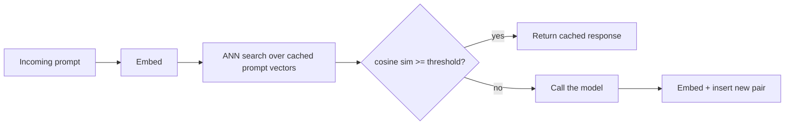

> **One-paragraph hook:** Most requests to a production LLM app are not identical strings but near-duplicates — the same question asked in five different phrasings. Exact-match caching misses all of them. Semantic caching embeds the incoming prompt, finds the nearest prior request in vector space, and if it's close enough, returns the cached completion without ever calling the model — turning a class of repeated traffic into a lookup instead of a generation.

## The mechanism

The core loop is embed → search → threshold → serve-or-call. An incoming prompt is embedded with an [[Concept - Embedding Models|embedding model]], the resulting vector is searched against an approximate-nearest-neighbor index (the same [[Concept - HNSW]] structures used in [[Concept - Semantic Search]]) built over a store of prior `(prompt, response)` pairs, and the top match's cosine similarity is compared against a threshold $\tau$:

$$\cos(\theta) = \frac{u \cdot v}{\lVert u \rVert \, \lVert v \rVert} \geq \tau \implies \text{return cached response}$$

If the similarity clears $\tau$, the cached completion is returned and the model is never called. If it doesn't, the model is called normally and the new `(prompt, response)` pair is inserted into the index for future lookups.

This is a fundamentally different mechanism from two things it's easily confused with. Exact-match caching is a hash lookup on the literal request string — it catches only byte-identical repeats. [[Concept - Prompt Caching]] and prefix caching at the serving layer (the [[Concept - KV Cache]] reuse that engines like [[Breakdown - vLLM]] implement) still call the model on every request; they only cut the cost of re-processing a shared prefix during prefill. Semantic caching is the only one of the three that skips the model call entirely, which is also what makes it the riskiest: a wrong hit doesn't degrade latency, it serves a wrong answer with full confidence.

## In practice

Threshold tuning is the whole game, and it is a precision/recall tradeoff, not a knob with a universally correct setting. Set $\tau$ too low and semantically-close-but-answer-different queries collide — "what's the capital of Austria" and "what's the capital of Australia" embed close together under most sentence encoders because they share almost every token and syntactic structure, yet the correct answers are entirely different. Set $\tau$ too high and the cache barely fires, because paraphrases that a human would call "the same question" don't clear the bar. Teams that ship this in production typically land around 0.95-0.97 cosine similarity as a starting point, and then validate it empirically per domain with a labeled set of near-duplicate and near-miss pairs — there is no threshold that transfers across embedding models or domains without re-validation.

The cache key has to be wider than the embedding alone: it must include the model id, the prompt template version, the relevant decode parameters, and the tenant, or the cache will confidently serve one customer's answer to another customer's semantically similar question. Invalidation is handled with TTLs for time-sensitive content, a version bump on any prompt or model change (an old cache entry keyed to a retired prompt version should never match a new request), and manual purge when the underlying source content changes — a cached RAG answer is only as fresh as the document it was generated from.

Economically, semantic caching only pays off when embedding cost plus vector-store round-trip latency is well below the cost and latency of the model call it replaces — for a frontier model at seconds of latency and cents per call, a single-digit-millisecond ANN lookup against a small embedding model is a clear win; for a cheap, fast small model, the math can flip. It performs best on high-repetition workloads: FAQ bots, classification-style queries, deduplication of near-identical support tickets — anywhere the same intent recurs across many users, which is exactly the traffic pattern [[Concept - Cost Engineering for LLM Applications]] identifies as the highest-leverage target for any caching lever. Real deployments of this pattern include GPTCache (Zilliz), Redis/RedisVL's semantic cache module, and the cache layers built into gateway products discussed in [[Concept - LLM Gateways and Routing]].

## Failure modes

**False hits that serve a confidently wrong answer.** This is the highest-pain failure mode by a wide margin, because unlike a slow response or an error, a false hit looks exactly like a correct answer to the end user. **Caching personalized or context-dependent responses.** If the cache key doesn't capture the conversation history or user-specific context that shaped the original answer, a semantically similar-looking but contextually different follow-up gets the wrong cached reply. **Cross-tenant leakage.** Omitting tenant from the key means one customer's data can surface in another customer's response — a caching bug that is also a data-isolation incident. **Cache poisoning.** If a bad or manipulated response ever gets inserted (from a jailbroken session, a bug, or an adversarial input crafted to sit just under the threshold of a benign-looking cluster), it now serves that answer to every future semantically-similar query until TTL expiry, silently amplifying a single bad generation into a systematic failure. See [[Gotchas - LLM Production Operations]] for the specific incident pattern of a threshold-adjacent false hit reaching production.

## The non-obvious

Semantic caching converts your model's per-call sampling variance into a permanent bias. A single generation, sampled once from a distribution of possible answers, gets frozen and served to every future request that lands in its similarity radius — so whichever roll of the dice happened to populate the cache first becomes *the* answer for that whole cluster of queries, invisibly, until the entry expires. This is different from the failure mode of a wrong answer in isolation: it means the cache doesn't just risk occasional errors, it risks systematically and repeatedly serving one bad sample to an entire population of near-duplicate queries, and nothing in the cache-hit path signals that anything unusual happened. A second trap: a threshold tuned and validated against one embedding model does not transfer when the embedding model is upgraded, because the geometry of the vector space itself changes — a `text-embedding-3-large` cutover after calibrating against `text-embedding-ada-002` silently changes your effective hit rate and false-positive rate without anyone touching the threshold value.

## Connections

- [[Concept - Semantic Search]] — the underlying retrieval mechanism (embed, index, nearest-neighbor lookup) that semantic caching repurposes for cache lookups instead of document retrieval.
- [[Concept - Embedding Models]] — the component whose choice and version directly determines the cache's similarity geometry and false-hit rate.
- [[Concept - HNSW]] — the ANN index structure that makes sub-linear lookup over a growing cache of prior prompts practical at scale.
- [[Concept - KV Cache]] — the serving-layer cache semantic caching is often confused with; KV caching speeds up a model call, semantic caching skips it.
- [[Concept - Prompt Caching]] — the provider-level prefix-caching discount that still executes the model, unlike a semantic cache hit which doesn't.
- [[Concept - Cost Engineering for LLM Applications]] — the economic frame that determines when a semantic cache's embedding + lookup cost is actually worth paying.
- [[Concept - LLM Gateways and Routing]] — the layer where semantic caching is typically implemented as a pre-call hook in production stacks.
- [[Gotchas - LLM Production Operations]] — documents the false-hit-just-above-threshold incident pattern this note's failure modes describe.
- [[Breakdown - vLLM]] — the serving engine whose KV-cache prefix reuse is the mechanism semantic caching is most often confused with, despite skipping the model call entirely rather than speeding it up.

## Sources
- Bang, F. (2023) — "GPTCache: An Open-Source Semantic Cache for LLM Applications Enabling Faster Answers and Cost Savings" (NLP-OSS workshop, ACL 2023) — the embed-search-threshold architecture this note describes, as implemented in the widely-deployed open-source project of the same name.
