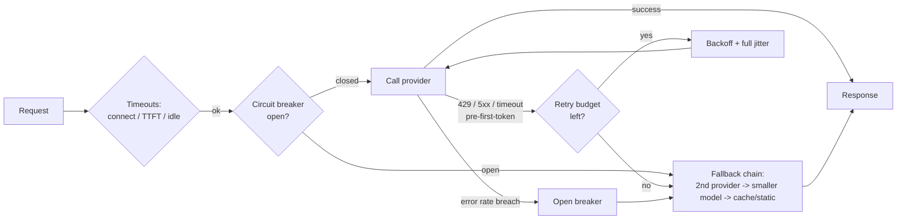

> **Problem:** Model provider APIs are flaky, slow-tailed, rate-limited, and non-idempotent once tokens start streaming — a naive client integration either hangs, retries into a self-inflicted outage, or silently duplicates output and cost. **Solution shape:** wrap every call in layered, provider-agnostic client resilience — timeouts, jittered retries, optional hedging, a circuit breaker, and a graceful fallback chain — so failures degrade instead of cascading.

## Context & forces

This applies to essentially every production caller of an LLM API, whether through a direct SDK or a [[Concept - LLM Gateways and Routing|gateway]]. The forces in tension: user-facing latency wants aggressive timeouts and hedged requests, but both cost extra money on every hedge or retry; retrying transient failures improves reliability, but retrying too eagerly — no jitter, no attempt cap — turns a small upstream blip into a self-inflicted traffic spike that looks identical to a DDoS from the provider's side; and streaming responses make retries fundamentally unsafe once the first token has reached the user, because there is no way to "un-send" partial output. This collides directly with [[Concept - Nondeterminism in Production LLM Serving]]: a retried call is not guaranteed to reproduce the completion the original call had already started streaming. [[Concept - Rate Limiting and Quota Design]] governs how much request volume this pattern is allowed to generate in the first place; this pattern governs what happens to an individual request once it has been admitted.

## The pattern

Four layers compose, each independently valuable:

1. **Timeout structure**, split into *connect*, *time-to-first-token (TTFT)*, and *overall/stream-idle* timeouts rather than one blanket deadline. A long generation legitimately needs minutes of overall budget, but a tight TTFT timeout and a stream-idle timeout catch a stalled connection instead of the client hanging for the full overall budget on a dead stream.
2. **Retries with backoff and full jitter**, restricted to transient, pre-first-token failures (429, 5xx, connect timeout) with a hard attempt cap — 2 to 4 is typical — and honoring the provider's `Retry-After` header when present. "Full jitter" (randomize the entire backoff window, not just add noise around a fixed exponential curve) is the specific mechanism that prevents synchronized retry storms: naive exponential-without-jitter causes retries across many clients to re-synchronize and re-hit the upstream in lockstep, amplifying rather than absorbing the original blip.
3. **Hedged requests** (optional): fire a second, identical request after the running request passes its own p95 latency mark, and take whichever returns first, canceling the loser. This trades money for tail latency — the hedged fraction (typically the slowest ~5% of requests) costs double, and hedging requires idempotency to be safe under side effects such as a tool call.
4. **Circuit breaker**: track a rolling error rate per provider/deployment; when it crosses a threshold, "open" the breaker so subsequent calls fail fast to the fallback chain instead of piling additional load and latency onto an upstream that is already struggling — then periodically "half-open" to probe for recovery before closing fully again.

The **fallback chain** is the pattern's last line of defense: primary model → secondary provider → smaller/cheaper model → cached or static response, degrading the user experience in controlled steps rather than surfacing a raw 500.

## Implementation notes

Never retry after the first streamed token without an idempotency key — a retried streaming call has no way to know the client already rendered partial output, so a blind retry either duplicates visible content or silently drops it depending on client-side handling. Reserve `max_tokens` conservatively for cost math, but keep retry and hedge budgets keyed off actual elapsed time and token counts, not the reservation. Tune circuit-breaker thresholds per provider/deployment, not globally — a shared multi-tenant proxy sees blended error rates that can mask one deployment's degradation while the aggregate still looks healthy. Wire all four layers into the same request-tracing spans described in [[Concept - LLM Observability and Tracing]] so a retry storm or an open breaker shows up in the trace, not only in an aggregate metric someone has to notice.

## Tradeoffs & when NOT to use

Every layer here trades money or complexity for reliability: hedging doubles cost on the hedged fraction; a breaker with too-aggressive a threshold flips to the fallback chain — often a weaker model — more than necessary, trading quality for availability; and a long fallback chain adds latency on exactly the failure path where the user is already waiting longest. Skip hedging for cost-sensitive, non-latency-critical batch workloads — the tail-latency benefit isn't worth doubling spend on background jobs. Skip a multi-provider fallback chain entirely when the application is hard-dependent on one model's specific behavior — a fine-tune or a model-tuned system prompt — where a fallback response would be actively wrong rather than merely degraded.

## Known uses

The **LiteLLM Router** (see [[Breakdown - LiteLLM]]) implements this pattern directly: per-deployment cooldowns after failures, configurable retry and backoff, and fallback chains that include a context-window-overflow fallback to a larger-context model. AWS Bedrock and Google Vertex AI client SDKs ship built-in exponential-backoff-with-jitter retry logic for exactly this reason. The general pattern predates LLMs entirely — Netflix's Hystrix and its successor resilience4j popularized the circuit-breaker-plus-fallback shape for microservice calls, and LLM gateways are a direct, largely unmodified adaptation of that same shape to a slower, more expensive kind of remote call.

## Connections

- [[Concept - LLM Gateways and Routing]] — gateways package this exact pattern as a managed product layer rather than in-app code.
- [[Concept - Rate Limiting and Quota Design]] — governs the admission side; this pattern governs per-request handling once a call is admitted.
- [[Breakdown - LiteLLM]] — a concrete, widely deployed implementation of the router, cooldown, and fallback mechanics described here.
- [[Playbook - Incident Response for LLM Systems]] — the incident runbook that triggers and relies on this pattern's fallback chain and breaker during a live outage.
- [[Concept - Nondeterminism in Production LLM Serving]] — the reason a naive retry isn't guaranteed to reproduce the original request's output, and why post-first-token retries are unsafe.
- [[Gotchas - LLM Production Operations]] — the retry-storm and streaming-double-charge failure signatures this pattern exists specifically to prevent.
- [[Concept - The Inference Request Lifecycle]] — the server-side request path this pattern wraps from the client; the TTFT timeout budget has to account for the prefill phase this note describes.
- [[Gotchas - Agents in Production]] — agent loops multiply every call in this pattern N times per task, so a retry-storm or hedging-cost bug compounds far faster in an agent than in a single-call app.

## Sources
- Brooker, M. (2015) — "Exponential Backoff and Jitter" (AWS Architecture Blog) — the thundering-herd rationale behind full jitter used in the retry layer above.
- Beyer, B. et al. (2016) — *Site Reliability Engineering* (Google), chapter on handling overload and cascading failures — the general theory behind circuit breakers and graceful degradation this pattern adapts.
- Netflix Technology Blog (Hystrix documentation, ~2012-2018) — the circuit-breaker-plus-fallback-chain design this note adapts to LLM calls.
- LiteLLM Router documentation (as of 2026) — the concrete cooldown/fallback implementation cited under Known uses.
