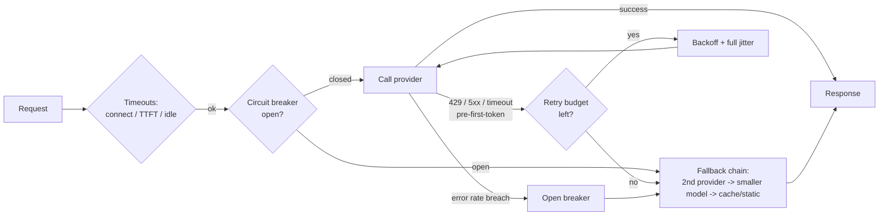

> **Problem:** Model provider APIs are flaky, slow-tailed, rate-limited, and non-idempotent once tokens start streaming. A naive client hangs, retries itself into an outage, or silently duplicates output and cost. **Solution shape:** wrap every call in layered, provider-agnostic client resilience (timeouts, jittered retries, optional hedging, a circuit breaker, a graceful fallback chain) so failures degrade instead of cascading.

## Context & forces

This applies to almost every production caller of an LLM API, through a direct SDK or a [[Concept - LLM Gateways and Routing|gateway]]. The forces pull against each other:

- User-facing latency wants aggressive timeouts and hedged requests, and every hedge or retry costs money.
- Retrying transient failures improves reliability. Retrying too eagerly (no jitter, no attempt cap) turns a small upstream blip into a self-inflicted traffic spike that looks like a DDoS from the provider's side.
- Streaming makes retries unsafe once the first token reaches the user, since you can't "un-send" partial output. It also runs into [[Concept - Nondeterminism in Production LLM Serving]]: a retried call won't necessarily reproduce the completion the original had already started streaming.

[[Concept - Rate Limiting and Quota Design]] decides how much request volume this pattern may generate in the first place. This pattern decides what happens to one request after admission.

## The pattern

Four layers, each useful on its own:

1. **Split timeouts**: *connect*, *time-to-first-token (TTFT)*, and *overall/stream-idle*, instead of one blanket deadline. A long generation can legitimately need minutes overall. A tight TTFT timeout plus a stream-idle timeout catch a stalled connection so the client doesn't hang for the full overall budget on a dead stream.
2. **Retries with backoff and full jitter**, only for transient, pre-first-token failures (429, 5xx, connect timeout), with a hard attempt cap (2 to 4 is typical) and the provider's `Retry-After` header honored when present. Full jitter randomizes the entire backoff window instead of adding noise around a fixed exponential curve. That's what prevents synchronized retry storms. Exponential backoff without jitter lets retries from many clients re-synchronize and hit the upstream in lockstep, which amplifies the original blip.
3. **Hedged requests** (optional): once a running request passes its own p95 latency mark, fire an identical second one, take whichever returns first and cancel the other. You're buying tail latency with money. The hedged fraction (typically the slowest ~5% of requests) costs double, and hedging needs idempotency to be safe when there are side effects like a tool call.
4. **Circuit breaker**: track a rolling error rate per provider/deployment. When it crosses a threshold, "open" the breaker so later calls fail fast to the fallback chain instead of piling load and latency onto an upstream that's already struggling. Periodically go "half-open" to probe for recovery before closing again.

The **fallback chain** is the last line of defense: primary model → secondary provider → smaller/cheaper model → cached or static response. The user experience degrades in controlled steps, and nobody sees a raw 500.

## Implementation notes

Never retry after the first streamed token without an idempotency key. A retried streaming call can't know the client already rendered partial output, so a blind retry either duplicates visible content or silently drops it, depending on client-side handling.

Reserve `max_tokens` conservatively for cost math, but key retry and hedge budgets off actual elapsed time and token counts, not the reservation.

Tune breaker thresholds per provider/deployment, not globally. A shared multi-tenant proxy sees blended error rates that can hide one deployment's degradation while the aggregate looks healthy.

Wire all four layers into the request-tracing spans from [[Concept - LLM Observability and Tracing]], so a retry storm or an open breaker shows up in the trace and not only in an aggregate metric someone has to notice.

## Tradeoffs & when NOT to use

Every layer trades money or complexity for reliability. Hedging doubles cost on the hedged fraction. A breaker with too aggressive a threshold falls back (often to a weaker model) more than it needs to, giving up quality for availability. A long fallback chain adds latency on the failure path, where the user is already waiting longest.

Skip hedging for cost-sensitive batch workloads where latency doesn't matter; the tail-latency gain isn't worth doubling spend on background jobs. Skip a multi-provider fallback chain when the app depends hard on one model's specific behavior, such as a fine-tune or a model-tuned system prompt. There a fallback response would be wrong, not merely degraded.

## Known uses

The **LiteLLM Router** ([[Breakdown - LiteLLM]]) implements this pattern directly: per-deployment cooldowns after failures, configurable retry and backoff, and fallback chains including a context-window-overflow fallback to a larger-context model. The AWS Bedrock and Google Vertex AI client SDKs ship exponential-backoff-with-jitter retries built in for the same reason. The pattern predates LLMs. Netflix's Hystrix and its successor resilience4j popularized the circuit-breaker-plus-fallback shape for microservice calls, and LLM gateways adapt that shape, largely unmodified, to a slower and more expensive kind of remote call.

## Connections

- [[Concept - LLM Gateways and Routing]] — gateways package this exact pattern as a managed product layer rather than in-app code.
- [[Concept - Rate Limiting and Quota Design]] — governs the admission side; this pattern governs per-request handling once a call is admitted.
- [[Breakdown - LiteLLM]] — a concrete, widely deployed implementation of the router, cooldown, and fallback mechanics described here.
- [[Playbook - Incident Response for LLM Systems]] — the incident runbook that triggers and relies on this pattern's fallback chain and breaker during a live outage.
- [[Concept - Nondeterminism in Production LLM Serving]] — the reason a naive retry isn't guaranteed to reproduce the original request's output, and why post-first-token retries are unsafe.
- [[Gotchas - LLM Production Operations]] — the retry-storm and streaming-double-charge failure signatures this pattern exists specifically to prevent.
- [[Concept - The Inference Request Lifecycle]] — the server-side request path this pattern wraps from the client; the TTFT timeout budget has to account for the prefill phase this note describes.
- [[Gotchas - Agents in Production]] — agent loops multiply every call in this pattern N times per task, so a retry-storm or hedging-cost bug compounds far faster in an agent than in a single-call app.

## Sources
- Brooker, M. (2015) — "Exponential Backoff and Jitter" (AWS Architecture Blog) — the thundering-herd rationale behind full jitter used in the retry layer above.
- Beyer, B. et al. (2016) — *Site Reliability Engineering* (Google), chapter on handling overload and cascading failures — the general theory behind circuit breakers and graceful degradation this pattern adapts.
- Netflix Technology Blog (Hystrix documentation, ~2012-2018) — the circuit-breaker-plus-fallback-chain design this note adapts to LLM calls.
- LiteLLM Router documentation (as of 2026) — the concrete cooldown/fallback implementation cited under Known uses.
