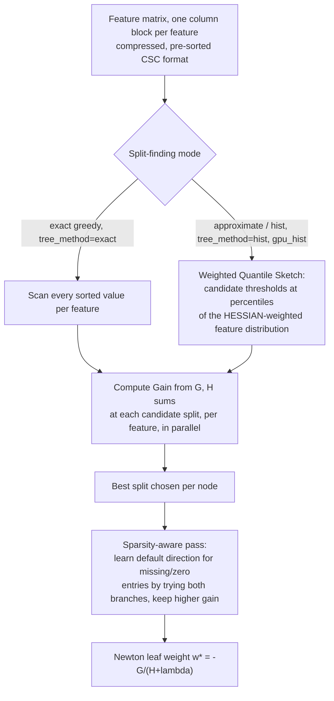

# Breakdown - XGBoost

> XGBoost ("eXtreme Gradient Boosting") is Tianqi Chen's open-source implementation of [[Concept - Gradient Boosting]], formalized with Carlos Guestrin in "XGBoost: A Scalable Tree Boosting System" (KDD 2016). There's no new statistical idea in it; Friedman's gradient boosting machine was already over a decade old. What it did was systems work. It turned GBM from a slow research method into infrastructure: a regularized, second-order, distributed, out-of-core tree-boosting library fast and robust enough to be a default. It appeared in most Kaggle-winning solutions from roughly 2015 through 2020 ([[Lore - Kaggle and the Reign of Gradient Boosting]]), and with [[Breakdown - LightGBM]] and CatBoost it's still a standard production default for tabular problems as of 2026 ([[Decision - Deep Learning vs Gradient Boosting for Tabular Data]]).

## The headline numbers
- Chen & Guestrin, KDD 2016. The paper reports XGBoost was used in 17 of the 29 winning solutions published on the Kaggle blog in 2015, an unusually direct empirical flex for a systems paper.
- The regularized objective adds $\Omega(f) = \gamma T + \tfrac{1}{2}\lambda\|w\|^2$ to the training loss every round: $T$ is the leaf count, $w$ the vector of leaf weights, and $\gamma$ and $\lambda$ are explicit complexity penalties that most earlier GBM implementations left implicit or didn't have.
- Optimal leaf weight under a second-order Taylor expansion of the loss: $w^* = -\dfrac{G}{H+\lambda}$, where $G=\sum_i g_i$ and $H=\sum_i h_i$ are the summed first- and second-order gradients ($g_i = \partial \text{loss}/\partial \hat{y}_i$, $h_i = \partial^2\text{loss}/\partial \hat{y}_i^2$) of the rows routed to that leaf. That's a closed-form Newton step, not a residual mean.
- Split gain: $\text{Gain} = \tfrac{1}{2}\left[\dfrac{G_L^2}{H_L+\lambda} + \dfrac{G_R^2}{H_R+\lambda} - \dfrac{(G_L+G_R)^2}{H_L+H_R+\lambda}\right] - \gamma$. A split is taken only if Gain > 0, so $\gamma$ acts as a per-split minimum-improvement threshold instead of a post-hoc cost-complexity pruning pass.

## How it actually works
Each boosting round, XGBoost computes $g_i$ and $h_i$ for every row under the current ensemble's predictions, then grows one tree that greedily maximizes the split-gain formula at every node. That's how it generalizes [[Concept - Gradient Boosting]] to *any* twice-differentiable loss: plug in a new loss, get new $g_i, h_i$ formulas, and the tree-growing machinery stays the same.

Two design choices carry the system.

**Exact vs. approximate split finding.** On data that fits comfortably in memory, XGBoost can scan every sorted value of every feature per node (exact greedy): expensive but optimal. At scale it switches to the **weighted quantile sketch**, which proposes candidate thresholds at percentiles of the feature values *weighted by each row's Hessian* $h_i$, not of the raw values. This is the non-obvious detail in the paper. With squared-error loss $h_i$ is a constant 1 and the sketch reduces to ordinary quantiles. Under logistic loss $h_i = p_i(1-p_i)$, so rows the model already classifies confidently (near $p{=}0$ or $p{=}1$) have Hessian near zero and barely affect where candidates land, while rows near the decision boundary ($p{\approx}0.5$, $h_i{\approx}0.25$) dominate. The search concentrates where the current model is most uncertain.

**Sparsity-aware split finding.** Real tabular data is full of missing values and one-hot sparsity. XGBoost doesn't impute. It visits only a feature's non-missing entries in one pass and, for each candidate split, tries sending all missing/zero rows left and then right, keeping whichever gives higher gain. The tree *learns* a default direction per node with no separate imputation step, and because it's one pass it costs no more than the dense case.

Systems engineering does the rest:

- The **column block** stores each feature pre-sorted once in compressed sparse column format and reuses it across every round and every tree, turning an $O(n\log n)$ re-sort per split into an amortized $O(n)$ scan.
- **Cache-aware prefetching** buffers gradient/Hessian statistics into cache-sized chunks, because naive index-gather from sorted feature order thrashes CPU cache. Split finding here is memory-bandwidth-bound, not compute-bound, which is the roofline regime where these tricks pay off ([[Concept - GPU Memory Hierarchy]], [[Concept - The Roofline Model]]).
- **Out-of-core computation** compresses and shards blocks to disk, with a dedicated I/O thread overlapping computation, so you can train on data larger than RAM without OOM.

## The clever parts
1. **Second-order (Newton) boosting.** Using $g_i$ and $h_i$ together means any twice-differentiable custom objective (quantile-adjacent losses, ranking losses, count losses) gets a correct leaf weight and split criterion for free. First-order GBM implementations of the era needed loss-specific derivations.
2. **The Hessian-weighted quantile sketch.** Putting candidate thresholds where the model is least certain is adaptive computation built into split finding itself.
3. **Learned default directions for sparsity.** "How do I handle missing data" becomes a parameter the tree learns in the same pass that finds the split. It stops being a preprocessing decision made once and frozen.
4. **Column block plus cache-aware access.** It treats split finding as a memory-system problem as much as an algorithms problem. That was the biggest reason XGBoost ran dramatically faster than contemporaneous GBM implementations at the same accuracy in 2016: for a workload this irregular, [[Concept - Floating Point for Deep Learning|numerical throughput]] on commodity hardware is almost always bandwidth-limited before it's compute-limited.
5. **Out-of-core block compression and sharding.** Gradient boosting on data bigger than RAM became a solved problem, no longer a reason to subsample or move to a distributed framework.

## What it got wrong / what's dated
XGBoost's original and still-default growth is **level-wise**: breadth-first, every leaf at a given depth considered for splitting before going deeper, bounded by `max_depth`. That wastes split budget on low-potential leaves just because they sit at a shallow depth. [[Breakdown - LightGBM|LightGBM]] built its whole design around the contrast. Leaf-wise (best-first) growth reaches lower loss for the same leaf budget, with large-data speed and memory that level-wise, exact-greedy XGBoost couldn't match on release.

XGBoost answered by converging. It added its own `hist` method, `gpu_hist`, a `grow_policy=lossguide` best-first option, native categorical support (`enable_categorical`, 2.x) and GPU acceleration, absorbing LightGBM's and CatBoost's ideas over several major versions. By 2026 (`XGBoost 2.x`, per [[Reference - Gradient Boosting Hyperparameters]]) the practical gap between the libraries on large data is small. The choice often comes down to ecosystem, categorical-handling defaults and team familiarity, with no clear performance winner.

## What to steal
The Newton-step leaf weight and the explicit $\gamma T + \tfrac{1}{2}\lambda\|w\|^2$ regularization generalize past trees: any additive-model or greedy stagewise fitting procedure benefits from an explicit, tunable complexity penalty on top of early stopping. The learned default direction for missing data (let the model pick which branch absent information takes, judged by the same gain criterion as every other decision) is reusable anywhere structurally missing features would otherwise force an arbitrary imputation step. And the Hessian-weighted sketch is a worked example of a general principle: when you have to subsample or bucket candidate decision points under a budget, weight the budget by where the current model is least certain, not uniformly by raw value or row count.

## Connections
- [[Concept - Gradient Boosting]] — the functional-gradient-descent mechanism XGBoost implements; this note is the "how one system engineered it" complement to that concept.
- [[Breakdown - LightGBM]] — the direct architectural counterpoint: leaf-wise growth and histogram binning versus XGBoost's level-wise-by-default, exact/sketch split finding.
- [[Concept - Decision Trees]] — the single-tree mechanics (axis-aligned greedy splitting) that both the exact-greedy and sketch-based split search are built on top of.
- [[Reference - Gradient Boosting Hyperparameters]] — the concrete knob names (`eta`, `max_depth`, `reg_lambda`, `tree_method`) that expose the mechanisms described here.
- [[Gotchas - Gradient Boosting in Practice]] — the failure modes (leakage, non-reproducible histograms, missed-value handling surprises) that this system's own cleverness can hide until production.
- [[Playbook - Tuning Gradient Boosted Trees]] — the ordered procedure for actually setting `eta`, `max_depth`, `lambda`, and the rest on a real dataset.
- [[Concept - GPU Memory Hierarchy]] — the memory-bandwidth constraints that motivate the column block and cache-aware prefetching design.
- [[Concept - The Roofline Model]] — the framework for understanding why split-finding is a bandwidth-bound, not compute-bound, workload on this kind of irregular, gather-heavy access pattern.
- [[Concept - Floating Point for Deep Learning]] — the numerical-throughput backdrop against which XGBoost's systems tricks (compression, cache-aware prefetch) were designed to win.
- [[Lore - Kaggle and the Reign of Gradient Boosting]] — the competitive-ML history in which XGBoost's 2015-2016 breakout made "just XGBoost it" a meme and set the tabular-ML default that persisted for a decade.
- [[Decision - Deep Learning vs Gradient Boosting for Tabular Data]] — the build decision this system is usually the concrete answer to on tabular problems today.

## Sources
- Chen, T. & Guestrin, C. (2016) — "XGBoost: A Scalable Tree Boosting System," KDD 2016. The primary source for the regularized objective, weighted quantile sketch, sparsity-aware splitting, and systems design.
- Friedman, J. (2001) — "Greedy Function Approximation: A Gradient Boosting Machine." The underlying boosting formulation XGBoost extends with second-order statistics and explicit regularization.
- Grinsztajn, L. et al. (2022) — "Why do tree-based models still outperform deep learning on tabular data?" The benchmark validating XGBoost-class GBDTs' continued edge on tabular problems.
