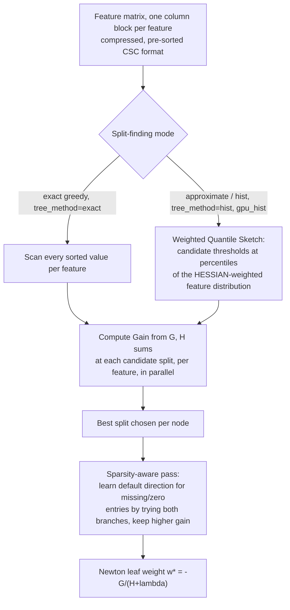

# Breakdown - XGBoost

> XGBoost ("eXtreme Gradient Boosting") is Tianqi Chen's open-source implementation of [[Concept - Gradient Boosting]], formalized with Carlos Guestrin in "XGBoost: A Scalable Tree Boosting System" (KDD 2016). It contains no new statistical idea — Friedman's gradient boosting machine was already over a decade old — but it is the systems paper that turned GBM from a slow research method into infrastructure: a regularized, second-order, distributed, out-of-core tree-boosting library fast and robust enough to become a default rather than a research toy. It appeared in the majority of Kaggle-winning solutions from roughly 2015 through 2020 ([[Lore - Kaggle and the Reign of Gradient Boosting]]), and alongside [[Breakdown - LightGBM]] and CatBoost it remains a standard production default for tabular problems as of 2026 ([[Decision - Deep Learning vs Gradient Boosting for Tabular Data]]).

## The headline numbers
- Chen & Guestrin, KDD 2016. The paper reports XGBoost was used in 17 of the 29 winning solutions published on the Kaggle blog in 2015 — an unusually direct empirical flex for a systems paper.
- The regularized objective adds $\Omega(f) = \gamma T + \tfrac{1}{2}\lambda\|w\|^2$ to the training loss at every round: $T$ is the leaf count, $w$ the vector of leaf weights, $\gamma$ and $\lambda$ explicit complexity penalties most earlier GBM implementations left implicit or absent entirely.
- Optimal leaf weight under a second-order Taylor expansion of the loss: $w^* = -\dfrac{G}{H+\lambda}$, where $G=\sum_i g_i$ and $H=\sum_i h_i$ are the summed first- and second-order gradients ($g_i = \partial \text{loss}/\partial \hat{y}_i$, $h_i = \partial^2\text{loss}/\partial \hat{y}_i^2$) of the rows routed to that leaf — a closed-form Newton step, not a residual mean.
- Split gain: $\text{Gain} = \tfrac{1}{2}\left[\dfrac{G_L^2}{H_L+\lambda} + \dfrac{G_R^2}{H_R+\lambda} - \dfrac{(G_L+G_R)^2}{H_L+H_R+\lambda}\right] - \gamma$. A split is only taken if Gain > 0, which makes $\gamma$ a direct, per-split minimum-improvement threshold rather than a post-hoc cost-complexity pruning pass.

## How it actually works
Every boosting round, XGBoost first computes $g_i$ and $h_i$ for every row under the current ensemble's predictions, then grows one tree to greedily maximize the split-gain formula above at every node — this is the mechanism that generalizes [[Concept - Gradient Boosting]] to *any* twice-differentiable loss: plug in a new loss, get new $g_i, h_i$ formulas, and the rest of the tree-growing machinery is unchanged.

Two design choices carry the whole system. First, **exact vs. approximate split finding**: on data that fits comfortably in memory, XGBoost can scan every sorted value of every feature per node (exact greedy) — expensive but optimal. At scale it switches to the **weighted quantile sketch**: candidate split thresholds are proposed at percentiles not of the raw feature values, but of the feature values *weighted by each row's Hessian* $h_i$. This is the genuinely non-obvious detail in the paper — with squared-error loss $h_i$ is a constant 1 and the sketch degenerates to ordinary quantiles, but under logistic loss $h_i = p_i(1-p_i)$, so rows the model already classifies confidently (near $p{=}0$ or $p{=}1$) have Hessian near zero and barely influence where split candidates get proposed, while rows still near the decision boundary ($p{\approx}0.5$, $h_i{\approx}0.25$) dominate the sketch — the algorithm concentrates its search exactly where the current model is most uncertain.

Second, **sparsity-aware split finding**. Real tabular data is full of missing values and one-hot sparsity. Rather than impute, XGBoost visits only the non-missing entries for a feature in one pass and, for each candidate split, tries sending all missing/zero rows down the left branch and then the right branch, keeping whichever gives higher gain — the tree *learns* a default direction per node instead of requiring a separate imputation step, and the single-pass structure means this costs no more than the non-sparse case.

Systems engineering does the rest: the **column block** stores each feature pre-sorted once in compressed sparse column format, reused across every boosting round and every tree, turning what would be an $O(n\log n)$ re-sort per split into an amortized $O(n)$ scan; **cache-aware prefetching** buffers the gradient/Hessian statistics into cache-sized chunks because naive index-gather patterns from sorted feature order thrash CPU cache ([[Concept - GPU Memory Hierarchy]], [[Concept - The Roofline Model]] — split finding here is memory-bandwidth-bound, not compute-bound, exactly the roofline regime where these tricks matter); and **out-of-core computation** compresses and shards blocks to disk with a dedicated I/O thread overlapping computation, so training data larger than RAM is possible without OOM.

## The clever parts
1. **Second-order (Newton) boosting.** Using both $g_i$ and $h_i$ rather than gradients alone means any twice-differentiable custom objective — quantile-adjacent losses, ranking losses, count losses — gets a correct leaf weight and split criterion for free; plain first-order GBM implementations of the era needed loss-specific derivations.
2. **The Hessian-weighted quantile sketch.** Concentrating candidate split thresholds where the model is least certain is a form of adaptive computation baked into the split-finding step itself, not bolted on afterward.
3. **Sparsity-aware learned default directions.** Turning "how do I handle missing data" into a parameter the tree learns, in the same single pass that finds the split, rather than a preprocessing decision made once and frozen.
4. **The column block plus cache-aware access pattern.** Treats split-finding as a memory-system problem, not just an algorithms problem — the single biggest reason XGBoost was dramatically faster than contemporaneous GBM implementations at the same accuracy in 2016, since [[Concept - Floating Point for Deep Learning|numerical throughput]] on commodity hardware is almost always bandwidth-limited before it's compute-limited for a workload this irregular.
5. **Out-of-core block compression and sharding.** Made "gradient boosting on data bigger than RAM" a solved problem rather than a reason to subsample or switch to a distributed framework.

## What it got wrong / what's dated
XGBoost's original and still-default tree growth is **level-wise** (breadth-first: every leaf at a given depth is considered for splitting before descending further), bounded by `max_depth`. This wastes split budget on leaves whose loss reduction potential is low just because they happen to be at a shallow depth, and it is the direct contrast [[Breakdown - LightGBM|LightGBM]] built its whole design around: leaf-wise (best-first) growth reaches lower loss for the same leaf budget, at real large-data speed and memory cost that level-wise, exact-greedy XGBoost could not match on release. XGBoost's response was convergent evolution rather than a rebuttal — it added its own `hist` method, `gpu_hist`, and a `grow_policy=lossguide` best-first option, native categorical support (`enable_categorical`, 2.x), and GPU acceleration, largely absorbing LightGBM's and CatBoost's innovations over several major versions rather than the reverse. By 2026 (`XGBoost 2.x`, per [[Reference - Gradient Boosting Hyperparameters]]) the practical gap between the libraries on large data is small and the choice is often about ecosystem, categorical-handling defaults, and team familiarity rather than a clear performance winner.

## What to steal
The Newton-step leaf weight formula and the explicit $\gamma T + \tfrac{1}{2}\lambda\|w\|^2$ regularization generalize past trees: any additive-model or greedy-stagewise fitting procedure benefits from an explicit, tunable complexity penalty rather than relying on early stopping alone. The learned-default-direction trick for missing data — let the model choose which branch absent information should take, evaluated with the same gain criterion as every other decision — is a broadly reusable pattern anywhere structurally missing features would otherwise force a separate, arbitrary imputation step. And the Hessian-weighted quantile sketch is a specific, worked example of a more general principle worth carrying into other systems: when you must subsample or bucket candidate decision points under a budget, weight that budget by where the current model is least certain, not uniformly by raw value or row count.

## Connections
- [[Concept - Gradient Boosting]] — the functional-gradient-descent mechanism XGBoost implements; this note is the "how one system engineered it" complement to that concept.
- [[Breakdown - LightGBM]] — the direct architectural counterpoint: leaf-wise growth and histogram binning versus XGBoost's level-wise-by-default, exact/sketch split finding.
- [[Concept - Decision Trees]] — the single-tree mechanics (axis-aligned greedy splitting) that both the exact-greedy and sketch-based split search are built on top of.
- [[Reference - Gradient Boosting Hyperparameters]] — the concrete knob names (`eta`, `max_depth`, `reg_lambda`, `tree_method`) that expose the mechanisms described here.
- [[Gotchas - Gradient Boosting in Practice]] — the failure modes (leakage, non-reproducible histograms, missed-value handling surprises) that this system's own cleverness can hide until production.
- [[Playbook - Tuning Gradient Boosted Trees]] — the ordered procedure for actually setting `eta`, `max_depth`, `lambda`, and the rest on a real dataset.
- [[Concept - GPU Memory Hierarchy]] — the memory-bandwidth constraints that motivate the column block and cache-aware prefetching design.
- [[Concept - The Roofline Model]] — the framework for understanding why split-finding is a bandwidth-bound, not compute-bound, workload on this kind of irregular, gather-heavy access pattern.
- [[Concept - Floating Point for Deep Learning]] — the numerical-throughput backdrop against which XGBoost's systems tricks (compression, cache-aware prefetch) were designed to win.
- [[Lore - Kaggle and the Reign of Gradient Boosting]] — the competitive-ML history in which XGBoost's 2015-2016 breakout made "just XGBoost it" a meme and set the tabular-ML default that persisted for a decade.
- [[Decision - Deep Learning vs Gradient Boosting for Tabular Data]] — the build decision this system is usually the concrete answer to on tabular problems today.

## Sources
- Chen, T. & Guestrin, C. (2016) — "XGBoost: A Scalable Tree Boosting System," KDD 2016. The primary source for the regularized objective, weighted quantile sketch, sparsity-aware splitting, and systems design.
- Friedman, J. (2001) — "Greedy Function Approximation: A Gradient Boosting Machine." The underlying boosting formulation XGBoost extends with second-order statistics and explicit regularization.
- Grinsztajn, L. et al. (2022) — "Why do tree-based models still outperform deep learning on tabular data?" The benchmark validating XGBoost-class GBDTs' continued edge on tabular problems.
