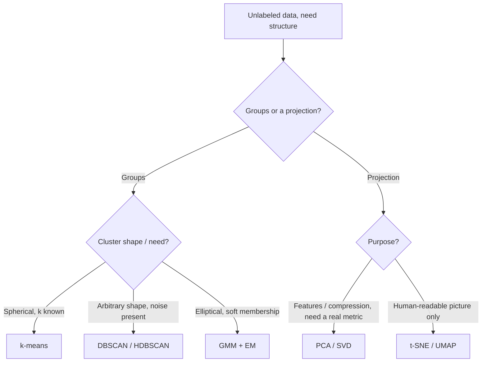

> Clustering (k-means, DBSCAN/HDBSCAN, Gaussian mixtures) finds groups without labels; dimensionality reduction (PCA, t-SNE, UMAP) finds low-dimensional structure in high-dimensional data. Both run in seconds on data you don't understand yet, which is exactly the danger: every method here quietly violates an assumption the moment you stop checking it, and the failure mode is a confident, good-looking plot that means less than you think.

## The mechanism

**k-means** is Lloyd's algorithm doing coordinate descent on within-cluster sum of squared error:

$$\arg\min_{S} \sum_{i=1}^{k} \sum_{x \in S_i} \lVert x - \mu_i \rVert^2$$

Alternate between assigning each point to its nearest centroid and recomputing centroids as cluster means, until assignments stop changing. This converges to a local optimum only, and the starting centroids matter a lot — k-means++ seeding (Arthur & Vassilvitskii, 2007) picks initial centroids probabilistically proportional to squared distance from already-chosen centroids, giving an $O(\log k)$ approximation guarantee instead of arbitrarily bad luck. k-means assumes clusters are spherical and roughly equal-variance (it's implicitly doing Euclidean-distance Voronoi partitioning), is sensitive to feature scale and outliers, and needs $k$ fixed in advance. Choosing $k$ is itself unsolved in general: the elbow method on SSE, the silhouette score, and the gap statistic are all heuristic and frequently ambiguous on real data; only the probabilistic GMM case admits a principled answer via BIC.

**DBSCAN** (Ester et al., 1996) is density-based instead of centroid-based: a point is a core point if at least `minPts` neighbors fall within radius `eps`, clusters are formed by chaining core points together, and anything not reachable gets a noise label — for free, unlike k-means, which forces every point into some cluster. DBSCAN finds arbitrary-shaped clusters but struggles when clusters have genuinely different densities, because one global `eps` can't be right everywhere at once. HDBSCAN (Campello et al.) fixes this by building a hierarchy of density levels and extracting the most stable clusters across it, at the cost of a subtler cost function to reason about.

**Gaussian Mixture Models** via Expectation-Maximization give *soft* assignments instead of hard ones. The E-step computes each point's responsibility for each component,

$$\gamma_{ik} = \frac{\pi_k \, \mathcal{N}(x_i \mid \mu_k, \Sigma_k)}{\sum_j \pi_j \, \mathcal{N}(x_i \mid \mu_j, \Sigma_j)}$$

and the M-step updates each component's mean, covariance, and mixing weight using those responsibilities as soft weights. GMMs model elliptical (not just spherical) clusters because each component has its own covariance, but EM converges to local optima like k-means, and a component can collapse onto a single point with near-zero covariance — a degenerate solution that needs regularization to avoid.

**PCA** is the eigendecomposition of the (centered, usually standardized) covariance matrix — equivalently the SVD of the centered data matrix, see [[Concept - Matrix Multiplication as the Atom of Deep Learning]] and the linear-algebra machinery underneath it. Principal components are the orthogonal directions of maximum variance, ranked by eigenvalue. PCA is linear, requires feature scaling to be meaningful, and is fully interpretable in the sense that you can inspect exactly which original features load onto each component — the right tool for denoising, compression, and any downstream step that needs an actual distance metric.

**t-SNE** (van der Maaten & Hinton, 2008) is not a metric-preserving projection at all — it minimizes the [[Concept - KL Divergence]] between a Gaussian similarity distribution over neighbors in the original high-dimensional space and a heavier-tailed Student-t similarity distribution in the 2D/3D embedding, with a `perplexity` parameter (typically 5–50) that sets the effective neighborhood size. Because the objective only cares about preserving *local* neighbor rankings, not global geometry, t-SNE **fails as a distance metric**: cluster sizes and inter-cluster distances in the resulting plot are close to meaningless, and the layout is stochastic — a different random seed gives a visually different (though often qualitatively similar) picture (Wattenberg et al., "How to Use t-SNE Effectively"). **UMAP** (McInnes et al., 2018) instead builds a fuzzy topological graph over nearest neighbors and optimizes a low-dimensional layout to match it via a cross-entropy-style loss; it runs faster than t-SNE, tends to preserve more global structure, but is still fundamentally a visualization tool, not a faithful metric or a general-purpose feature extractor.

## In practice

PCA is the workhorse before anything else: standardize features, keep components covering ~90–95% cumulative explained variance, and use the result either as compressed input to a downstream model or as a denoising step before clustering (clustering directly on hundreds of noisy raw dimensions is usually worse than clustering on the top 20–50 principal components). UMAP has largely displaced t-SNE as the default visualization for large embedding sets (millions of points from an [[Concept - Embedding Models]] output, or activation vectors from a [[Concept - Vision Transformers]] model) because it scales sub-quadratically and its `n_neighbors`/`min_dist` parameters are more predictable to tune than t-SNE's perplexity. k-means remains the default first clustering pass on tabular features precisely because it's fast and well-understood — reach for DBSCAN/HDBSCAN specifically when you expect noise points or clusters of visibly different density (fraud detection, geospatial clustering), and GMM when you need soft cluster membership probabilities rather than hard labels.

## Failure modes

- **k-means on non-spherical or unscaled data.** A cluster shaped like an elongated ellipse gets sliced by k-means into several spurious spherical pieces; an unscaled feature in the thousands (income) drowns out one in single digits (years of tenure). Detect by checking per-feature scale before fitting and inspecting per-cluster silhouette, not just the aggregate score.
- **Reading distance or size off a t-SNE/UMAP plot.** Two visually distant clusters are not necessarily more different than two nearby ones — inter-cluster distance is not preserved. Teams have built product segmentation decisions directly off a t-SNE plot's apparent cluster count and spacing, which is building on noise. Detect by re-running with different seeds and perplexities and checking whether the *qualitative* grouping is stable; never treat plot coordinates as features.
- **GMM covariance collapse.** A component that captures very few points can shrink its covariance toward singular, giving that component an unbounded likelihood contribution and destabilizing the fit. Detect via a covariance-regularization term or a minimum-component-size floor; symptom is EM log-likelihood spiking or NaN-ing mid-fit.
- **DBSCAN under variable density.** A single `eps` tuned for the dense region either merges the sparse region into noise or fragments the dense region into many tiny clusters. Detect by checking the k-distance plot (used to pick `eps`) for multiple distinct "knees" — a sign density genuinely varies and HDBSCAN is the better tool.

## The non-obvious

folklore, weakly sourced: t-SNE and UMAP will both happily produce visually convincing, well-separated "clusters" when run on pure noise or near-uniform random data — the optimization process itself tends to push points into blobs because that's what lowers the local-neighbor-preservation loss, independent of whether real cluster structure exists. Practitioners who've been burned by this treat any t-SNE/UMAP plot as a hypothesis generator, never as evidence, and always follow up with an actual clustering algorithm run on the original (or PCA-reduced) space before making a claim about how many real groups exist. The deeper version of this lesson, stated by Wattenberg et al.: cluster *count* and *size* in these plots are themselves artifacts of the perplexity/`n_neighbors` parameter, not discoveries about the data — change the parameter and the apparent number of clusters can change too, which is the opposite of what a trustworthy structure-finding tool should do.

## Connections
- [[Concept - Matrix Multiplication as the Atom of Deep Learning]] — PCA's eigendecomposition and the equivalent SVD are direct applications of the same linear algebra.
- [[Concept - KL Divergence]] — t-SNE's objective literally minimizes a KL divergence between high- and low-dimensional neighbor-affinity distributions.
- [[Concept - Embedding Models]] — the vectors most practitioners cluster or project with these tools are the output of an embedding model.
- [[Concept - Sparse Autoencoders]] — a learned, non-geometric alternative for finding structure in high-dimensional activations, worth contrasting with PCA's purely linear-algebraic approach.
- [[Concept - Superposition]] — the reason naive PCA on model activations can mislead: superposed features don't align with PCA's orthogonal variance-maximizing directions.
- [[Concept - Decision Trees]] — a useful contrast: trees partition feature space supervised and axis-aligned, while k-means/GMM partition it unsupervised via distance or density.
- [[Concept - Learning from Imbalanced Data]] — cluster-size imbalance produces the same evaluation traps (a dominant cluster inflating aggregate silhouette) that class imbalance produces for supervised metrics.
- [[Concept - Vision Transformers]] — a common real workload is running UMAP or t-SNE over ViT patch or CLS-token embeddings to inspect learned structure.
- [[Concept - The Geometry of High-Dimensional Spaces]] — the curse-of-dimensionality backdrop explaining why distance and density behave so differently at high dimension, which is precisely why these methods (and their specific pathologies) exist.

## Sources
- Lloyd (1957/1982) — "Least Squares Quantization in PCM." The coordinate-descent algorithm underlying k-means.
- Arthur & Vassilvitskii (2007) — "k-means++: The Advantages of Careful Seeding." The $O(\log k)$ approximation-guaranteeing initialization.
- Ester et al. (1996) — "A Density-Based Algorithm for Discovering Clusters" (DBSCAN).
- van der Maaten & Hinton (2008) — "Visualizing Data using t-SNE."
- McInnes, Healy & Melville (2018) — "UMAP: Uniform Manifold Approximation and Projection."
- Wattenberg, Viégas & Johnson — "How to Use t-SNE Effectively" (Distill, 2016). The canonical warning against reading quantitative structure off a t-SNE plot.
