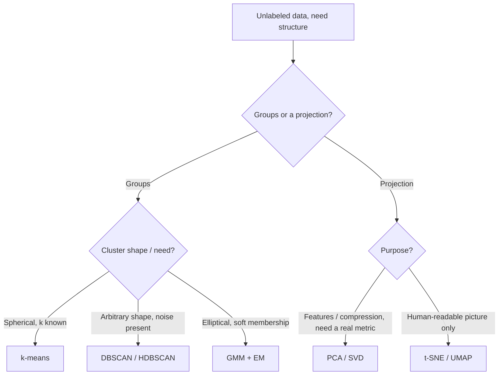

> Clustering (k-means, DBSCAN/HDBSCAN, Gaussian mixtures) finds groups without labels. Dimensionality reduction (PCA, t-SNE, UMAP) finds low-dimensional structure in high-dimensional data. Both run in seconds on data you don't understand yet, and that's the danger. Every method here breaks one of its assumptions as soon as you stop checking, and what you get is a confident, good-looking plot that means less than you think.

## The mechanism

**k-means** is Lloyd's algorithm doing coordinate descent on within-cluster sum of squared error:

$$\arg\min_{S} \sum_{i=1}^{k} \sum_{x \in S_i} \lVert x - \mu_i \rVert^2$$

Alternate between assigning each point to its nearest centroid and recomputing centroids as cluster means until assignments stop changing. It only converges to a local optimum, and the starting centroids matter a lot. k-means++ seeding (Arthur & Vassilvitskii, 2007) picks initial centroids with probability proportional to squared distance from those already chosen, which gives an $O(\log k)$ approximation guarantee in place of arbitrarily bad luck.

k-means assumes spherical, roughly equal-variance clusters (it's implicitly doing Euclidean Voronoi partitioning). It's sensitive to feature scale and outliers, and $k$ has to be fixed in advance. Choosing $k$ is unsolved in general: the elbow method on SSE, the silhouette score and the gap statistic are all heuristics and often ambiguous on real data. Only the probabilistic GMM case gets a principled answer, via BIC.

**DBSCAN** (Ester et al., 1996) is density-based. A point is a core point if at least `minPts` neighbors fall within radius `eps`; clusters form by chaining core points; anything unreachable is labeled noise. You get that noise label for free, whereas k-means forces every point into some cluster. DBSCAN finds arbitrarily shaped clusters but struggles when clusters really do differ in density, because one global `eps` can't be right everywhere. HDBSCAN (Campello et al.) fixes that by building a hierarchy of density levels and extracting the most stable clusters across it. The price is a subtler cost function to reason about.

**Gaussian Mixture Models** fit by Expectation-Maximization give *soft* assignments. The E-step computes each point's responsibility for each component,

$$\gamma_{ik} = \frac{\pi_k \, \mathcal{N}(x_i \mid \mu_k, \Sigma_k)}{\sum_j \pi_j \, \mathcal{N}(x_i \mid \mu_j, \Sigma_j)}$$

and the M-step updates each component's mean, covariance and mixing weight with those responsibilities as soft weights. Each component has its own covariance, so GMMs model elliptical clusters as well as spherical ones. But EM converges to local optima just like k-means, and a component can collapse onto a single point with near-zero covariance. That degenerate solution needs regularization to avoid.

**PCA** is the eigendecomposition of the centered (usually standardized) covariance matrix, or equivalently the SVD of the centered data matrix; see [[Concept - Matrix Multiplication as the Atom of Deep Learning]] for the linear algebra underneath. Principal components are the orthogonal directions of maximum variance, ranked by eigenvalue. PCA is linear and needs feature scaling to mean anything. It's fully interpretable, in that you can see which original features load onto each component. Use it for denoising, compression, and any downstream step that needs a real distance metric.

**t-SNE** (van der Maaten & Hinton, 2008) doesn't preserve a metric at all. It minimizes the [[Concept - KL Divergence]] between a Gaussian similarity distribution over neighbors in the original space and a heavier-tailed Student-t similarity distribution in the 2D/3D embedding. A `perplexity` parameter (typically 5–50) sets the effective neighborhood size. The objective only cares about *local* neighbor rankings, so t-SNE **fails as a distance metric**. Cluster sizes and inter-cluster distances in the plot are close to meaningless, and the layout is stochastic: a different seed gives a visually different, though often qualitatively similar, picture (Wattenberg et al., "How to Use t-SNE Effectively").

**UMAP** (McInnes et al., 2018) builds a fuzzy topological graph over nearest neighbors and optimizes a low-dimensional layout to match it with a cross-entropy-style loss. It's faster than t-SNE and tends to keep more global structure. It's still a visualization tool. It doesn't give you a faithful metric or a general-purpose feature extractor.

## In practice

PCA comes first. Standardize features, keep components covering ~90–95% cumulative explained variance, and use the result as compressed input to a downstream model or as a denoising step before clustering. Clustering directly on hundreds of noisy raw dimensions usually does worse than clustering on the top 20–50 principal components.

UMAP has mostly replaced t-SNE as the default visualization for large embedding sets (millions of points from an [[Concept - Embedding Models]] output, or activation vectors from a [[Concept - Vision Transformers]] model). It scales sub-quadratically, and its `n_neighbors`/`min_dist` parameters behave more predictably than t-SNE's perplexity.

k-means is still the default first clustering pass on tabular features because it's fast and well understood. Reach for DBSCAN/HDBSCAN when you expect noise points or clusters of visibly different density (fraud detection, geospatial clustering), and for GMM when you need soft membership probabilities in place of hard labels.

## Failure modes

- **k-means on non-spherical or unscaled data.** k-means slices an elongated elliptical cluster into several spurious spherical pieces. An unscaled feature in the thousands (income) drowns out one in single digits (years of tenure). Check per-feature scale before fitting and look at per-cluster silhouette, not only the aggregate score.
- **Reading distance or size off a t-SNE/UMAP plot.** Two clusters far apart on the plot aren't necessarily more different than two close together, because inter-cluster distance isn't preserved. Teams have made product segmentation decisions from a t-SNE plot's apparent cluster count and spacing, which is building on noise. Re-run with different seeds and perplexities and see whether the *qualitative* grouping holds. Never use plot coordinates as features.
- **GMM covariance collapse.** A component with very few points can shrink its covariance toward singular, giving it an unbounded likelihood contribution and destabilizing the fit. Guard with a covariance-regularization term or a minimum component size. The symptom is EM log-likelihood spiking or going NaN mid-fit.
- **DBSCAN under variable density.** One `eps` tuned for the dense region either pushes the sparse region into noise or fragments the dense region into many tiny clusters. Look at the k-distance plot (used to pick `eps`) for several distinct "knees". That means density really varies, and HDBSCAN is the better tool.

## The non-obvious

folklore, weakly sourced: t-SNE and UMAP will both produce convincing, well-separated "clusters" from pure noise or near-uniform random data. The optimization pushes points into blobs because that lowers the local-neighbor-preservation loss, whether or not real cluster structure exists. People who've been burned treat any t-SNE/UMAP plot as a hypothesis generator and never as evidence. Before claiming how many real groups exist, they run an actual clustering algorithm on the original (or PCA-reduced) space.

The deeper version, from Wattenberg et al.: cluster *count* and *size* in these plots are artifacts of the perplexity/`n_neighbors` setting, not discoveries about the data. Change the parameter and the apparent number of clusters can change too. A trustworthy structure-finding tool should do the opposite.

## Connections
- [[Concept - Matrix Multiplication as the Atom of Deep Learning]] — PCA's eigendecomposition and the equivalent SVD are direct applications of the same linear algebra.
- [[Concept - KL Divergence]] — t-SNE's objective literally minimizes a KL divergence between high- and low-dimensional neighbor-affinity distributions.
- [[Concept - Embedding Models]] — the vectors most practitioners cluster or project with these tools are the output of an embedding model.
- [[Concept - Sparse Autoencoders]] — a learned, non-geometric alternative for finding structure in high-dimensional activations, worth contrasting with PCA's purely linear-algebraic approach.
- [[Concept - Superposition]] — the reason naive PCA on model activations can mislead: superposed features don't align with PCA's orthogonal variance-maximizing directions.
- [[Concept - Decision Trees]] — a useful contrast: trees partition feature space supervised and axis-aligned, while k-means/GMM partition it unsupervised via distance or density.
- [[Concept - Learning from Imbalanced Data]] — cluster-size imbalance produces the same evaluation traps (a dominant cluster inflating aggregate silhouette) that class imbalance produces for supervised metrics.
- [[Concept - Vision Transformers]] — a common real workload is running UMAP or t-SNE over ViT patch or CLS-token embeddings to inspect learned structure.
- [[Concept - The Geometry of High-Dimensional Spaces]] — the curse-of-dimensionality backdrop explaining why distance and density behave so differently at high dimension, which is precisely why these methods (and their specific pathologies) exist.

## Sources
- Lloyd (1957/1982) — "Least Squares Quantization in PCM." The coordinate-descent algorithm underlying k-means.
- Arthur & Vassilvitskii (2007) — "k-means++: The Advantages of Careful Seeding." The $O(\log k)$ approximation-guaranteeing initialization.
- Ester et al. (1996) — "A Density-Based Algorithm for Discovering Clusters" (DBSCAN).
- van der Maaten & Hinton (2008) — "Visualizing Data using t-SNE."
- McInnes, Healy & Melville (2018) — "UMAP: Uniform Manifold Approximation and Projection."
- Wattenberg, Viégas & Johnson — "How to Use t-SNE Effectively" (Distill, 2016). The canonical warning against reading quantitative structure off a t-SNE plot.
