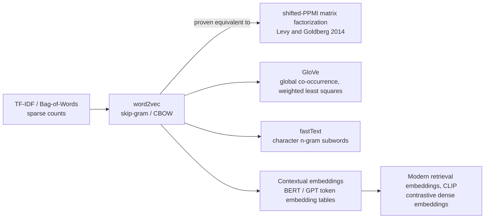

> word2vec (Mikolov et al., 2013) replaced sparse count vectors ([[Concept - TF-IDF and the Bag of Words]]) with dense, low-dimensional word vectors learned by predicting context. It set the template every embedding model since still follows, from GloVe to CLIP to transformer token embeddings. Once you understand the skip-gram objective, and the later proof that it's implicit matrix factorization, "neural embeddings" stop looking mysterious: they're a continuous evolution of classical linear algebra.

## The mechanism

Skip-gram predicts context words from a center word. CBOW (continuous bag-of-words) goes the other way and predicts the center word from its context. Either way the network is shallow: one linear projection in, one back out, no nonlinearity in between. The thing everyone wants, the word embedding, **is the hidden weight matrix itself**. It isn't a byproduct pulled out of a network trained for something else. "Predict the context" is scaffolding; the weights are the product.

A full softmax over the vocabulary,

$$P(c \mid w) = \frac{\exp(v_c \cdot v_w)}{\sum_{c' \in V} \exp(v_{c'} \cdot v_w)}$$

is far too expensive to evaluate and differentiate every step when $|V|$ is 100k–1M words, the same wall every large-vocabulary classifier hits (see [[Concept - Softmax]]). **Skip-gram with negative sampling (SGNS)** sidesteps it by turning the problem into binary classification: tell each true $(w,c)$ pair apart from $k$ sampled noise pairs,

$$\log \sigma(v_c \cdot v_w) + \sum_{i=1}^{k} \mathbb{E}_{c_i \sim P_n(w)}\big[\log \sigma(-v_{c_i} \cdot v_w)\big]$$

The noise distribution $P_n(w)$ draws negatives in proportion to unigram frequency raised to the **3/4 power**. That's a famous folklore-tuned constant: the original paper found it empirically beat raw-frequency and uniform sampling, and there's no clean theoretical reason why 3/4 in particular. Hierarchical softmax (a Huffman-tree factorization of the output layer) is the less-used alternative that also avoids the full-vocabulary sum.

The most important theoretical result in this lineage is **Levy & Goldberg (2014)**. They proved that SGNS at its optimum implicitly factorizes a shifted positive pointwise mutual information matrix,

$$M_{ij} = \max\left(0,\; \log\frac{P(w_i, c_j)}{P(w_i)P(c_j)} - \log k\right)$$

That ties "neural" word2vec straight back to classical count-based distributional semantics; LSA-style SVD on a co-occurrence matrix did conceptually the same job decades earlier. The innovation wasn't a new kind of representation. It was that SGD over an implicit matrix scales to billion-word corpora, and materializing and decomposing the matrix directly doesn't.

The famous **linear analogy structure** (king − man + woman ≈ queen) is real on curated demo sets: nearest-neighbor search in cosine space, excluding the input words, reliably finds the expected answer. It's much more fragile and dataset-dependent than the demo suggested, though. On broader analogy benchmarks, accuracy swings a lot with preprocessing, frequency thresholds and how the input words are excluded from the search. Vector arithmetic is a good illustration and a poor foundation for a product feature unless you validate it on your own data.

**GloVe** (Pennington et al., 2014) gets to much the same place by a different road. It factorizes a global word-word co-occurrence count matrix directly with weighted least squares, where SGNS samples local context windows. That revived a "count vs. predict" framing, which Levy & Goldberg's proof largely dissolved: both families approximate the same underlying object.

The limits that drove successors can't be tuned away. **One fixed vector per word** means no polysemy: "bank" the river and "bank" the institution collapse to one point. And there's **no handling of out-of-vocabulary words**; a word never seen in training has no vector. fastText (Bojanowski et al., 2017) patches OOV by composing a word's vector from character n-gram subword embeddings instead of a single atomic lookup. Contextual models solve polysemy properly by making the vector a function of the surrounding sentence, which is the conceptual bridge from static word2vec-style embeddings to every transformer's token embedding layer today.

## In practice

Original word2vec used embedding dimensions of 100–300, trained on corpora of hundreds of billions of tokens (Google News), with context windows of roughly 5–10 words and negative-sample counts $k$ of 5–20 for large corpora, down to 2–5 for small ones.

The same skip-gram machinery works well beyond text. item2vec treats a shopping basket or session as a "sentence" of item co-occurrences, and node2vec applies it to random walks over a graph. Both are production techniques in recommender systems, and both are just the SGNS objective with a different notion of "context."

Every transformer's input and output embedding tables descend directly from word2vec's lookup-table matrix, now trained jointly end to end with the rest of the network instead of by a standalone shallow objective (see [[Deep Dive - The Transformer]]). Training a small word2vec model from scratch is still worth it in 2026 for lightweight, domain-specific representations: a legal or medical corpus where off-the-shelf [[Concept - Embedding Models]] underperform and fine-tuning a full transformer is out of proportion to the problem.

## Failure modes

- **One vector per word, so no polysemy.** An ambiguous word's nearest neighbors mix unrelated senses (river "bank" neighbors next to financial "bank" neighbors), because the string gets one point in the space whatever the context. Inspect nearest-neighbor lists for known ambiguous words.
- **No out-of-vocabulary coverage.** A typo, a new term or a rare proper noun gets no vector at all in vanilla word2vec. Not a bad vector: none, a hard failure at lookup. fastText's character n-grams exist to fix this.
- **Over-trusting the analogy demo.** king−man+woman≈queen is a curated example. Broader analogy test sets show the effect depends on preprocessing and on whether query words are excluded from the search space. Building a product feature on raw vector arithmetic without checking your own data repeats a well-known overclaim.
- **SGNS hyperparameters transfer poorly.** The 3/4 negative-sampling exponent, window size and minimum word count were tuned on one corpus and don't carry over automatically. A domain-specific corpus (short, noisy social text vs. long-form news) often needs its own sweep.

## The non-obvious

folklore, weakly sourced: many practitioners independently rediscover that truncated SVD on a co-occurrence or PPMI matrix gives embeddings roughly as useful as a tuned word2vec model, for a fraction of the engineering effort. Levy & Goldberg's proof predicts this, since that's approximately what SGNS does under the hood.

The transferable lesson when you evaluate any new "neural embedding" claim: ask what matrix it's implicitly factorizing. Word2vec, several matrix-factorization recommenders and even some contrastive embedding objectives turn out to be "SGD-based factorization of an implicit matrix too large to materialize" once you go looking for the matrix. That question is a practical debugging and evaluation heuristic as much as a piece of history.

## Connections
- [[Concept - Embedding Models]] — the direct successor lineage: word2vec's predictive-embedding idea generalized into today's contrastively-trained dense retrieval embeddings.
- [[Concept - Softmax]] — the expensive full-vocabulary softmax that negative sampling exists specifically to avoid computing at every training step.
- [[Concept - Matrix Multiplication as the Atom of Deep Learning]] — the embedding lookup and projection are matrix multiplications, and the PMI-factorization result reduces word2vec training to matrix factorization outright.
- [[Concept - CLIP and Contrastive Vision-Language Training]] — a direct descendant: the same predict/contrast-against-negatives idea generalized from word-context pairs to image-text pairs.
- [[Concept - TF-IDF and the Bag of Words]] — the sparse count-based representation that word2vec's dense predictive embeddings were built to replace.
- [[Concept - Byte-Pair Encoding]] — the subword tokenization scheme that solves the same out-of-vocabulary problem fastText's character n-grams address, one layer earlier in the pipeline.
- [[Deep Dive - The Transformer]] — every transformer's token embedding table is the direct architectural descendant of word2vec's lookup-table embedding matrix.
- [[Concept - Rerankers]] — downstream retrieval components that consume the dense embeddings this entire lineage produces.
- [[Concept - Embedding Space Geometry]] — the deeper, more recent study of exactly the analogy-structure and distance-geometry questions word2vec first raised.

## Sources
- Mikolov, Sutskever, Chen, Corrado & Dean (2013) — "Distributed Representations of Words and Phrases and their Compositionality." Introduces skip-gram, CBOW, and negative sampling.
- Levy & Goldberg (2014) — "Neural Word Embedding as Implicit Matrix Factorization." Proves SGNS factorizes a shifted PPMI matrix.
- Pennington, Socher & Manning (2014) — "GloVe: Global Vectors for Word Representation."
- Bojanowski, Grave, Joulin & Mikolov (2017) — "Enriching Word Vectors with Subword Information" (fastText).
