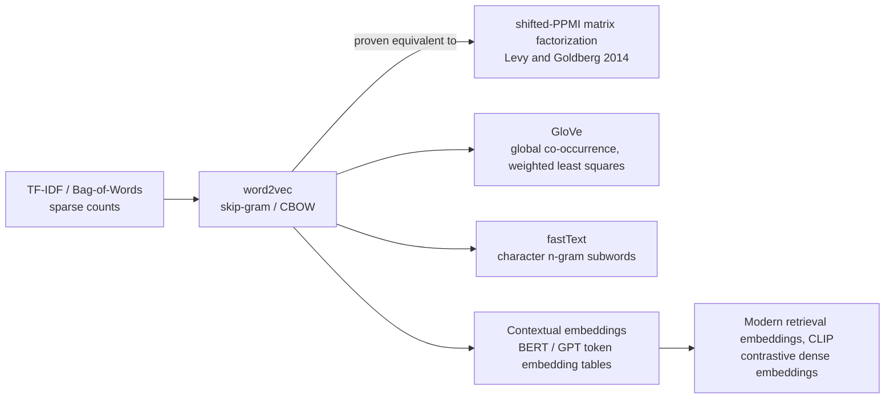

> word2vec (Mikolov et al., 2013) replaced sparse count vectors ([[Concept - TF-IDF and the Bag of Words]]) with dense, low-dimensional word vectors learned by predicting context — and in doing so set the template every embedding model since, from GloVe to CLIP to transformer token embeddings, still follows. Understanding the skip-gram objective, and its later proof as implicit matrix factorization, demystifies "neural embeddings" as a genuinely continuous evolution of classical linear algebra rather than a break from it.

## The mechanism

Skip-gram predicts context words from a center word; CBOW (continuous bag-of-words) runs the prediction the other way, predicting the center word from its surrounding context. The network in both cases is shallow — a single linear projection in, a projection back out, no nonlinearity between — and the object everyone actually wants, the word embedding, **is the hidden weight matrix itself**, not a byproduct extracted from a network trained to do something else. The "predict the context" task is scaffolding; the weights are the product.

A full softmax over the vocabulary,

$$P(c \mid w) = \frac{\exp(v_c \cdot v_w)}{\sum_{c' \in V} \exp(v_{c'} \cdot v_w)}$$

is prohibitively expensive to evaluate and differentiate at every training step when $|V|$ is 100k–1M words — the same computational wall every large-vocabulary classifier hits (see [[Concept - Softmax]]). **Skip-gram with negative sampling (SGNS)** sidesteps it by turning the problem into binary classification: distinguish each true $(w,c)$ pair from $k$ sampled noise pairs,

$$\log \sigma(v_c \cdot v_w) + \sum_{i=1}^{k} \mathbb{E}_{c_i \sim P_n(w)}\big[\log \sigma(-v_{c_i} \cdot v_w)\big]$$

where the noise distribution $P_n(w)$ draws negative words proportional to unigram frequency raised to the **3/4 power** — a famous folklore-tuned constant, empirically found in the original paper to outperform both raw-frequency and uniform sampling, with no clean theoretical derivation for why 3/4 specifically. Hierarchical softmax (a Huffman-tree factorization of the output layer) is the less-used alternative that also avoids the full-vocabulary sum.

The single most important theoretical result in this lineage is **Levy & Goldberg (2014)**: they proved that SGNS, at its optimum, is implicitly factorizing a shifted positive pointwise mutual information matrix,

$$M_{ij} = \max\left(0,\; \log\frac{P(w_i, c_j)}{P(w_i)P(c_j)} - \log k\right)$$

This reconnects "neural" word2vec directly back to classical count-based distributional semantics — LSA-style SVD on a co-occurrence matrix was doing conceptually the same job decades earlier. The real innovation wasn't a new kind of representation; it was that SGD over an implicit matrix scales to billion-word corpora in a way that materializing and decomposing the matrix directly does not.

The famous **linear analogy structure** (king − man + woman ≈ queen) is real on curated demonstration sets: nearest-neighbor search in cosine space, after excluding the input words, reliably surfaces the expected answer. But it is considerably more fragile and dataset-dependent than the original demo suggested — broader analogy benchmarks show accuracy swings heavily with preprocessing, frequency thresholds, and exactly how the input words are excluded from the search, which is why "vector arithmetic" is a compelling illustration but a poor foundation for a product feature without validating it on your own data.

**GloVe** (Pennington et al., 2014) takes a different route to essentially the same destination: it factorizes a global word-word co-occurrence count matrix directly, via weighted least squares, rather than SGNS's local-context-window sampling. This revived a "count vs. predict" framing that Levy & Goldberg's factorization proof largely dissolved — both families are approximating the same underlying object.

The limits that drove successors are structural, not tuning problems: **one fixed vector per word** means no polysemy ("bank" the river and "bank" the institution collapse to a single point), and there is **no handling of out-of-vocabulary words** — a word never seen during training simply has no vector. fastText (Bojanowski et al., 2017) patches the OOV problem by composing a word's vector from character n-gram sub-word embeddings instead of a single atomic lookup. Contextual models solve polysemy properly by making the vector a function of the surrounding sentence rather than a fixed table lookup — the conceptual bridge from static word2vec-style embeddings to every transformer's token embedding layer today.

## In practice

Original word2vec used embedding dimensions in the 100–300 range, trained on corpora of hundreds of billions of tokens (Google News), with context windows of roughly 5–10 words and negative-sample counts $k$ of 5–20 for large corpora down to as low as 2–5 for small ones. The exact same skip-gram machinery generalizes far beyond text: item2vec treats a shopping basket or a session as a "sentence" of item co-occurrences, and node2vec applies it to random walks over a graph — both are production techniques in recommender systems, using nothing more than the SGNS objective applied to a different notion of "context." Every transformer's input and output embedding tables are the direct architectural descendant of word2vec's lookup-table matrix, now trained jointly end-to-end with the rest of the network rather than via a standalone shallow objective (see [[Deep Dive - The Transformer]]). It's still worth training a small word2vec model from scratch in 2026 for lightweight, domain-specific representations — a legal or medical corpus where off-the-shelf [[Concept - Embedding Models]] underperform and fine-tuning a full transformer is disproportionate to the problem.

## Failure modes

- **One vector per word — no polysemy.** An ambiguous word's nearest neighbors mix unrelated senses (river "bank" neighbors alongside financial "bank" neighbors) because there is exactly one point in the space for that string, no matter the context. Detect by inspecting nearest-neighbor lists for known ambiguous words.
- **No out-of-vocabulary coverage.** A typo, a new term, or a rare proper noun gets no vector at all in vanilla word2vec — not a bad vector, no vector, a hard failure at lookup time. fastText's character n-grams exist specifically to fix this.
- **Over-trusting the analogy demo.** king−man+woman≈queen is a curated example; broader analogy test sets show the effect is sensitive to preprocessing and whether the query words are excluded from the search space. Building a product feature on raw vector arithmetic without validating against your own data repeats a well-known overclaim.
- **Untuned SGNS hyperparameters transfer poorly.** The 3/4 negative-sampling exponent, window size, and minimum word count were tuned on one corpus and don't automatically carry over — a domain-specific corpus (short, noisy social text vs. long-form news) often needs its own sweep.

## The non-obvious

folklore, weakly sourced: many practitioners independently rediscover that "just run truncated SVD on a co-occurrence or PPMI matrix" gets embeddings roughly as useful as a tuned word2vec model, for a fraction of the engineering effort — which is exactly what Levy & Goldberg's factorization proof predicts, since that's approximately what SGNS is doing under the hood anyway. The transferable lesson for engineers evaluating any new "neural embedding" claim: ask what matrix it's implicitly factorizing. Word2vec, several matrix-factorization recommender systems, and even some contrastive embedding objectives collapse a lot of apparent novelty into "SGD-based factorization of an implicit matrix too large to materialize" once you look for the matrix. That question is a genuinely useful debugging and evaluation heuristic, not just a historical curiosity.

## Connections
- [[Concept - Embedding Models]] — the direct successor lineage: word2vec's predictive-embedding idea generalized into today's contrastively-trained dense retrieval embeddings.
- [[Concept - Softmax]] — the expensive full-vocabulary softmax that negative sampling exists specifically to avoid computing at every training step.
- [[Concept - Matrix Multiplication as the Atom of Deep Learning]] — the embedding lookup and projection are matrix multiplications, and the PMI-factorization result reduces word2vec training to matrix factorization outright.
- [[Concept - CLIP and Contrastive Vision-Language Training]] — a direct descendant: the same predict/contrast-against-negatives idea generalized from word-context pairs to image-text pairs.
- [[Concept - TF-IDF and the Bag of Words]] — the sparse count-based representation that word2vec's dense predictive embeddings were built to replace.
- [[Concept - Byte-Pair Encoding]] — the subword tokenization scheme that solves the same out-of-vocabulary problem fastText's character n-grams address, one layer earlier in the pipeline.
- [[Deep Dive - The Transformer]] — every transformer's token embedding table is the direct architectural descendant of word2vec's lookup-table embedding matrix.
- [[Concept - Rerankers]] — downstream retrieval components that consume the dense embeddings this entire lineage produces.
- [[Concept - Embedding Space Geometry]] — the deeper, more recent study of exactly the analogy-structure and distance-geometry questions word2vec first raised.

## Sources
- Mikolov, Sutskever, Chen, Corrado & Dean (2013) — "Distributed Representations of Words and Phrases and their Compositionality." Introduces skip-gram, CBOW, and negative sampling.
- Levy & Goldberg (2014) — "Neural Word Embedding as Implicit Matrix Factorization." Proves SGNS factorizes a shifted PPMI matrix.
- Pennington, Socher & Manning (2014) — "GloVe: Global Vectors for Word Representation."
- Bojanowski, Grave, Joulin & Mikolov (2017) — "Enriching Word Vectors with Subword Information" (fastText).
