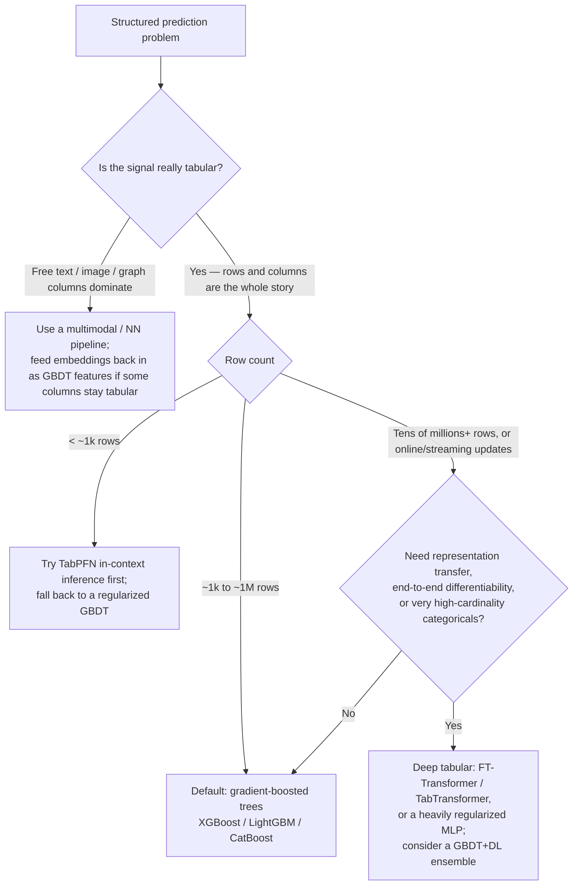

> On tabular data with heterogeneous numeric/categorical features and up to roughly 100k–1M rows, reach for [[Concept - Gradient Boosting]] first — XGBoost, LightGBM, or CatBoost, all stacks of shallow [[Concept - Decision Trees]] fit sequentially — not a deep net. The default only flips when the data stops looking tabular.

## Decision flow

The default path resolves concretely to [[Breakdown - XGBoost]] (or an equivalent LightGBM/CatBoost run) for the large majority of real tabular projects — this is the empirically grounded verdict of Grinsztajn et al. (2022), "Why do tree-based models still outperform deep learning on tabular data?"

## Tradeoff matrix

| Criterion | GBDT (XGBoost/LightGBM/CatBoost) | Deep tabular (FT-Transformer, TabTransformer, regularized MLP) | TabPFN (in-context) |
|---|---|---|---|
| Accuracy on small/medium tabular (<1M rows) | Best in most published benchmarks | Usually a bit behind unless heavily regularized (Kadra et al. 2021) | Matches tuned GBDT on <1k rows, <100 features |
| Training compute | Seconds–minutes, CPU | Minutes–hours, GPU preferred | One GPU forward pass, no per-dataset training |
| Tuning effort | Low–moderate; sane defaults + early stopping | High; architecture + regularization search | None per dataset (pretrained once) |
| Handles uninformative features | Robust — splits simply ignore them | MLPs spread capacity across them, degrading signal | Inherited from the pretraining prior |
| Fits irregular / non-smooth targets | Yes — piecewise-constant fits jagged functions well | NNs over-smooth sharp discontinuities | Inherits GBDT-like priors |
| Categorical / free-text / image columns | Needs encoding; poor at raw text/image | Natively embeds high-cardinality categoricals, text, images | v1: numeric only; v2 (2025) adds categoricals |
| Interpretability | SHAP, gain importance, monotonic constraints | Harder; attention maps are a weak substitute | Low — opaque in-context inference |
| Deployment footprint | A few MB, CPU-servable | GPU-friendly, larger runtime | GPU required, dataset ships with every request |
| Streaming / online updates | Awkward — full or incremental refit | Natural — a gradient step per batch | Not designed for this |

## The details that flip the decision

- **The columns are secretly a different modality.** If the highest-signal features are free text, images, or graph structure, the problem was never tabular — reach for a [[Concept - Vision Transformers]]-style or embedding-based pipeline, and, if you like, feed the resulting embeddings back into a GBDT as engineered features. This is the single most common reason GBDT "underperforms" in practice: the team never actually left tree-land when it should have.
- **Rows are very few (<~1k) and features are mostly numeric.** [[Breakdown - TabPFN]] does no per-dataset training at all — it performs in-context inference with a transformer pretrained once on millions of synthetic datasets — and matched tuned GBDT in under a second on a GPU in v1's small-data regime. It stops being competitive as row count, feature count, or class count grow past its context limits.
- **Representation transfer or end-to-end differentiability is required.** If the tabular model is one head bolted onto a larger neural system — jointly trained with an image tower, or sharing weights across related tasks — a deep tabular model is the only option that composes; GBDT is not differentiable end-to-end. This is the same build-vs-buy tension that shows up one layer up the stack in [[Decision - Fine-Tuning vs RAG vs Prompting]], and it's the practical analog of the transfer argument behind [[Concept - Scaling Laws]].
- **"Deep tabular never wins" is folklore, not law.** A properly regularized MLP with the right dropout/weight-decay/data-augmentation cocktail (Kadra et al. 2021, "Well-Tuned Simple Nets Excel on Tabular Datasets") closes most of the gap to GBDT — most published DL-loses-to-trees results used under-regularized baselines. Budget for this before concluding DL "can't" work here.
- **Cost and ops asymmetry rarely gets weighed.** A GBDT model that trains in 90 seconds on a laptop CPU and ships as an 8MB file changes the [[Concept - Cost Engineering for LLM Applications]]-style economics of a project versus a GPU-serving deep net — factor this in even when accuracy is a wash, echoing the more-capacity-isn't-free-capacity lesson familiar from [[Concept - Double Descent]].
- **Kaggle-scale competitions sometimes stack both.** A small GBDT+DL ensemble occasionally adds a marginal lift on leaderboard-style problems — worth trying only after each model is independently tuned, not as a first move.

## Connections

- [[Concept - Gradient Boosting]] — the mechanism this decision defaults to; understand it before arguing against it.
- [[Concept - Decision Trees]] — the atomic learner whose axis-aligned, piecewise-constant inductive bias is *why* trees win on tabular data.
- [[Breakdown - XGBoost]] — the concrete system most teams reach for when the decision flow says "GBDT."
- [[Breakdown - TabPFN]] — the frontier exception that flips the default on very small tabular datasets.
- [[Decision - Fine-Tuning vs RAG vs Prompting]] — the analogous build-vs-buy decision one layer up the stack, relevant once tabular signal is mixed with text.
- [[Concept - Scaling Laws]] — the deep-learning argument for "more data, more capacity" that explains when and why DL eventually overtakes GBDT at large scale.
- [[Concept - Vision Transformers]] — what a project reaches for once the "tabular" columns are actually images in disguise.
- [[Concept - Cost Engineering for LLM Applications]] — the ops-cost lens (train/serve footprint) the tradeoff matrix borrows from LLM economics.
- [[Concept - Double Descent]] — the general lesson that more model capacity is not automatically better, relevant to the reflexive "just use deep learning" instinct.

## Sources
- Grinsztajn, Oyallon & Varoquaux (2022) — "Why do tree-based models still outperform deep learning on tabular data?" The benchmark that grounds the default answer.
- Gorishniy, Rubachev, Khrulkov & Babenko (2021) — FT-Transformer and neural-tabular benchmarks; the deep-tabular contenders' actual track record.
- Kadra, Lindauer, Hutter & Grabocka (2021) — "Well-Tuned Simple Nets Excel on Tabular Datasets" (regularization cocktails); the counter-evidence that DL is stronger than folklore admits.
- Hollmann et al. (2022, ICLR) — TabPFN; in-context tabular inference as amortized Bayesian inference.
