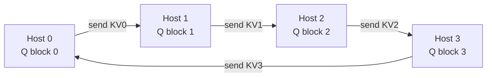

> **One-paragraph hook:** [[Deep Dive - FlashAttention]] keeps one device from materializing an N×N score matrix by tiling through SRAM; Ring Attention applies the same trick across devices instead of across memory tiers — shard the sequence over N hosts, pass key/value blocks hand-to-hand around a ring, and no device ever holds more than 1/N of the KV cache at once. That's the difference between a model that tops out around 128k context because it's fighting single-device HBM and one that reaches 1M+ tokens because context length now scales with how many GPUs you're willing to add.

## The mechanism
Liu et al. 2023 ("Ring Attention with Blockwise Transformers for Near-Infinite Context") shard a sequence of length $S$ across $N$ hosts, each holding a contiguous block of queries and its corresponding local K/V block of size $S/N$. Each host computes attention between its query block and its own K/V block, then the K/V block is passed to the next host in a ring topology while the *next* K/V block is simultaneously arriving from the previous host. After $N$ steps, every host's query block has attended to every K/V block in the sequence — full attention, but the full K/V tensor is never materialized on any single device.

The trick that makes this fast rather than merely memory-saving is **overlap**: while host $i$ computes attention against the K/V block currently in hand, it asynchronously sends its old block onward and receives the next one. As long as per-block compute time is at least as long as block transfer time, communication hides entirely under computation and the ring adds close to zero wall-clock overhead versus a hypothetical single giant device. Miss that condition — a slow fabric, or blocks too small to amortize transfer latency — and the ring becomes communication-bound instead.

Ring Attention composes with, rather than replaces, FlashAttention: each host's local attention computation still uses online-softmax accumulation (running max and running denominator updated incrementally per K/V block) so it never forms the local score matrix either. Stack the two and per-device activation memory for attention drops from $O(S)$ to $O(S/N)$ — maximum feasible context grows roughly linearly with device count, which is the whole point.

Naive contiguous sharding under a causal mask creates **load imbalance**: a host holding late-sequence queries can attend to every earlier K/V block, while a host holding early queries can only attend to a few — so later ring steps do systematically more work. Striped Attention (Brandon et al. 2023) and zigzag/interleaved block assignment fix this by scattering each host's queries across the sequence rather than assigning contiguous chunks, roughly doubling throughput on causal (decoder-only) models by equalizing work per step.

## In practice
The Large World Model (LWM), trained to 1M-token context on top of ring attention, is the clearest existence proof this scales in practice, and the same primitive underlies context-parallelism implementations in Megatron and DeepSpeed via the [[Concept - Sequence and Context Parallelism]] accounting that training frameworks use to book memory and communication cost. Gemini-class long-context claims lean on the same family of tricks. This note owns the "extreme context" framing on the inference/extreme-scale side; [[Concept - Tensor and Pipeline Parallelism]] and the general training-side parallelism composition live in domain 04.

## Failure modes
Ring Attention trades HBM capacity for interconnect bandwidth — see [[Concept - GPU Memory Hierarchy]] for the memory tiers being traded off — so it wants NVLink- or InfiniBand-class fabric; run it over a slower interconnect and the overlap assumption breaks, turning a near-zero-overhead trick into a comms-bound bottleneck. A single **straggler host** stalls the entire ring, since every host waits on its neighbor's block — there's no partial progress the way there is with fully asynchronous data parallelism, unlike the fault tolerance you'd get from independent [[Concept - All-Reduce and Collective Operations|all-reduce]] steps. And because each host's online-softmax state (running max, running sum) accumulates across many more steps than single-device FlashAttention, low-precision accumulation (bf16, fp8) needs to be numerically careful — sloppy rescaling shows up as logit drift that specifically degrades quality at extreme context lengths, exactly where you have the least budget to notice it in a spot-check. See [[Gotchas - Long-Context Failure Modes]] for the broader symptom catalog.

## The non-obvious
Ring Attention and FlashAttention are the *same idea* applied at two different memory-hierarchy levels — FlashAttention tiles across the SRAM/HBM boundary on one chip; Ring Attention tiles across the HBM/interconnect boundary across chips. Once you see that, the load-balancing problem (Striped Attention) is recognizable as the exact same "later positions see more keys under causal masking" issue that motivates blockwise causal-masking optimizations inside a single FlashAttention kernel — it just reappears one memory tier up. The practical corollary: extreme-context serving is fundamentally a communication-engineering problem, not a compute or single-device-memory problem, once your model's positional encoding (see [[Concept - RoPE Extrapolation and Context Extension]]) already generalizes to the target length — you can have a model that's mathematically fine at 1M tokens and still be unable to serve it because the ring stalls on cluster fabric.

## Connections
- [[Deep Dive - FlashAttention]] — Ring Attention is the same online-softmax, no-materialized-score-matrix trick applied across devices instead of across a chip's memory hierarchy.
- [[Concept - Tensor and Pipeline Parallelism]] — the sibling parallelism strategies that context/ring parallelism composes with in 3D/4D parallel training.
- [[Concept - All-Reduce and Collective Operations]] — the ring K/V pass here is a point-to-point analog of the same collective-communication patterns used for gradient synchronization.
- [[Concept - RoPE Extrapolation and Context Extension]] — extending the positional encoding to generalize is the prerequisite; ring attention is what makes the *compute* for that length feasible.
- [[Concept - KV Cache]] — ring attention's whole purpose is avoiding ever materializing the full KV cache on one device.
- [[Gotchas - Long-Context Failure Modes]] — the symptom catalog for what breaks when extreme-context serving goes wrong.
- [[Concept - GPU Memory Hierarchy]] — the memory-tier reasoning (SRAM vs HBM vs interconnect) that both FlashAttention and Ring Attention exploit.
- [[Concept - Sequence and Context Parallelism]] — the training-framework bookkeeping (Megatron/DeepSpeed) that implements ring-style context parallelism in practice.
- [[Concept - Warp Specialization and Async Pipelines on Hopper]] — the single-GPU analog of overlapping computation with data movement that Ring Attention performs at cluster scale.

## Sources
- Liu et al. (2023) — Ring Attention with Blockwise Transformers for Near-Infinite Context. The core ring communication + blockwise attention algorithm.
- Brandon et al. (2023) — Striped Attention: Faster Ring Attention for Causal Transformers. The load-balancing fix for causal masking.
- Dao et al. (2022) — FlashAttention: Fast and Memory-Efficient Exact Attention with IO-Awareness. The online-softmax primitive Ring Attention composes with.
