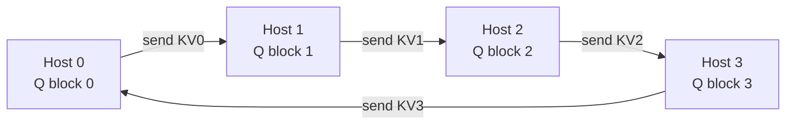

> **One-paragraph hook:** [[Deep Dive - FlashAttention]] avoids materializing an N×N score matrix on one device by tiling through SRAM. Ring Attention does the same thing across devices instead of across memory tiers. Shard the sequence over N hosts, pass key/value blocks around a ring, and no device ever holds more than 1/N of the KV cache at once. A model fighting single-device HBM tops out around 128k context; with the ring it reaches 1M+ tokens, because context length now scales with how many GPUs you're willing to add.

## The mechanism
Liu et al. 2023 ("Ring Attention with Blockwise Transformers for Near-Infinite Context") shard a sequence of length $S$ across $N$ hosts. Each host holds a contiguous block of queries and the matching local K/V block of size $S/N$. It computes attention between its query block and its own K/V block, then passes the K/V block to the next host in the ring while the *next* block arrives from the previous host. After $N$ steps every query block has attended to every K/V block. That's full attention, and no single device ever materializes the full K/V tensor.

What makes it fast, as well as memory-saving, is **overlap**. While host $i$ computes against the K/V block it has, it asynchronously sends its old block on and receives the next. If per-block compute takes at least as long as the block transfer, communication hides entirely under compute and the ring adds close to zero wall-clock overhead compared with one hypothetical giant device. Break that condition (a slow fabric, or blocks too small to amortize transfer latency) and the ring goes communication-bound.

Ring Attention composes with FlashAttention. Each host's local attention still uses online-softmax accumulation (running max and running denominator updated per K/V block), so it never forms the local score matrix either. Stack the two and per-device activation memory for attention drops from $O(S)$ to $O(S/N)$. Maximum feasible context grows roughly linearly with device count, which is the point of the whole exercise.

Naive contiguous sharding under a causal mask causes **load imbalance**. A host with late-sequence queries attends to every earlier K/V block; a host with early queries attends to only a few. Later ring steps do systematically more work. Striped Attention (Brandon et al. 2023) and zigzag/interleaved block assignment fix it by scattering each host's queries across the sequence, which equalizes work per step and roughly doubles throughput on causal (decoder-only) models.

## In practice
The Large World Model (LWM), trained to 1M-token context on ring attention, is the clearest proof that this scales in practice. The same primitive underlies context parallelism in Megatron and DeepSpeed, through the [[Concept - Sequence and Context Parallelism]] accounting training frameworks use to book memory and communication cost. Gemini-class long-context claims lean on the same family of tricks. This note owns the "extreme context" framing on the inference and extreme-scale side; [[Concept - Tensor and Pipeline Parallelism]] and general training-side parallelism composition live in domain 04.

## Failure modes
Ring Attention trades HBM capacity for interconnect bandwidth ([[Concept - GPU Memory Hierarchy]] covers the tiers involved), so it wants NVLink- or InfiniBand-class fabric. On a slower interconnect the overlap assumption fails and a near-zero-overhead trick becomes a comms-bound bottleneck.

One **straggler host** stalls the whole ring, since every host waits on its neighbor's block. You get no partial progress, unlike fully asynchronous data parallelism or the fault tolerance of independent [[Concept - All-Reduce and Collective Operations|all-reduce]] steps.

Each host's online-softmax state (running max, running sum) also accumulates over many more steps than single-device FlashAttention, so low-precision accumulation (bf16, fp8) needs care. Sloppy rescaling shows up as logit drift that degrades quality specifically at extreme context lengths, where a spot-check is least likely to catch it. [[Gotchas - Long-Context Failure Modes]] has the broader symptom catalog.

## The non-obvious
Ring Attention and FlashAttention are one idea at two levels of the memory hierarchy. FlashAttention tiles across the SRAM/HBM boundary on one chip; Ring Attention tiles across the HBM/interconnect boundary between chips. Seen that way, the load-balancing problem Striped Attention solves is the same "later positions see more keys under causal masking" issue that drives blockwise causal-masking optimizations inside a single FlashAttention kernel, one memory tier up.

The practical corollary: once your positional encoding (see [[Concept - RoPE Extrapolation and Context Extension]]) generalizes to the target length, extreme-context serving is a communication-engineering problem. Compute and single-device memory stop being the limit. A model can be mathematically fine at 1M tokens and still unservable because the ring stalls on the cluster fabric.

## Connections
- [[Deep Dive - FlashAttention]] — Ring Attention is the same online-softmax, no-materialized-score-matrix trick applied across devices instead of across a chip's memory hierarchy.
- [[Concept - Tensor and Pipeline Parallelism]] — the sibling parallelism strategies that context/ring parallelism composes with in 3D/4D parallel training.
- [[Concept - All-Reduce and Collective Operations]] — the ring K/V pass here is a point-to-point analog of the same collective-communication patterns used for gradient synchronization.
- [[Concept - RoPE Extrapolation and Context Extension]] — extending the positional encoding to generalize is the prerequisite; ring attention is what makes the *compute* for that length feasible.
- [[Concept - KV Cache]] — ring attention's whole purpose is avoiding ever materializing the full KV cache on one device.
- [[Gotchas - Long-Context Failure Modes]] — the symptom catalog for what breaks when extreme-context serving goes wrong.
- [[Concept - GPU Memory Hierarchy]] — the memory-tier reasoning (SRAM vs HBM vs interconnect) that both FlashAttention and Ring Attention exploit.
- [[Concept - Sequence and Context Parallelism]] — the training-framework bookkeeping (Megatron/DeepSpeed) that implements ring-style context parallelism in practice.
- [[Concept - Warp Specialization and Async Pipelines on Hopper]] — the single-GPU analog of overlapping computation with data movement that Ring Attention performs at cluster scale.

## Sources
- Liu et al. (2023) — Ring Attention with Blockwise Transformers for Near-Infinite Context. The core ring communication + blockwise attention algorithm.
- Brandon et al. (2023) — Striped Attention: Faster Ring Attention for Causal Transformers. The load-balancing fix for causal masking.
- Dao et al. (2022) — FlashAttention: Fast and Memory-Efficient Exact Attention with IO-Awareness. The online-softmax primitive Ring Attention composes with.
