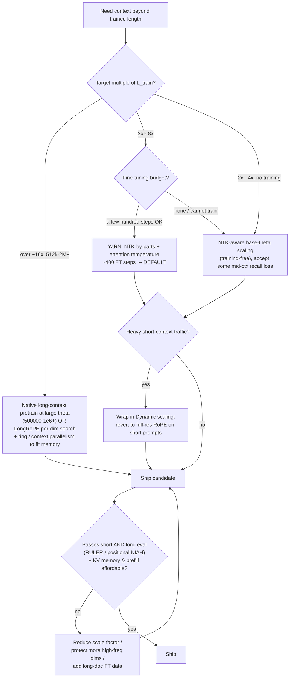

# Decision - Choosing a Context Extension Method

> You need a [[Concept - Rotary Position Embeddings (RoPE)|RoPE]] model to work past its trained length. **Default for the 80% case:** for a 2–8× extension with a modest fine-tuning budget, use [[Breakdown - YaRN|YaRN]] (NTK-by-parts frequency scaling + attention-temperature, ~400 fine-tune steps) — best quality-per-token and the community default already baked into many long-context checkpoints. The full method mechanics live in [[Concept - RoPE Extrapolation and Context Extension]]; the step-by-step execution lives in [[Playbook - Extending a Model's Context Window]]. This note is only the *choice*.

## Decision flow

## Tradeoff matrix

| Method | Fine-tune cost | Max reliable extension¹ | Short-ctx regression risk | Impl complexity | When it's the pick |
|---|---|---|---|---|---|
| **Position Interpolation** (Chen et al. 2023) | ~1000 steps | ~4–8× | Medium–high — uniformly compresses high-frequency dims, blurring local order | Low | Only for simplicity or as a baseline; YaRN dominates it at equal quality |
| **NTK-aware base-θ scaling** (bloc97, r/LocalLLaMA) | 0 to a few hundred steps | ~2–4× | Low–medium | Low | Training-free / tiny budget; "just raise θ" and accept some mid-context recall loss |
| **Dynamic NTK scaling** | 0 | ~2–4× | Very low — reverts to full-res RoPE on short prompts | Low–medium | Mixed traffic: mostly-short prompts with occasional long ones |
| **YaRN** (Peng et al. 2023) | ~400 steps, ~10× fewer tokens than PI | ~8–16× (64k–128k on Llama) | Low | Medium | **The default.** Best quality-per-token; already in many checkpoints |
| **LongRoPE** (Ding et al. 2024) | evolutionary per-dim search + FT | up to 2M | Medium | High | Existing model must reach extreme length without a full pretrain |
| **Native long-context pretrain** | full pretrain at large θ | model-defined (Llama 3: θ=500000) | None — trained in | Highest (frontier-lab budget) | You control pretraining and the target is a first-class requirement |

¹ "Reliable" means passing a *dual-regime* eval (short-context suite intact **and** mid-context recall on RULER/multi-needle), not just single-needle NIAH. Ranges are order-of-magnitude; the exact ceiling depends on base θ, head dim, and fine-tuning data. *(as of 2026)*

The two axes that actually decide it: **the extension multiple** (how far past `L_train` you need to go) sets the row, and **whether you can fine-tune** collapses the top rows to one choice. Everything past ~16× is a different budget class entirely — it needs [[Concept - Ring Attention and Extreme Context|ring / context parallelism]] just to hold the [[Concept - KV Cache|KV cache]] in memory, which is why frontier labs pretrain long rather than extend.

## The details that flip the decision

**Heavy short-context production traffic → prefer Dynamic scaling, even over a better static method.** Any static rescale that helps at 128k costs you something at 2k, and if 90% of your requests are short you're paying that tax on the wrong distribution. Dynamic NTK sets the scale factor from the *actual* sequence length, so short prompts run at full-resolution RoPE and only long prompts pay for the stretch. This can outrank YaRN for a serving fleet whose traffic is mostly short.

**Retrieval-heavy long-context → weight mid-context recall, not the ends.** [[Gotchas - Long-Context Failure Modes|Lost-in-the-middle]] means a method can pass single-needle NIAH (needles land near the ends, where models attend best) while failing real multi-hop retrieval buried at 50% depth. Evaluate on RULER and multi-needle before trusting a number. A method that "passes NIAH at 128k" and one that actually retrieves from the middle band are frequently different methods — this is the single most common way an extension choice looks fine and ships broken. This is also where the RAG-vs-extend question resurfaces: see [[Decision - RAG vs Long-Context Windows]] before assuming a longer window is the answer at all.

**The base model was already trained with high θ → a *smaller* additional scale suffices.** Llama 3 pretrains at θ=500000, so many of its RoPE dimensions already have wavelengths shorter than a long context and generalize without help. Stacking a large scale factor on top of an already-long base over-interpolates and craters short-context quality. Check the base θ first; the required extension multiple is relative to what the model already reaches, not to the original 10000-base assumption.

**Extreme targets are a memory decision before they're a method decision.** Prefill attention is O(L²) and KV memory is O(L)·layers·heads, so at 1M tokens the *prefill can cost more than the generation* and the KV cache alone can blow your budget. LongRoPE and native long-context both assume ring/context parallelism is on the table; if it isn't, no amount of frequency rescaling makes 2M tokens serveable. Decide whether you can *afford to fill* the window before choosing how to *reach* it.

**Anti-pattern to refuse: quoting the extended length as a capability.** "Supports 1M tokens" with no dual-regime eval, no RULER, and no prefill/KV-memory budget is a spec sheet, not a capability. The method choice is only valid relative to a measured short-and-long evaluation and a confirmed serving cost — which is exactly the rollback loop the [[Playbook - Extending a Model's Context Window|extension playbook]] enforces.

## Connections

- [[Concept - RoPE Extrapolation and Context Extension]] — the mechanism behind every option here (why RoPE fails to extrapolate and how frequency rescaling fixes it); this Decision only picks among them.
- [[Breakdown - YaRN]] — the default choice, reverse-engineered: NTK-by-parts plus the attention-temperature term that lets it work with minimal fine-tuning.
- [[Playbook - Extending a Model's Context Window]] — the end-to-end execution of whichever method you pick here, including the dual-regime eval and rollback triggers.
- [[Concept - Ring Attention and Extreme Context]] — the up-link for the >16× branch (domain-adjacent, frontier level): distributing attention so extreme context fits in device memory at all.
- [[Gotchas - Long-Context Failure Modes]] — the failure catalog (lost-in-the-middle, NIAH-that-lies, KV-quant artifacts) that defines what "reliable extension" in the matrix means.
- [[Concept - KV Cache]] — the down-link (domain 07, core): the KV-memory math that turns "extreme target" from a method question into a budget question.
- [[Concept - Rotary Position Embeddings (RoPE)]] — the base positional scheme (domain 03) all these methods rescale; the base θ it was trained with directly flips the required scale factor.
- [[Decision - RAG vs Long-Context Windows]] — the prior question (domain 11): whether to extend the window at all versus retrieve into a short one, especially for retrieval-heavy workloads.

## Sources

- Chen et al. (2023) — *Extending Context Window of LLMs via Position Interpolation.* The linear-downscale baseline; ~1000 fine-tune steps.
- Peng et al. (2023) — *YaRN: Efficient Context Window Extension of LLMs.* NTK-by-parts + attention temperature; 64k–128k on Llama with ~10× fewer tokens and ~2.5× fewer steps than PI.
- Ding et al. (2024) — *LongRoPE.* Evolutionary per-dimension rescale search reaching 2M tokens on existing models.
- Su et al. (2021) — *RoFormer* (RoPE). The rotary construction whose base θ every method here manipulates.
- Liu et al. (2023) — *Lost in the Middle.* The U-shaped positional recall that makes mid-context (RULER-style) evaluation mandatory, not optional.
