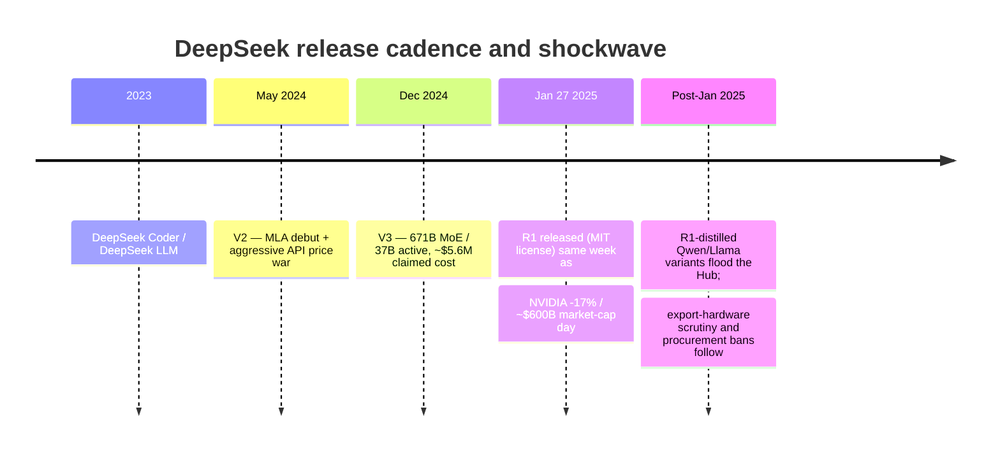

> DeepSeek is a Chinese AI lab spun out of High-Flyer, a quantitative hedge fund, founded by Liang Wenfeng. It matters because its December 2024-January 2025 release run — V3, then R1 — combined frontier-adjacent capability, a detailed and unusually low claimed training cost, and a fully open MIT license, and the combination did more damage to the "compute moat" narrative in a single week than any prior open-weights release. Date-stamped as of 2026; the shockwave and its aftershocks are still settling.

## The headline numbers

- **Origin:** spun out of High-Flyer, a Chinese quantitative hedge fund; founder Liang Wenfeng. The lab entered the frontier race with a GPU stockpile assembled before export controls tightened — on the order of **~10,000 A100s** per public claims, accumulated while that hardware was still exportable.
- **V3** (Dec 2024): 671B total parameters, a [[Concept - Mixture of Experts Architecture]] with only **37B active per token**; trained on 2,048 H800 GPUs, ~2.79M GPU-hours, with a claimed **~$5.6M final-run cost**.
- **R1** (Jan 2025): open reasoning model released under the **MIT license**, reaching o1-class reasoning performance at open weights.
- **The market shock:** January 27, 2025 — NVIDIA fell **~17% in a single day**, roughly **$600B in market cap erased**, the largest single-day market-cap loss in US stock market history for any company. The DeepSeek app simultaneously hit **#1 on the US App Store**.

## How it actually works

The mechanisms behind V3 and R1 — [[Concept - Multi-Head Attention Variants (MHA MQA GQA MLA)]] (MLA) attention, MoE routing, [[Concept - GRPO and RL with Verifiable Rewards]] (GRPO), and [[Concept - Mixed Precision Training]] (FP8 training) — belong to their owning domains; this note covers what DeepSeek *did as an organization* and why it moved the market. The relevant mechanism here is the release-cadence and disclosure strategy:

Each release compounded pressure on the same thesis: DeepSeek Coder/LLM (2023) established the lab as a serious open-weights player; V2 (May 2024) introduced MLA and paired it with an API price war that undercut incumbent token pricing; V3 (Dec 2024) delivered a 671B-parameter MoE model at a training cost an order of magnitude below what the market assumed frontier-class training required; and R1 (Jan 2025) did the same to reasoning-model training, open-sourcing o1-class capability under a license with essentially no restrictions. The market didn't react to any single release — it reacted to the pattern, in the same week R1 landed, of a non-incumbent lab repeatedly beating the market's assumed cost curve.

## The clever parts

1. **Efficiency-as-strategy under a hardware constraint.** Training on export-throttled H800 GPUs (the China-specific, performance-capped variant of the H800/H100 line) forced algorithmic efficiency rather than allowing it: MLA shrinks the KV-cache footprint per token, and FP8 mixed-precision training cuts memory and compute cost per step. The "constraint bred efficiency" narrative is not just PR — a GPU-constrained lab has a structural incentive to optimize FLOPs-per-capability that a GPU-rich lab can defer.
2. **The cost-disclosure move as marketing, not just accounting.** Publishing a specific, defensible-looking $5.6M final-run figure — rather than staying silent the way incumbents do — is a deliberate transparency play. It signals confidence and forces every frontier lab that had never disclosed a training-cost figure to either match the disclosure or look evasive by comparison.
3. **The V2 price war as a market-entry wedge.** Pricing API tokens far below OpenAI's and Anthropic's rates in May 2024 wasn't just aggressive pricing — it accelerated the industry-wide token-price-deflation trend and forced incumbents into reactive repricing, buying DeepSeek attention and adoption it could not have bought with capability alone.
4. **Open-sourcing R1 under MIT at the reasoning frontier.** No other lab had released an o1-class reasoning model with essentially no usage restriction. This specifically triggered a distillation wave — R1-distilled Qwen and Llama variants appeared across the Hub within days, meaning DeepSeek's reasoning-training recipe propagated into the broader open ecosystem faster than any prior open release had managed.
5. **Publishing genuinely detailed technical papers as a challenger's marketing lever.** Where incumbent labs increasingly withhold architecture and training detail in their technical reports (see [[Concept - The Preprint and Social-Media Research Culture]]), DeepSeek's V3 and R1 papers disclose architecture, training recipe, and RL objective in real detail — a transparency posture that is cheap for a challenger and costly for an incumbent to match, and DeepSeek used that asymmetry deliberately.

## What it got wrong / what's dated

The **cost-claim controversy** is real and unresolved: the ~$5.6M figure covers only the final training run's GPU-hours, explicitly excluding prior research iterations, failed experiments, and the hardware capex of the GPU stockpile itself. Critics reasonably characterized the headline figure as misleading when read as "total cost to build V3," even though the final-run GPU-hour number itself is plausible and consistent with the disclosed cluster size.

The **geopolitical fallout** is a genuine cost DeepSeek did not fully anticipate: training on export-throttled H800s drew US government and procurement scrutiny, and subsequent bans in some government-adjacent and regulated contexts followed — meaning the weights can be excellent and still be a compliance non-starter for some buyers (see [[Decision - Which Model Ecosystem to Bet On]] on geopolitical risk as a gating criterion).

The market's one-day read that "the compute moat is dead" was probably overstated. Subsequent frontier training runs across the industry have continued to show real returns to scale; DeepSeek demonstrated that efficiency gains are available at the margin for a hardware-constrained, algorithmically sharp team, not that raw compute stopped mattering. The correct update was narrower than the panic implied.

## What to steal

- Publish detailed technical papers as a challenger's marketing strategy — disclosure is a credible, hard-to-fake signal precisely because it's costly for the incumbent to match.
- Use an aggressive price war as a market-entry wedge when you hold a genuine, defensible cost advantage, not as a loss-leader bluff.
- Treat training efficiency — the FLOPs-per-capability ratio, not the compute budget — as the actual moat-buster against capital-rich incumbents; a hardware constraint, engineered around well, can be converted into a competitive edge rather than merely absorbed as a handicap.

## Connections
- [[Reference - The AI Lab Landscape]] — situates DeepSeek among the Chinese-lab cohort (Qwen, GLM, Kimi) increasingly setting the open-weights frontier.
- [[Reference - Model Genealogy]] — DeepSeek's V1→V2 (MLA)→V3→R1 lineage is one of the major open-model family trees this note's release cadence maps onto.
- [[Concept - The Open vs Closed Model Divide]] — DeepSeek is the sharpest recent data point in the closing-capability-gap argument that concept makes.
- [[Reference - The AI Hardware Market]] — the H800/export-control backdrop that shaped DeepSeek's training-hardware constraints and the geopolitics that followed.
- [[Concept - Mixture of Experts Architecture]] — the MoE mechanism (671B total / 37B active) underlying V3, owned by domain 03 rather than re-derived here.
- [[Concept - GRPO and RL with Verifiable Rewards]] — the reinforcement-learning objective behind R1's reasoning training, owned by domain 06.
- [[Concept - Mixed Precision Training]] — the FP8 training approach that helped V3's cost efficiency, owned by domain 04.
- [[Concept - Multi-Head Attention Variants (MHA MQA GQA MLA)]] — MLA's role in shrinking KV-cache cost, the attention-variant mechanism behind V2 onward.
- [[Breakdown - DeepSeek-V3 Architecture]] — the deep architectural reverse-engineering of V3 that this org-level breakdown deliberately does not duplicate.
- [[Breakdown - DeepSeek-R1]] — the reasoning-training mechanism breakdown that this note points to rather than re-derives.

## Sources
- DeepSeek-AI (2024) — "DeepSeek-V3 Technical Report." Discloses architecture, training recipe, and the ~2.79M GPU-hour / ~$5.6M final-run cost figure.
- DeepSeek-AI (2025) — "DeepSeek-R1: Incentivizing Reasoning Capability in LLMs via Reinforcement Learning." The R1 paper documenting the GRPO-based reasoning training.
- Widely reported market data (Jan 27, 2025) — NVIDIA's single-day ~17% decline and ~$600B market-cap loss, contemporaneously reported across financial press.
