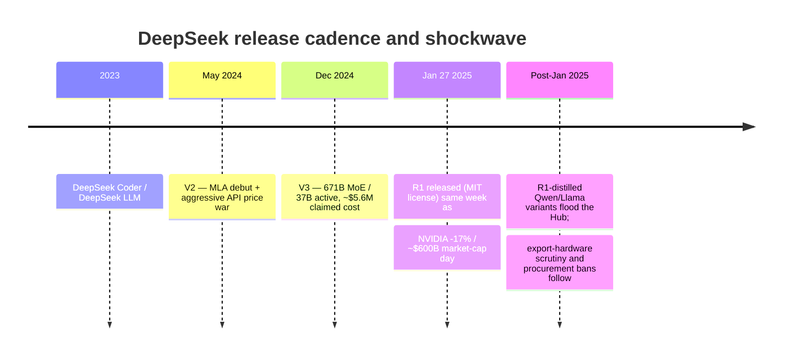

> DeepSeek is a Chinese AI lab spun out of High-Flyer, a quantitative hedge fund, and founded by Liang Wenfeng. Its December 2024-January 2025 release run, V3 and then R1, combined near-frontier capability, a detailed and unusually low claimed training cost, and a fully open MIT license. That combination did more damage to the "compute moat" narrative in one week than any earlier open-weights release. Date-stamped as of 2026; the shockwave and its aftershocks are still settling.

## The headline numbers

- **Origin:** spun out of High-Flyer, a Chinese quantitative hedge fund; founder Liang Wenfeng. The lab entered the frontier race with a GPU stockpile built before export controls tightened, on the order of **~10,000 A100s** per public claims, bought while that hardware was still exportable.
- **V3** (Dec 2024): 671B total parameters, a [[Concept - Mixture of Experts Architecture]] with only **37B active per token**. Trained on 2,048 H800 GPUs, ~2.79M GPU-hours, with a claimed **~$5.6M final-run cost**.
- **R1** (Jan 2025): open reasoning model released under the **MIT license**, with o1-class reasoning performance at open weights.
- **The market shock:** on January 27, 2025, NVIDIA fell **~17% in a single day**, erasing roughly **$600B in market cap**, the largest single-day market-cap loss for any company in US stock market history. The DeepSeek app hit **#1 on the US App Store** at the same time.

## How it actually works

The mechanisms behind V3 and R1 belong to their owning domains: [[Concept - Multi-Head Attention Variants (MHA MQA GQA MLA)]] (MLA) attention, MoE routing, [[Concept - GRPO and RL with Verifiable Rewards]] (GRPO), and [[Concept - Mixed Precision Training]] (FP8 training). This note covers what DeepSeek *did as an organization* and why it moved the market. The mechanism that matters here is the release cadence and disclosure strategy:

Each release added pressure on the same thesis. DeepSeek Coder/LLM (2023) established the lab as a serious open-weights player. V2 (May 2024) introduced MLA alongside an API price war that undercut incumbent token pricing. V3 (Dec 2024) delivered a 671B-parameter MoE model at a training cost an order of magnitude below what the market assumed frontier-class training needed. R1 (Jan 2025) did the same for reasoning-model training, open-sourcing o1-class capability under a license with essentially no restrictions. The market wasn't reacting to one release. In the week R1 landed, it reacted to the pattern: a non-incumbent lab kept beating the cost curve the market had assumed.

## The clever parts

1. **Efficiency as strategy under a hardware constraint.** Training on export-throttled H800 GPUs (the China-specific, performance-capped variant of the H800/H100 line) made algorithmic efficiency mandatory. MLA shrinks the KV-cache footprint per token, and FP8 mixed-precision training cuts memory and compute per step. The "constraint bred efficiency" story is more than PR: a GPU-constrained lab has a built-in reason to optimize FLOPs per unit of capability, which a GPU-rich lab can put off.
2. **Cost disclosure as marketing.** Publishing a specific, defensible-looking $5.6M final-run figure, where incumbents stay silent, was a deliberate transparency play. It signals confidence and leaves every frontier lab that never disclosed a training cost two options: match the disclosure or look evasive.
3. **The V2 price war as a market-entry wedge.** Pricing API tokens far below OpenAI's and Anthropic's rates in May 2024 sped up industry-wide token-price deflation and forced incumbents into reactive repricing. It bought DeepSeek attention and adoption that capability alone couldn't have.
4. **Open-sourcing R1 under MIT at the reasoning frontier.** No other lab had released an o1-class reasoning model with essentially no usage restrictions. It set off a distillation wave: R1-distilled Qwen and Llama variants appeared across the Hub within days, so DeepSeek's reasoning-training recipe spread into the open ecosystem faster than any earlier open release had.
5. **Detailed technical papers as a challenger's marketing lever.** Incumbent labs increasingly withhold architecture and training detail in their technical reports (see [[Concept - The Preprint and Social-Media Research Culture]]). DeepSeek's V3 and R1 papers disclose architecture, training recipe and RL objective in real detail. That transparency is cheap for a challenger and costly for an incumbent to match, and DeepSeek used the asymmetry on purpose.

## What it got wrong / what's dated

The **cost-claim controversy** is real and unresolved. The ~$5.6M figure covers only the final training run's GPU-hours. It explicitly excludes earlier research iterations, failed experiments, and the capex of the GPU stockpile itself. Critics reasonably called the headline figure misleading when read as "total cost to build V3," even though the final-run GPU-hour number is plausible and consistent with the disclosed cluster size.

The **geopolitical fallout** was a cost DeepSeek didn't fully anticipate. Training on export-throttled H800s drew US government and procurement scrutiny, and bans followed in some government-adjacent and regulated contexts. The weights can be excellent and still be a compliance non-starter for some buyers (see [[Decision - Which Model Ecosystem to Bet On]] on geopolitical risk as a gating criterion).

The market's one-day verdict that "the compute moat is dead" was probably overstated. Later frontier training runs across the industry kept showing real returns to scale. DeepSeek showed that a hardware-constrained, algorithmically sharp team can find efficiency gains at the margin. It didn't show that raw compute stopped mattering, and the correct update was narrower than the panic suggested.

## What to steal

- Publish detailed technical papers as a challenger's marketing strategy. Disclosure is a credible, hard-to-fake signal because it's costly for the incumbent to match.
- Use an aggressive price war as a market-entry wedge only when you hold a real, defensible cost advantage, never as a loss-leader bluff.
- Treat training efficiency (FLOPs per unit of capability, not the compute budget) as the moat-buster against capital-rich incumbents. A hardware constraint, engineered around well, can become a competitive edge instead of a handicap you absorb.

## Connections
- [[Reference - The AI Lab Landscape]] — situates DeepSeek among the Chinese-lab cohort (Qwen, GLM, Kimi) increasingly setting the open-weights frontier.
- [[Reference - Model Genealogy]] — DeepSeek's V1→V2 (MLA)→V3→R1 lineage is one of the major open-model family trees this note's release cadence maps onto.
- [[Concept - The Open vs Closed Model Divide]] — DeepSeek is the sharpest recent data point in the closing-capability-gap argument that concept makes.
- [[Reference - The AI Hardware Market]] — the H800/export-control backdrop that shaped DeepSeek's training-hardware constraints and the geopolitics that followed.
- [[Concept - Mixture of Experts Architecture]] — the MoE mechanism (671B total / 37B active) underlying V3, owned by domain 03 rather than re-derived here.
- [[Concept - GRPO and RL with Verifiable Rewards]] — the reinforcement-learning objective behind R1's reasoning training, owned by domain 06.
- [[Concept - Mixed Precision Training]] — the FP8 training approach that helped V3's cost efficiency, owned by domain 04.
- [[Concept - Multi-Head Attention Variants (MHA MQA GQA MLA)]] — MLA's role in shrinking KV-cache cost, the attention-variant mechanism behind V2 onward.
- [[Breakdown - DeepSeek-V3 Architecture]] — the deep architectural reverse-engineering of V3 that this org-level breakdown deliberately does not duplicate.
- [[Breakdown - DeepSeek-R1]] — the reasoning-training mechanism breakdown that this note points to rather than re-derives.

## Sources
- DeepSeek-AI (2024) — "DeepSeek-V3 Technical Report." Discloses architecture, training recipe, and the ~2.79M GPU-hour / ~$5.6M final-run cost figure.
- DeepSeek-AI (2025) — "DeepSeek-R1: Incentivizing Reasoning Capability in LLMs via Reinforcement Learning." The R1 paper documenting the GRPO-based reasoning training.
- Widely reported market data (Jan 27, 2025) — NVIDIA's single-day ~17% decline and ~$600B market-cap loss, contemporaneously reported across financial press.
