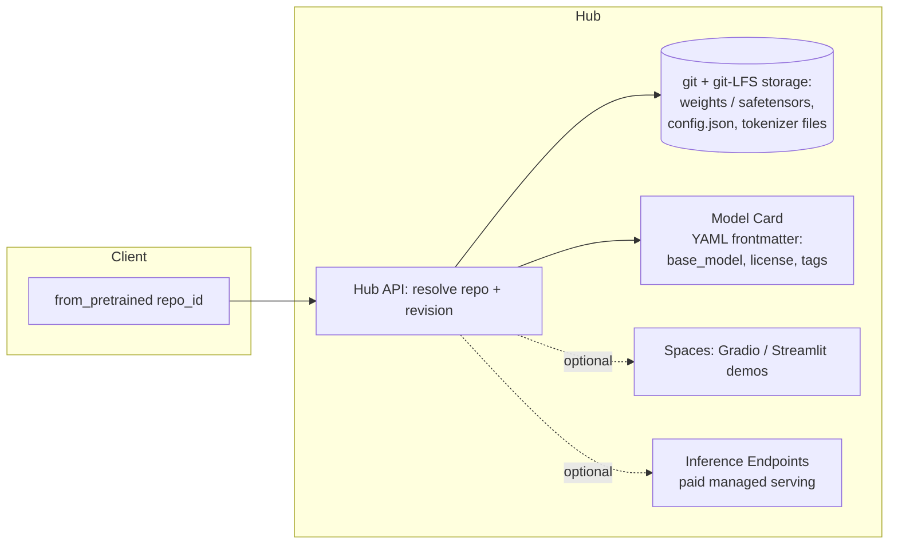

> Hugging Face started in 2016 as a chatbot app for teenagers in New York (Clément Delangue, Julien Chaumond, Thomas Wolf). The pivot that made it infrastructure was the `transformers` library (2018-19), an open-source wrapper that gave BERT, GPT-2 and every architecture since a shared loading API. By 2026 the Hub is the closest thing the field has to a universal registry. Open labs, closed labs and hobbyists all publish through it, and `from_pretrained(...)` is more of a lingua franca than any single company's product name has a right to be.

## The headline numbers

- Origin: 2016 chatbot startup. The `transformers` library (2018-19) was the inflection point that turned a consumer app company into ML infrastructure.
- The Hub hosts **1M+ models** (as of 2026), plus datasets and Spaces (Gradio/Streamlit demo apps), all versioned with git + git-LFS and using model-card YAML frontmatter as the metadata standard.
- Core library stack: `transformers`, `datasets`, `tokenizers` (Rust-backed for speed), `accelerate`, `PEFT`, `TRL`, `diffusers`. `from_pretrained` is the field's de facto default entry point for loading a model.
- Business: **~$4.5B valuation** at its 2023 Series D. Monetization is open-core: free public hosting plus paid Enterprise Hub and Inference Endpoints.

## How it actually works

The Hub is GitHub for model weights. Every repo is a git repository, large binary tensors are tracked with git-LFS (or the safetensors-native equivalent), and the repo's `README.md` frontmatter (the model card) is a YAML schema (license, tags, `base_model`, eval results) that both the site and the libraries parse. `transformers.AutoModel.from_pretrained("org/repo")` turns a repo id into a Hub API call, downloads the config, tokenizer and weight shards, and instantiates the right architecture class from the `architectures` field in `config.json`. The caller never needs to know which of the hundreds of supported model classes it is.

Spaces let anyone attach a live demo (Gradio/Streamlit) to a model or dataset repo, which made the Hub a discovery surface as well as storage: you can try a model in the browser before downloading a byte. Inference Endpoints is the paid managed-serving product built on the same repo format, the monetization layer sitting right on top of the free distribution layer.

## The clever parts

1. **One `AutoModel`/`AutoTokenizer`/config triad over divergent research code.** Before `transformers`, every paper shipped its own bespoke codebase: a different repo shape, tokenizer format and checkpoint convention each time. Putting BERT, GPT-2 and everything since behind one `from_pretrained` call with a shared config/tokenizer/model interface turned "try five architectures on my data" from a week of porting into a one-line change. It's why `transformers` became the reference implementation labs target, even before their own code is public.
2. **Safetensors as a real security fix.** PyTorch's default `.bin`/pickle checkpoint format uses Python's `pickle`, whose `__reduce__` protocol lets a deserialized object run arbitrary code on load. A checkpoint file can, mechanically, execute anything the moment you call `torch.load()`. Safetensors replaces that with a flat header (tensor names, shapes, dtypes, byte offsets) followed by raw tensor bytes: memory-mappable, with nothing executable in it. The worst a malicious safetensors file can do is hand you wrong numbers. Hugging Face pushed the format field-wide because open uploads make the Hub a supply-chain attack surface (see the Checklist entry on pickle RCE below).
3. **`base_model` as a lineage fingerprint.** One field added to the model-card schema, `base_model: org/parent-model` plus `base_model_relation` (finetune/merge/adapter/quantized), turned an opaque Hub of a million repos into a graph tooling can walk (see [[Snippet - Tracing Model Lineage via Hugging Face Metadata]]). Cheap to add, disproportionately valuable downstream.
4. **Neutrality is the business moat.** Hugging Face hosts Meta's Llama, Mistral's releases, Alibaba's Qwen and Google's Gemma side by side and competes with none of them at the model layer. No frontier lab has to worry that hosting on the Hub hands infrastructure leverage to a rival model-builder, so every lab, closed or open, still publishes model cards there and, for open releases, weights. If Hugging Face started competing seriously at the model layer, that neutrality and the distribution advantage built on it would erode.
5. **Open-core monetization on top of a free distribution good.** Public hosting, the libraries and the Hub API are free and drive adoption. Enterprise Hub (private repos, access control, SSO) and Inference Endpoints (managed, paid serving) charge the organizations that already depend on the free layer. It's the classic infrastructure-company playbook, run on top of a real public good.

## What it got wrong / what's dated

The **Open LLM Leaderboard** is the clearest cautionary case. A standardized public leaderboard was the shared benchmark the ecosystem needed, and it got Goodharted within a couple of years. Models were increasingly fine-tuned to the leaderboard's public test sets, and [[Concept - Benchmark Contamination]] eroded the signal until Hugging Face had to overhaul the original version substantially and eventually archive/retire it. Well-meant shared infrastructure became a target as soon as it had enough traffic to be worth gaming.

The Hub is also a **single point of dependence** for a huge share of the field's tooling. `from_pretrained` calls the Hub by default, so an outage, a gated or removed model, or a network partition breaks CI pipelines and production inference across thousands of downstream projects that never designed around the dependency. Open uploads are a real attack surface too. Provenance verification (publisher authenticity, checksums, revision pinning), malware scanning, and typosquatted repo names (one edit away from a popular model's name) are ongoing operational problems, not solved ones.

Business-model tension is emerging as well. As Enterprise Hub and Inference Endpoints integrate more deeply with specific clouds (AWS, Azure, GCP), the "neutral Switzerland of AI" position that forms the moat comes under quiet pressure. Monetizing infrastructure while staying neutral to the labs building on it gets harder to balance as the company scales.

## What to steal

- The `base_model` metadata field: a near-zero-cost schema addition that enables lineage archaeology at ecosystem scale. Copy it into any internal model registry.
- Neutrality as strategy: an aggregation layer that refuses to compete with its own participants earns outsized trust and default-choice status. Don't compete with the ecosystem you want to be the substrate for.
- Default to a code-free serialization format (safetensors or equivalent) for any checkpoint that crosses a trust boundary. Never load pickle-format weights from an untrusted source in a production path.

## Connections
- [[Reference - Model Genealogy]] — the Hub's `base_model` metadata is the raw material that makes model family trees traceable at scale.
- [[Snippet - Tracing Model Lineage via Hugging Face Metadata]] — the concrete code that walks the metadata convention described here to reconstruct lineage.
- [[Reference - The AI Lab Landscape]] — every lab profiled there, open or closed, distributes through the Hub described in this note.
- [[Checklist - Vetting an Open-Weights Model for Production]] — the provenance/safetensors/pickle-RCE checks in that checklist are the operational counterpart to the security intervention described here.
- [[Concept - Benchmark Contamination]] — the mechanism behind the Open LLM Leaderboard's contamination/retirement saga.
- [[Deep Dive - LoRA]] and [[Concept - QLoRA]] — the PEFT library that makes these techniques a one-line `from_pretrained`-style call is part of the same library glue this note covers.
- [[Breakdown - vLLM]] — a serving engine that, like Inference Endpoints, sits downstream of the Hub's distribution layer and consumes its model-card/config conventions directly.
- [[Concept - The Open vs Closed Model Divide]] — the Hub's neutral-hosting role is what makes it the shared battleground where the open-vs-closed strategy actually plays out.
- [[Reference - Where Real AI Knowledge Lives]] — names the Hugging Face engineering blog specifically as a high-signal source, one layer up from the platform mechanics covered here.

## Sources
- Wolf, T. et al. (2020) — "Transformers: State-of-the-Art Natural Language Processing." EMNLP System Demonstrations. The paper documenting the library's unifying `AutoModel` design.
- Hugging Face company announcements (2023) — Series D funding round, ~$4.5B valuation, publicly reported at the time.
