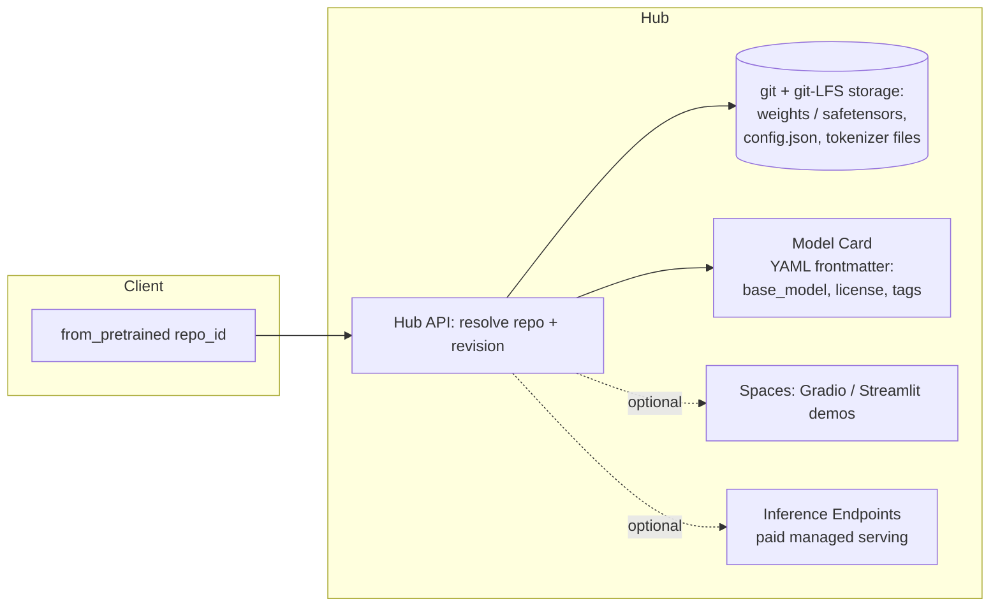

> Hugging Face started in 2016 as a teenager-facing chatbot app in New York (Clément Delangue, Julien Chaumond, Thomas Wolf). The pivot that made it infrastructure was the `transformers` library (2018-19), an open-source wrapper that gave BERT, GPT-2, and every architecture since a shared loading API. By 2026 the Hub is the closest thing the field has to a universal registry: open labs, closed labs, and hobbyists all publish through it, and `from_pretrained(...)` is closer to a lingua franca than any single company's product name should be.

## The headline numbers

- Origin: 2016 chatbot startup; the `transformers` library (2018-19) became the inflection point that turned a consumer app company into ML infrastructure.
- The Hub hosts **1M+ models** (as of 2026), plus datasets and Spaces (Gradio/Streamlit demo apps), all under git + git-LFS versioning with model-card YAML frontmatter as the metadata standard.
- Core library stack: `transformers`, `datasets`, `tokenizers` (Rust-backed for speed), `accelerate`, `PEFT`, `TRL`, `diffusers` — `from_pretrained` is the field's de facto default entry point for loading a model.
- Business: **~$4.5B valuation** at its 2023 Series D; monetization is open-core — free public hosting plus paid Enterprise Hub and Inference Endpoints.

## How it actually works

The Hub is, structurally, GitHub for model weights: every repo is a git repository, large binary tensors are tracked via git-LFS (or the safetensors-native equivalent), and the repo's `README.md` frontmatter (the model card) is a YAML schema — license, tags, `base_model`, eval results — that the site and the libraries both parse. `transformers.AutoModel.from_pretrained("org/repo")` resolves a repo id to a Hub API call, downloads the config, tokenizer, and weight shards, and instantiates the right architecture class from the `config.json`'s `architectures` field, without the caller needing to know which of the hundreds of supported model classes it is.

Spaces let anyone attach a live demo (Gradio/Streamlit) to a model or dataset repo, which turned the Hub into a discovery surface as much as a storage layer — you can try a model in-browser before downloading a single byte. Inference Endpoints is the paid managed-serving product built on the same repo format, the monetization layer sitting directly on top of the free distribution layer.

## The clever parts

1. **The `AutoModel`/`AutoTokenizer`/config triad unifying divergent research code.** Before `transformers`, every lab's release was its own bespoke codebase (a different repo shape, a different tokenizer format, a different checkpoint convention) for every paper. Wrapping BERT, GPT-2, and everything since behind one `from_pretrained` call with a shared config/tokenizer/model interface is the single decision that made "try five different architectures on my data" a one-line change instead of a week of porting work. It is the reason `transformers` became the reference implementation labs target even before their own code is public.
2. **Safetensors as a genuine security intervention, not a marketing format.** PyTorch's default `.bin`/pickle checkpoint format uses Python's `pickle`, whose `__reduce__` protocol lets a deserialized object execute arbitrary code on load — a checkpoint file is, mechanically, capable of running anything the moment you call `torch.load()`. Safetensors replaces this with a flat header (tensor names, shapes, dtypes, byte offsets) followed by raw tensor bytes, memory-mappable and containing no executable component: loading a malicious safetensors file can at worst hand you wrong numbers, never code execution. Hugging Face pushed this format field-wide specifically because the Hub's open-upload model makes it a supply-chain attack surface (see the Checklist entry on pickle RCE below).
3. **The `base_model` metadata convention as a lineage fingerprint.** A one-field addition to the model-card schema — `base_model: org/parent-model` plus `base_model_relation` (finetune/merge/adapter/quantized) — turned an otherwise-opaque Hub of a million repos into a graph that tooling can walk (see [[Snippet - Tracing Model Lineage via Hugging Face Metadata]]). Cheap to add, disproportionately valuable downstream.
4. **Neutrality as the actual business moat.** Hugging Face hosts Meta's Llama, Mistral's releases, Alibaba's Qwen, and Google's Gemma side by side, competing with none of them at the model layer. No frontier lab has to worry that hosting on the Hub hands infrastructure leverage to a rival model-builder, which is precisely why every lab — closed or open — still publishes model cards and, for open releases, weights there. The moment Hugging Face tried to compete seriously at the model layer, this neutrality (and the distribution advantage built on it) would erode.
5. **Open-core monetization layered on a free distribution good.** Public hosting, the libraries, and the Hub API are free and drive adoption; Enterprise Hub (private repos, access control, SSO) and Inference Endpoints (managed, paid serving) monetize the organizations that already depend on the free layer — a classic infrastructure-company playbook, executed on top of a genuinely public good rather than instead of one.

## What it got wrong / what's dated

The **Open LLM Leaderboard** is the clearest cautionary case: a standardized public leaderboard was exactly the kind of shared benchmark the ecosystem needed, and it got Goodharted within a couple of years — models increasingly fine-tuned specifically to the leaderboard's public test sets, contamination [[Concept - Benchmark Contamination]] eroding the signal until Hugging Face had to substantially overhaul and eventually archive/retire the original version. A well-intentioned piece of shared infrastructure became a target the moment it had enough traffic to be worth gaming.

The Hub is also a **single point of dependence** for a huge share of the field's tooling: `from_pretrained` phones home to the Hub by default, so a Hub outage, a gated/removed model, or a network partition breaks CI pipelines and production inference paths across thousands of downstream projects that never architected around that dependency. The open-upload model is also a real attack surface — provenance verification (publisher authenticity, checksums, revision pinning), malware scanning, and typosquatted repo names (uploads one edit-distance from a popular model's name) are ongoing operational concerns rather than solved problems.

Business-model tension is emerging too: as Enterprise Hub and Inference Endpoints deepen integrations with specific clouds (AWS, Azure, GCP), the "neutral Switzerland of AI" positioning that is the actual moat comes under quiet pressure — monetizing infrastructure while staying neutral to the labs building on top of it is a harder balance to hold as the company scales.

## What to steal

- The `base_model` metadata field: a near-zero-cost schema addition that unlocks lineage archaeology at ecosystem scale — worth copying in any internal model registry.
- Neutrality-as-strategy: an aggregation layer that refuses to compete with its own participants earns disproportionate trust and default-choice status; don't compete with the ecosystem you're trying to be the substrate for.
- Default to a code-free serialization format (safetensors or equivalent) for any checkpoint that crosses a trust boundary — never load pickle-format weights from an untrusted source in a production path.

## Connections
- [[Reference - Model Genealogy]] — the Hub's `base_model` metadata is the raw material that makes model family trees traceable at scale.
- [[Snippet - Tracing Model Lineage via Hugging Face Metadata]] — the concrete code that walks the metadata convention described here to reconstruct lineage.
- [[Reference - The AI Lab Landscape]] — every lab profiled there, open or closed, distributes through the Hub described in this note.
- [[Checklist - Vetting an Open-Weights Model for Production]] — the provenance/safetensors/pickle-RCE checks in that checklist are the operational counterpart to the security intervention described here.
- [[Concept - Benchmark Contamination]] — the mechanism behind the Open LLM Leaderboard's contamination/retirement saga.
- [[Deep Dive - LoRA]] and [[Concept - QLoRA]] — the PEFT library that makes these techniques a one-line `from_pretrained`-style call is part of the same library glue this note covers.
- [[Breakdown - vLLM]] — a serving engine that, like Inference Endpoints, sits downstream of the Hub's distribution layer and consumes its model-card/config conventions directly.
- [[Concept - The Open vs Closed Model Divide]] — the Hub's neutral-hosting role is what makes it the shared battleground where the open-vs-closed strategy actually plays out.
- [[Reference - Where Real AI Knowledge Lives]] — names the Hugging Face engineering blog specifically as a high-signal source, one layer up from the platform mechanics covered here.

## Sources
- Wolf, T. et al. (2020) — "Transformers: State-of-the-Art Natural Language Processing." EMNLP System Demonstrations. The paper documenting the library's unifying `AutoModel` design.
- Hugging Face company announcements (2023) — Series D funding round, ~$4.5B valuation, publicly reported at the time.
