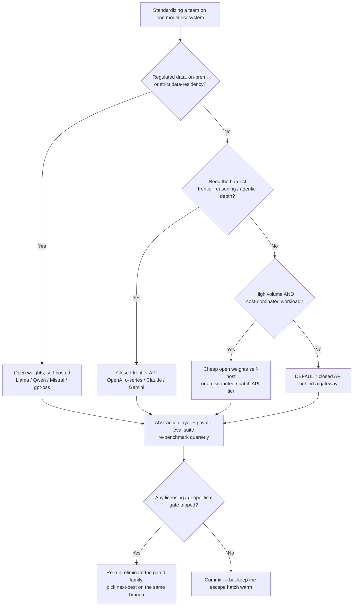

# Decision - Which Model Ecosystem to Bet On

> You're picking a **counterparty and a migration cost**, more than a model. Default for the 80% case: build against a **closed frontier API behind a provider-agnostic gateway**, keep a private eval suite, and re-shop quarterly, because the "best model" changes and inference prices fall roughly 10x/year. Leave the default only when a hard constraint (regulated data, extreme volume, a specific licensing or geopolitical gate) forces you off it.

Teams treat this as a capability question ("which model scores highest?"). It's a **strategy question** about what you can afford to be wrong about. The axes that matter: **open-weights self-host vs closed API**, **frontier capability vs cost vs control/privacy**, and **single vendor vs abstraction layer** ([LiteLLM](https://) / OpenRouter). Capability decays fastest, which makes it the *worst* axis to build a two-year commitment around.

## Decision flow

One thing in the flow is non-negotiable: whichever branch you land on, you land **behind an abstraction layer**. The branch is the *primary* bet, and the gateway is the *hedge* that makes it reversible. [[Decision - Fine-Tuning vs RAG vs Prompting]] comes after this one. Decide the ecosystem first, because a fine-tune welds you to a base model in a way a RAG index never does.

## Tradeoff matrix

Ballpark figures *(as of 2026; volatile. [[Concept - Cost Engineering for LLM Applications]] has the real per-workload math)*:

| Criterion | Closed frontier API | Open-weights major (self-host) | Chinese open weights | Abstraction layer over N providers |
|---|---|---|---|---|
| Frontier capability | Highest, day-one | 0–6 mo behind (weeks for reasoning since R1) | At/near frontier for reasoning | Whatever the underlying pick is |
| $ / 1M output tokens | ~$1–15 (flagship high) | <$0.50 amortized at high GPU utilization | Cheapest API tier + free weights | Inherited; gateway adds ~0 marginal |
| Control / privacy | Low (data leaves your VPC) | Highest (weights on your metal) | Highest if self-hosted | Depends on route |
| Lock-in surface | High (prompts, tools, tokenizer) | Medium (bound to base for fine-tunes) | Medium | **Lowest by design** |
| Licensing risk | ToS, output-usage clauses | Llama MAU cap, AUP, naming | MIT/Apache mostly clean | Aggregate of all routes |
| Counterparty / longevity | Deprecation churn | You own the weights forever | Procurement/ban risk | Diversified |
| Geopolitical / compliance | US-centric | Regional options | **High** (residency optics, bans) | Route around gated origins |

Two numbers anchor the table. One is **inference price deflation of ~10x/year**, the trend that makes any capability lead temporary and any long lock-in a liability. The other is **DeepSeek-V3's ~$5.6M final-run figure** and the ~17% (~$600B) single-day NVIDIA drop on 27 Jan 2025, the market recognizing that efficiency now sets the open-weights frontier as much as scale does (see [[Breakdown - DeepSeek]]). Both point the same way: **don't overpay for a capability moat that erodes in months.**

For the players behind each column (funding, posture, who's likely to still exist in 18 months), read [[Reference - The AI Lab Landscape]]. For the exact grants and restrictions per license, read [[Reference - Open Weights Licensing]]. Why labs offer this choice at all (commoditize-your-complement, the distillation asymmetry) is in [[Concept - The Open vs Closed Model Divide]].

## The details that flip the decision

**Lock-in vectors people underestimate.** The switching cost is rarely the weights. It's everything welded to one model's quirks: prompts and few-shot exemplars tuned to its idiosyncrasies, fine-tunes bound to one base checkpoint, **differing tokenizers and chat templates** (a Llama chat template silently corrupts on a Qwen model), and **incompatible function-calling schemas** (OpenAI tool JSON ≠ Anthropic tool blocks ≠ open-model ad-hoc formats). A team that hand-tunes 40 prompts to GPT-4o's temperament has built a moat *around its own ankles*. That's the whole argument for an abstraction layer, and why [[Decision - Self-Hosting vs Managed LLM API]] should be answered with portability in mind as well as $/token.

**Counterparty and longevity risk is the one nobody prices.** Will the lab, and the *specific model*, still exist and still be served when your product depends on it? Stability AI's near-collapse in 2024, Inflection's talent being reverse-acqui-hired into Microsoft, and aggressive deprecation timelines (a "GA" model sunset on 6 months' notice) are all live failure modes. **Read the deprecation policy before you commit**, not after the sunset email. Open weights invert the risk. Once you hold the `.safetensors`, no vendor can deprecate them out from under you; you trade counterparty risk for ops burden.

**Licensing is a gate, not a footnote.** The Llama Community License's **>700M-MAU clause** is there to deny the largest competitors the grant. If your product could plausibly cross that line, the license is a time bomb. Output-usage clauses (can you train other models on the outputs?), field-of-use bans in the acceptable-use policy, and geographic limits can each disqualify an otherwise perfect model. It's the first hard filter in the flow, which is why [[Checklist - Vetting an Open-Weights Model for Production]] starts with license verification.

**Geopolitics turns excellent models into a no-go.** DeepSeek and Qwen are at the open frontier, yet **data-residency optics, government procurement bans and government-use restrictions** rule them out in regulated sectors *even when the weights are the best available*. Open weights don't make the origin acceptable to your compliance officer. Going the other way, sovereign/regional models (Mistral in the EU, Falcon in the UAE) exist to be the acceptable choice where US-origin closed APIs are politically or legally awkward.

**The capability-trajectory bet is the subtle one.** You're betting on a *family's improvement rate* and on the migration cost when a better model shows up elsewhere, not on today's benchmark. A strictly better model *will* appear on a competitor's branch within a year, so the rational move is to minimize migration cost, which brings you back to the abstraction layer. **The hedge is the answer:** build provider-agnostic, keep a private eval suite as the ground truth for "did the swap help," and re-benchmark quarterly. The winning teams weren't the ones who picked the right model in 2025. They're the ones who could swap it in an afternoon in 2026.

## Connections

- [[Reference - Open Weights Licensing]] — the license is the first hard gate in the flow; MAU caps and output clauses disqualify models before capability even matters.
- [[Concept - The Open vs Closed Model Divide]] — the strategic *why* behind the open/closed axis (commoditize-complements, distillation asymmetry) that shapes every column of the matrix.
- [[Reference - The AI Lab Landscape]] — the counterparty-longevity axis is a bet on *organizations*; this maps their funding, posture, and churn.
- [[Decision - Fine-Tuning vs RAG vs Prompting]] — the downstream adaptation choice; a fine-tune welds you to one base and raises the ecosystem-switching cost.
- [[Concept - Cost Engineering for LLM Applications]] — turns the matrix's ballpark $/token into real per-workload economics, the axis that deflates ~10x/year.
- [[Checklist - Vetting an Open-Weights Model for Production]] — the operational go/no-go once you've chosen the open-weights branch.
- [[Breakdown - DeepSeek]] — the concrete case that proved efficiency can break the compute-moat thesis and narrow the open-vs-frontier gap to weeks.
- [[Decision - Self-Hosting vs Managed LLM API]] — the serving-side sibling decision; portability and $/token trade off here once the ecosystem is chosen.

## Sources
- Spolsky, J. (2002) — *Strategy Letter V* ("commoditize your complement"). The framing for why an incumbent rationally open-sources a rival's moat.
- DeepSeek-AI (2025) — *DeepSeek-R1*. The open reasoning release that compressed the open-vs-frontier capability gap and reset the cost narrative.
- Meta (2024) — *Llama 3 / Llama Community License*. Source for the 700M-MAU clause and acceptable-use constraints that gate commercial adoption.
- Epoch AI / a16z compute-cost analyses (2024–2025) — the ~10x/year token-price-deflation trend (analyst estimate; directional, not audited).
