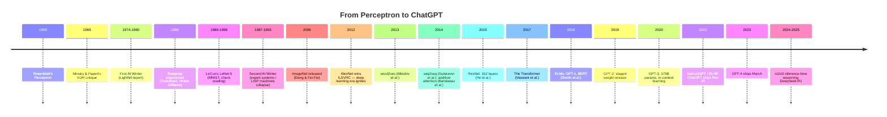

# Deep Dive - From Perceptron to ChatGPT

> **One-paragraph hook:** The history of AI is not a story of steadily accumulating cleverness. It is a story of three ingredients — data, compute, and a workable algorithm — periodically clicking into alignment, punctuated by decade-long winters spent paying for the previous cycle's overpromising. An engineer who understands the *mechanism* of these phase transitions, not just the dates, can read the current cycle (reasoning models, agents, whatever comes next) with the right mix of skepticism and urgency instead of either dismissing it as hype or treating it as inevitable.

## The mechanism

Every AI "spring" in this history follows the same shape: an algorithmic idea that already existed, combined with a resource (data or compute) that only just became abundant enough to make it work at a scale that mattered. Every "winter" follows the mirror image: a gap opens between what was promised and what shipped, funders notice, and money evaporates faster than the underlying research quality declined.

The first winter is the clean case study. Frank Rosenblatt's [[Concept - The Multilayer Perceptron|Perceptron]] (Rosenblatt, 1958) was oversold — press coverage at the time implied a machine that could soon walk, talk, and reproduce itself. Marvin Minsky and Seymour Papert's *Perceptrons* (1969) proved that a single-layer perceptron cannot compute XOR — it can't represent non-linearly-separable functions — and the field read this as a much broader indictment than the math actually supported (multi-layer networks don't have this limitation, but nobody had a good way to train them yet). Combined with the UK government's 1973 Lighthill report, which concluded AI had failed to deliver on its promises and recommended cutting funding, this produced the first AI winter, roughly 1974–1980.

The second winter followed the same pattern one layer up the stack. Backpropagation was popularized by Rumelhart, Hinton, and Williams in 1986, and Yann LeCun's LeNet-5 (1989, refined through 1998) proved multi-layer convolutional networks could read handwritten digits and, eventually, bank checks. But the commercial AI wave of the mid-1980s was built on symbolic expert systems and dedicated LISP-machine hardware, not connectionist networks — and when the expert-system market collapsed and general-purpose workstations undercut LISP machines on price/performance, the resulting crash (roughly 1987–1993) took "AI" as a funding category down with it, even though neural-net research itself kept quietly progressing in the background.

## Architecture / walkthrough

Walking the timeline in substance, not just dates:

**The convergence of 2012.** Three things arrived independently and stacked: large labeled datasets — ImageNet (Deng and Fei-Fei, 2009) gave the field 14M labeled images, several orders of magnitude beyond prior benchmarks; commodity GPU compute — gaming GPUs turned out to be well-suited to the dense matrix multiplies neural nets need; and deep [[Concept - Convolutional Neural Networks|convolutional networks]] that were already understood in principle since LeCun's work. AlexNet (Krizhevsky, Sutskever, Hinton, 2012) combined all three and cut ImageNet top-5 error from ~26% to ~15%, a margin so large the competition's other entrants — mostly hand-engineered feature pipelines — never recovered. This is the ignition point the field treats as the start of the modern deep learning era.

**The CV interregnum (2012–2015).** VGG pushed depth with small filters; GoogLeNet introduced inception modules for compute efficiency; [[Concept - Residual Connections|ResNet]] (He et al., 2015) solved the degradation problem — deeper plain networks trained *worse*, not just overfit more — by adding identity shortcut connections, reaching 152 layers where prior architectures topped out around 20–30. Residual connections turned out to matter far beyond vision; they are now load-bearing in every modern transformer.

**The NLP arc (2013–2017).** word2vec (Mikolov et al., 2013) showed that a shallow prediction task over raw text yields linear, arithmetic-like structure in word [[Concept - Embeddings as Learned Representations|embeddings]] ("king − man + woman ≈ queen"). Sutskever et al.'s sequence-to-sequence framework (2014) showed [[Concept - Recurrent Networks and the LSTM|recurrent networks]] could map an input sequence to an output sequence of different length — the basis of neural machine translation. Bahdanau et al. (2014) added additive [[Concept - Attention Mechanism|attention]] so the decoder could look back at relevant encoder states instead of compressing the whole source sentence into one fixed vector. Vaswani et al.'s "Attention Is All You Need" (NeurIPS 2017, see [[Lore - The Attention Is All You Need Origin Story]]) then discarded the recurrence entirely, keeping only attention plus feed-forward layers — the [[Deep Dive - The Transformer|Transformer]] — because it parallelizes across the sequence dimension in a way RNNs structurally cannot.

**The pretraining era (2018–2020).** ELMo, GPT-1, and BERT (Devlin et al., 2018) established that a model pretrained on raw text with a generic objective, then lightly adapted, beat task-specific architectures trained from scratch. GPT-2 (2019) was notable less for its architecture than for OpenAI's staged release — withholding the full 1.5B-parameter weights for months, citing misuse risk, the first time a lab publicly treated a language model's release as a safety decision rather than a pure publication. GPT-3 (Brown et al., 2020, 175B parameters) was the real surprise: without any gradient update, feeding a handful of examples in the prompt (in-context learning) let the model perform new tasks, a capability nobody had explicitly trained for and that [[Concept - Scaling Laws|scaling laws]] work had not fully predicted.

**The alignment turn (2022–2023).** Raw pretrained GPT-3 was fluent but not useful as an assistant — it would complete a question with more questions, or refuse nothing. InstructGPT (Ouyang et al., 2022) applied supervised fine-tuning followed by [[Deep Dive - RLHF End to End|RLHF]] to align the model's outputs with what a human rater actually wanted, and ChatGPT (November 30, 2022) packaged that into a free chat product that reached an estimated 100 million users within two months — at the time the fastest user growth of any consumer application in history. GPT-4 followed in March 2023, and the industry's center of gravity shifted from "can we pretrain a bigger model" to "can we make the model behave."

**The reasoning turn (2024–2025).** OpenAI's o1 and o3 introduced inference-time compute as a new scaling axis — spend more tokens *thinking* before answering, rather than only scaling parameters or pretraining tokens. DeepSeek-R1 (January 2025) reproduced o1-class reasoning performance at open weights under an MIT license, compressing what had historically been a 6–12 month open-vs-closed capability gap down to weeks (see [[Reference - Model Genealogy]] and [[Breakdown - DeepSeek-R1]]).

## Evolution

Each era didn't just add capability — it displaced the previous default approach. Rule-based symbolic systems gave way to connectionist networks once training became tractable; statistical NLP (n-gram language models, HMM taggers) gave way to neural sequence models once word embeddings and RNNs outperformed hand-built features; recurrent seq2seq-with-attention gave way to pure attention (the Transformer) once parallelizable training on GPUs made "sequential by construction" a liability rather than a simplification. Pretrain-then-fine-tune (BERT-style) gave way to pretrain-then-prompt (GPT-3-style) once scale made task-specific fine-tuning look wasteful for many use cases. Prompt-only interaction gave way to RLHF-aligned chat once labs realized raw completion was the wrong product surface for non-experts. And as of 2026, pure next-token chat is partially giving way to inference-time reasoning and [[Concept - What Is an LLM Agent|agentic]] tool use, on the bet that more test-time compute plus verifiable rewards substitutes for more pretraining compute. What replaces the reasoning turn is an open question — candidates include continual/online learning, richer verifiable-reward environments, and multi-agent search — but per the mechanism above, expect it to be an old idea meeting a newly abundant resource, not a clean-sheet invention.

## In practice

The pattern shows up in numbers you can check: AlexNet's ~11-point top-5 error drop in a single year (2012); ResNet's jump from ~20-layer to 152-layer networks becoming trainable overnight once identity shortcuts fixed the degradation problem (2015); GPT-3 at 175B parameters exhibiting few-shot behavior that smaller models in the same family did not (2020); ChatGPT's ~100M users in two months (Nov 2022–Jan 2023) as the clearest evidence that the alignment turn, not a new architecture, was what finally made these models broadly usable. None of these were driven by a single new algorithm invented in that year — attention existed three years before the Transformer paper, GPUs existed for a decade before AlexNet used them for training, backprop existed decades before the deep learning boom used it at scale.

## Failure modes

The AI winters are the field's literal failure mode, and they have a detectable signature: a widening gap between demo and deployed capability, promises pegged to a timeline the underlying research can't support, and — critically — a funding structure with no tolerance for the gap once it becomes visible. The 1969 Minsky-Papert critique and the 1973 Lighthill report are the textbook trigger events; watch for their modern analogues — a widely cited negative result plus a funding-body report — as the leading indicator that a correction is coming, not the eventual headline layoffs. A second-order failure mode is rebranding: after each winter, work continued under different names ("machine learning," "informatics," "expert systems" morphing into "knowledge engineering") specifically to escape the stigma the word "AI" had accumulated. If you see practitioners quietly renaming their field, that is itself a symptom worth reading.

## The non-obvious

The single most useful insight from this history is that no spring was caused by inventing a new algorithm from scratch. Attention (Bahdanau, 2014) predates the Transformer (2017) by three years; backprop (1980s) predates the deep learning boom (2012) by two and a half decades; GPUs were a mature gaming technology for a decade before AlexNet repurposed them. In every case, the unlock was recognizing that an existing, already-published idea could now be run at a scale it previously couldn't reach, because a resource constraint (labeled data, FLOPs, parallel hardware) had quietly disappeared. Practically, this means the highest-leverage question to ask about any current "stuck" problem in AI is not "what new architecture would solve this" but "what old, already-known idea is being blocked by a resource constraint that might be about to lift" — inference-time reasoning is exactly this pattern one more time (test-time compute is an old idea; making it economical at scale is the 2024 unlock).

## Connections
- [[Reference - Model Genealogy]] — the family-tree view of exactly which models descended from which era; this note gives the timeline, that note gives the pedigree.
- [[Reference - The AI Lab Landscape]] — who was building at each inflection point and why their strategic posture shaped what got released.
- [[Lore - The Attention Is All You Need Origin Story]] — the human story behind the single most consequential paper in this timeline.
- [[Deep Dive - The Transformer]] — the architecture mechanism this note deliberately treats as a black box; read there for how it actually works.
- [[Concept - Attention Mechanism]] — the mechanism Bahdanau introduced in 2014 and Vaswani et al. generalized into the sole primitive of the Transformer.
- [[Concept - Convolutional Neural Networks]] — the architecture family that carried the field from LeNet-5 through ResNet before attention displaced it in most domains.
- [[Concept - Recurrent Networks and the LSTM]] — the sequence-modeling default that seq2seq and attention were built on top of, and that the Transformer eventually replaced.
- [[Concept - Residual Connections]] — the mechanism that made networks past ~20 layers trainable at all, first proven at scale in ResNet.
- [[Concept - Scaling Laws]] — the quantitative relationship (data, compute, parameters, loss) that explains why "bigger" kept working across the pretraining era.
- [[Deep Dive - RLHF End to End]] — the mechanism behind the alignment turn that separates raw GPT-3 from shippable ChatGPT.
- [[Breakdown - DeepSeek-R1]] — the concrete system that defines the current reasoning-turn inflection point.
- [[Concept - In-Context Learning]] — the specific emergent behavior that made GPT-3 a surprise rather than just a bigger GPT-2.
- [[Concept - The Emergent Abilities Debate]] — the live argument over whether capabilities like in-context learning are truly discontinuous or a measurement artifact.
- [[Concept - Vision Transformers]] — where the Transformer architecture jumped back out of NLP into the vision domain it originally displaced CNNs from.
- [[Concept - The Multilayer Perceptron]] — the primitive Rosenblatt's original perceptron generalized into once multi-layer training became possible.
- [[Concept - Embeddings as Learned Representations]] — the representational idea word2vec first demonstrated at scale, now load-bearing in every modern model.
- [[Concept - What Is an LLM Agent]] — the product surface (tool use, planning) that the reasoning turn is being built to support.

## Sources
- Rosenblatt, F. (1958) — *The Perceptron: A Probabilistic Model for Information Storage and Organization in the Brain.* The original single-layer learning machine.
- Minsky, M. & Papert, S. (1969) — *Perceptrons.* Proved the linear-separability limitation that fed the first AI winter.
- Rumelhart, D., Hinton, G., & Williams, R. (1986) — *Learning representations by back-propagating errors.* Popularized backprop for multi-layer networks.
- LeCun, Y. et al. (1989, refined 1998) — LeNet-5, gradient-based learning applied to document/check recognition.
- Deng, J. & Fei-Fei, L. et al. (2009) — ImageNet, the large labeled dataset that made the 2012 convergence possible.
- Krizhevsky, A., Sutskever, I., & Hinton, G. (2012) — AlexNet, the ILSVRC-winning CNN that ignited the deep learning era.
- He, K. et al. (2015) — Deep Residual Learning for Image Recognition (ResNet).
- Mikolov, T. et al. (2013) — word2vec, efficient estimation of word representations.
- Sutskever, I., Vinyals, O., & Le, Q. (2014) — Sequence to Sequence Learning with Neural Networks.
- Bahdanau, D. et al. (2014) — Neural Machine Translation by Jointly Learning to Align and Translate (additive attention).
- Vaswani, A. et al. (2017) — Attention Is All You Need (the Transformer).
- Devlin, J. et al. (2018) — BERT: Pre-training of Deep Bidirectional Transformers for Language Understanding.
- Brown, T. et al. (2020) — Language Models are Few-Shot Learners (GPT-3).
- Ouyang, L. et al. (2022) — Training language models to follow instructions with human feedback (InstructGPT / RLHF).
