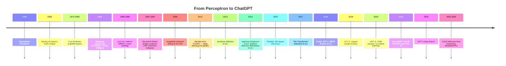

# Deep Dive - From Perceptron to ChatGPT

> **One-paragraph hook:** AI's history isn't cleverness piling up steadily. Three ingredients (data, compute and a workable algorithm) periodically click into alignment, and between those moments come decade-long winters spent paying for the last cycle's overpromising. An engineer who understands the *mechanism* of these phase transitions, and not only the dates, can read the current cycle (reasoning models, agents, whatever's next) with the right mix of skepticism and urgency, without dismissing it as hype or treating it as inevitable.

## The mechanism

Every AI "spring" here has the same shape. An algorithmic idea that already existed meets a resource (data or compute) that has only just become abundant enough to make it work at a scale that matters. Every "winter" is the mirror image: a gap opens between what was promised and what shipped, funders notice, and money disappears faster than research quality actually declined.

The first winter is the clean case. Frank Rosenblatt's [[Concept - The Multilayer Perceptron|Perceptron]] (Rosenblatt, 1958) was oversold; press coverage implied a machine that could soon walk, talk and reproduce itself. Marvin Minsky and Seymour Papert's *Perceptrons* (1969) proved a single-layer perceptron can't compute XOR, since it can't represent non-linearly-separable functions. The field read that as a far broader indictment than the math supported. Multi-layer networks don't have the limitation; nobody yet had a good way to train them. Add the UK government's 1973 Lighthill report, which concluded AI had failed to deliver and recommended cutting funding, and you get the first AI winter, roughly 1974–1980.

The second winter repeated the pattern one layer up the stack. Rumelhart, Hinton and Williams popularized backpropagation in 1986, and Yann LeCun's LeNet-5 (1989, refined through 1998) showed multi-layer convolutional networks could read handwritten digits and eventually bank checks. But the commercial AI wave of the mid-1980s ran on symbolic expert systems and dedicated LISP-machine hardware, with connectionist networks nowhere in it. When the expert-system market collapsed and general-purpose workstations beat LISP machines on price/performance, the crash (roughly 1987–1993) took "AI" down as a funding category, while neural-net research kept progressing quietly in the background.

## Architecture / walkthrough

The timeline in substance:

### The convergence of 2012
Three things arrived independently and stacked. Large labeled datasets: ImageNet (Deng and Fei-Fei, 2009) gave the field 14M labeled images, several orders of magnitude past earlier benchmarks. Commodity GPU compute: gaming GPUs turned out to suit the dense matrix multiplies neural nets need. And deep [[Concept - Convolutional Neural Networks|convolutional networks]], understood in principle since LeCun's work. AlexNet (Krizhevsky, Sutskever, Hinton, 2012) combined all three and cut ImageNet top-5 error from ~26% to ~15%, a margin so large that the other entrants, mostly hand-engineered feature pipelines, never recovered. The field treats this as the ignition point of the modern deep learning era.

### The CV interregnum (2012–2015)
VGG pushed depth with small filters. GoogLeNet introduced inception modules for compute efficiency. [[Concept - Residual Connections|ResNet]] (He et al., 2015) solved the degradation problem, where deeper plain networks trained *worse* (beyond just overfitting more), by adding identity shortcut connections. It reached 152 layers where earlier architectures topped out around 20–30. Residual connections turned out to matter far beyond vision; every modern transformer depends on them.

### The NLP arc (2013–2017)
word2vec (Mikolov et al., 2013) showed that a shallow prediction task over raw text produces linear, arithmetic-like structure in word [[Concept - Embeddings as Learned Representations|embeddings]] ("king − man + woman ≈ queen"). Sutskever et al.'s sequence-to-sequence framework (2014) showed [[Concept - Recurrent Networks and the LSTM|recurrent networks]] could map an input sequence to an output sequence of different length, the basis of neural machine translation. Bahdanau et al. (2014) added additive [[Concept - Attention Mechanism|attention]] so the decoder could look back at relevant encoder states instead of squeezing the whole source sentence into one fixed vector. Vaswani et al.'s "Attention Is All You Need" (NeurIPS 2017, see [[Lore - The Attention Is All You Need Origin Story]]) then dropped recurrence entirely and kept only attention plus feed-forward layers. The [[Deep Dive - The Transformer|Transformer]] parallelizes across the sequence dimension in a way RNNs can't by construction.

### The pretraining era (2018–2020)
ELMo, GPT-1 and BERT (Devlin et al., 2018) established that a model pretrained on raw text with a generic objective, then lightly adapted, beat task-specific architectures trained from scratch. GPT-2 (2019) stood out less for its architecture than for OpenAI's staged release: it withheld the full 1.5B-parameter weights for months, citing misuse risk, the first time a lab publicly treated a language model release as a safety decision instead of a routine publication. GPT-3 (Brown et al., 2020, 175B parameters) was the real surprise. With no gradient update, a handful of examples in the prompt (in-context learning) let it perform new tasks, a capability nobody had trained for explicitly and that [[Concept - Scaling Laws|scaling laws]] work hadn't fully predicted.

### The alignment turn (2022–2023)
Raw pretrained GPT-3 was fluent but useless as an assistant. It would answer a question with more questions, or refuse nothing. InstructGPT (Ouyang et al., 2022) applied supervised fine-tuning and then [[Deep Dive - RLHF End to End|RLHF]] to align outputs with what a human rater wanted. ChatGPT (November 30, 2022) packaged that as a free chat product and reached an estimated 100 million users within two months, at the time the fastest user growth of any consumer application in history. GPT-4 followed in March 2023, and the industry's center of gravity moved from "can we pretrain a bigger model" to "can we make the model behave."

### The reasoning turn (2024–2025)
OpenAI's o1 and o3 made inference-time compute a new scaling axis: spend more tokens *thinking* before answering, on top of scaling parameters or pretraining tokens. DeepSeek-R1 (January 2025) reproduced o1-class reasoning at open weights under an MIT license, shrinking what had historically been a 6–12 month open-vs-closed capability gap to weeks (see [[Reference - Model Genealogy]] and [[Breakdown - DeepSeek-R1]]).

## Evolution

Each era displaced the previous default as well as adding capability. Rule-based symbolic systems gave way to connectionist networks once training became tractable. Statistical NLP (n-gram language models, HMM taggers) gave way to neural sequence models once word embeddings and RNNs beat hand-built features. Recurrent seq2seq with attention gave way to pure attention (the Transformer) once parallel GPU training made "sequential by construction" a liability. Pretrain-then-fine-tune (BERT-style) gave way to pretrain-then-prompt (GPT-3-style) once scale made task-specific fine-tuning look wasteful for many uses. Prompt-only interaction gave way to RLHF-aligned chat once labs realized raw completion was the wrong product surface for non-experts. And as of 2026, pure next-token chat is partly giving way to inference-time reasoning and [[Concept - What Is an LLM Agent|agentic]] tool use, on the bet that more test-time compute plus verifiable rewards substitutes for more pretraining compute.

What replaces the reasoning turn is open. Candidates include continual/online learning, richer verifiable-reward environments and multi-agent search. By the mechanism above, expect an old idea meeting a newly abundant resource, not a clean-sheet invention.

## In practice

The pattern shows up in numbers you can check. AlexNet's ~11-point top-5 error drop in one year (2012). ResNet taking trainable depth from ~20 layers to 152 overnight once identity shortcuts fixed the degradation problem (2015). GPT-3 at 175B parameters showing few-shot behavior that smaller models in the same family didn't (2020). ChatGPT's ~100M users in two months (Nov 2022–Jan 2023), the clearest evidence that the alignment turn, and no new architecture, is what finally made these models broadly usable. None of these came from a single algorithm invented that year. Attention existed three years before the Transformer paper, GPUs existed for a decade before AlexNet trained on them, and backprop existed decades before the deep learning boom used it at scale.

## Failure modes

The AI winters are the field's literal failure mode, and they have a recognizable signature: a widening gap between demo and deployed capability, promises pegged to timelines the research can't support, and a funding structure with no tolerance for the gap once it shows. The 1969 Minsky-Papert critique and the 1973 Lighthill report are the textbook triggers. Watch for their modern equivalents, a widely cited negative result plus a funding-body report, as the leading indicator of a correction; the headline layoffs come later.

A second-order failure mode is rebranding. After each winter, work carried on under other names ("machine learning," "informatics," "expert systems" turning into "knowledge engineering") to escape the stigma attached to "AI." If practitioners are quietly renaming their field, read that as a symptom.

## The non-obvious

No spring in this history came from inventing a new algorithm from scratch. Attention (Bahdanau, 2014) predates the Transformer (2017) by three years. Backprop (1980s) predates the deep learning boom (2012) by two and a half decades. GPUs were mature gaming hardware for a decade before AlexNet repurposed them. Each time, the unlock was noticing that an existing, published idea could now run at a scale it couldn't reach before, because a resource constraint (labeled data, FLOPs, parallel hardware) had quietly gone away. So for any "stuck" problem in AI today, the more useful question is which old, known idea is being held back by a resource constraint that might be about to lift, and the less useful one is what new architecture would solve it. Inference-time reasoning fits the pattern once more: test-time compute is an old idea, and making it economical at scale is the 2024 unlock.

## Connections
- [[Reference - Model Genealogy]] — the family-tree view of exactly which models descended from which era; this note gives the timeline, that note gives the pedigree.
- [[Reference - The AI Lab Landscape]] — who was building at each inflection point and why their strategic posture shaped what got released.
- [[Lore - The Attention Is All You Need Origin Story]] — the human story behind the single most consequential paper in this timeline.
- [[Deep Dive - The Transformer]] — the architecture mechanism this note deliberately treats as a black box; read there for how it actually works.
- [[Concept - Attention Mechanism]] — the mechanism Bahdanau introduced in 2014 and Vaswani et al. generalized into the sole primitive of the Transformer.
- [[Concept - Convolutional Neural Networks]] — the architecture family that carried the field from LeNet-5 through ResNet before attention displaced it in most domains.
- [[Concept - Recurrent Networks and the LSTM]] — the sequence-modeling default that seq2seq and attention were built on top of, and that the Transformer eventually replaced.
- [[Concept - Residual Connections]] — the mechanism that made networks past ~20 layers trainable at all, first proven at scale in ResNet.
- [[Concept - Scaling Laws]] — the quantitative relationship (data, compute, parameters, loss) that explains why "bigger" kept working across the pretraining era.
- [[Deep Dive - RLHF End to End]] — the mechanism behind the alignment turn that separates raw GPT-3 from shippable ChatGPT.
- [[Breakdown - DeepSeek-R1]] — the concrete system that defines the current reasoning-turn inflection point.
- [[Concept - In-Context Learning]] — the specific emergent behavior that made GPT-3 a surprise rather than just a bigger GPT-2.
- [[Concept - The Emergent Abilities Debate]] — the live argument over whether capabilities like in-context learning are truly discontinuous or a measurement artifact.
- [[Concept - Vision Transformers]] — where the Transformer architecture jumped back out of NLP into the vision domain it originally displaced CNNs from.
- [[Concept - The Multilayer Perceptron]] — the primitive Rosenblatt's original perceptron generalized into once multi-layer training became possible.
- [[Concept - Embeddings as Learned Representations]] — the representational idea word2vec first demonstrated at scale, now load-bearing in every modern model.
- [[Concept - What Is an LLM Agent]] — the product surface (tool use, planning) that the reasoning turn is being built to support.

## Sources
- Rosenblatt, F. (1958) — *The Perceptron: A Probabilistic Model for Information Storage and Organization in the Brain.* The original single-layer learning machine.
- Minsky, M. & Papert, S. (1969) — *Perceptrons.* Proved the linear-separability limitation that fed the first AI winter.
- Rumelhart, D., Hinton, G., & Williams, R. (1986) — *Learning representations by back-propagating errors.* Popularized backprop for multi-layer networks.
- LeCun, Y. et al. (1989, refined 1998) — LeNet-5, gradient-based learning applied to document/check recognition.
- Deng, J. & Fei-Fei, L. et al. (2009) — ImageNet, the large labeled dataset that made the 2012 convergence possible.
- Krizhevsky, A., Sutskever, I., & Hinton, G. (2012) — AlexNet, the ILSVRC-winning CNN that ignited the deep learning era.
- He, K. et al. (2015) — Deep Residual Learning for Image Recognition (ResNet).
- Mikolov, T. et al. (2013) — word2vec, efficient estimation of word representations.
- Sutskever, I., Vinyals, O., & Le, Q. (2014) — Sequence to Sequence Learning with Neural Networks.
- Bahdanau, D. et al. (2014) — Neural Machine Translation by Jointly Learning to Align and Translate (additive attention).
- Vaswani, A. et al. (2017) — Attention Is All You Need (the Transformer).
- Devlin, J. et al. (2018) — BERT: Pre-training of Deep Bidirectional Transformers for Language Understanding.
- Brown, T. et al. (2020) — Language Models are Few-Shot Learners (GPT-3).
- Ouyang, L. et al. (2022) — Training language models to follow instructions with human feedback (InstructGPT / RLHF).
