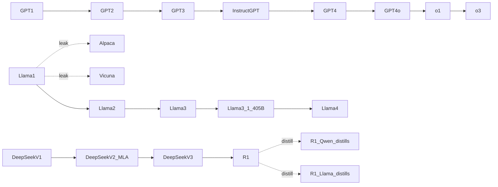

# Reference - Model Genealogy

## Major lineages

| Lineage | Origin | Key nodes | Notes |
|---|---|---|---|
| GPT | OpenAI | GPT-1 → GPT-2 → GPT-3 → GPT-3.5/InstructGPT → GPT-4 → GPT-4o → o1 → o3 | Decoder-only [[Deep Dive - The Transformer]] as the shared trunk across every generation |
| Llama | Meta | Llama 1 (leaked) → Alpaca/Vicuna/Guanaco (instruction distills) → Llama 2 → Llama 3/3.1 (405B) → Llama 4 | Base of the majority of open fine-tunes and merges on the Hub |
| Mistral | Mistral AI | Mistral 7B → Mixtral 8x7B (sparse MoE) → Mistral Large / Nemo | Second-most-merged open base after Llama |
| Qwen | Alibaba | Qwen 1 → 2 → 2.5 → 3 | Increasingly a default base for Chinese and open-weights fine-tunes |
| DeepSeek | High-Flyer / DeepSeek | V1 → V2 (MLA) → V3 → R1 | R1 (MIT license) seeded a large open reasoning-distill wave |
| GLM | Zhipu | GLM series | Chinese open lineage, separate tokenizer/architecture family |
| Yi | 01.AI | Yi series | Chinese open lineage |
| Gemini / Gemma | Google DeepMind | Gemini (closed) with Gemma (open) as a lighter sibling line | Same lab running both open and closed release strategies simultaneously |
| Claude | Anthropic | Claude 1 → 2 → 3 → 3.5 → 4 (Opus/Sonnet/Haiku tiering) | Closed only; tiering by cost/capability rather than by version depth |
| Phi | Microsoft | Phi series | Distillation-heavy small-model lineage |
| Command | Cohere | Command series | Enterprise/RAG-focused |
| Falcon | TII (UAE) | Falcon series | Sovereign/regional open lineage |
| MPT | MosaicML / Databricks | MPT series | Early fully-open commercial-license attempt, largely superseded |

## Reading a lineage graph

Solid edges = weight descent (the child's parameters derive from the parent's, via continued training or architecture reuse with shared checkpoints). Dashed edges = data/output descent (the child was trained on the parent's *outputs*, e.g. distillation, with no shared weights).

## Derivation types

| Type | Mechanism | Example |
|---|---|---|
| Architecture reuse | Published architecture copied, weights trained fresh | Nearly every open decoder-only model reuses the [[Deep Dive - The Transformer]] block |
| Weight-init / continued pretraining | Starts from an existing checkpoint, keeps training | Code Llama continuing from Llama 2 weights |
| Distillation | Student trained on teacher's outputs or logits | R1-distilled Qwen/Llama variants; Alpaca trained on text-davinci-003 completions |
| Model merging | Weight-space combination, no gradient step | SLERP, TIES, DARE merges published on the Hub |
| LoRA-adapter stacks | Small trainable deltas layered on a frozen base | Hub adapters keyed to one `base_model_name_or_path` |

Cross-link the mechanisms behind each edge type: [[Concept - Byte-Pair Encoding]] for tokenizer inheritance, [[Concept - Mixture of Experts Architecture]] for sparse-MoE lineages like Mixtral and DeepSeek, [[Concept - Knowledge Distillation]] for the distillation edges, and [[Concept - Scaling Laws]] for why continued-pretraining children often outperform same-size from-scratch models.

## Tokenizer inheritance as a lineage fingerprint

Many models silently reuse the GPT-2, Llama, or Qwen tokenizer even when the model card is vague or silent about ancestry — tokenizer vocabulary and merge rules survive fine-tuning essentially unchanged, so a tokenizer hash match is stronger evidence of lineage than a self-reported `base_model` field. See [[Snippet - Tracing Model Lineage via Hugging Face Metadata]] for the concrete archaeology technique.

## The distillation-from-closed pattern

A large share of the open instruct-model ecosystem descends, by data rather than by weight, from closed frontier models: ShareGPT-scraped GPT-4 conversations and similar corpora seeded a generation of open "instruct" models — the pattern nicknamed "GPT-4 in a trench coat." This lives in a legal grey zone, since most closed-lab terms of service prohibit training competing models on their outputs, but enforcement against a decentralized open-source ecosystem has been essentially nonexistent (see [[Lore - The LLaMA Leak]] for the parallel case of weights, rather than outputs, escaping containment).

## How to read a family tree

- Solid edges = weight descent; dashed edges = data/output descent — mixing these up is the most common lineage-reading error.
- A `base_model` field on the Hub is a *claim*, not a fact — corroborate with tokenizer fingerprint and config architecture before trusting it.
- Distillation-from-closed edges are usually undeclared, since declaring them creates ToS exposure — treat an unusually GPT-style formatting or refusal pattern as circumstantial evidence, not proof.
- Merges typically have multiple parents; a single-parent assumption will misread a TIES or DARE merge as a simple fine-tune.

## Connections
- [[Reference - The AI Lab Landscape]] — the organizations that anchor each lineage and the business logic behind their release cadence.
- [[Concept - The Open vs Closed Model Divide]] — why some lineages branch into open derivatives at all while others (Claude, Gemini) stay single-trunk.
- [[Snippet - Tracing Model Lineage via Hugging Face Metadata]] — the runnable code for reconstructing a lineage graph from Hub artifacts.
- [[Lore - The LLaMA Leak]] — the single event that turned the Llama lineage into the ecosystem's most-branched family tree.
- [[Concept - Byte-Pair Encoding]] — the tokenizer mechanism whose inheritance pattern is one of the most reliable lineage fingerprints.
- [[Concept - Mixture of Experts Architecture]] — the architectural mechanism behind sparse-MoE branches like Mixtral and DeepSeek-V3.
- [[Concept - Knowledge Distillation]] — the mechanism behind every dashed edge in the lineage graph.
- [[Concept - Scaling Laws]] — explains why continued-pretraining children of a strong base often beat from-scratch models of the same size.
- [[Deep Dive - The Transformer]] — the shared architectural trunk every lineage in this note branches from.
