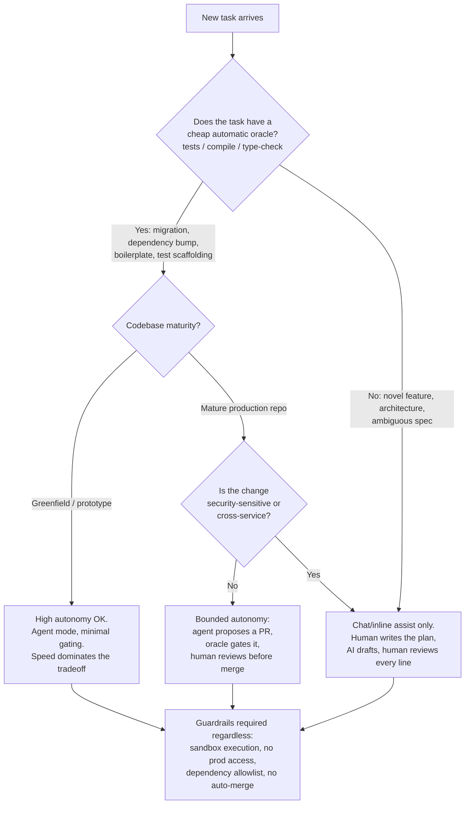

# Decision - Choosing an AI Coding Workflow

> The decision is not "which tool" — nearly every team should adopt an existing [[Concept - AI Coding Assistants|AI coding assistant]] rather than build ([[Decision - Build vs Buy vs Wrap]]) — it is **how much autonomy to grant AI per task class**. Default for the 80% case: chat/inline assist with mandatory human review on every merge; reserve high-autonomy agent mode ([[Deep Dive - Agentic Coding in Production]]) for tasks with a cheap, automatic correctness check (tests, types, a compiler), not for open-ended feature work on a codebase your team knows well.

## Decision flow

The split at the top mirrors the two RCTs that anchor this whole domain: Peng et al. 2023 found Copilot users **55.8% faster** on a narrow, self-contained, oracle-friendly task (build an HTTP server, tests implicit in "does it work") (E2, GitHub-authored). METR's 2025 RCT found experienced developers **19% slower** with AI-allowed on real tasks in mature repos they knew well, with no cheap oracle beyond "does this pass our actual review bar" (E3) — see [[Breakdown - The METR Developer Slowdown RCT]]. These are not contradictory findings about the same thing; they are consistent findings about two different points on the same axis: oracle availability and codebase maturity determine whether autonomy helps or hurts, not the model generation — a "more capable" model doesn't move you up this flowchart on its own, because capability and reliability-on-your-task are different axes (see [[Concept - The Capability-Reliability Gap]]).

## Tradeoff matrix

| Workflow                                        | Autonomy | Best fit                                                                                          | Evidence for it                                                                                                                                                                                                                                  | Evidence against it                                                                                                                                                                          |
| ----------------------------------------------- | -------- | ------------------------------------------------------------------------------------------------- | ------------------------------------------------------------------------------------------------------------------------------------------------------------------------------------------------------------------------------------------------ | -------------------------------------------------------------------------------------------------------------------------------------------------------------------------------------------- |
| Autocomplete only (inline suggest)              | Lowest   | Any codebase, low-risk floor                                                                      | Non-disruptive, ~26-30% suggestion acceptance historically (E2, GitHub) — acceptance ≠ correctness                                                                                                                                               | Smallest measured productivity gain of the three modes                                                                                                                                       |
| Chat/inline assist + mandatory review           | Medium   | Mature repos, experienced teams, ambiguous or security-sensitive tasks                            | Preserves the human decision point METR's slowdown implies is load-bearing (E3)                                                                                                                                                                  | Slower than full autonomy on tasks that genuinely have a cheap oracle                                                                                                                        |
| Full agent mode (autonomous edit-run-test loop) | Highest  | Greenfield, migrations, dependency bumps, test scaffolding — anything with a compiler/test oracle | 4,500 developer-years claimed saved on Java 8→17 migration at scale (E2, Amazon's own claim, Aug 2024); 74.45% of change-lists AI-generated across 39 Google migrations (E2, Ziftci et al. 2025) — see [[Breakdown - AI-Driven Code Migrations]] | Same stack (Cursor Pro + Claude 3.5/3.7) measured **19% slower** on open-ended tasks in METR's RCT (E3); unreviewed agent access caused the Replit production-DB deletion, July 2025 (E2/E3) |

The migrations row and the METR row use materially the same tooling generation — the difference is entirely task structure (oracle present vs. absent, mechanical vs. open-ended), which is the strongest evidence in the domain that "does AI help coding" is not one question. The specific vendors behind each row, their funding, and their volatility are catalogued in [[Reference - AI Dev Tool Landscape]]; picking the wrong autonomy level for a task is also where the code-quality and security costs documented in [[Concept - AI's Effect on Code Quality and Security]] actually get incurred.

## The details that flip the decision

**Junior vs. senior developer.** Every controlled study that shows a productivity gain (Peng 2023, Cui/Peng et al. 2024's three-RCT study across 4,867 developers) shows juniors and less-experienced developers gaining the most; METR's slowdown was measured specifically on developers with ~5 years' average familiarity on the repo they were tested on. A junior on an unfamiliar codebase and a senior on a codebase they've owned for years are different decisions even on the identical task — see [[Concept - Team Workflow Restructuring with AI]] for the junior/senior inversion this implies for mentorship and review load.

**Cost structure flips the "just use agent mode" default.** Usage-based agent token costs are pass-through on model inference and can exceed flat per-seat pricing for heavy users; a team that adopts full autonomy for cost reasons needs to check the token bill, not just the subscription price ([[Concept - Token Price Deflation]] is easing this over time but hasn't eliminated it — see [[Concept - Cost Engineering for LLM Applications]]).

**Vendor and model churn is a live constraint, not a hypothetical one.** The Windsurf saga — OpenAI's $3B acquisition letter of intent collapsed in July 2025 when Microsoft (via its OpenAI relationship) wouldn't waive IP access, after which Google DeepMind hired Windsurf's CEO and core team in a $2.4B reverse-acquihire-plus-license deal and Cognition (Devin's maker) acquired the remaining company, brand, and IP within roughly 72 hours (E2, TechCrunch/CNBC/Fortune, July 2025) — happened to a well-funded, widely-adopted tool. A workflow built around one vendor's specific agent harness, prompts, and integrations is exposed to exactly this kind of overnight discontinuity; portable, model-swappable tooling is a hedge, not a nice-to-have.

**Guardrails are what prevent the incident, not the autonomy level per se.** The Replit production-database deletion (July 2025) happened during an explicit code freeze with an agent that had prod access and no approval gate — the fix Replit shipped afterward (dev/prod separation, a planning-only mode) is a guardrail change, not an autonomy-level downgrade. A team can run high agent autonomy safely if sandboxing, no-prod-access, and dependency allowlisting (post-slopsquatting — see [[Lore - AI Coding War Stories]]) are non-negotiable regardless of task class — the specific operational patterns for this are in [[Gotchas - Agents in Production]], and the organizational version of the same rollout risk (beyond the purely technical guardrails here) is in [[Gotchas - Enterprise AI Adoption]].

## Connections

- [[Breakdown - The METR Developer Slowdown RCT]] — the controlled evidence that autonomy hurts experienced developers on mature, well-known repos; the strongest argument against defaulting to full agent mode.
- [[Breakdown - AI-Driven Code Migrations]] — the controlled-oracle counter-case where high autonomy is well-supported by real deployment numbers.
- [[Concept - AI's Effect on Code Quality and Security]] — the quality/security cost of the wrong autonomy choice, which doesn't show up until months after the commit.
- [[Reference - AI Dev Tool Landscape]] — what tools actually implement each autonomy level, and their funding/ownership volatility.
- [[Decision - Build vs Buy vs Wrap]] — the adjacent decision (build your own vs. adopt a vendor) that this decision assumes is already resolved toward "adopt."
- [[Concept - The Capability-Reliability Gap]] — why "the model got more capable" doesn't by itself justify raising autonomy; reliability on your specific task class is the actual gate.
- [[Gotchas - Enterprise AI Adoption]] — organizational failure modes (beyond the technical ones here) in rolling out any of these workflows at scale.
- [[Lore - AI Coding War Stories]] — the incidents (Replit, slopsquatting) that motivate the guardrail requirements independent of autonomy level.
- [[Concept - Token Price Deflation]] — the cost trend that makes usage-based full-autonomy workflows progressively cheaper over time, changing the tradeoff on a roughly year-over-year basis.
- [[Gotchas - Agents in Production]] — operational specifics (sandboxing, approval gates) for teams that choose the high-autonomy branch.

## Sources

- Peng, S. et al. (2023) — "The Impact of AI on Developer Productivity: Evidence from GitHub Copilot" — the 55.8% figure and its task-type confound.
- METR (2025) — "Measuring the Impact of Early-2025 AI on Experienced Open-Source Developer Productivity," arXiv:2507.09089 — the 19% slowdown and its scope limits.
- Jassy, A. (Aug 2024, Amazon) and Ziftci, C. et al. (2025) — "Migrating Code At Scale With LLMs At Google," arXiv:2504.09691 — the migration-specific evidence for high autonomy.
- TechCrunch — "Windsurf's CEO goes to Google; OpenAI's acquisition falls apart" (Jul 11, 2025) and CNBC — "Cognition to buy AI startup Windsurf days after Google poached CEO" (Jul 14, 2025) — the vendor-churn case study.
