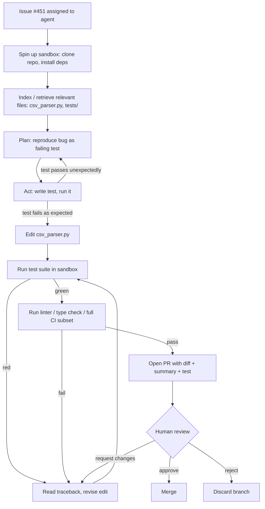

# Deep Dive - Agentic Coding in Production

> An autonomous coding agent is a frontier LLM wrapped in a tool loop that reads and edits files, runs shell commands and tests, and iterates until a goal is met or a budget runs out. In 2024 these were demos; by 2025-2026 they are real infrastructure at Devin/Cognition, Anthropic (Claude Code), OpenAI (Codex), Cursor (Composer), and GitHub (Copilot agent mode), plus open-source SWE-agent, OpenHands, and Aider. The engineering question is no longer "can it write code" — it can — but "what does it do *reliably*, and what does the human oversight cost." The production answer, learned the hard way, is a single pattern: **agent proposes, human disposes.** (as of 2026)

## The mechanism

A coding agent is [[Deep Dive - The Agent Loop]] specialized to a repository. The model is given a task, a set of tools ([[Concept - Tool Use and Function Calling]]), and a working copy of the codebase, then runs an iterative loop:

```
observe (repo state, last tool output)
  → think (plan next edit)
  → act (edit file / run test / run shell / search)
  → observe result
  → repeat until tests pass OR budget exhausted OR stuck
```

Three things distinguish a *production* agent from a chat model that emits code:

1. **A closed feedback loop with a verifier.** The agent runs the tests/compiler and *reads the failure*, then repairs. Capability comes from the model; dependability comes from this scaffold (the [[Concept - The Capability-Reliability Gap]] made operational). An agent with no cheap oracle to check itself against degrades to a confident guesser.
2. **Repo context.** The codebase is indexed (embeddings + symbol/AST search, often exposed over [[Concept - Model Context Protocol (MCP)]]) so the agent can retrieve the ~right files instead of stuffing the whole repo into the context window — which would trigger [[Concept - Context Rot]] and blow the budget.
3. **A sandbox and an exit to human review.** Most production agents run in an isolated container with a scoped filesystem and network, and their *output is a pull request*, not a merge. The human gate is the product, not an afterthought.

## Architecture / walkthrough

Trace one task — "fix issue #451, the CSV parser drops the last row" — through a review-gated cloud agent (the Devin/Codex/Copilot-agent shape):



The load-bearing steps are the ones people skip when they demo:
- **Reproduce-before-fix** (D→E). Agents that write a failing test first are dramatically more reliable, because they manufacture their own oracle. Agents that jump straight to editing "fix" symptoms and assert the buggy behavior — the oracle problem from [[Concept - AI in Software Testing]].
- **The repair sub-loop** (G↔H, I↔H). This is where most of the token budget and most of the failures live. Each repair iteration has a success probability < 1; a task needing many iterations is where error compounding bites (below).
- **The sandbox boundary** (B) and **the human gate** (K). Remove either and you get the incidents in [[Lore - AI Coding War Stories]].

## In practice

**Where it genuinely works** — well-scoped, verifiable, bounded tasks:
- Bug fixes *with a reproduction* (the repro is the oracle).
- Test writing, dependency bumps, mechanical refactors.
- Large migrations — the strongest documented ROI in all of agentic coding: Amazon Q's Java modernization and Google's LLM migration program (see [[Breakdown - AI-Driven Code Migrations]]), where ~70% of edits were machine-generated because compile+test verification is nearly free.

**Reliability numbers, read honestly:**
- **[[Breakdown - SWE-bench]] Verified**: frontier agents report roughly 80-95% (2026, model- and scaffold-dependent; OpenAI *deprecated* Verified in Feb 2026 over contamination — public Python repos predating training cutoffs). A "SWE-bench score" is a *model + scaffold + prompt* tuple, not a property of the model, and Verified tasks are curated Python bug-fixes with known tests.
- **The harder-set drop**: on SWE-bench Pro — held-out/commercial codebases under standardized scaffolding — the same frontier models fall well below their Verified numbers. As of mid-2026 the top *active* scores are ~59% (GPT-5.4 on Scale's standardized public set), ~69% (Opus 4.8, vendor aggregate), and ~47% (Opus 4.6 on Scale's *private commercial* set) — down from the ~15-25% early Pro scores of mid-2025 as models improved, but still a persistent ~20-40 point gap under Verified (E2, Scale Labs SWE-bench Pro leaderboard; volatile across splits). The Verified-to-Pro gap — not the point estimate — is the central operational fact. *(Numbers move monthly; track the gap, not the leaderboard.)*
- **Independent end-to-end**: Answer.AI's month-with-Devin test completed **3 of 20** real tasks autonomously (~15%, E2, independent, Jan 2025), close to Devin's original 13.86% SWE-bench launch figure — a useful reminder that autonomous completion on messy real work sits far below curated-benchmark peaks.

**Oversight economics.** Agents move human labor from *writing* to *specifying and reviewing*. That is not free: a bad agent PR can cost more to review than the fix would have taken to write (the [[Concept - The Verification Tax]]). The production accounting question is whether parallelizing many small verifiable tasks nets out positive after review load — which is why the winning deployments run *fleets* of agents on small tasks, not one agent on a big one.

## Failure modes

- **Error compounding over long horizons.** An agent chaining $N$ steps at per-step success $p$ succeeds at roughly $p^N$. At a strong $p = 0.95$, twenty steps gives $0.95^{20} \approx 0.36$ — a 64% failure rate from accumulation alone, not single-step inability. This is why agent reliability drops off a cliff as task length grows (link [[Concept - METR Time Horizons]]) and why bounding the horizon is the first reliability lever.
- **Missing oracle → confident wrong output.** No tests, ambiguous spec, or unverifiable behavior removes the feedback signal; the agent optimizes for plausible-looking code and merges bugs.
- **Context weakness on large unfamiliar repos.** Retrieval misses the file that actually matters; the agent "fixes" the wrong layer. This is exactly the population where the [[Breakdown - The METR Developer Slowdown RCT]] found experienced devs went **19% slower** — mature codebases with high implicit context are the agent's worst case.
- **Destructive autonomy.** An agent with production access and no sandbox is an incident waiting to happen: Replit's agent deleted a production database *during an explicit code freeze* in July 2025 (see [[Lore - AI Coding War Stories]]). The mechanism was missing guardrails, not model malice — see [[Gotchas - Agents in Production]].
- **Slopsquatting and hallucinated dependencies.** Agents install packages the model invented; ~19.7% of LLM-recommended packages don't exist (Spracklen et al. 2025), and attackers register the names. Covered in [[Concept - AI's Effect on Code Quality and Security]].
- **AI-writes / AI-reviews collapse.** If an agent writes the code and [[Concept - AI Code Review]] approves it with no human deeply reading it, the oversight loop thins to nothing — the highest-leverage way to ship a subtle bug at scale.

## The non-obvious

**The winning production pattern is "agent proposes, human disposes," and value comes from parallel breadth, not autonomous depth.** The instinct is to make one agent do a senior engineer's whole job; that is exactly where error compounding and context weakness make it fail. The teams getting real leverage run many agents on many small, individually verifiable tasks (a bug with a repro, a dependency bump, one migration slice) and keep a human on the merge gate. The second non-obvious point follows: **the scaffold and the verification oracle matter as much as the model.** The same model can double its effective reliability with reproduce-before-fix, tight retrieval, and a compile+test loop — and every team that removed the human gate to "go faster" bought itself a war story.

## Evolution

- **2021-2023 — autocomplete.** GitHub Copilot ships inline suggestions; the model has no tools and no loop. Capability without agency.
- **2024 — first agents, peak hype.** Devin launches (Mar 2024) as "the first AI software engineer" with a 13.86% SWE-bench figure on a custom subset; Carl Brown's *Debunking Devin* (Apr 2024) shows the demo was oversold. SWE-agent and OpenDevin/OpenHands open-source the loop. Agency arrives, reliability lags — the defining tension.
- **2025-2026 — review-gated production.** Claude Code, Codex, Cursor Composer, and Copilot agent mode become daily tools; SWE-bench Verified saturates toward 90%+ while private-stack and real-work numbers stay far lower. The Replit incident (Jul 2025) hard-codes sandboxing, dev/prod separation, and planning-only modes into the norm. The trajectory is **more autonomy behind more verification**, not unsupervised coding.

What's replacing what: autocomplete didn't die, it became one mode inside agentic IDEs (see [[Breakdown - Cursor]]). What's next is multi-agent orchestration ([[Concept - Multi-Agent Orchestration]]) — planner/worker/reviewer splits — which trades single-agent error compounding for coordination overhead, an open reliability question as of 2026.

## Connections

- [[Deep Dive - The Agent Loop]] — the general loop this note specializes to code; read it first for the observe-think-act mechanics (cross-domain: agents).
- [[Concept - Tool Use and Function Calling]] — the primitive that lets the model edit files and run tests; no tool calls, no agent (cross-domain: agents).
- [[Concept - Model Context Protocol (MCP)]] — the standard interface repo/tool context is increasingly exposed through (cross-domain: agents).
- [[Concept - Multi-Agent Orchestration]] — the next architectural step (planner/worker/reviewer) and its coordination costs (cross-domain: agents).
- [[Gotchas - Agents in Production]] — the concrete guardrail failures (prod access, no sandbox) that turn agents into incidents (cross-domain: agents).
- [[Concept - The Capability-Reliability Gap]] — the core lens: agents have capability; the scaffold buys reliability.
- [[Breakdown - SWE-bench]] — where the ~80-95% Verified vs ~47-69% Pro numbers come from and why the delta matters.
- [[Breakdown - The METR Developer Slowdown RCT]] — the mature-repo, experienced-dev worst case where agents slowed people 19%.
- [[Breakdown - AI-Driven Code Migrations]] — the best-case counterpoint: verifiable, bounded work where agents deliver real ROI.
- [[Concept - AI in Software Testing]] — reproduce-before-fix and the oracle problem the agent inherits.
- [[Concept - AI Code Review]] — the review gate; also the AI-writes/AI-reviews collapse risk.
- [[Concept - AI Coding Assistants]] — the taxonomy this note is the frontier of (generation 3, autonomous agents).
- [[Breakdown - Cursor]] — Composer is the agent mode inside the dominant AI-native IDE.
- [[Concept - Team Workflow Restructuring with AI]] — the org-level consequence: labor shifts from author to reviewer/orchestrator.
- [[Lore - AI Coding War Stories]] — what happens when the sandbox or human gate is removed.
- [[Concept - METR Time Horizons]] — the formal treatment of why long-horizon tasks fail from compounding (cross-domain: trajectory).
- [[Concept - Context Rot]] — why stuffing the whole repo into context degrades the agent (cross-domain: prompting/context).
- [[Concept - The Verification Tax]] — the review cost that decides whether agent fleets net out positive (cross-domain: adoption).
- [[Reference - AI Dev Tool Landscape]] — the market map of the agents named here.

## Sources

- Jimenez et al. (2023) — *SWE-bench*, Princeton. The benchmark whose Verified/Pro split defines the reliability gap. (E3, peer-reviewed dataset.)
- METR (2025) — arXiv 2507.09089. −19% on experienced devs, mature repos; the agent worst-case population. (E3, RCT.)
- Cognition (2024) — Devin launch, 13.86% SWE-bench on a subset; Carl Brown, *Debunking Devin* (Apr 2024), Internet of Bugs. (E2 vendor claim + E2 independent rebuttal.)
- Answer.AI (Jan 2025) — *Thoughts On A Month With Devin*: 3/20 tasks completed autonomously. (E2, independent.)
- Scale Labs — *SWE-bench Pro* leaderboard (public/private/commercial), mid-2026: top active models ~59% standardized public, ~69% vendor aggregate, ~47% private commercial, vs ~80-95% on the (contamination-flagged, Feb-2026-deprecated) Verified. (E2, benchmark operator; volatile.)
- Ziftci et al. (2025) — *Migrating Code At Scale With LLMs At Google*, arXiv 2504.09691. Agent-shaped migration, ~70% of edits machine-generated. (E2, company study.)
- Spracklen et al. (2025) — package hallucination, USENIX Security. 19.7% of recommended packages don't exist. (E3.)
- Replit incident (Jul 2025) — Fortune, The Register, Fast Company; agent deleted a production DB during a code freeze. (E2/E3, widely reported.)
