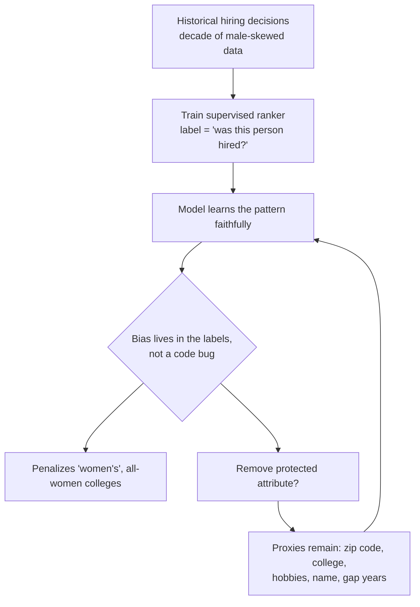

# Breakdown - AI in Recruiting and HR Screening
> Resume screening, video-interview scoring and candidate sourcing are where AI's oldest and best-documented failure, algorithmic bias, runs into active discrimination litigation and regulation that reclassifies the whole category as high-risk. Medical scribes and legal copilots are success stories. This one is a cautionary tale: the flagship "wins" are the ones that got scrapped or sued. (Assessed as of 2026-07.)

## The headline numbers

| Item | Fact | Tier |
|---|---|---|
| Amazon recruiting tool | Built 2014-2017, scrapped 2018 for penalizing women | E3 (Reuters/Dastin, widely reported) |
| Mobley v. Workday | Collective action certified (ADEA), May 2025 | E2/E3 (N.D. Cal. filings) |
| Applications in Workday scope | ~1.1B rejected via its tools in the relevant period | E2 (Workday's own representation) |
| EU AI Act | Employment AI = high-risk (Annex III §4); obligations deferred to 2 Dec 2027 (Digital Omnibus, agreed June 2026; classification unchanged) | E3 (regulatory text) |
| NYC Local Law 144 | Annual independent bias audit, publicly posted | E3 (statute, in force since 2023) |

## How it works, and how it fails

Amazon's is the canonical failure. Between 2014 and 2017 it built a model to score applicants, trained on a decade of the company's own resumes, which came overwhelmingly from men in a male-skewed tech labor pool. The model learned to **penalize the token "women's"** (as in "women's chess club captain") and to downgrade graduates of two all-women's colleges, while rewarding masculine-coded verbs. Amazon patched the obvious terms in 2015, couldn't guarantee the model wouldn't find new proxies, and scrapped it in 2018 (E3, Reuters, 2018).

**The model didn't malfunction. It learned the historical pattern in its training data.** The bias was in the labels ("who did we hire before"), so there was no bug to patch. HR stays the permanent cautionary tale for supervised AI on human-outcome decisions for this reason: you're asking a model to reproduce a distribution that was itself discriminatory, and it obliges.

## Why it keeps getting deployed anyway

- **Top-of-funnel volume is crushing.** One posting can draw thousands of applicants. Resume ranking, screening chatbots and HireVue-style video-interview scoring exist because human review doesn't scale to that. The pull is real, and it's why the category persists despite the risk.
- **The safe subset is large.** Administrative HR work is low-stakes, reversible, human-reviewed and productive: drafting job descriptions, scheduling interviews, summarizing candidate notes, answering employee policy questions from an HR knowledge base. That's ordinary [[Concept - Copilot vs Autopilot Deployment Modes|copilot]] work with no litigation surface.
- The distinction that matters: **assisting HR staff is fine; ranking or rejecting humans is the regulated, litigable core.** The function splits cleanly into a safe copilot half and a high-risk decisioning half, and only the second half is the problem.

## What it got wrong / what's dated

The risk moved from PR embarrassment to **direct litigation**. In *Mobley v. Workday* (N.D. Cal.), plaintiff Derek Mobley (Black, over 40, over 100 applications rejected) sued Workday itself. In July 2024 Judge Rita Lin denied the motion to dismiss, holding that Workday could be liable as an **"agent"** of the employers using its screening tools. In May 2025 she granted preliminary collective certification under the ADEA for applicants 40+ (E2/E3, court filings). Workday's own filing conceded ~1.1 billion applications were rejected via its tools in the relevant window, so the potential class is enormous. The whole sector is watching because of the novel theory: the **AI vendor** is directly liable, not only the employer.

Regulation reclassifies the category. The EU AI Act designates employment and worker-management AI as **high-risk under Annex III §4**, with obligations for technical documentation, logging, risk management, bias testing and human oversight. The EU Digital Omnibus (Council approved 29 June 2026) pushed the high-risk provisions from 2 Aug 2026 to 2 Dec 2027, but the Annex III classification is settled law (E3). NYC **Local Law 144** (in force since 2023) already requires an annual independent **bias audit** of any automated employment decision tool, testing disparate impact across race/ethnicity/sex, publicly posted (E3). It's the "regulated function drops down the automation list regardless of volume" rule from [[Decision - Which Business Function to Automate First]].

The hardest-earned point: **"debiasing" a screening model isn't a solved technical fix.** Remove protected attributes (gender, race) and *proxies* remain: zip code, college, hobbies, name, employment gaps. Together they reconstruct the protected class statistically. You can't scrub your way to fairness, because the correlation lives in the joint distribution, not in one column you can delete. The durable answer is **human-in-the-loop plus audit**, which is governance, not modeling. Candidate ranking is a worst case of the [[Concept - The Capability-Reliability Gap|capability-reliability gap]] (domain 20): even a capable ranker can't be trusted to be *fair* enough for an irreversible, protected-class decision.

## What to steal

- **Use AI for HR administration and gate it hard away from candidate decisioning.** Draft, schedule, summarize, answer policy questions. Don't let it rank or reject.
- **If you must score candidates, set up the human-in-the-loop and the audit first.** The audit is now a legal obligation ([[Pattern - Human-in-the-Loop Review Workflow]]).
- **Assume proxies survive attribute removal.** Test outputs for disparate impact instead of checking inputs for protected fields.
- **Treat Mobley's vendor-liability theory as live.** Building or buying screening AI now carries the employer's discrimination exposure *and* potentially the vendor's.

## Connections
- [[Concept - The Front-Office Back-Office Adoption Split]] — HR splits into safe back-office admin and high-liability candidate decisioning; only the latter is blocked.
- [[Concept - Copilot vs Autopilot Deployment Modes]] — the safe HR wins are copilot admin tasks; autopilot ranking of humans is the litigable core.
- [[Pattern - Human-in-the-Loop Review Workflow]] — the durable answer to bias is human review plus audit, not a cleaner model.
- [[Concept - AI in Finance Operations]] — the parallel back-office function where governance and data access, not model capability, are the binding constraint.
- [[Reference - AI Impact by Business Function]] — HR is the cautionary row of the cross-function matrix.
- [[Concept - Vertical AI Agents by Function]] — vertical HR agents face the same bias-plus-regulation ceiling that bounds full autonomy here.
- [[Decision - Which Business Function to Automate First]] — regulated human-outcome decisions drop to the bottom of the automation list regardless of volume.
- [[Lore - Hallucination Liability Incidents]] — the liability-from-AI-output pattern; here it is discrimination, not fabrication (domain 23).
- [[Reference - The EU AI Act for Operators]] — the high-risk classification and its obligations for employment AI (domain 23).
- [[Gotchas - Enterprise AI Adoption]] — bias, proxies, and audit obligations are recurring enterprise-deployment traps (domain 23).
- [[Concept - The Evaluation Gap]] — measuring fairness on outputs, not inputs, is a specialized eval problem most teams skip (domain 23).
- [[Concept - The Capability-Reliability Gap]] — a capable ranker still cannot be trusted fair enough for an irreversible protected-class decision (domain 20).

## Sources
- Dastin, J. (2018) — "Amazon scraps secret AI recruiting tool that showed bias against women," Reuters. The canonical failure, E3.
- Mobley v. Workday, Inc., N.D. Cal. (3:23-cv-00770) — motion-to-dismiss denial (Jul 2024, "agent" theory) and collective certification (May 2025). Court record, E2/E3.
- EU AI Act, Annex III §4 (employment/worker-management as high-risk); high-risk obligations deferred to 2026-12-02 by the Digital Omnibus. Regulatory text, E3.
- NYC Local Law 144 (2021, effective 2023) — mandatory annual bias audit for automated employment decision tools. Statute, E3.
