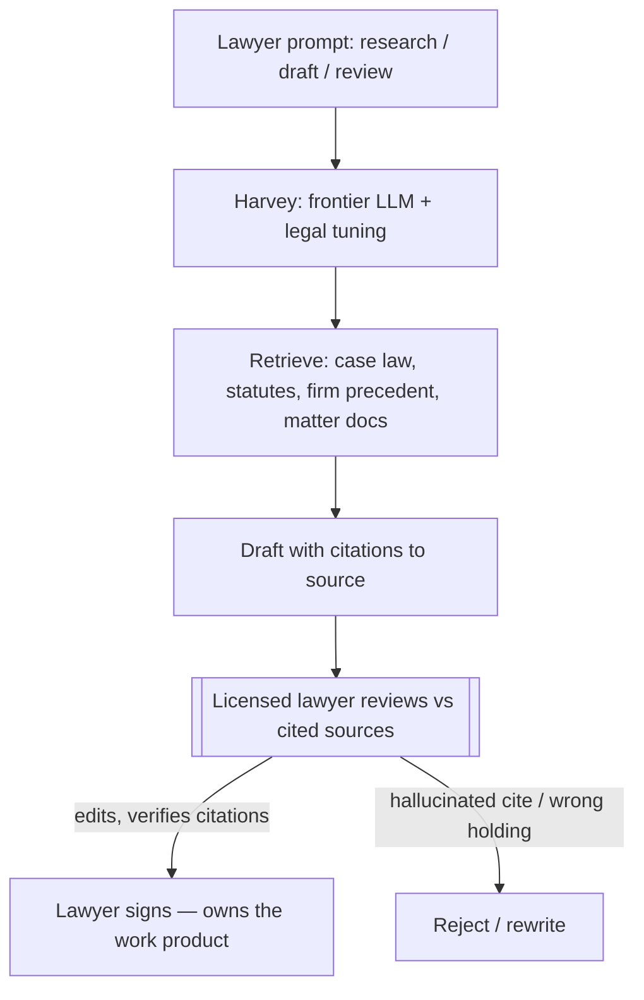

# Breakdown - Harvey and AI in Legal Work
> Harvey is the OpenAI-backed legal-AI company that put a GPT-based copilot inside elite law firms, starting with Allen & Overy's firmwide rollout in February 2023. It is the flagship of the legal vertical: large measured adoption, a strictly review-mandatory design forced by the profession's zero-tolerance for fabricated citations, and a valuation that ran from ~$3B to ~$11B in thirteen months. (Assessed as of 2026-07.)

## The headline numbers

| Metric | Value | Tier |
|---|---|---|
| First firmwide deployment | Allen & Overy, ~3,500 lawyers, 43 offices | E2 (A&O / LawSites, 2023-02-17) |
| Trial usage before rollout | ~40,000 queries during beta | E2 (A&O) |
| Big-4 anchor | PwC alliance, 4,000+ legal professionals | E2 (PwC press, 2023-03) |
| Reported throughput | 700,000+ tasks/day across firms | E2 (Harvey, company-claimed) |
| Reach | 142,000+ lawyers, 1,500+ customers, ~50% of Am Law 100 | E2 (Harvey, 2026) |
| ARR | ~$100M (Aug 2025) → ~$195M (end 2025) → ~$300M (May 2026) | E1/E2 (Sacra estimates) |

Valuation trajectory — each an announced round, a marker of investor conviction in the legal vertical, **not** of realized value:

| Date | Round | Valuation | Tier |
|---|---|---|---|
| Feb 2025 | Series D ($300M, Sequoia-led) | ~$3B | E2 |
| Jun 2025 | Series E | ~$5B | E2 |
| Dec 2025 | Series F ($160M, a16z-led) | ~$8B | E2 |
| Mar 2026 | Growth ($200M, GIC/Sequoia) | ~$11B — most valuable legal-tech company ever | E2 (CNBC, 2026-03-25) |

## How it actually works

Harvey is a retrieval-grounded legal assistant built on frontier models (OpenAI, later multi-model), tuned on legal corpora and wired into a firm's own document sets, with a **licensed lawyer as the mandatory commit gate** on every output.

The whole system is designed around one constraint: **unreviewed legal output carries direct, uninsurable liability**, so Harvey is a [[Concept - Copilot vs Autopilot Deployment Modes|copilot]], never an autopilot. It drafts research memos, contract redlines, and first-pass diligence; a lawyer reviews against the cited sources and signs. The [[Deep Dive - RAG Architectures|retrieval-grounding]] (domain 11) exists specifically so a reviewer can check each claim against a real document rather than trusting the model — the same verify-against-source shape used in finance and healthcare.

The tasks Harvey targets — research, review, drafting, diligence — are chosen because they are **high-billable-hour, document-bounded, and already have a senior-review step in the workflow**. The accountable reviewer already exists; Harvey slots a draft in front of them. This is the identical logic that made [[Breakdown - AI Medical Scribes|medical scribes]] scale where autonomous diagnosis did not: pick the task where a licensed human is *already* the legal owner of the output.

## The clever parts

- **Anchor-client land-grab.** A&O (3,500 lawyers) and PwC (4,000+ professionals) as launch partners in early 2023 converted "AI legal startup" into "the tool the top of the market already uses." That reference set unlocked Am Law 100 adoption faster than any benchmark could — the distribution *is* the moat (see [[Concept - Moats in the AI Application Layer]], domain 22).
- **Citations as the trust primitive.** Grounding every claim in a retrievable source document turns review from "re-do the research" into "check the footnotes," which is what makes the copilot economically worthwhile rather than pure overhead.
- **Vertical depth over horizontal breadth.** Co-building PwC's tax assistant on 6M+ curated tax sources (2023) signals the strategy: domain data and firm-specific integration, not the base model, as the defensible layer — a direct answer to wrapper commoditization.

## What it got wrong / what's dated

The core risk is **confident fabrication of citations and holdings**, and the evidence that this is not solved is strong — but it must be cited precisely. The widely-quoted Stanford RegLab study ("Hallucination-Free?", Magesh, Surani, Dahl et al., May 2024, E2/E3) tested **Lexis+ AI and Westlaw AI-Assisted Research — not Harvey** — and found hallucination rates of ~17% (Lexis+) to ~33% (Westlaw), against GPT-4's ~43% baseline, despite vendors' "hallucination-free" marketing. An earlier Stanford study (Dahl et al., "Large Legal Fictions," Jan 2024) found *general* LLMs hallucinate on 58-88% of specific legal queries. Harvey was not independently measured in that work; the honest statement is that **the category hallucinates at material rates**, which is precisely why Harvey's human-review gate is non-negotiable, not that Harvey's own rate is published. Anyone citing "specialized legal AI hallucinates" should attach it to the tools actually tested.

The liability is not hypothetical: *Mata v. Avianca* (2023) saw lawyers sanctioned for filing a brief with fake ChatGPT-invented citations — the incident that made "verify every cite" a professional-conduct baseline (see [[Lore - Hallucination Liability Incidents]], domain 23).

What is dated fastest is the valuation. `$3B→$11B` in thirteen months prices near-flawless execution; realized ARR (~$300M mid-2026, E1/E2 Sacra) implies a revenue multiple that only holds if legal AI retention proves durable — a bet, not a fact.

## What to steal

- **Sell time-per-matter savings under a mandatory-review contract.** Never position legal AI as replacing the lawyer's sign-off; the sign-off is the product's legal container.
- **Ground every claim in a retrieved source with a citation**, so review is verification, not redo — the economic hinge of the copilot.
- **Win the anchor clients first.** In regulated professional services, a marquee reference is worth more than a benchmark; adoption is gated on trust, not accuracy points.
- **Assume the base model hallucinates and build the workflow around catching it** — the durable answer to the [[Concept - The Capability-Reliability Gap|capability-reliability gap]] (domain 20) is process, not a cleaner model.

## Connections
- [[Concept - The Front-Office Back-Office Adoption Split]] — legal drafting/review is high-liability work that adopted only in copilot form; Harvey shows why.
- [[Concept - Copilot vs Autopilot Deployment Modes]] — Harvey is a pure copilot by design; the liability logic forbids autopilot.
- [[Pattern - Human-in-the-Loop Review Workflow]] — the mandatory lawyer-review gate is the exact pattern instrumented.
- [[Concept - Vertical AI Agents by Function]] — Harvey is the legal instance of the outcome-owning vertical-agent thesis.
- [[Breakdown - AI Medical Scribes]] — the parallel professional-services case: same accountable-reviewer-already-exists logic.
- [[Reference - AI Impact by Business Function]] — Harvey is the legal row of the cross-function matrix.
- [[Lore - Hallucination Liability Incidents]] — Mata v. Avianca and the fake-citation sanctions that force the review gate (domain 23).
- [[Reference - The EU AI Act for Operators]] — legal-AI deployment sits under professional and, in places, high-risk regulatory obligations (domain 23).
- [[Concept - Moats in the AI Application Layer]] — Harvey's anchor-client + domain-data defensibility argument against wrapper commoditization (domain 22).
- [[Breakdown - Frontier Lab Economics]] — Harvey's economics are downstream of OpenAI model pricing and its OpenAI Startup Fund backing (domain 22).
- [[Concept - The Capability-Reliability Gap]] — legal's zero error tolerance is the sharpest instance of the gap forcing human review (domain 20).
- [[Deep Dive - RAG Architectures]] — citation-grounded drafting is a retrieval-plus-extraction system (domain 11).

## Sources
- Allen & Overy / LawSites (2023-02-17) — firmwide Harvey rollout to ~3,500 lawyers; the anchor deployment, E2.
- PwC press release (2023-03) — strategic alliance, 4,000+ legal professionals; later co-built tax AI assistant.
- Magesh, Surani, Dahl, Suzgun, Manning, Ho — "Hallucination-Free? Assessing the Reliability of Leading AI Legal Research Tools" (Stanford RegLab, arXiv 2405.20362, 2024) — 17-33% hallucination on Lexis+/Westlaw; the category-level counter-evidence.
- Dahl et al. — "Large Legal Fictions" (2024) — 58-88% hallucination on general LLMs for legal queries.
- CNBC (2026-03-25) — $200M at $11B valuation; the valuation trajectory endpoints.
- Sacra — Harvey ARR estimates (~$100M/$195M/$300M); E1/E2 third-party revenue estimates.
