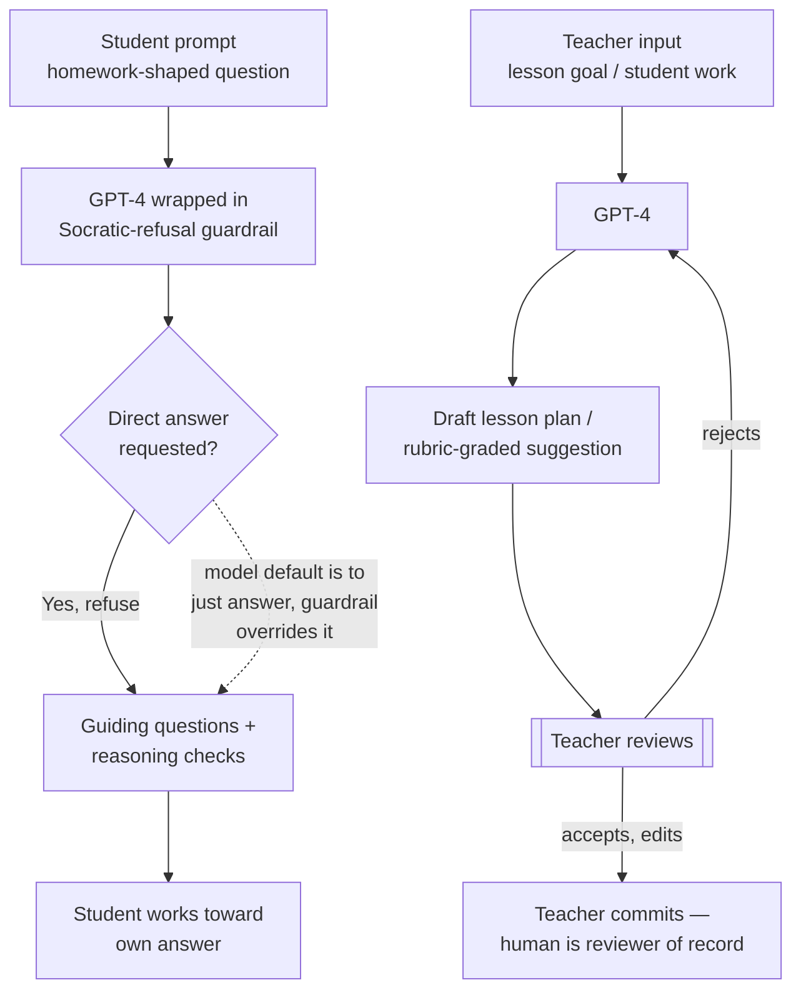

# Breakdown - Khanmigo and AI Tutoring

> Khanmigo is Khan Academy's GPT-4-powered AI tutor and teaching assistant. It launched March 14, 2023, the same day GPT-4 went public, pitched as a democratized answer to Bloom's "2 sigma problem." It's the anchor case for AI in education *(as of 2026)*: real adoption at nonprofit scale, real cost engineering to keep it free, and outcome evidence far more mixed than the marketing story.

## The headline numbers

- **Users.** ~68,000 students and teachers across ~45 partner districts in the 2023-24 pilot year, growing to 700,000+ users across 380+ districts in 2024-25 (E2, Khan Academy blog/Microsoft partnership reporting, 2024-2025).
- **Pricing drove the inflection, not capability.** Khanmigo launched at $4/student/month. In May 2024 Microsoft donated Azure OpenAI infrastructure to Khan Academy, and the tool went free for partner-district teachers and students overnight. The growth curve tracks that price cut more tightly than any capability jump (E2, Khan Academy/Microsoft 2024).
- **Engagement is the constraint, not access.** Despite 108M+ recorded interactions since launch, Khan Academy has reported that only around 15% of eligible students in partner districts actively use Khanmigo. That prompted a 2026 product redesign aimed at engagement instead of capability (E2, Khan Academy reporting, cited 2026).
- **Built on GPT-4** (OpenAI). Khan Academy, a nonprofit, negotiated subsidized or donated model access to keep per-seat cost near zero, a deliberate contrast to commercial ed-tech pricing.

## How it works

Two products ride the same model:

1. **Student tutor.** A Socratic conversational layer in front of GPT-4, engineered to *not* hand over answers. It asks guiding questions, checks reasoning steps, and refuses direct solutions to homework-shaped prompts. That's a copilot-mode design choice (see [[Concept - Copilot vs Autopilot Deployment Modes]]). GPT-4 can trivially solve the problems it's tutoring on, so capability isn't what limits it.
2. **Teacher assistant.** Lesson planning, rubric-based grading support, and IEP/differentiation drafting, with a human teacher as the reviewer of record (see [[Pattern - Human-in-the-Loop Review Workflow]]).

The Socratic refusal is the central engineering decision in the product. An answer-giving GPT-4 wrapper would have been trivial to build, and it would have been a cheating machine. The harder and more valuable build resists its own model's default of being maximally helpful.

## The clever parts

- **Refusing the easy answer.** Getting GPT-4 to sustain a multi-turn Socratic dialogue without leaking the answer is a hard prompt-engineering and guardrail problem. RLHF pushes the model toward direct helpfulness, and Khanmigo has to fight that gradient every turn.
- **Riding someone else's compute subsidy.** The Microsoft donation is what made the scale economics work. Khan Academy doesn't have to cover the marginal cost per student conversation alone, so a nonprofit could scale where a VC-funded ed-tech competitor with the same product would have to charge (see [[Concept - Unit Economics of LLM Products]]).
- **Teacher-in-the-loop from the start.** Every teacher-facing feature produces a draft, never a final artifact. Grading suggestions and lesson plans get reviewed and can be rejected, so legal and pedagogical accountability stays with the human.

## What it got wrong / what's dated

Vendors gloss over the efficacy evidence. This note won't. Press coverage conflates three separate, non-equivalent data points, and they need pulling apart:

- Khan Academy's **November 2024 efficacy blog post** is about the *core Khan Academy platform*: practice-problem usage correlating with ~20% larger test-score gains at 30+ minutes/week. It does **not** contain a completed Khanmigo-specific RCT result. The post says Khanmigo efficacy studies were "underway" (E2, Khan Academy blog, Nov 2024).
- A small, independently published 2025 study (Journal of Teaching and Learning, ~69 undergraduates) compared Khanmigo, a Google-search condition and a paper-only condition on undergraduate physics learning. It found **no statistically significant difference** in learning outcomes between conditions (E2, single study, small N; don't generalize past its scope).
- Secondary blog coverage circulating in 2025-2026 claims a "Harvard/Stanford RCT" and a "WestEd 47-school RCT" showing statistically significant Khanmigo math gains. Neither resolves to a citable, verifiable primary source; no author names, DOI or publication venue could be found (E0, unverifiable as circulated). This note excludes them as evidence and flags them as a live example of the sourcing problem this vault exists to catch.

Net, *(as of 2026)*: Khanmigo has real, well-documented adoption and a real, well-engineered Socratic design. But this research pass turned up no *(as of 2026)* independently verified, large-sample RCT showing a Khanmigo-specific learning-outcome effect. That gap is itself the finding. [[Concept - The Evaluation Gap]] explains why outcome measurement lags deployment across the whole applied wing, and [[Concept - The Capability-Reliability Gap]] explains why "the model can tutor" doesn't mean "the tutoring works."

The closest rigorous evidence isn't about Khanmigo at all. Bastani, Bastani, Sungu et al. (2024, SSRN/PNAS-track, ~1,000 Turkish high schoolers) ran an RCT on GPT-4 tutoring in general. An unrestricted GPT-4 assistant raised practice-problem scores 48% but *lowered* exam scores 17% once the tool was taken away. A Socratic-guardrail version, structurally the same as Khanmigo's design choice, avoided the exam-score harm (E3, peer-reviewed RCT, 2024). That's the strongest evidence available that refusing the answer is more than cosmetic. It separates a tool that helps from one that quietly erodes retention.

## What to steal

- **The Socratic-refusal pattern generalizes.** Any copilot on a model whose RLHF defaults to "be maximally helpful" needs an explicit, tested guardrail layer to *not* do the easy version of the task, when the easy version is the wrong product. AI code review tools flag instead of auto-fixing for a similar reason (see [[Concept - AI Code Review]]).
- **Subsidized compute is a go-to-market lever.** Khan Academy's Microsoft deal shows donated or discounted inference is a strategic asset. It moved the adoption curve more than any model upgrade did.
- **Engagement limits AI tutoring more than tutoring quality does.** A patient, always-available, non-judgmental tutor still needs the student to open the app. 15% active use against 700,000 provisioned seats is the tell. AI tutoring doesn't solve the motivation problem that Bloom's original research assumed a human in the room would solve. Teams building AI tutors learn this the hard way: capability was never the bottleneck. Showing up was.

## Connections

- [[Concept - Copilot vs Autopilot Deployment Modes]] — Khanmigo is copilot-mode by explicit design (Socratic refusal), not by capability ceiling.
- [[Concept - The Front-Office Back-Office Adoption Split]] — a front-office, human-facing deployment with mandatory human-in-the-loop review on the teacher side.
- [[Pattern - Human-in-the-Loop Review Workflow]] — the teacher-assistant half of the product never outputs a final artifact without teacher review.
- [[Concept - Vertical AI Agents by Function]] — Khanmigo is a vertical (education-specific) agent built on a horizontal model (GPT-4).
- [[Reference - AI Impact by Business Function]] — where education-sector adoption numbers sit relative to other functions.
- [[Concept - Machine Translation and the Localization Industry]] — Duolingo's parallel 2024 contractor cuts show the same AI-driven labor reallocation inside the adjacent language-learning/localization space.
- [[Breakdown - AI Medical Scribes]] — another human-service-adjacent domain where AI is deployed as an assistant to, not a replacement for, a licensed professional.
- [[Concept - The Evaluation Gap]] — the core reason the Khanmigo efficacy question is still open: outcome measurement infrastructure lags deployment.
- [[Concept - The Pilot-to-Production Gap]] — Khanmigo's district-partner growth (45 → 380+) is a rare Applied Wing example of a pilot that *did* scale.
- [[Concept - Unit Economics of LLM Products]] — the Microsoft compute subsidy is what made a near-zero-marginal-cost nonprofit deployment possible.
- [[Concept - The Capability-Reliability Gap]] — GPT-4 can solve the problems it tutors; the gap here is between "can answer" and "should answer," engineered away by Socratic design.

## Sources

- Khan Academy Blog (2024-2025) — Khanmigo user/district growth figures, Microsoft partnership, November 2024 efficacy results (core-platform scope).
- Bastani, H., Bastani, O., Sungu, A. et al. (2024) — "Generative AI Without Guardrails Can Harm Learning" (SSRN preprint / Wharton study, ~1,000-student RCT) — unrestricted vs. guardrailed GPT-4 tutoring effects on practice vs. exam performance.
- Journal of Teaching and Learning (2025) — small (~69 student) RCT-style comparison of Khanmigo vs. Google search vs. paper-only in undergraduate physics; no significant difference found.
- Bloom, B.S. (1984) — "The 2 Sigma Problem," Educational Researcher — the classic one-to-one tutoring effect-size finding that motivates the AI-tutoring pitch.
- TechCrunch, CNBC, American Banker (2024-2025) — Duolingo contractor cuts and JPMorgan LLM Suite reporting used for cross-function comparison.
