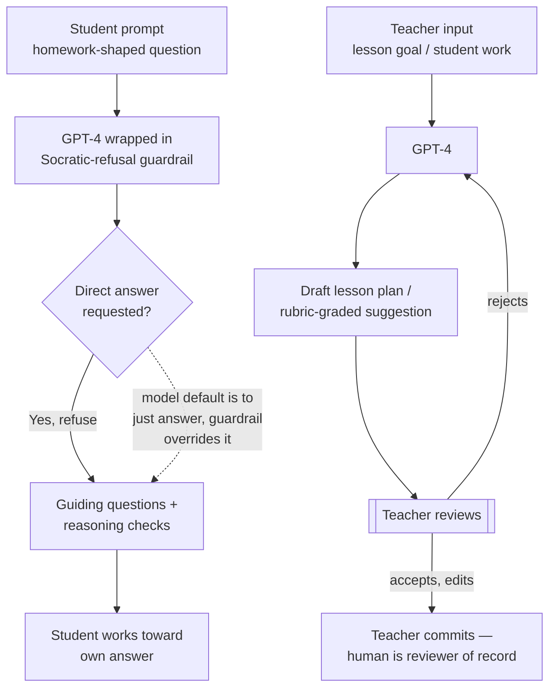

# Breakdown - Khanmigo and AI Tutoring

> Khanmigo is Khan Academy's GPT-4-powered AI tutor and teaching assistant, launched March 14, 2023 (the same day GPT-4 went public) and positioned as a democratized answer to Bloom's "2 sigma problem." It is the anchor case for AI in education *(as of 2026)*: real adoption at nonprofit scale, real cost engineering to keep it free, and an outcome-evidence picture that is far more mixed than the marketing narrative.

## The headline numbers

- **Users:** ~68,000 students and teachers across ~45 partner districts in the 2023-24 pilot year, growing to 700,000+ users across 380+ districts in 2024-25 (E2, Khan Academy blog/Microsoft partnership reporting, 2024-2025).
- **The inflection point was pricing, not capability:** Khanmigo launched at $4/student/month. In May 2024 Microsoft donated Azure OpenAI infrastructure to Khan Academy, and the tool went free for partner-district teachers and students overnight — the growth curve tracks the price cut more tightly than any capability jump (E2, Khan Academy/Microsoft 2024).
- **Engagement is the real constraint, not access:** despite 108M+ recorded interactions since launch, Khan Academy has reported that only around 15% of eligible students in partner districts actively use Khanmigo, prompting a 2026 product redesign aimed at engagement rather than capability (E2, Khan Academy reporting, cited 2026).
- **Built on GPT-4** (OpenAI), with Khan Academy — a nonprofit — negotiating subsidized/donated model access specifically to keep per-seat cost near zero, a deliberate contrast to commercial ed-tech pricing.

## How it actually works

Khanmigo has two products riding the same model:

1. **Student tutor** — a Socratic conversational layer in front of GPT-4, deliberately engineered to *not* hand over answers. It asks guiding questions, checks reasoning steps, and refuses direct solutions to homework-shaped prompts. This is a copilot-mode design choice (see [[Concept - Copilot vs Autopilot Deployment Modes]]), not a capability limitation — GPT-4 can trivially solve the problems it's tutoring on.
2. **Teacher assistant** — lesson planning, rubric-based grading support, and IEP/differentiation drafting, keeping a human teacher as the reviewer of record (see [[Pattern - Human-in-the-Loop Review Workflow]]).

The Socratic-refusal design is not incidental. It is the load-bearing engineering decision in the whole product: an answer-giving GPT-4 wrapper would have been trivial to build and would have been a cheating machine. The harder, more valuable build is the one that resists its own model's default behavior of being maximally helpful.

## The clever parts

- **Refusing the easy answer.** Prompting GPT-4 to sustain a multi-turn Socratic dialogue without leaking the answer is a genuinely hard prompt-engineering and guardrail problem — the model's RLHF training pushes toward direct helpfulness, and Khanmigo has to fight that gradient turn after turn.
- **Riding someone else's compute subsidy.** The Microsoft donation is the real unlock for scale economics: Khan Academy's marginal cost per student conversation is not its problem to solve alone, which is why a nonprofit could scale where a VC-funded ed-tech competitor with the same product would need to charge (see [[Concept - Unit Economics of LLM Products]]).
- **Teacher-in-the-loop by design, not compliance afterthought.** Every teacher-facing feature produces a draft, never a final artifact — grading suggestions and lesson plans are reviewed and can be rejected, keeping legal and pedagogical accountability with the human.

## What it got wrong / what's dated

The efficacy evidence is the part vendors gloss over and this note will not. Three separate, non-equivalent data points get conflated in press coverage, and pulling them apart matters:

- Khan Academy's own **November 2024 efficacy blog post** is about the *core Khan Academy platform* (practice-problem usage correlating with ~20% larger test-score gains at 30+ minutes/week) — it does **not** contain a completed Khanmigo-specific RCT result; the post itself states Khanmigo efficacy studies were "underway" (E2, Khan Academy blog, Nov 2024).
- A small, independently published 2025 study (Journal of Teaching and Learning, ~69 undergraduates) comparing Khanmigo, a Google-search condition, and a paper-only condition on undergraduate physics learning found **no statistically significant difference** in learning outcomes between conditions (E2, single study, small N — do not generalize past its scope).
- Secondary blog coverage circulating in 2025-2026 claims a "Harvard/Stanford RCT" and a "WestEd 47-school RCT" showing statistically significant Khanmigo math gains. Neither claim resolves to a citable, verifiable primary source — no author names, DOI, or publication venue were locatable (E0 — unverifiable as circulated; excluded from this note as load-bearing evidence and flagged as a live example of the sourcing problem this vault exists to catch).

Net: the honest evidence-tier picture *(as of 2026)* is that Khanmigo has real, well-documented adoption and a real, well-engineered Socratic design — but no *(as of 2026)* independently verified, large-sample RCT establishing a Khanmigo-specific learning-outcome effect has surfaced in this research pass. That gap is itself the finding — see [[Concept - The Evaluation Gap]] for why outcome measurement lags deployment across the whole applied wing, and [[Concept - The Capability-Reliability Gap]] for why "the model can tutor" doesn't imply "the tutoring works."

The closest thing to rigorous adjacent evidence is not about Khanmigo at all: Bastani, Bastani, Sungu et al. (2024, SSRN/PNAS-track, ~1,000 Turkish high schoolers) ran an RCT on GPT-4 tutoring generally and found an unrestricted GPT-4 assistant raised practice-problem scores 48% but *lowered* exam scores 17% once the tool was removed — while a Socratic-guardrail version (structurally identical to Khanmigo's design choice) avoided the exam-score harm (E3, peer-reviewed RCT, 2024). This is the strongest available evidence that Khanmigo's specific design choice — refuse the answer — is not cosmetic; it is the difference between a tool that helps and a tool that quietly erodes retention.

## What to steal

- **The Socratic-refusal pattern generalizes.** Any AI copilot built on a model whose RLHF defaults to "be maximally helpful" needs an explicit, tested guardrail layer to *not* do the easy version of the task, when the easy version is the wrong product — this is a direct analog to why AI code review tools flag rather than auto-fix (see [[Concept - AI Code Review]]).
- **Subsidized compute as a go-to-market lever.** Khan Academy's Microsoft deal shows that access to donated/discounted inference is a strategic asset, not a footnote — it changed the adoption curve more than any model upgrade did.
- **Engagement, not tutoring quality, is the binding constraint (non-obvious).** A functionally patient, infinitely available, non-judgmental tutor still needs the student to open the app. The 15% active-use rate against 700,000 provisioned seats is the tell: AI tutoring doesn't solve the motivation problem Bloom's original research assumed was solved by having a human in the room. Practitioners building AI tutors learn this the hard way — capability was never the bottleneck; showing up was.

## Connections

- [[Concept - Copilot vs Autopilot Deployment Modes]] — Khanmigo is copilot-mode by explicit design (Socratic refusal), not by capability ceiling.
- [[Concept - The Front-Office Back-Office Adoption Split]] — a front-office, human-facing deployment with mandatory human-in-the-loop review on the teacher side.
- [[Pattern - Human-in-the-Loop Review Workflow]] — the teacher-assistant half of the product never outputs a final artifact without teacher review.
- [[Concept - Vertical AI Agents by Function]] — Khanmigo is a vertical (education-specific) agent built on a horizontal model (GPT-4).
- [[Reference - AI Impact by Business Function]] — where education-sector adoption numbers sit relative to other functions.
- [[Concept - Machine Translation and the Localization Industry]] — Duolingo's parallel 2024 contractor cuts show the same AI-driven labor reallocation inside the adjacent language-learning/localization space.
- [[Breakdown - AI Medical Scribes]] — another human-service-adjacent domain where AI is deployed as an assistant to, not a replacement for, a licensed professional.
- [[Concept - The Evaluation Gap]] — the core reason the Khanmigo efficacy question is still open: outcome measurement infrastructure lags deployment.
- [[Concept - The Pilot-to-Production Gap]] — Khanmigo's district-partner growth (45 → 380+) is a rare Applied Wing example of a pilot that *did* scale.
- [[Concept - Unit Economics of LLM Products]] — the Microsoft compute subsidy is what made a near-zero-marginal-cost nonprofit deployment possible.
- [[Concept - The Capability-Reliability Gap]] — GPT-4 can solve the problems it tutors; the gap here is between "can answer" and "should answer," engineered away by Socratic design.

## Sources

- Khan Academy Blog (2024-2025) — Khanmigo user/district growth figures, Microsoft partnership, November 2024 efficacy results (core-platform scope).
- Bastani, H., Bastani, O., Sungu, A. et al. (2024) — "Generative AI Without Guardrails Can Harm Learning" (SSRN preprint / Wharton study, ~1,000-student RCT) — unrestricted vs. guardrailed GPT-4 tutoring effects on practice vs. exam performance.
- Journal of Teaching and Learning (2025) — small (~69 student) RCT-style comparison of Khanmigo vs. Google search vs. paper-only in undergraduate physics; no significant difference found.
- Bloom, B.S. (1984) — "The 2 Sigma Problem," Educational Researcher — the classic one-to-one tutoring effect-size finding that motivates the AI-tutoring pitch.
- TechCrunch, CNBC, American Banker (2024-2025) — Duolingo contractor cuts and JPMorgan LLM Suite reporting used for cross-function comparison.
