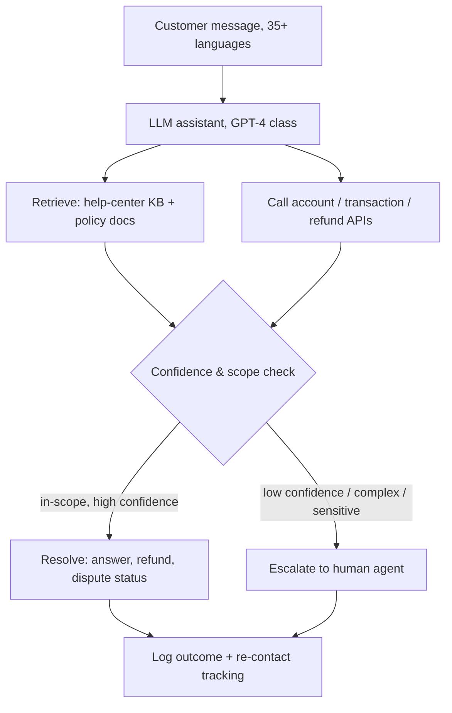

# Breakdown - Klarna's AI Customer Service Bet
> Klarna's customer-service assistant, launched February 2024 in partnership with OpenAI, is the single most-cited applied-AI case study of the cycle — first as proof that a chatbot could do "the work of 700 agents," then, after the May 2025 reversal, as the textbook warning about scoping autonomy too broadly. Both readings are correct, which is exactly why it matters. (Assessed as of 2026-07.)

## The headline numbers

All launch figures are Klarna's and OpenAI's own claims (E2, Feb 2024 press release + openai.com/index/klarna), repeated across the press as fact but never independently audited.

| Metric | Claim | Tier |
|---|---|---|
| Conversations, first month | 2.3M — ~two-thirds of Klarna's support chats | E2 (Klarna, Feb 2024) |
| Human-agent equivalent | Work of ~700 full-time agents | E2 — a *workload* equivalence, not 700 people fired (see below) |
| Resolution time | ~11 min → under 2 min | E2 (Klarna) |
| Repeat inquiries | −25% | E2 (Klarna) |
| CSAT | On par with human agents | E2 (Klarna) |
| Reach | 23 markets, 35+ languages, 24/7 | E2 (Klarna) |
| 2024 profit impact | ~$40M estimated | E2 — Klarna *internal estimate*, not audited |

The `$40M` is the number to distrust most: it is a modeled projection of profit improvement, not a booked result, and it circulated as though it were a financial disclosure. Treat every row here as a vendor deck, not a filing.

## How it actually works

The system is a retrieval-grounded assistant wired into Klarna's own transactional systems, with a confidence-gated escalation path to humans — not a raw LLM answering from weights.

The design decision that made it work at all is that it is **grounded and tool-using**, not generative-from-memory: answers are pulled from help-center content and live account/transaction APIs, so "what's the status of my refund" resolves against real data rather than a plausible hallucination. The autonomy is real for the routine 60-70% (order status, refunds, payment scheduling, disputes) and the rest routes to humans. This is a [[Concept - Copilot vs Autopilot Deployment Modes|autopilot]] deployment for a *bounded* set of query types — which is both why the launch numbers were genuine and why the overreach came later.

The `2.3M conversations` figure is real deflection scale and it stuck. What did not survive is the framing that this equalled replacing 700 people. Independent analysis (E2, The Pragmatic Engineer, 2024) noted the 700-agent number is a workload-equivalence estimate; much of the headcount reduction that Klarna advertised in parallel came from a **hiring freeze and attrition** (workforce fell from ~5,000 toward ~3,800 across 2023-2024), not 700 agents walked to the door because of the bot. The bot and the layoffs were marketed as one story; they were two.

## The clever parts

- **Tool-grounding over generation.** By resolving against transaction APIs and a curated knowledge base, Klarna kept the assistant on the verifiable-output side of the [[Concept - Support Deflection Economics|deflection]] problem. The failure mode of support bots — confidently wrong policy answers — was structurally suppressed for the query types they scoped.
- **Bounded autopilot, real volume.** 2.3M chats/month is a legitimately large deflection number; the routine-query automation was not vaporware. The mistake was not *that* they automated but *how far*.
- **Outcome framing for narrative.** Klarna deliberately reported the deployment as a P&L event (`$40M`, `700 agents`) to signal AI leadership ahead of its IPO. This bought enormous attention — and set a bar the company then had to walk back publicly.

## What it got wrong / what's dated

The reversal is multiply-sourced and firmer than the launch numbers (E2/E3, Bloomberg / TechCrunch / Fortune, May-June 2025). In May 2025 CEO Sebastian Siemiatkowski told Bloomberg the company "went too far" and that "we focused too much on cost. The result was lower quality." The stated mechanism: AI replies were **generic, repetitive, and lacked the empathy and nuanced problem-solving** complex cases need — the bot handled *volume* but not *judgment*. Klarna began rehiring humans, targeting a remote workforce (students, rural residents, loyal users) for premium and complex support (E2, TechCrunch, 2025-06-04).

Critically, Klarna did **not** un-deploy the AI. It corrected an over-automation overshoot: AI stays on high-volume routine queries, humans return for nuanced and VIP cases. The outcome validates a copilot+autopilot *split within one function* — the exact discipline of the [[Pattern - Human-in-the-Loop Review Workflow]] — not "AI support failed." Read as "the bot didn't work," the case is misunderstood; read as "unbounded autonomy plus a cost-only metric degrades quality on the hard residual," it is the most instructive deployment of the cycle.

Why the failure was structural, not a bug: removing the easy 60% leaves a residual queue that is *harder and angrier* on average, so the marginal automated contact is exactly the one the model handles worst (the residual-difficulty effect from [[Concept - Support Deflection Economics]]). Optimizing raw savings hides this until CSAT and churn — lagged, diffuse signals — finally land.

## What to steal

- **Bound autonomy to query types you have measured**, and expand scope only when a quality metric (not just a savings metric) clears a threshold.
- **Run a re-contact / CSAT guardrail alongside the cost metric.** Klarna measured savings without a firing quality guardrail; the [[Concept - The Evaluation Gap|evaluation gap]] is where the overshoot hid.
- **Ground answers in retrieval and live APIs**, not model memory, for anything touching money or account state.
- **Never announce headcount-equivalence numbers you will have to retract.** Announce capability, not staffing math — the `700 agents` line is the part that aged worst.

## Connections
- [[Concept - Support Deflection Economics]] — the unit-economics mechanism Klarna is the flagship instance of; the residual-difficulty effect explains the reversal.
- [[Concept - The Front-Office Back-Office Adoption Split]] — Klarna is the canonical front-office autonomy bet, the risky end of the split.
- [[Concept - Copilot vs Autopilot Deployment Modes]] — Klarna over-rotated to autopilot then rebalanced to a mode split; the case defines the tradeoff.
- [[Lore - The Klarna Reversal and Support Bot Walk-Backs]] — the war-story treatment of the reversal and the quieter walk-backs it typifies.
- [[Lore - What Vendors Don't Say About Deflection Rates]] — the measurement games (assumed resolution, containment vs resolution) that let the launch numbers look clean.
- [[Concept - Vertical AI Agents by Function]] — Klarna's outcome-framed support automation is a precursor to the outcome-priced vertical-agent thesis.
- [[Reference - AI Impact by Business Function]] — Klarna is the customer-support row in the cross-function matrix.
- [[Concept - AI in Marketing and Content]] — Klarna reported large marketing-content cost savings from AI in the same period, generalizing the claim beyond support.
- [[Concept - The Pilot-to-Production Gap]] — the reversal is a production-scale instance of measurement skipped at pilot stage (domain 23).
- [[Concept - The Evaluation Gap]] — no quality guardrail firing alongside the savings metric is the root cause (domain 23).
- [[Concept - Unit Economics of LLM Products]] — the $0.x-per-contact economics that made the business case (domain 22).

## Sources
- Klarna (2024-02-27) — "Klarna AI assistant handles two-thirds of customer service chats in its first month." The launch numbers, all E2.
- OpenAI — "Klarna's AI assistant does the work of 700 full-time agents." Partnership + workload-equivalence claim.
- The Pragmatic Engineer (2024) — critical read establishing the 700 figure as workload-equivalence and the layoff/hiring-freeze conflation.
- Bloomberg / Fortune / TechCrunch (2025-05 to 06) — the Siemiatkowski "went too far" reversal and human rehiring; the multiply-sourced E2/E3 counter-evidence.
