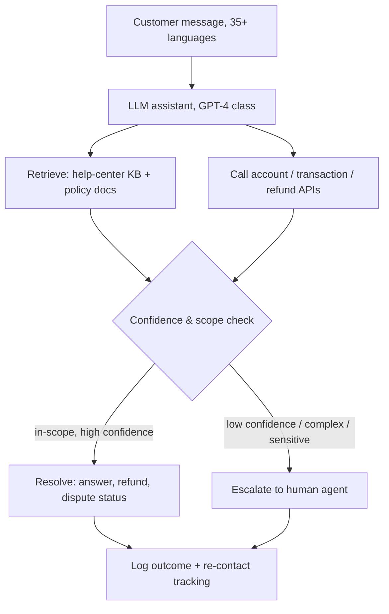

# Breakdown - Klarna's AI Customer Service Bet
> Klarna's customer-service assistant, launched February 2024 with OpenAI, is the most-cited applied-AI case study of the cycle. First it was proof that a chatbot could do "the work of 700 agents." After the May 2025 reversal it became the textbook warning about scoping autonomy too broadly. Both readings are correct, and that's what makes it useful. (Assessed as of 2026-07.)

## The headline numbers

Every launch figure is Klarna's or OpenAI's own claim (E2, Feb 2024 press release + openai.com/index/klarna). The press repeated them as fact; nobody independently audited them.

| Metric | Claim | Tier |
|---|---|---|
| Conversations, first month | 2.3M — ~two-thirds of Klarna's support chats | E2 (Klarna, Feb 2024) |
| Human-agent equivalent | Work of ~700 full-time agents | E2; a *workload* equivalence, not 700 people fired (see below) |
| Resolution time | ~11 min → under 2 min | E2 (Klarna) |
| Repeat inquiries | −25% | E2 (Klarna) |
| CSAT | On par with human agents | E2 (Klarna) |
| Reach | 23 markets, 35+ languages, 24/7 | E2 (Klarna) |
| 2024 profit impact | ~$40M estimated | E2; Klarna *internal estimate*, not audited |

Distrust the `$40M` most. It's a modeled projection of profit improvement, not a booked result, and it circulated as if it were a financial disclosure. Read every row here as a vendor deck, not a filing.

## How it works

It's a retrieval-grounded assistant wired into Klarna's own transactional systems, with a confidence-gated escalation path to humans. It doesn't answer from model weights.

What made it work at all is that it's **grounded and tool-using**. Answers come from help-center content and live account/transaction APIs, so "what's the status of my refund" resolves against real data instead of a plausible hallucination. Autonomy is real for the routine 60-70% (order status, refunds, payment scheduling, disputes), and the rest routes to humans. That's an [[Concept - Copilot vs Autopilot Deployment Modes|autopilot]] deployment for a *bounded* set of query types, which explains both the genuine launch numbers and the later overreach.

The `2.3M conversations` figure is real deflection scale, and it held up. The claim that it amounted to replacing 700 people didn't. Independent analysis (E2, The Pragmatic Engineer, 2024) noted the 700-agent number is a workload-equivalence estimate. Much of the headcount reduction Klarna advertised alongside it came from a **hiring freeze and attrition**: the workforce fell from ~5,000 toward ~3,800 across 2023-2024. It wasn't 700 agents walked out the door because of the bot. The bot and the layoffs were marketed as one story; they were two.

## The clever parts

- **Tool-grounding over generation.** Resolving against transaction APIs and a curated knowledge base kept the assistant on the verifiable-output side of the [[Concept - Support Deflection Economics|deflection]] problem. For the query types in scope, the classic support-bot failure (confidently wrong policy answers) was suppressed by design.
- **Bounded autopilot, real volume.** 2.3M chats a month is a large deflection number, and the routine-query automation wasn't vaporware. Klarna's mistake was how far it automated, not the decision to automate.
- **Outcome framing for the narrative.** Klarna reported the deployment as a P&L event (`$40M`, `700 agents`) to signal AI leadership ahead of its IPO. It bought enormous attention and set a bar the company later walked back in public.

## What it got wrong / what's dated

The reversal is better sourced than the launch numbers (E2/E3, Bloomberg / TechCrunch / Fortune, May-June 2025). In May 2025 CEO Sebastian Siemiatkowski told Bloomberg the company "went too far" and that "we focused too much on cost. The result was lower quality." His stated mechanism: AI replies were **generic, repetitive, and lacked the empathy and nuanced problem-solving** complex cases need. The bot handled *volume* but not *judgment*. Klarna began rehiring humans, recruiting a remote workforce (students, rural residents, loyal users) for premium and complex support (E2, TechCrunch, 2025-06-04).

Klarna did **not** un-deploy the AI. It corrected an over-automation overshoot: AI stays on high-volume routine queries, and humans come back for nuanced and VIP cases. That validates a copilot+autopilot split *within one function*, the discipline of the [[Pattern - Human-in-the-Loop Review Workflow]]. Read as "the bot didn't work," the case is misunderstood. Read as "unbounded autonomy plus a cost-only metric degrades quality on the hard residual," it's the most instructive deployment of the cycle.

The failure came from the setup, not a bug. Remove the easy 60% and the residual queue is *harder and angrier* on average, so each additional automated contact is the kind the model handles worst (the residual-difficulty effect from [[Concept - Support Deflection Economics]]). Optimizing raw savings hides this until CSAT and churn, both lagged and diffuse, finally move.

## What to steal

- **Bound autonomy to query types you've measured**, and widen scope only when a quality metric (not only a savings metric) clears a threshold.
- **Run a re-contact / CSAT guardrail next to the cost metric.** Klarna measured savings with no quality guardrail that could fire, and the overshoot hid in the [[Concept - The Evaluation Gap|evaluation gap]].
- **Ground answers in retrieval and live APIs** for anything touching money or account state. Don't trust model memory there.
- **Never announce headcount-equivalence numbers you'll have to retract.** Announce capability, not staffing math. The `700 agents` line aged worst.

## Connections
- [[Concept - Support Deflection Economics]] — the unit-economics mechanism Klarna is the flagship instance of; the residual-difficulty effect explains the reversal.
- [[Concept - The Front-Office Back-Office Adoption Split]] — Klarna is the canonical front-office autonomy bet, the risky end of the split.
- [[Concept - Copilot vs Autopilot Deployment Modes]] — Klarna over-rotated to autopilot then rebalanced to a mode split; the case defines the tradeoff.
- [[Lore - The Klarna Reversal and Support Bot Walk-Backs]] — the war-story treatment of the reversal and the quieter walk-backs it typifies.
- [[Lore - What Vendors Don't Say About Deflection Rates]] — the measurement games (assumed resolution, containment vs resolution) that let the launch numbers look clean.
- [[Concept - Vertical AI Agents by Function]] — Klarna's outcome-framed support automation is a precursor to the outcome-priced vertical-agent thesis.
- [[Reference - AI Impact by Business Function]] — Klarna is the customer-support row in the cross-function matrix.
- [[Concept - AI in Marketing and Content]] — Klarna reported large marketing-content cost savings from AI in the same period, generalizing the claim beyond support.
- [[Concept - The Pilot-to-Production Gap]] — the reversal is a production-scale instance of measurement skipped at pilot stage (domain 23).
- [[Concept - The Evaluation Gap]] — no quality guardrail firing alongside the savings metric is the root cause (domain 23).
- [[Concept - Unit Economics of LLM Products]] — the $0.x-per-contact economics that made the business case (domain 22).

## Sources
- Klarna (2024-02-27) — "Klarna AI assistant handles two-thirds of customer service chats in its first month." The launch numbers, all E2.
- OpenAI — "Klarna's AI assistant does the work of 700 full-time agents." Partnership + workload-equivalence claim.
- The Pragmatic Engineer (2024) — critical read establishing the 700 figure as workload-equivalence and the layoff/hiring-freeze conflation.
- Bloomberg / Fortune / TechCrunch (2025-05 to 06) — the Siemiatkowski "went too far" reversal and human rehiring; the multiply-sourced E2/E3 counter-evidence.
