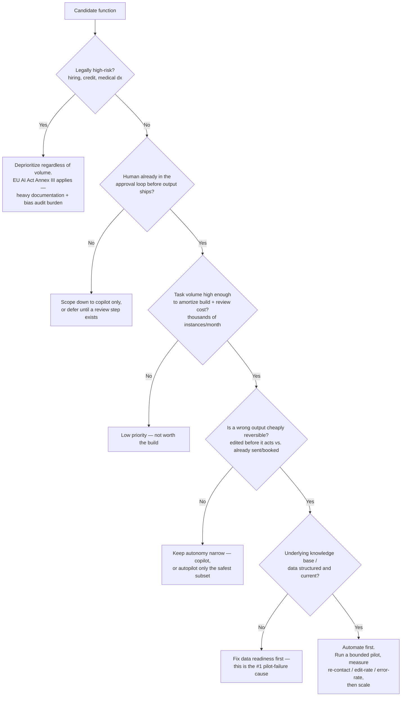

# Decision - Which Business Function to Automate First

> **Decision:** which business function gets the first AI deployment, out of support, sales, marketing, legal, HR, finance ops, and internal knowledge work. **Default for the 80% case:** pick the highest-volume, human-reviewed, easily-reversible task on the back-office side of the [[Concept - The Front-Office Back-Office Adoption Split]] with a clean data source — not the highest-visibility customer-facing one. Documentation and internal-analysis copilots (medical scribes, internal LLM assistants) score highest; autonomous external actions (unsupervised outbound sales, unreviewed customer resolution) score lowest and should be deferred until the copilot version is measured and mature.

## Decision flow

This is the same logic restated as five scoring axes: **volume**, **error tolerance**, **reversibility**, **review cost**, **data readiness**. A function that fails any early gate (regulatory exposure, no reviewer, low volume) drops out before the axes that differentiate the remaining candidates even matter — the flowchart is a set of eliminations, not a weighted average, because a single hard blocker (Annex III exposure, no reversibility) overrides a good score on everything else.

## Tradeoff matrix

The full per-function numbers this table condenses live in [[Reference - AI Impact by Business Function]]; what follows is the decision-relevant cut, one archetype row per function.

| Function | Volume | Error tolerance | Reversibility | Review cost/item | Regulatory exposure | Mode | Real-world anchor |
|---|---|---|---|---|---|---|---|
| Clinical/internal documentation (scribe-style) | Very high | Low, but human signs before it's final | High — edited before it enters the record | Low (marginal edit, not authorship) | Moderate (PHI) — mitigated by mandatory sign-off | Copilot | Kaiser Permanente: 7,260 physicians, 2.5M encounters, ~15,700–16,000 documentation hours saved over Oct 2023–Dec 2024 (E2, Tierney/Liu et al., *NEJM Catalyst* 2025) |
| Internal knowledge work / analysis copilot ([[Concept - AI in Finance Operations]]) | Very high | Low-moderate, output reviewed before use | High | Low | Low-moderate | Copilot | JPMorgan LLM Suite: 200,000 employees onboarded within 8 months of 2024 launch, 450+ production use cases (1,000 targeted by 2026), reported 30–40% efficiency gains and ~$1.5B/yr, later raised toward ~$2B (E2, JPMorgan-claimed, 2025–2026) |
| Support triage / routine ticket resolution | Very high | Moderate | High for chat (re-contact possible); lower once irreversible actions (refunds, cancellations) are in scope | The whole point: AI ~$0.50–1.50/contact vs. human ~$8–12 (B2B SaaS $25–35) (E2, SaaS Capital 2024) | Low-moderate | Autopilot for routine, escalate the rest | Klarna: 2.3M conversations/month, ~75% of chat volume, work equated to ~700 agents (E2, Klarna/OpenAI claim, Feb 2024) — see the reversal below |
| Marketing/content drafting | High | High (marketer edits before publish) | High | Low | Low | Copilot | Jasper raised at a ~$1.5B valuation in Oct 2022, then cut that internal valuation by ~20% and laid off an undisclosed share of its ~150-person staff in Jul 2023 after ChatGPT commoditized generic copywriting (E2, Voicebot.ai/Maginative reporting, 2023) — the commoditization marker, not a failure of the copilot mode itself |
| Autonomous outbound sales (AI SDR) | High | Low — a bad email is sent to a real prospect under the company's name | Low — message is sent, not drafted-and-reviewed | High if reviewed per-item (defeats the automation case) | Moderate (spam/brand law) | Contested autopilot | 11x.ai: TechCrunch investigation (Mar 2025) found fabricated customer logos and ~70–80% churn against ~$14M reported ARR; founder stepped down May 2025 (E2, TechCrunch reporting) |
| HR/recruiting screening (ranking, rejection) | High | Very low — decision affects a person's livelihood | Very low — a rejection already happened | High (mandated audit) | Very high — EU AI Act Annex III classifies recruitment/worker-management AI as high-risk; enforcement date deferred to 2 Dec 2027 under the Digital Omnibus, but the classification itself is settled law (E3, EU AI Act text, 2024/2026 amendment) | Administrative copilot only; avoid autonomous ranking/rejection | Amazon scrapped an internal resume-screening tool in 2018 after it penalized resumes containing "women's" (E3); Workday faces ongoing algorithmic-discrimination litigation (E2/E3, ongoing 2025–2026) |

Sort by mode, not by department: two functions with the same label ("customer support") can sit at opposite ends of this table depending on whether the AI drafts (copilot) or acts (autopilot) — see [[Concept - Copilot vs Autopilot Deployment Modes]]. The matrix rows are archetypes; the real scoring happens per task within a function.

## The details that flip the decision

**A regulated function drops to the bottom regardless of volume.** Hiring, credit, and medical-diagnosis decisions are classified high-risk under the [[Reference - The EU AI Act for Operators]] (Annex III), which mandates bias audits, technical documentation, and human oversight before an operator can ship them — even when a human nominally makes the final call, an AI system whose output materially influences that call still counts (E3, EU AI Act Annex III; enforcement pushed to Dec 2027 via the 2026 Digital Omnibus, but the compliance target doesn't move — building without it now means rebuilding later). This is why HR/recruiting screening ranks near the bottom of the matrix despite genuinely high volume: [[Breakdown - AI in Recruiting and HR Screening]] covers the mechanism in depth.

**The highest-visibility function is usually the wrong first bet — it's what maximizes liability, not value.** Klarna's 2024 launch is the canonical case: 2.3M conversations/month sounds like a win, and the company claimed an estimated $40M profit improvement, but the number was Klarna's own internal estimate (E2), and the company had automated a broad slice of customer-facing support without a quality guardrail alongside the savings metric. In May 2025, CEO Sebastian Siemiatkowski said publicly the company "went too far," that cost-cutting had degraded service quality, and Klarna began rehiring human agents for nuanced and premium support — see [[Lore - The Klarna Reversal and Support Bot Walk-Backs]] and [[Concept - Support Deflection Economics]] for why deflection and true resolution are different numbers. Klarna didn't undo the AI deployment; it corrected the scope of autonomy after shipping without measuring re-contact rate. The lesson generalizes: automate what demos well last, not first.

**A function with a clean, structured knowledge base and an existing human approval step jumps the queue regardless of how unglamorous it is.** MIT's 2025 "GenAI Divide" study — 52 executive interviews, 153 leader surveys, and analysis of 300 public deployments — found 95% of enterprise generative-AI pilots produced no measurable P&L impact, and traced the failure primarily to organizational integration gaps, not model capability (E2, MIT Media Lab/NANDA, Aug 2025, widely reported e.g. Fortune). The same study found that although more than half of measured genAI budget went to sales and marketing tools — the visible, demo-friendly bets — the biggest realized ROI showed up in back-office automation: cutting BPO spend and external agency costs. That's the non-obvious part: the function that gets the budget and the function that returns the value are frequently different functions, and the mismatch is a resourcing choice, not a technology limit.

**Reversibility, not error rate alone, decides whether an axis is disqualifying.** A wrong scribe draft costs a physician a few seconds of editing before signing; a wrong autonomous outbound email or booking has already left the building. This is why AI SDR autonomy stays contested even at similar underlying model quality to scribe copilots — the 11x.ai episode (fabricated logos, unauthorized use of customer names, 70–80% churn against reported ARR) is a review-cost failure as much as a capability one: nobody was checking outputs before they reached real inboxes. See [[Pattern - Human-in-the-Loop Review Workflow]] for where to insert the review step cheaply instead of skipping it.

**Data readiness is usually the hidden blocker, not the model.** A function that scores well on volume, tolerance, and reversibility still fails if the knowledge base behind it is stale, unstructured, or fragmented across systems — this is the top concrete cause behind the pilot failure rate cited above; see [[Concept - The Pilot-to-Production Gap]] for the mechanism. Fixing this before automating is cheaper than automating and discovering it in production.

**Once a function clears the gates, measure the pilot on a re-contact / edit-rate / error-rate metric before scaling — a demo is not a measurement.** [[Playbook - Picking Profitable AI Use Cases]] covers the portfolio-level version of this same discipline; [[Reference - The 2026 Navigation Cheatsheet]] gives the current state of play across functions to sanity-check a choice against what's already been tried elsewhere.

## Connections

- [[Concept - The Front-Office Back-Office Adoption Split]] — names the same divide this decision operationalizes: back-office, human-reviewed work is where the measured wins concentrate.
- [[Concept - Support Deflection Economics]] — the cost math (human $8-12/contact vs. AI $0.50-1.50) behind the support row of the tradeoff matrix, and why raw deflection overstates true resolution.
- [[Reference - AI Impact by Business Function]] — the full cross-function numbers table this note's matrix is a condensed, decision-oriented cut of.
- [[Pattern - Human-in-the-Loop Review Workflow]] — the mechanism for cheaply inserting the review step that moves a function from "defer" to "automate now" on the reversibility axis.
- [[Concept - AI in Finance Operations]] — a concrete worked example of the high-volume, human-approved, structured-data profile the default answer favors (JPMorgan LLM Suite).
- [[Lore - The Klarna Reversal and Support Bot Walk-Backs]] — the primary cautionary tale for the "highest-visibility function first" trap.
- [[Playbook - Picking Profitable AI Use Cases]] — the portfolio-level sequel: once you've picked the first function by this framework, this is how you keep choosing well.
- [[Concept - The Pilot-to-Production Gap]] — data readiness, the axis most pilots fail on before the AI mechanism is even tested.
- [[Reference - The 2026 Navigation Cheatsheet]] — current-state snapshot to check a candidate function against what other operators have already learned.
- [[Concept - Copilot vs Autopilot Deployment Modes]] — the mode split (draft-and-review vs. act-directly) that determines which row of the matrix a function actually falls into.
- [[Reference - The EU AI Act for Operators]] — the regulatory gate that overrides volume/reversibility scoring for hiring, credit, and medical-decision functions.
- [[Breakdown - AI in Recruiting and HR Screening]] — the detailed case for why HR screening ranks at the bottom of the matrix despite high volume.

## Sources

- Tierney, A., Liu, V. et al. (2025) — "Ambient Artificial Intelligence Scribes: Learnings after 1 Year and over 2.5 Million Uses," *NEJM Catalyst*. Kaiser Permanente physician-hours-saved data.
- JPMorganChase (2025–2026) — company disclosures on LLM Suite adoption, use-case count, and estimated annual value (self-reported, E2).
- SaaS Capital (2024) — B2B Support Spending Report. Human vs. AI cost-per-contact figures.
- Entrepreneur, Forbes, MLQ News (May 2025) — reporting on Sebastian Siemiatkowski's public reversal of Klarna's AI-first support strategy.
- Klarna/OpenAI (Feb 2024) — company-published launch figures for the support assistant (E2, self-reported, later partially walked back).
- MIT Media Lab / NANDA initiative (Aug 2025) — "The GenAI Divide: State of AI in Business 2025." Pilot failure rate and budget-vs-ROI mismatch finding, as reported by Fortune and others.
- TechCrunch (Mar 2025) — investigation into 11x.ai's customer logos, contracted ARR, and churn rate.
- Voicebot.ai (Jul 2023) and Maginative (Sep 2023) — Jasper's Oct 2022 $1.5B valuation, the ~20% internal valuation markdown, and the Jul 2023 layoffs.
- European Commission, AI Act Service Desk — Annex III high-risk classification for employment/recruitment AI systems, and the 2026 Digital Omnibus enforcement-date amendment.
- Reuters/press coverage (2018) — Amazon's discontinued internal resume-screening tool.
